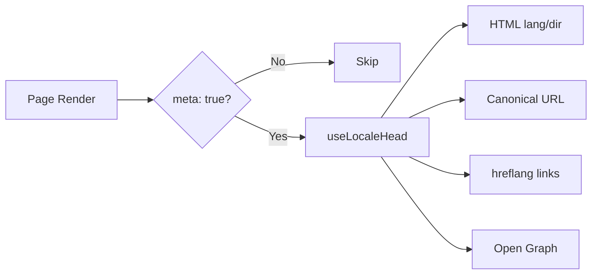

# 🌐 Průvodce SEO pro Nuxt I18n Micro

## 📖 Úvod

Efektivní SEO (optimalizace pro vyhledávače) je zásadní pro zajištění, aby byl váš vícejazyčný web přístupný a viditelný uživatelům po celém světě prostřednictvím vyhledávačů. `Nuxt I18n Micro` zjednodušuje proces správy SEO pro vícejazyčné weby automatickým generováním nezbytných meta tagů a atributů, které informují vyhledávače o struktuře a obsahu vašeho webu.

Tento průvodce vysvětluje, jak `Nuxt I18n Micro` zpracovává SEO pro zlepšení viditelnosti vašeho webu a uživatelské zkušenosti bez potřeby dodatečné konfigurace.

## ⚙️ Automatické zpracování SEO

### Tok generování SEO meta



**Generované tagy:**

| Tag             | Příklad                                                  |
| --------------- | -------------------------------------------------------- |
| HTML atributy   | `<html lang="en" dir="ltr">`                             |
| Canonical       | `<link rel="canonical" href="...">`                      |
| hreflang        | `<link rel="alternate" hreflang="en" href="...">`        |
| x-default       | `<link rel="alternate" hreflang="x-default" href="...">` |
| Open Graph      | `<meta property="og:locale" content="en_US">`            |

#### `og` na locale (`og:locale` vs BCP 47)

`<html lang>` a `hreflang` používají **BCP 47** přes `locale.iso` (např. `ar-AE`).  
Open Graph vyžaduje **`language_TERRITORY`** s **podtržítkem** (`ar_AE`), dle [OG protokolu](https://ogp.me/).

Ve výchozím nastavení se `og:locale` odvozuje z `iso`, když je mapování jednoznačné (`en-US` → `en_US`).  
Nastavte explicitní řetězec **`og`**, když potřebujete vlastní hodnotu (např. `zh-Hans` → `zh_CN`).  
Pokud není k dispozici ani `og`, ani konvertibilní `iso`, `og:locale` tagy se negenerují — v developmentu dostanete varování v konzoli (respektuje `missingWarn`).

```typescript
i18n: {
  meta: true,
  locales: [
    { code: 'ar', iso: 'ar-AE', og: 'ar_AE', dir: 'rtl' },
    { code: 'en', iso: 'en-US' }, // og:locale → en_US
    { code: 'zh', iso: 'zh-Hans', og: 'zh_CN' }, // script tags need explicit og
  ],
}
```

### 🔑 Klíčové SEO funkce

Když je v `Nuxt I18n Micro` povolena volba `meta`, modul automaticky spravuje následující SEO aspekty:

1. **🌍 Atributy jazyka a směru**:
   - Modul nastavuje atributy `lang` a `dir` na tagu `<html>` podle aktuálního locale a směru textu (např. `ltr` pro angličtinu nebo `rtl` pro arabštinu).

2. **🔗 Canonical URL**:
   - Modul generuje canonical odkaz (`<link rel="canonical">`) pro každou stránku, čímž zajišťuje, že vyhledávače rozpoznají primární verzi obsahu.

3. **🌐 Alternativní jazykové odkazy (`hreflang`)**:
   - Modul automaticky generuje tagy `<link rel="alternate" hreflang="">` pro všechna dostupná locale. To pomáhá vyhledávačům pochopit, které jazykové verze vašeho obsahu jsou dostupné, což zlepšuje uživatelský komfort pro globální publikum.
   - Každý locale vydává **jeden** tag: `hreflang = iso || code`. Když je `iso` nastaveno, routovací `code` se nikdy nepoužívá jako `hreflang` (takže tržní klíče jako `mx` se nestávají neplatnými jazykovými tagy).
   - Volitelné `hreflangBaseLanguage: true` také vydává bare-language tag odvozený z `iso` (např. `es-ES` → `es`), nárokovaný prvním regionálním locale v `locales`.

4. **🌏 `x-default` Hreflang**:
   - Modul automaticky generuje tag `<link rel="alternate" hreflang="x-default">` ukazující na URL výchozího locale. To říká vyhledávačům, kterou URL zobrazit uživatelům, jejichž jazyk neodpovídá žádnému z definovaných locale. Není potřeba žádná další konfigurace — funguje automaticky, když je nastaveno `meta: true`.

5. **🔖 Open Graph metadata**:
   - Modul generuje Open Graph meta tagy (`og:locale`, `og:url` atd.) pro každý locale, což je obzvláště užitečné pro sdílení na sociálních sítích a indexování vyhledávači.

### 🛠️ Konfigurace

Chcete-li tyto SEO funkce povolit, ujistěte se, že je volba `meta` nastavena na `true` ve vašem souboru `nuxt.config.ts`:

```typescript
export default defineNuxtConfig({
  modules: ['nuxt-i18n-micro'],
  i18n: {
    locales: [
      { code: 'en', iso: 'en-US', dir: 'ltr' },
      { code: 'fr', iso: 'fr-FR', dir: 'ltr' },
      { code: 'ar', iso: 'ar-SA', dir: 'rtl' },
    ],
    defaultLocale: 'en',
    translationDir: 'locales',
    meta: true, // Enables automatic SEO management
  },
})
```

### 🌍 Dynamické `metaBaseUrl` pro multi-doménová nasazení

Když není `metaBaseUrl` nastaveno, absolutní SEO URL se řeší v tomto pořadí (#240):

1. `site.url` z [`nuxt-site-config`](https://nuxtseo.com/docs/site-config) (pokud je tento modul přítomen — např. přes `@nuxtjs/seo`)
2. Jinak hostname z aktuálního požadavku (`useRequestURL()` / `window.location.origin`)

Fallback z origin požadavku respektuje hlavičky reverzní proxy (`X-Forwarded-Host`, `X-Forwarded-Proto`), takže funguje správně za nginx, Cloudflare, AWS ALB a podobnými proxy.

To znamená, že aplikace již nastavující `site.url` pro sitemap / robots / schema.org **nepotřebují** druhou deklaraci `metaBaseUrl`:

```typescript
export default defineNuxtConfig({
  site: {
    url: process.env.NUXT_SITE_URL, // also used by micro for canonical / og:url / hreflang
  },
  i18n: {
    meta: true,
    // metaBaseUrl omitted — picks up site.url, then request origin
  },
})
```

Bez `site.url` může jedna instance aplikace stále obsluhovat **více domén** se správnými SEO tagy pro každou přes origin požadavku:

```typescript
export default defineNuxtConfig({
  i18n: {
    meta: true,
    // metaBaseUrl is undefined by default — resolved dynamically from the request
  },
})
```

Například požadavek na `https://site-a.com/en/about` vyprodukuje:

```html
<link rel="canonical" href="https://site-a.com/en/about" /> <meta property="og:url" content="https://site-a.com/en/about" />
```

Zatímco stejná aplikace obsluhující `https://site-b.com/en/about` vyprodukuje:

```html
<link rel="canonical" href="https://site-b.com/en/about" /> <meta property="og:url" content="https://site-b.com/en/about" />
```

Pokud potřebujete pevnou základní URL, která vždy vyhraje nad `site.url`, předejte statický řetězec:

```typescript
metaBaseUrl: 'https://example.com'
```

### 🔍 Whitelist canonical query

Ve výchozím nastavení jsou query parametry z canonical a `og:url` odstraněny, aby se zabránilo duplicitnímu obsahu. Můžete whitelistovat konkrétní query parametry, které mají být zachovány:

```typescript
i18n: {
  canonicalQueryWhitelist: ['page', 'sort', 'filter', 'search', 'q', 'query', 'tag']
}
```

V canonical URL se objeví pouze parametry uvedené v `canonicalQueryWhitelist`. Všechny ostatní query parametry (např. tracking, session ID) jsou odstraněny.

### 🚫 Zakázání meta tagů pro jednotlivé stránky

Generování SEO meta tagů pro konkrétní stránky můžete zakázat pomocí `defineI18nRoute()`:

```vue
<script setup>
// Disable all SEO meta tags for this page
defineI18nRoute({
  disableMeta: true,
})
</script>
```

Meta můžete také zakázat pouze pro konkrétní locale:

```vue
<script setup>
// Disable meta tags only for English locale on this page
defineI18nRoute({
  disableMeta: ['en'],
})
</script>
```

Když je `disableMeta` aktivní, pro dotčenou stránku/locale se negenerují žádné tagy `hreflang`, `canonical`, `og:locale`, `og:url` ani `x-default`.

### 🔇 Zakázaná locale

Locale s `disabled: true` jsou automaticky vyloučena z veškerého generování SEO tagů — nejsou pro ně vytvářeny žádné `hreflang`, `og:locale:alternate` ani alternativní odkazy:

```typescript
i18n: {
  locales: [
    { code: 'en', iso: 'en-US' },
    { code: 'fr', iso: 'fr-FR', disabled: true }, // excluded from SEO tags
  ]
}
```

### 🙈 Opt-out locale (`seo: false`)

Pro locale, které mají zůstat routovatelné a přeložené, ale neměly by se objevovat v cross-locale discovery tazích, nastavte `seo: false`. Tato locale jsou vynechána z `hreflang` alternates a `og:locale:alternate`. Pokud má váš nakonfigurovaný **výchozí** locale `seo: false`, není vydán ani odkaz `x-default`.

```typescript
i18n: {
  locales: [
    { code: 'en', iso: 'en-US' },
    { code: 'ru', iso: 'ru-RU', seo: false }, // internal / non-indexed locale
  ]
}
```

### 📌 Chování specifické pro strategii

| Strategie               | hreflang odkazy    | x-default              | canonical         | og:url |
| ----------------------- | ------------------ | ---------------------- | ----------------- | ------ |
| `prefix`                | ✅ všechna locale  | ✅ URL výchozího locale | ✅ aktuální URL   | ✅     |
| `prefix_except_default` | ✅ všechna locale  | ✅ URL bez prefixu     | ✅ aktuální URL   | ✅     |
| `prefix_and_default`    | ✅ všechna locale  | ✅ URL výchozího locale | ✅ aktuální URL   | ✅     |
| `no_prefix`             | ❌ negenerují se   | ❌ negeneruje se       | ✅ aktuální URL   | ✅     |

Pro strategii `no_prefix` se generují pouze `canonical`, `og:url`, `og:locale` a `html` atributy (`lang`, `dir`). Alternativní jazykové odkazy (`hreflang`) a `x-default` se negenerují, protože neexistují odlišné URL na locale.

## Přepisy na úrovni stránky (`useI18nHead`)

Pro **články, průvodce nebo jakýkoli CMS obsah**, kde ne každý locale existuje nebo URL pocházejí z API, použijte na stránce [`useI18nHead`](/api/composables/use-i18n-head) místo vlastního i18n head pluginu.

### Článek s částečnými překlady

```vue
<script setup lang="ts">
const article = await loadArticle()
// article.locales = { en: '...', de: '...' } — only translated locales

useI18nHead({
  meta: [{ property: 'og:title', content: article.title }],
  replace: {
    hreflang: Object.entries(article.locales).map(([locale, href]) => ({
      rel: 'alternate',
      hreflang: locale,
      href,
    })),
    ogAlternates: Object.keys(article.locales),
  },
})
</script>
```

### Slugy podle locale s `$setI18nRouteParams`

Když se slugy liší podle jazyka, nejprve nastavte parametry routy a poté přepište alternates reálnými URL:

```vue
<script setup lang="ts">
const { $defineI18nRoute, $setI18nRouteParams } = useNuxtApp()
const { data: article } = await useFetch(`/api/articles/${slug}`)

$defineI18nRoute({
  localeRoutes: { en: '/blog/[slug]', de: '/de/blog/[slug]' },
})

$setI18nRouteParams({
  en: { slug: article.value.slugEn },
  de: { slug: article.value.slugDe },
})

useI18nHead({
  replace: {
    hreflang: ['en', 'de'].map((locale) => ({
      rel: 'alternate',
      hreflang: locale,
      href: article.value.urls[locale],
    })),
    ogAlternates: ['en', 'de'],
  },
})
</script>
```

### HTTPS origin za proxy

Pro správné absolutní URL při SSR bez vlastního origin composable:

```ts
i18n: {
  meta: true,
  metaBaseUrl: undefined,
  metaTrustForwardedHost: true,
  metaTrustForwardedProto: true,
}
```

Více příkladů (canonical override, `x-default`, reactive fetch, sdílení pomocníci): [composable useI18nHead](/api/composables/use-i18n-head).

### ⚠️ Trailing slash

Modul generuje canonical a `hreflang` URL na základě skutečné cesty z `useRoute().fullPath`. Pokud vaše aplikace používá trailing slashe (např. přes `router.options` v Nuxt), generované URL to budou odrážet. `$switchLocalePath` však může cesty normalizovat a odstranit trailing slashe. Pokud je konzistence trailing slashe pro vaše SEO kritická, ověřte, že generované URL odpovídají URL struktuře vaší aplikace.

### 🎯 Výhody

Povolením volby `meta` získáte:

- **📈 Vylepšené pořadí ve vyhledávačích**: Vyhledávače mohou váš web lépe indexovat a chápat vztahy mezi různými jazykovými verzemi.
- **👥 Lepší uživatelský komfort**: Uživatelům je poskytována správná jazyková verze podle jejich preferencí, což vede k personalizovanějšímu zážitku.
- **🔧 Méně ruční konfigurace**: Modul zpracovává SEO úkoly automaticky, což vás osvobozuje od nutnosti ručně přidávat meta tagy a atributy související s SEO.

## 🔗 Nuxt SEO (`@nuxtjs/seo`)

[`@nuxtjs/seo`](https://nuxtseo.com/) sdružuje sitemap, robots, schema.org, OG images a související moduly. Integruje se s **nuxt-i18n-micro** přes [`nuxt-site-config`](https://nuxtseo.com/docs/site-config/guides/i18n) (v4+).

### Požadavky

- **`@nuxtjs/seo` 3+** (aktuální vydání používají `nuxt-site-config` 4+, které registruje plugin `nuxt-site-config:i18n` pro micro)
- **`i18n.meta: true`** (doporučeno — micro dodává locale-aware head tagy; Nuxt SEO přidává sitemap, schema.org atd.)

### Pořadí modulů

Uveďte **nuxt-i18n-micro před `@nuxtjs/seo`**, aby site config mohl číst vaše nastavení locale:

```typescript
export default defineNuxtConfig({
  modules: ['nuxt-i18n-micro', '@nuxtjs/seo'],
  site: {
    url: 'https://example.com',
    name: 'My Site',
  },
  i18n: {
    meta: true,
    defaultLocale: 'en',
    locales: [
      { code: 'en', iso: 'en-US' },
      { code: 'de', iso: 'de-DE' },
    ],
  },
})
```

### Přeložený název a popis webu

Nuxt Site Config čte volitelné překladové klíče z vašich locale souborů:

```json
{
  "nuxtSiteConfig": {
    "name": "My Site",
    "description": "My site description"
  }
}
```

Hodnoty per-locale v `locales/en.json`, `locales/de.json` atd. se načítají automaticky.

### Řešení problémů

Pokud vidíte `Plugin nuxt-seo:defaults depends on nuxt-site-config:i18n but they are not registered`, upgradujte **`@nuxtjs/seo` na 3+** (viz [issue #133](https://github.com/s00d/nuxt-i18n-micro/issues/133)). Starší `nuxt-site-config` 3.x propojoval i18n pouze pro `@nuxtjs/i18n`, ne pro micro.

Více: [Průvodce sitemap i18n](https://nuxtseo.com/docs/sitemap/guides/i18n), [Průvodce Site Config i18n](https://nuxtseo.com/docs/site-config/guides/i18n).
