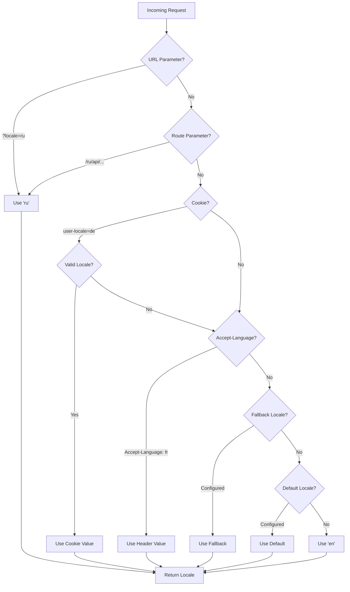

# 🌍 Serverové překlady a informace o locale v Nuxt I18n Micro

## 📖 Přehled

Nuxt I18n Micro supports server-side translations and locale information, allowing you to translate content and access locale details on the server. This is particularly useful for APIs or server-rendered applications where localization is needed before reaching the client.

The translations use locale messages defined in the Nuxt I18n configuration and are dynamically resolved based on the detected locale.

By default (`translationPayloads.mode: 'premerged'`), root-level files are baked into every page payload at build time as `\{page\}/\{locale\}/data.json`. The server loads the same pre-built files as the client fetches under `/\{apiBaseUrl\}/...`, so all keys (both shared and page-specific) are available in server handlers.

With `translationPayloads.mode: 'source'`, compact source files are merged at runtime when `loadTranslationsFromServer()` (or the `/_locales` route) is called — on **Edge** via Nitro `serverAssets`, on **Node** from the optional public copy. See the [Performance Guide — Serverless Payload Output](/guides/performance#serverless-payload-output) and [Cache & Storage Architecture](/api/cache) for details.

For a consolidated list of runtime and server APIs, see the [API Reference](/api/overview).

## 🛠️ Nastavení serverového middleware

To enable server-side translations and locale information, use the provided middleware functions:

- `useTranslationServerMiddleware` - for translating content
- `useLocaleServerMiddleware` - for accessing locale information

Both middleware functions are automatically available in all server routes.

The locale detection logic is shared between both middleware functions through the `detectCurrentLocale` utility function to ensure consistency across the module.

## ✨ Použití překladů v serverových handlerech

You can seamlessly translate content in any `eventHandler` by using the translation middleware.

### Example: Basic Translation Usage

```typescript
import { defineEventHandler } from 'h3'

export default defineEventHandler(async (event) => {
  const t = await useTranslationServerMiddleware(event)
  return {
    message: t('greeting'), // Returns the translated value for the key "greeting"
  }
})
```

In this example:

- The user's locale is detected automatically from query parameters, cookies, or headers.
- The `t` function retrieves the appropriate translation for the detected locale.

## 🌍 Použití informací o locale v serverových handlerech

### Basic Locale Information Usage

```typescript
import { defineEventHandler } from 'h3'

export default defineEventHandler((event) => {
  const localeInfo = useLocaleServerMiddleware(event)

  return {
    success: true,
    data: localeInfo,
    timestamp: new Date().toISOString(),
  }
})
```

### Providing Custom Locale Parameters

```typescript
import { defineEventHandler } from 'h3'

export default defineEventHandler((event) => {
  // Force specific locale with custom default
  const localeInfo = useLocaleServerMiddleware(event, 'en', 'ru')

  return {
    success: true,
    data: localeInfo,
    timestamp: new Date().toISOString(),
  }
})
```

### Response Structure

The locale middleware returns a `LocaleInfo` object with the following properties:

```typescript
interface LocaleInfo {
  current: string // Current detected locale code
  default: string // Default locale code
  fallback: string // Fallback locale code
  available: string[] // Array of all available locale codes
  locale: Locale | null // Full locale configuration object
  isDefault: boolean // Whether current locale is the default
  isFallback: boolean // Whether current locale is the fallback
}
```

### Example Response

```json
{
  "success": true,
  "data": {
    "current": "ru",
    "default": "en",
    "fallback": "en",
    "available": ["en", "ru", "de"],
    "locale": {
      "code": "ru",
      "iso": "ru-RU",
      "dir": "ltr",
      "displayName": "Русский"
    },
    "isDefault": false,
    "isFallback": false
  },
  "timestamp": "2024-01-15T10:30:00.000Z"
}
```

## 🌐 Poskytnutí vlastního locale

If you need to specify a locale manually (e.g., for testing or certain requests), you can pass it to the translation middleware:

### Example: Custom Locale

```typescript
import { defineEventHandler } from 'h3'

function detectLocale(event): string | null {
  const urlSearchParams = new URLSearchParams(event.node.req.url?.split('?')[1])
  const localeFromQuery = urlSearchParams.get('locale')
  if (localeFromQuery) return localeFromQuery

  return 'en'
}

export default defineEventHandler(async (event) => {
  const t = await useTranslationServerMiddleware(event, 'en', detectLocale(event)) // Force French local, en - default locale
  return {
    message: t('welcome'), // Returns the French translation for "welcome"
  }
})
```

## 📋 Logika detekce locale

Both middleware functions automatically determine the user's locale using the following priority order:



1. **URL Parameters**: `?locale=ru`
2. **Route Parameters**: `/ru/api/endpoint`
3. **Cookies**: `user-locale` cookie
4. **HTTP Headers**: `Accept-Language` header
5. **Fallback Locale**: As configured in module options
6. **Default Locale**: As configured in module options
7. **Hardcoded Fallback**: `'en'`

> **Note**: The locale detection logic is shared between `useLocaleServerMiddleware` and `useTranslationServerMiddleware` to ensure consistency across the module.

## 📋 Pokročilé příklady použití

### Conditional Response Based on Locale

```typescript
import { defineEventHandler } from 'h3'

export default defineEventHandler((event) => {
  const { current, isDefault, locale } = useLocaleServerMiddleware(event)

  // Return different content based on locale
  if (current === 'ru') {
    return {
      message: 'Привет, мир!',
      locale: current,
      isDefault,
    }
  }

  if (current === 'de') {
    return {
      message: 'Hallo, Welt!',
      locale: current,
      isDefault,
    }
  }

  // Default English response
  return {
    message: 'Hello, World!',
    locale: current,
    isDefault,
  }
})
```

### Custom Locale Detection

```typescript
import { defineEventHandler } from 'h3'

export default defineEventHandler((event) => {
  // Force German locale with English as fallback
  const { current, isDefault, locale } = useLocaleServerMiddleware(event, 'en', 'de')

  return {
    message: 'Hallo, Welt!',
    locale: current,
    isDefault: false, // Will be false since we forced German
  }
})
```

### Locale-Aware API with Validation

```typescript
import { defineEventHandler, createError } from 'h3'

export default defineEventHandler((event) => {
  const { current, available, locale } = useLocaleServerMiddleware(event)

  // Validate if the detected locale is supported
  if (!available.includes(current)) {
    throw createError({
      statusCode: 400,
      statusMessage: `Unsupported locale: ${current}. Available locales: ${available.join(', ')}`,
    })
  }

  // Return locale-specific configuration
  return {
    locale: current,
    direction: locale?.dir || 'ltr',
    displayName: locale?.displayName || current,
    availableLocales: available,
  }
})
```

### Integration with Translation Middleware

You can combine locale information with translation middleware for comprehensive internationalization:

```typescript
import { defineEventHandler } from 'h3'

export default defineEventHandler(async (event) => {
  const localeInfo = useLocaleServerMiddleware(event)
  const t = await useTranslationServerMiddleware(event)

  return {
    locale: localeInfo.current,
    message: t('welcome_message'),
    availableLocales: localeInfo.available,
    isDefault: localeInfo.isDefault,
  }
})
```

## 📝 Osvědčené postupy

1. **Vždy validujte locale**: Zkontrolujte, zda je detekovaný locale ve vašem seznamu dostupných locale
2. **Používejte fallback logiku**: Poskytněte rozumné výchozí hodnoty, když detekce locale selže
3. **Cachujte informace o locale**: Pro výkonově kritické aplikace zvažte cachování výsledků detekce locale
4. **Zpracovávejte okrajové případy**: Počítejte s nepodporovanými locale a poskytněte odpovídající chybové odpovědi
5. **Kombinujte s překlady**: Používejte informace o locale spolu s překladovým middleware pro plnou podporu i18n

## 🚀 Aspekty výkonu

- Obě middleware funkce jsou lehké a navržené pro rychlé provedení
- Detekce locale používá efektivní fallback řetězce
- Během detekce locale se neprovádějí žádná externí API volání
- Výsledky se počítají synchronně pro optimální výkon
