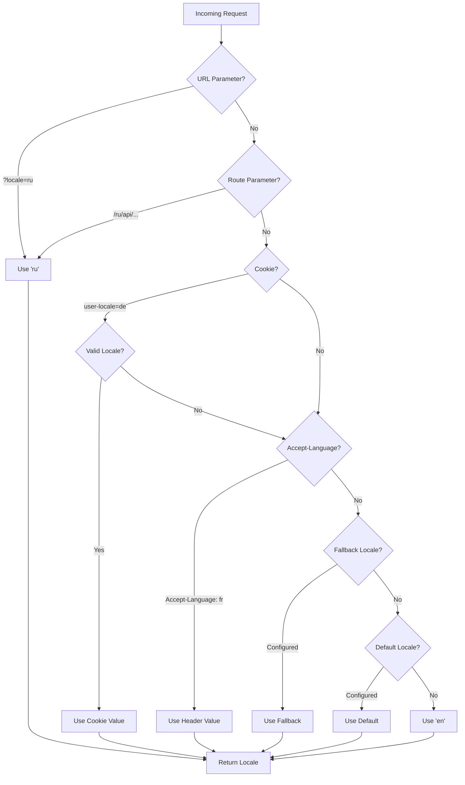

# 🌍 Překlady a informace o locale na straně serveru v Nuxt I18n Micro

## 📖 Přehled

Nuxt I18n Micro podporuje překlady a informace o locale na straně serveru, což vám umožňuje překládat obsah a získávat detaily locale na serveru. To je zvláště užitečné pro API nebo serverem renderované aplikace, kde je lokalizace potřeba ještě před dorazem na klienta.

Překlady používají locale zprávy definované v konfiguraci Nuxt I18n a jsou dynamicky vyřešeny na základě detekovaného locale.

Ve výchozím stavu (`translationPayloads.mode: 'premerged'`) jsou kořenové soubory zapečené do každého payloadu stránky v době buildu jako `\{page\}/\{locale\}/data.json`. Server načítá stejné předsestavené soubory, které klient fetchuje pod `/\{apiBaseUrl\}/...`, takže všechny klíče (sdílené i stránkově specifické) jsou v serverových handlerech dostupné.

S `translationPayloads.mode: 'source'` jsou kompaktní zdrojové soubory sloučeny za běhu, když se volá `loadTranslationsFromServer()` (nebo routa `/_locales`). Na **Edge** přes Nitro `serverAssets`, na **Node** z volitelné veřejné kopie. Podrobnosti najdete v [Průvodci výkonem: Serverless Payload Output](/guides/performance#serverless-payload-output) a [Architektuře cache a úložiště](/api/cache).

Konsolidovaný seznam runtime a serverových API najdete v [Referenci API](/api/overview).

## 🛠️ Nastavení serverového middleware

Chcete-li zapnout překlady a informace o locale na straně serveru, použijte poskytnuté middleware funkce:

- `useTranslationServerMiddleware`: pro překlad obsahu
- `useLocaleServerMiddleware`: pro přístup k informacím o locale

Obě middleware funkce jsou automaticky dostupné ve všech serverových routách.

Logika detekce locale je sdílena mezi oběma middleware funkcemi přes utility funkci `detectCurrentLocale`, aby se zajistila konzistence napříč modulem.

## ✨ Použití překladů v serverových handlerech

Obsah můžete v jakémkoli `eventHandler` hladce přeložit pomocí translation middleware.

### Příklad: Základní použití překladu

```typescript
import { defineEventHandler } from 'h3'

export default defineEventHandler(async (event) => {
  const t = await useTranslationServerMiddleware(event)
  return {
    message: t('greeting'), // Returns the translated value for the key "greeting"
  }
})
```

V tomto příkladu:

- Locale uživatele je detekován automaticky z query parametrů, cookies nebo hlaviček.
- Funkce `t` získává vhodný překlad pro detekovaný locale.

## 🌍 Použití informací o locale v serverových handlerech

### Základní použití informací o locale

```typescript
import { defineEventHandler } from 'h3'

export default defineEventHandler((event) => {
  const localeInfo = useLocaleServerMiddleware(event)

  return {
    success: true,
    data: localeInfo,
    timestamp: new Date().toISOString(),
  }
})
```

### Poskytování vlastních parametrů locale

```typescript
import { defineEventHandler } from 'h3'

export default defineEventHandler((event) => {
  // Force specific locale with custom default
  const localeInfo = useLocaleServerMiddleware(event, 'en', 'ru')

  return {
    success: true,
    data: localeInfo,
    timestamp: new Date().toISOString(),
  }
})
```

### Struktura odpovědi

Locale middleware vrací objekt `LocaleInfo` s následujícími vlastnostmi:

```typescript
interface LocaleInfo {
  current: string // Current detected locale code
  default: string // Default locale code
  fallback: string // Fallback locale code
  available: string[] // Array of all available locale codes
  locale: Locale | null // Full locale configuration object
  isDefault: boolean // Whether current locale is the default
  isFallback: boolean // Whether current locale is the fallback
}
```

### Ukázková odpověď

```json
{
  "success": true,
  "data": {
    "current": "ru",
    "default": "en",
    "fallback": "en",
    "available": ["en", "ru", "de"],
    "locale": {
      "code": "ru",
      "iso": "ru-RU",
      "dir": "ltr",
      "displayName": "Русский"
    },
    "isDefault": false,
    "isFallback": false
  },
  "timestamp": "2024-01-15T10:30:00.000Z"
}
```

## 🌐 Poskytnutí vlastního locale

Pokud potřebujete zadat locale ručně (například pro testování nebo konkrétní requesty), můžete ho předat translation middleware:

### Příklad: Vlastní locale

```typescript
import { defineEventHandler } from 'h3'

function detectLocale(event): string | null {
  const urlSearchParams = new URLSearchParams(event.node.req.url?.split('?')[1])
  const localeFromQuery = urlSearchParams.get('locale')
  if (localeFromQuery) return localeFromQuery

  return 'en'
}

export default defineEventHandler(async (event) => {
  const t = await useTranslationServerMiddleware(event, 'en', detectLocale(event)) // Force French local, en - default locale
  return {
    message: t('welcome'), // Returns the French translation for "welcome"
  }
})
```

## 📋 Logika detekce locale

Obě middleware funkce automaticky určují locale uživatele podle následujícího pořadí priority:



1. **URL parametry**: `?locale=ru`
2. **Parametry route**: `/ru/api/endpoint`
3. **Cookies**: cookie `user-locale`
4. **HTTP hlavičky**: hlavička `Accept-Language`
5. **Fallback locale**: podle konfigurace ve volbách modulu
6. **Výchozí locale**: podle konfigurace ve volbách modulu
7. **Hardcoded fallback**: `'en'`

> **Poznámka**: Logika detekce locale je sdílena mezi `useLocaleServerMiddleware` a `useTranslationServerMiddleware`, aby se zajistila konzistence napříč modulem.

## 📋 Pokročilé příklady použití

### Podmíněná odpověď na základě locale

```typescript
import { defineEventHandler } from 'h3'

export default defineEventHandler((event) => {
  const { current, isDefault, locale } = useLocaleServerMiddleware(event)

  // Return different content based on locale
  if (current === 'ru') {
    return {
      message: 'Привет, мир!',
      locale: current,
      isDefault,
    }
  }

  if (current === 'de') {
    return {
      message: 'Hallo, Welt!',
      locale: current,
      isDefault,
    }
  }

  // Default English response
  return {
    message: 'Hello, World!',
    locale: current,
    isDefault,
  }
})
```

### Vlastní detekce locale

```typescript
import { defineEventHandler } from 'h3'

export default defineEventHandler((event) => {
  // Force German locale with English as fallback
  const { current, isDefault, locale } = useLocaleServerMiddleware(event, 'en', 'de')

  return {
    message: 'Hallo, Welt!',
    locale: current,
    isDefault: false, // Will be false since we forced German
  }
})
```

### Locale-aware API s validací

```typescript
import { defineEventHandler, createError } from 'h3'

export default defineEventHandler((event) => {
  const { current, available, locale } = useLocaleServerMiddleware(event)

  // Validate if the detected locale is supported
  if (!available.includes(current)) {
    throw createError({
      statusCode: 400,
      statusMessage: `Unsupported locale: ${current}. Available locales: ${available.join(', ')}`,
    })
  }

  // Return locale-specific configuration
  return {
    locale: current,
    direction: locale?.dir || 'ltr',
    displayName: locale?.displayName || current,
    availableLocales: available,
  }
})
```

### Integrace s translation middleware

Informace o locale můžete kombinovat s translation middleware pro komplexní internacionalizaci:

```typescript
import { defineEventHandler } from 'h3'

export default defineEventHandler(async (event) => {
  const localeInfo = useLocaleServerMiddleware(event)
  const t = await useTranslationServerMiddleware(event)

  return {
    locale: localeInfo.current,
    message: t('welcome_message'),
    availableLocales: localeInfo.available,
    isDefault: localeInfo.isDefault,
  }
})
```

## 📝 Osvědčené postupy

1. **Vždy validujte locale**: Zkontrolujte, zda je detekovaný locale ve vašem seznamu dostupných locale
2. **Používejte fallback logiku**: Poskytněte rozumné výchozí hodnoty, když detekce locale selže
3. **Cachujte informace o locale**: Pro aplikace kritické na výkon zvažte cachování výsledků detekce locale
4. **Ošetřujte hraniční případy**: Počítejte s nepodporovanými locale a poskytněte odpovídající chybové odpovědi
5. **Kombinujte s překlady**: Používejte informace o locale spolu s translation middleware pro kompletní i18n podporu

## 🚀 Aspekty výkonu

- Obě middleware funkce jsou odlehčené a navržené pro rychlé spuštění
- Detekce locale používá efektivní fallback řetězce
- Během detekce locale se nedělají žádná externí API volání
- Výsledky se počítají synchronně pro optimální výkon
