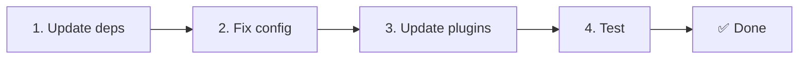

# 📦 Upgrade z v2.x na v3.x

<Tip>
Viz [Migrace z nuxt-i18n](/migration/from-nuxtjs-i18n) — tento průvodce se týká přechodu z ekosystému vue-i18n, ne z nuxt-i18n-micro v2.
</Tip>

Verze 3.0.0 přináší zásadní architektonické změny: balíčky strategií, nový systém cachování, centralizovanou správu locale přes `useI18nLocale()` a přepracovanou pipeline pro přesměrování. Tato sekce popisuje všechny breaking changes a jak aktualizovat váš kód.

## Kroky migrace



## Přehled breaking changes

- **Stav locale** — ruční `useState` / `useCookie` → composable `useI18nLocale()`
- **Přístup ke konfiguraci** — `useRuntimeConfig().public.i18nConfig` → `getI18nConfig()` z `#build/i18n.strategy.mjs`
- **Komponenta pro přesměrování** — volba `fallbackRedirectComponentPath` → serverový plugin pro přesměrování + klientský route middleware (automaticky)
- **`includeDefaultLocaleRoute`** — podporováno (deprecated) → odstraněno, použijte volbu `strategy`
- **`experimental.hmr`** — pod `experimental` → volba na kořenové úrovni
- **`previousPageFallback`** — zcela odstraněno (o toto se automaticky stará strategie kumulativního slučování)
- **Cachování** — `useStorage('cache')` → singleton `TranslationStorage` (`Symbol.for` na `globalThis`)
- **Přenos přes SSR** — runtime konfigurace → Nuxt payload (v3 používalo `useState`; chunky nyní žijí v `payload.data`, viz [Výkon](/guides/performance#server-side-payload-transfer))
- **Třídy strategií** — interní → samostatné balíčky (`@i18n-micro/route-strategy`, `@i18n-micro/path-strategy`)

## Odstraněno: `fallbackRedirectComponentPath`

Volba `fallbackRedirectComponentPath` a fallback komponenta `locale-redirect.vue` byly odstraněny. Logiku přesměrování nyní zajišťují:

1. **Serverový middleware** (`i18n.global.ts`) — nastavuje `event.context.i18n.locale`
2. **Serverový plugin pro přesměrování** (`06.redirect.ts`, pouze server) — 302 přesměrování před vykreslením
3. **Klientský route middleware** (`i18n-redirect.global.ts`) — SPA přesměrování po hydrataci

```diff
 i18n: {
   strategy: 'prefix_except_default',
-  fallbackRedirectComponentPath: '~/components/MyRedirect.vue',
 }
```

Pokud jste ve fallback komponentě měli vlastní logiku přesměrování, implementujte ji místo toho v serverovém pluginu:

```ts
// plugins/i18n-loader.server.ts
export default defineNuxtPlugin({
  name: 'i18n-custom-redirect',
  enforce: 'pre',
  order: -10,
  setup() {
    const { setLocale } = useI18nLocale()
    // Your custom detection logic
    setLocale(detectedLocale)
  },
})
```

## Odstraněno: `includeDefaultLocaleRoute`

Místo toho použijte volbu `strategy`:

- `includeDefaultLocaleRoute: true` → `strategy: 'prefix'`
- `includeDefaultLocaleRoute: false` → `strategy: 'prefix_except_default'` (výchozí)

```diff
 i18n: {
-  includeDefaultLocaleRoute: true,
+  strategy: 'prefix',
 }
```

## Přístup ke konfiguraci: `getI18nConfig()` nahrazuje `useRuntimeConfig`

```diff
- const config = useRuntimeConfig()
- const cookieName = config.public.i18nConfig?.localeCookie || 'user-locale'
+ import { getI18nConfig } from '#build/i18n.strategy.mjs'
+ const { localeCookie: configCookie } = getI18nConfig()
+ const cookieName = configCookie ?? 'user-locale'
```

## Správa locale: `useI18nLocale()` nahrazuje ruční stav

Ve verzi v2 jste možná používali přímo `useState('i18n-locale')` nebo `useCookie('user-locale')`. Ve verzi v3 použijte centralizovaný composable `useI18nLocale()`:

```diff
- const locale = useState('i18n-locale')
- const cookie = useCookie('user-locale')
- locale.value = 'fr'
- cookie.value = 'fr'
+ const { setLocale } = useI18nLocale()
+ setLocale('fr') // Updates both state and cookie atomically
```

Podrobné příklady viz [Vlastní detekce jazyka](/guides/custom-language-detection).

## Experimentální volby přesunuty / odstraněny

`hmr` bylo přesunuto z `experimental` na kořenovou úroveň. `previousPageFallback` bylo zcela odstraněno — modul nyní používá kumulativní hluboké slučování (do hloubky 2 úrovní), které automaticky zachovává překlady z předchozí stránky během přechodových animací, i když stránky sdílejí překrývající se vnořené klíče. Po dokončení přechodové animace vyčistí hook `page:transition:finish` klíče staré stránky z paměti.

```diff
 i18n: {
-  experimental: {
-    hmr: true,
-    previousPageFallback: true
-  }
+  hmr: true,
+  // previousPageFallback removed — handled automatically
 }
```

## Architektura přesměrování (v3)

Přesměrování nyní zpracovávají automaticky dvě komponenty:

1. **Na straně serveru** (`06.redirect.ts`, pouze server): běží během SSR, vydává 302 přesměrování před jakýmkoli vykreslením stránky — žádné „error flash"
2. **Na straně klienta** (`i18n-redirect.global.ts`): globální route middleware při SPA navigaci; zachovává query string a hash

Priorita locale pro přesměrování:

1. `useState('i18n-locale')` — nastaveno pomocí `useI18nLocale().setLocale()`
2. Cookie — pokud je nakonfigurováno `localeCookie`
3. Hlavička `Accept-Language` — pokud `autoDetectLanguage: true`
4. `defaultLocale` — fallback

Pro standardní nastavení nejsou potřeba žádné změny kódu.

<Warning>
Pro strategie `prefix` a `prefix_except_default` s `redirects: true` nastavte `localeCookie: 'user-locale'`, abyste povolili perzistenci locale mezi znovunačteními stránky. Bez toho přesměrování používají pouze `Accept-Language` nebo `defaultLocale`.
</Warning>

## TypeScript: Interní typy modulu (volitelné)

Pokud narazíte na chyby typů související s interními importy jako `#i18n-internal/plural`, `#i18n-internal/strategy` nebo `#i18n-internal/config`, přidejte do `package.json` svého projektu sekci `imports`:

```json
{
  "imports": {
    "#i18n-internal/plural": "nuxt-i18n-micro/internals",
    "#i18n-internal/strategy": "nuxt-i18n-micro/internals",
    "#i18n-internal/config": "nuxt-i18n-micro/internals"
  }
}
```

<Tip>

</Tip>
