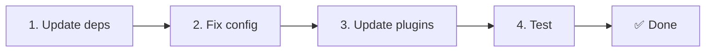

# 📦 Upgrade z v2.x na v3.x

<Tip>
Viz [Migrace z nuxt-i18n](/migration/from-nuxtjs-i18n). Ten průvodce pokrývá přechod z ekosystému vue-i18n, nikoli z nuxt-i18n-micro v2.
</Tip>

v3.0.0 přináší zásadní architektonické změny: strategy balíčky, nový cachovací systém, centralizovanou správu locale přes `useI18nLocale()` a přepracovanou pipeline pro přesměrování. Tato sekce pokrývá všechny prolamující změny a jak aktualizovat kód.

## Kroky migrace



## Souhrn prolamujících změn

- **Stav locale**: `useState` / `useCookie` manuálně → composable `useI18nLocale()`
- **Přístup ke konfiguraci**: `useRuntimeConfig().public.i18nConfig` → `getI18nConfig()` z `#build/i18n.strategy.mjs`
- **Redirect komponenta**: volba `fallbackRedirectComponentPath` → server redirect plugin + client route middleware (automaticky)
- **`includeDefaultLocaleRoute`**: podporováno (deprecated) → odstraněno, použijte volbu `strategy`
- **`experimental.hmr`**: pod `experimental` → volba na kořenové úrovni
- **`previousPageFallback`**: zcela odstraněno (kumulativní merge strategie to zvládne automaticky)
- **Cache**: `useStorage('cache')` → singleton `TranslationStorage` (`Symbol.for` na `globalThis`)
- **SSR přenos**: Runtime config → Nuxt payload (v3 používala `useState`; chunky nyní žijí v `payload.data`, viz [Výkon](/guides/performance#server-side-payload-transfer))
- **Strategy třídy**: interní → samostatné balíčky (`@i18n-micro/route-strategy`, `@i18n-micro/path-strategy`)

## Odstraněno: `fallbackRedirectComponentPath`

Volba `fallbackRedirectComponentPath` a fallback komponenta `locale-redirect.vue` byly odstraněny. Logiku přesměrování nyní zajišťují:

1. **Server middleware** (`i18n.global.ts`): nastavuje `event.context.i18n.locale`
2. **Server redirect plugin** (`06.redirect.ts`, pouze na serveru): 302 přesměrování před renderem
3. **Client route middleware** (`i18n-redirect.global.ts`): SPA přesměrování po hydrataci

```diff
 i18n: {
   strategy: 'prefix_except_default',
-  fallbackRedirectComponentPath: '~/components/MyRedirect.vue',
 }
```

Pokud jste ve fallback komponentě měli vlastní logiku přesměrování, implementujte ji místo toho v serverovém pluginu:

```ts
// plugins/i18n-loader.server.ts
export default defineNuxtPlugin({
  name: 'i18n-custom-redirect',
  enforce: 'pre',
  order: -10,
  setup() {
    const { setLocale } = useI18nLocale()
    // Your custom detection logic
    setLocale(detectedLocale)
  },
})
```

## Odstraněno: `includeDefaultLocaleRoute`

Použijte místo toho volbu `strategy`:

- `includeDefaultLocaleRoute: true` → `strategy: 'prefix'`
- `includeDefaultLocaleRoute: false` → `strategy: 'prefix_except_default'` (výchozí)

```diff
 i18n: {
-  includeDefaultLocaleRoute: true,
+  strategy: 'prefix',
 }
```

## Přístup ke konfiguraci: `getI18nConfig()` nahrazuje `useRuntimeConfig`

```diff
- const config = useRuntimeConfig()
- const cookieName = config.public.i18nConfig?.localeCookie || 'user-locale'
+ import { getI18nConfig } from '#build/i18n.strategy.mjs'
+ const { localeCookie: configCookie } = getI18nConfig()
+ const cookieName = configCookie ?? 'user-locale'
```

## Správa locale: `useI18nLocale()` nahrazuje manuální state

Ve v2 jste možná používali `useState('i18n-locale')` nebo `useCookie('user-locale')` přímo. Ve v3 použijte centralizovaný composable `useI18nLocale()`:

```diff
- const locale = useState('i18n-locale')
- const cookie = useCookie('user-locale')
- locale.value = 'fr'
- cookie.value = 'fr'
+ const { setLocale } = useI18nLocale()
+ setLocale('fr') // Updates both state and cookie atomically
```

Podrobné příklady najdete v [Vlastní detekci jazyka](/guides/custom-language-detection).

## Přesunuté / odstraněné experimentální volby

`hmr` byl přesunut z `experimental` na kořenovou úroveň. `previousPageFallback` bylo zcela odstraněno. Modul nyní používá kumulativní deep merge strategii (hloubka 2), která automaticky zachovává překlady z předchozí stránky během přechodových animací, i když stránky sdílí překrývající se vnořené klíče. Po dokončení přechodové animace hook `page:transition:finish` uklidí klíče staré stránky z paměti.

```diff
 i18n: {
-  experimental: {
-    hmr: true,
-    previousPageFallback: true
-  }
+  hmr: true,
+  // previousPageFallback removed — handled automatically
 }
```

## Architektura přesměrování (v3)

Přesměrování nyní automaticky zajišťují dvě komponenty:

1. **Na straně serveru** (`06.redirect.ts`, pouze na serveru): Běží během SSR, vydává 302 přesměrování před jakýmkoli renderem stránky. Žádný „error flash“.
2. **Na straně klienta** (`i18n-redirect.global.ts`): Globální route middleware při SPA navigaci; zachovává query string a hash.

Priorita locale pro přesměrování:

1. `useState('i18n-locale')`: nastaveno přes `useI18nLocale().setLocale()`
2. Cookie: pokud je `localeCookie` nakonfigurována
3. Hlavička `Accept-Language`: pokud `autoDetectLanguage: true`
4. `defaultLocale`: fallback

Pro standardní nastavení nejsou žádné změny kódu vyžadovány.

<Warning>
U strategií `prefix` a `prefix_except_default` s `redirects: true` nastavte `localeCookie: 'user-locale'`, aby locale přežívalo přes reload stránky. Bez toho přesměrování využívá jen `Accept-Language` nebo `defaultLocale`.
</Warning>

## TypeScript: interní typy modulu (volitelné)

Pokud narazíte na chyby typu související s interními importy jako `#i18n-internal/plural`, `#i18n-internal/strategy` nebo `#i18n-internal/config`, přidejte do `package.json` projektu sekci `imports`:

```json
{
  "imports": {
    "#i18n-internal/plural": "nuxt-i18n-micro/internals",
    "#i18n-internal/strategy": "nuxt-i18n-micro/internals",
    "#i18n-internal/config": "nuxt-i18n-micro/internals"
  }
}
```
