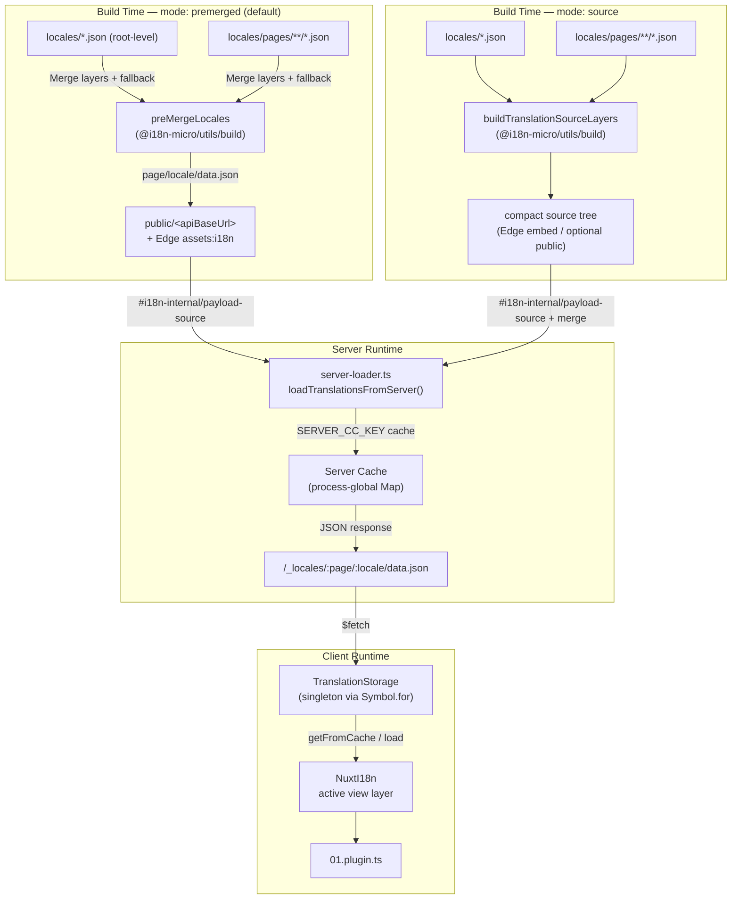

# 🗄️ Arkitektur for oversættelsescache og lagring

## 📖 Oversigt

Nuxt I18n Micro v3 bruger en cachingarkitektur i flere lag til oversættelser. Payload-indlæsning afhænger af `translationPayloads.mode`:

- **`premerged`** (standard) — rod-, side-, fallback- og lagfiler flettes ved buildtid via `@i18n-micro/utils/build` til `\{page\}/\{locale\}/data.json`
- **`source`** — kompakte kildefiler bevares til runtime-merge via `@i18n-micro/utils/source-loader` og `@i18n-micro/utils/merge-source` (Edge indlejrer dem i Nitro `serverAssets`; Node læser dem fra `public/`, når de er kopieret)

Denne side beskriver, hvordan den indbyggede cache fungerer, og hvordan du udvider den til brugerdefinerede scenarier (adminværktøjer, eksterne API'er, cache-invalidering).

## 📊 Arkitekturoversigt

### Dataflow



## 🧱 Kernekomponenter

### 1. `TranslationStorage` (klient + server)

**Fil**: `src/runtime/utils/storage.ts`

En singleton-klasse, der giver samlet lagring af oversættelser til både klient og server. Den bruger `Symbol.for('__NUXT_I18N_STORAGE_CACHE__')` på `globalThis` for at sikre, at kun én instans eksisterer, selv når flere bundles er indlæst.

**Nøglemetoder:**

| Metode                              | Beskrivelse                                                            |
| ----------------------------------- | ---------------------------------------------------------------------- |
| `getFromCache(locale, routeName?)`  | Synkront opslag: returnerer cachet data fra hukommelsen eller `null`   |
| `load(locale, routeName?, options)` | Asynkron indlæsning med caching: tjekker cachen først og henter derefter via `$fetch` |
| `clear()`                           | Rydder hele cachen                                                     |

**Cachenøgleformat**: `\{locale\}:\{routeName\}` (f.eks. `en:index`, `fr:about`)

```typescript
import { translationStorage } from '../utils/storage'

// Synchronous cache check
const cached = translationStorage.getFromCache('en', 'index')

// Async load (with automatic caching)
const result = await translationStorage.load('en', 'index', {
  apiBaseUrl: '_locales',
  baseURL: '/',
  dateBuild: '2024-01-01',
})
// result.data — merged translations
// result.cacheKey — cache key used
```

### ⚙️ Deterministisk cache-busting (`i18n.dateBuild`)

Som standard genererer dette modul `dateBuild` ved buildtid ved hjælp af `Date.now()`. Det indlejres derefter i den genererede `#build/i18n.strategy.mjs` og bruges som forespørgselsparameter (`?v=...`) til at invalidere oversættelsens fetch-caches efter genopbygninger.

Hvis du har brug for reproducerbare builds (for eksempel for at forbedre chunk-cachens hit rate ved rullende deployments), skal du sætte en stabil værdi i `nuxt.config`:

```ts
export default defineNuxtConfig({
  i18n: {
    // Any stable string/number (git SHA, CI build number, release tag, etc.)
    dateBuild: process.env.GIT_SHA ?? 'local-dev',
  },
})
```

### 2. `loadTranslationsFromServer()` (kun server)

**Fil**: `src/runtime/server/utils/server-loader.ts`

Indlæser oversættelser for et locale/side og cacher det flettede resultat i et proces-globalt `CacheControl`-map med nøgle via `@i18n-micro/hmr/cache-keys` (`SERVER_CC_KEY`).

Adfærd: SSR indlæser fra `#i18n-internal/payload-source` — **Node** `readFile` under `public/<apiBaseUrl>` (`\{page\}/\{locale\}/data.json` i premerged-tilstand), **Edge** `assets:i18n`. `premerged` læser én fil; `source` fletter rod/side/fallback via `@i18n-micro/utils/source-loader`.

```typescript
import { loadTranslationsFromServer } from '../server/utils/server-loader'

// Returns { data: Translations, json: string }
const { data, json } = await loadTranslationsFromServer('en', 'index')
```

### 3. Klientindlæsning (uden HTML-indlejring)

Ordbøger skrives **ikke** ind i `nuxtApp.payload`. Serveren holder dem i hukommelsen til SSR-rendering. Klient-pluginet afventer `switchContext`, som indlæser `/\{apiBaseUrl\}/:page/:locale/data.json` (samme standardopstilling som `@nuxtjs/i18n` med `experimental.preload: false`).

`NuxtI18n` holder den aktive view-lags-ordbog, som bruges af `$t()` og `$has()`. `NuxtTranslationLoader` skifter locale/rute-kontekst og fletter chunks ind i det lag.

### 4. Server-API-rute

**Rute**: `/_locales/\{page\}/\{locale\}/data.json`

**Fil**: `src/runtime/server/routes/i18n.ts`

Denne Nitro-rute serverer flettede oversættelser for den aktive payload-tilstand. Den kalder `loadTranslationsFromServer()` og returnerer resultatet som JSON.

I produktion sætter den også:

```http
Cache-Control: public, max-age={httpCacheDuration}, immutable
```

Standard `httpCacheDuration` er `31536000` (1 år). Det er sikkert, fordi klienter anmoder om payloads med `?v=\{dateBuild\}` cache-busting. Sæt `httpCacheDuration: 0` for at udelade headeren. Headeren anvendes ikke i udvikling.

## 📥 Udvidelse: brugerdefineret indlæsning af oversættelser

### Læs fra cache (serverrute)

```ts
// server/api/i18n/load-cache.[post].ts
import { defineEventHandler, readBody } from 'h3'
import { loadTranslationsFromServer } from '#imports'

export default defineEventHandler(async (event) => {
  const { page, locale } = await readBody<{ page: string; locale: string }>(event)
  const { data } = await loadTranslationsFromServer(locale, page)
  return { locale, page, data }
})
```

### Opdater oversættelser (fil + invalider cache)

```ts
// server/api/i18n/update.[post].ts
import { defineEventHandler, readBody, createError } from 'h3'
import { join } from 'node:path'
import { readFile, writeFile } from 'node:fs/promises'
import { deepMergeTranslations } from '@i18n-micro/utils/deep-merge'

export default defineEventHandler(async (event) => {
  const { path, updates } = await readBody<{ path: string; updates: Record<string, unknown> }>(event)

  if (!path || !updates) {
    throw createError({ statusCode: 400, statusMessage: 'Missing path or updates' })
  }

  const fullPath = join('locales', path)
  let existing: Record<string, unknown> = {}

  try {
    const content = await readFile(fullPath, 'utf-8')
    existing = JSON.parse(content) as Record<string, unknown>
  } catch {
    // File does not exist — create new
  }

  const merged = deepMergeTranslations(existing, updates)
  await writeFile(fullPath, JSON.stringify(merged, null, 2), 'utf-8')

  return { success: true, path, updated: merged }
})
```


## 🧹 Rydning af cache

### Programmatisk cache-rydning (klient)

Brug den indbyggede metode `$clearCache`:

```vue
<script setup>
const { $clearCache } = useNuxtApp()

// Clears both TranslationStorage and plugin-level cache
$clearCache()
</script>
```

### Adfærd for serverside-cache

Serverside-cachen (`loadTranslationsFromServer`) er proces-global og består indtil:

- Serverprocessen genstarter
- En ny deployment opdages (anden `dateBuild`-værdi)

I serverless-miljøer har hver koldstart en frisk cache.

## ⚙️ Konfiguration i serverless

I serverless-miljøer (Cloudflare Workers, AWS Lambda) bruger den indbyggede cache in-memory `Map`-objekter. Der kræves ingen ekstern lagerkonfiguration til selve oversættelsescachen.

Nitro-lagring for kildeoversættelsesfiler kan dog kræve konfiguration:

```ts
export default defineNuxtConfig({
  nitro: {
    storage: {
      // Only needed if default file-system storage is unavailable
      'assets:server': {
        driver: 'cloudflare-kv-binding',
        binding: 'MY_KV_NAMESPACE',
      },
    },
  },
})
```

## 💡 Vigtige forskelle fra v2

| Aspekt           | v2                            | v3                                                                       |
| ---------------- | ----------------------------- | ------------------------------------------------------------------------ |
| Klient-cache     | `useStorage('cache')`         | `TranslationStorage`-singleton (Symbol.for på globalThis)                |
| SSR-overførsel   | Runtime-config                | Fulde chunks via `payload.data` (v3.0 brugte `useState`)                 |
| Server-cache     | Nitro cache storage           | Proces-global `Map` via `Symbol.for`                                     |
| Merge-logik      | Klient-side                   | Buildtid (`premerged`) eller runtime (`source`) via `@i18n-micro/utils/*` |
| Cachenøgleformat | `i18n:merged:\{page\}:\{locale\}` | `\{locale\}:\{routeName\}`                                                   |

## 📚 Relateret

- [Performanceguide](/guides/performance) — hvordan caching påvirker ydeevnen
- [Oversættelser på serversiden](/guides/server-side-translations) — brug af oversættelser i serverruter
- [Firebase-deployment](/guides/firebase) — deployment-specifikke cache-overvejelser
