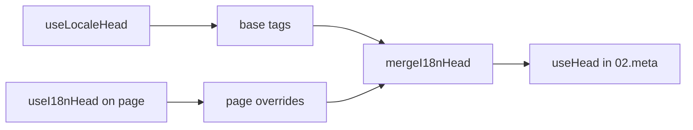

# Composablen `useI18nHead`

`useI18nHead` lader dig tilpasse i18n SEO-tags **pr. side** uden et brugerdefineret meta-plugin. Når `meta: true`, fletter modulet dit input oven på output fra [`useLocaleHead`](/api/composables/use-locale-head).

Typiske brugstilfælde:

- **CMS-/blogartikler** — kun nogle locales er oversat. Alternative URL'er afviger pr. sprog (forskellige slugs eller stier).
- **Dynamisk canonical** — den canoniske URL skal matche artikel-URL'en fra API'et, ikke `$switchLocalePath`.
- **Ekstra Open Graph** — `og:title`, `og:description`, `og:image` ved siden af auto-genereret `og:locale` / `og:url`.
- **Delvis kontrol** — behold modul-genereret canonical og `og:url`, men erstat kun `hreflang` og `og:locale:alternate`.

---

## Signatur

{/* generated:symbol:useI18nHead — do not edit; run `pnpm run docs:generate` */}

```ts
useI18nHead(input?: MaybeRefOrGetter<I18nHeadInput | null>): { pageHead: any; resetPageHead: () => void }
```

Registrer overrides på sideniveau for i18n SEO-head-tags. Flettes oven på output fra `useLocaleHead` af `02.meta`-pluginet.

| Parameter | Type | Beskrivelse |
| --- | --- | --- |
| `input` *(valgfri)* | `MaybeRefOrGetter<I18nHeadInput \| null>` |  |

{/* /generated:symbol:useI18nHead */}

## Sådan passer den ind i pipelinen



Du kalder `useI18nHead` i en sidekomponent. `02.meta`-pluginet anvender overrides efter hver `updateMeta()` (ruteskift, `$setI18nRouteParams`, `page:finish` på klienten).

---

## Eksempel 1 — artikel med oversættelser kun i nogle locales

Et almindeligt mønster: API'et returnerer, hvilke locales der findes, og deres absolutte eller relative URL'er.

```ts
interface Article {
  title: string
  slug: string
  /** Locale code → page URL (absolute or site-relative) */
  locales: Record<string, string>
}
```

```vue
<script setup lang="ts">
const route = useRoute()
const { data: article } = await useFetch<Article>(`/api/articles/${route.params.slug}`)

const localeCodes = computed(() => Object.keys(article.value?.locales ?? {}))

useI18nHead(() => {
  if (!article.value) return null

  return {
    meta: [
      { property: 'og:title', content: article.value.title },
      { property: 'og:type', content: 'article' },
    ],
    replace: {
      hreflang: localeCodes.value.map((locale) => ({
        rel: 'alternate',
        hreflang: locale,
        href: article.value!.locales[locale]!,
      })),
      ogAlternates: localeCodes.value,
    },
  }
})
</script>
```

`ogAlternates` tager **locale-koder** fra din `i18n.locales`-config. Værdier til `og:locale:alternate` resolveres via `locale.og` eller `iso` (Open Graph `en_US`-format).

---

## Eksempel 2 — artikel med slugs pr. locale (`$defineI18nRoute` + `$setI18nRouteParams`)

Når URL'er bygges ud fra lokaliserede rute-skabeloner og dynamiske params:

```vue
<script setup lang="ts">
const { $defineI18nRoute, $setI18nRouteParams } = useNuxtApp()
const route = useRoute()

const { data: article } = await useFetch(`/api/articles/${route.params.slug}`)

$defineI18nRoute({
  localeRoutes: {
    en: '/blog/[slug]',
    de: '/de/blog/[slug]',
    fr: '/fr/blog/[slug]',
  },
})

if (article.value) {
  $setI18nRouteParams({
    en: { slug: article.value.slugEn },
    de: { slug: article.value.slugDe },
    fr: { slug: article.value.slugFr },
  })

  const availableLocales = article.value.availableLocales as string[]

  useI18nHead({
    meta: [{ property: 'og:title', content: article.value.title }],
    replace: {
      hreflang: availableLocales.map((locale) => ({
        rel: 'alternate',
        hreflang: locale,
        href: article.value!.urls[locale],
      })),
      ogAlternates: availableLocales,
    },
  })
}
</script>
```

Modul-genererede alternater ville liste **alle** konfigurerede locales. `replace.hreflang` begrænser tags til locales, der faktisk har en oversættelse.

---

## Eksempel 3 — brugerdefineret `x-default` for artikel-URL i standard-locale

Som standard peger `x-default` på URL'en for standard-locale fra `$switchLocalePath`. For artikler skal du pege på standardoversættelsens URL:

```vue
<script setup lang="ts">
const { $defaultLocale } = useNuxtApp()
const article = await loadArticle()

const defaultLocale = $defaultLocale() ?? 'en'
const defaultHref = article.locales[defaultLocale]

useI18nHead({
  replace: {
    hreflang: Object.entries(article.locales).map(([locale, href]) => ({
      rel: 'alternate',
      hreflang: locale,
      href,
    })),
    xDefault: defaultHref ? { rel: 'alternate', hreflang: 'x-default', href: defaultHref } : false,
    ogAlternates: Object.keys(article.locales),
  },
})
</script>
```

---

## Eksempel 4 — erstat canonical og `og:url` med data fra API'et

Når den canoniske URL skal matche en CMS-leveret URL (multi-domæne, brugerdefineret sti eller forud bygget absolut URL):

```vue
<script setup lang="ts">
const article = await loadArticle()
const canonical = article.canonicalUrl // e.g. https://www.example.com/en/blog/my-post

useI18nHead({
  replace: {
    canonical,
    ogUrl: canonical,
    hreflang: buildAlternateLinks(article),
    ogAlternates: Object.keys(article.locales),
  },
  meta: [
    { property: 'og:title', content: article.title },
    { name: 'description', content: article.excerpt },
  ],
})
</script>
```

---

## Eksempel 5 — behold automatisk canonical / `og:url`, erstat kun alternater

Hvis `$switchLocalePath` + `$setI18nRouteParams` allerede producerer korrekt canonical og `og:url`, erstattes kun discovery-tags:

```vue
<script setup lang="ts">
const article = await loadArticle()

useI18nHead({
  replace: {
    hreflang: buildAlternateLinks(article),
    ogAlternates: Object.keys(article.locales),
  },
})
</script>
```

---

## Eksempel 6 — fuldt head for en indholds-detalje-side (meta + links)

Mønster svarende til at opdele "sidemeta" og "alternate links" i separate hjælpere, men kombineret i ét kald:

```vue
<script setup lang="ts">
const article = await loadArticle()
const alternates = Object.entries(article.locales).map(([locale, href]) => ({
  rel: 'alternate' as const,
  hreflang: locale,
  href: normalizeSeoUrl(href), // strip ?query and #hash if needed
}))

useI18nHead({
  meta: [
    { property: 'og:title', content: article.title },
    { property: 'og:description', content: article.description },
    { property: 'og:image', content: article.imageUrl },
    { name: 'twitter:card', content: 'summary_large_image' },
    { name: 'twitter:title', content: article.title },
  ],
  replace: {
    canonical: article.canonicalUrl,
    ogUrl: article.canonicalUrl,
    hreflang: alternates,
    ogAlternates: Object.keys(article.locales),
  },
})
</script>
```

```ts
/** Remove query and hash — useful when CMS URLs must be clean for SEO */
function normalizeSeoUrl(href: string): string {
  try {
    const url = new URL(href, 'https://placeholder.local')
    url.search = ''
    url.hash = ''
    return href.startsWith('http') ? url.href : `${url.pathname}`
  } catch {
    return href.split(/[?#]/)[0] ?? href
  }
}
```

---

## Eksempel 7 — to indholdstyper, samme mønster (nyheder vs. guides)

Samme API-form, forskellige rutenavne. Genbrug en lille hjælper:

```ts
// composables/useArticleHead.ts
import type { I18nHeadInput } from '@i18n-micro/types'

interface LocalizedContent {
  title: string
  locales: Record<string, string>
  canonicalUrl?: string
}

export function buildArticleHead(content: LocalizedContent): I18nHeadInput {
  const localeCodes = Object.keys(content.locales)
  const canonical = content.canonicalUrl ?? content.locales.en

  return {
    meta: [{ property: 'og:title', content: content.title }],
    replace: {
      canonical,
      ogUrl: canonical,
      hreflang: localeCodes.map((locale) => ({
        rel: 'alternate',
        hreflang: locale,
        href: content.locales[locale]!,
      })),
      ogAlternates: localeCodes,
    },
  }
}
```

```vue
<!-- pages/blog/[slug].vue -->
<script setup lang="ts">
const article = await loadArticle()
useI18nHead(buildArticleHead(article))
</script>
```

```vue
<!-- pages/guides/[slug].vue -->
<script setup lang="ts">
const guide = await loadGuide()
useI18nHead(buildArticleHead(guide))
</script>
```

---

## Eksempel 8 — deaktiver indbyggede alternater, angiv din egen liste

Svarer til at deaktivere modulets hreflang-generator og sende en brugerdefineret liste ind (ingen duplikerede alternate-sæt):

```vue
<script setup lang="ts">
const article = await loadArticle()

useI18nHead({
  disable: ['hreflang', 'x-default', 'og-alternates'],
  link: Object.entries(article.locales).map(([locale, href]) => ({
    rel: 'alternate',
    hreflang: locale,
    href,
  })),
  replace: {
    ogAlternates: Object.keys(article.locales),
  },
})
</script>
```

Alternativt foretræk `replace.hreflang` uden `disable`. Den erstatter alle `rel="alternate"`-links i ét trin.

---

## Eksempel 9 — landingsside: kun ekstra OG, behold alle i18n-tags

```vue
<script setup lang="ts">
const { t } = useI18n()

useI18nHead({
  meta: [
    { property: 'og:title', content: t('landing.ogTitle') },
    { property: 'og:description', content: t('landing.ogDescription') },
  ],
})
</script>
```

---

## Eksempel 10 — produktside: deaktivér hreflang for et enkelt locale-eksperiment

```vue
<script setup lang="ts">
useI18nHead({
  disable: ['hreflang', 'x-default'],
  // canonical, og:locale, og:url still generated
})
</script>
```

---

## Eksempel 11 — reaktive opdateringer efter klient-side fetch

```vue
<script setup lang="ts">
const article = ref<Article | null>(null)

onMounted(async () => {
  article.value = await $fetch('/api/articles/latest')
})

useI18nHead(() => {
  if (!article.value) return null
  return {
    meta: [{ property: 'og:title', content: article.value.title }],
    replace: {
      hreflang: Object.entries(article.value.locales).map(([locale, href]) => ({
        rel: 'alternate',
        hreflang: locale,
        href,
      })),
    },
  }
})
</script>
```

Head opdateres ved `page:finish`, og når `pageHead`-state ændres.

---

## Eksempel 12 — HTTPS-origin bag en reverse proxy

Hvis du tidligere resolvede en "public origin"-composable for canoniske / alternative absolutte URL'er, så brug modulkonfigurationen i stedet:

```ts
// nuxt.config.ts
export default defineNuxtConfig({
  i18n: {
    meta: true,
    // undefined = origin from current request (multi-domain friendly)
    metaBaseUrl: undefined,
    metaTrustForwardedHost: true,
    metaTrustForwardedProto: true,
  },
})
```

Send derefter **stier eller fulde URL'er** i `replace.hreflang` / `replace.canonical`. Modulet bruger `useRequestURL` med `X-Forwarded-Host` / `X-Forwarded-Proto` under SSR.

---

## API-reference

### `meta`

Ekstra `<meta>`-tags. Dedupleret efter `id`, `property` eller `name`.

### `link`

Ekstra `<link>`-tags. Dedupleret efter `id` eller `rel` + `hreflang`.

### `htmlAttrs`

Flettes ind i `<html>`-attributter fra `useLocaleHead` (`lang`, `dir`).

### `replace`

| Nøgle          | Type                      | Effekt                                          |
| -------------- | ------------------------- | ----------------------------------------------- |
| `canonical`    | `string \| false`         | Erstat eller fjern canonical-link                |
| `hreflang`     | `I18nHeadLink[] \| false` | Erstat eller fjern alle `rel="alternate"`-links |
| `xDefault`     | `I18nHeadLink \| false`   | Erstat eller fjern `hreflang="x-default"`       |
| `ogLocale`     | `string \| false`         | Erstat eller fjern `og:locale`                  |
| `ogUrl`        | `string \| false`         | Erstat eller fjern `og:url`                     |
| `ogAlternates` | `string[] \| false`       | Genopbyg `og:locale:alternate` for locale-koder |

### `disable`

| Værdi           | Fjerner                                  |
| --------------- | ---------------------------------------- |
| `hreflang`      | Locale alternate-links (ikke `x-default`) |
| `x-default`     | `hreflang="x-default"`-link              |
| `canonical`     | Canonical-link                           |
| `og`            | `og:locale` og `og:url`                  |
| `og-alternates` | `og:locale:alternate`-tags               |
| `html`          | `lang` / `dir` på `<html>`               |

---

## `useLocaleHead` vs `useI18nHead`

| Composable      | Anvendelse           | Hvornår du skal bruge den                     |
| --------------- | -------------------- | --------------------------------------------- |
| `useLocaleHead` | Global / manuel head | `meta: false`, fuldt brugerdefineret `useHead` |
| `useI18nHead`   | Overrides pr. side   | `meta: true`, tilpas specifikke sider         |

Når `meta: true`, har du **ikke** brug for `useLocaleHead` på sider, der kun bruger `useI18nHead`.

---

## Migration fra et brugerdefineret i18n-head-plugin

Mange projekter vedligeholder et brugerdefineret plugin, der:

- fletter sidespecifikke alternate-links fra delt state,
- filtrerer duplikerede regionale `hreflang`-poster,
- normaliserer `og:locale`-værdier,
- fjerner query-strings fra SEO-URL'er.

Du kan erstatte det med `useI18nHead` på hver indholdsside og modul-standarder.

| Tidligere tilgang                                     | Med `useI18nHead`                                    |
| ----------------------------------------------------- | ---------------------------------------------------- |
| Delt state + "hvilke locales findes for denne artikel" | `replace: \{ ogAlternates: localeCodes \}`             |
| Separat hjælper bygger `rel="alternate"`-links        | `replace: \{ hreflang: links \}`                       |
| Brugerdefineret plugin fletter sidestate ind i head'et | Indbygget merge i `02.meta`                          |
| Brugerdefineret "public origin" for absolutte URL'er   | `metaBaseUrl` + forwarded headers (se eksempel 12)   |
| Kort `og:locale` (`en` i stedet for `en_US`)          | Sæt `locale.og`, eller brug `iso` → `en_US` (OG-protokol) |

**`hreflang` fra `iso`:** hver locale udsender ét alternate med `hreflang = iso || code`. Routing-`code` bruges aldrig, når `iso` er sat (undgår ugyldige tags som `hreflang="mx"`). Tilvælg fallback for bare sprog (`es-ES` → også `es`) med `hreflangBaseLanguage: true`. Det udledes fra `iso`, ikke `code`. Til fuldt tilpassede lister, brug `replace.hreflang`.

**JSON-LD:** `useI18nHead` genererer ikke struktureret data. Behold `useHead(\{ script: [...] \})` eller en dedikeret JSON-LD-hjælper ved siden af.

---

## Se også

- [SEO-guide](/guides/seo) — automatisk meta-generering og overrides på sideniveau
- [`useLocaleHead`](/api/composables/use-locale-head) — lav-niveau head-API
