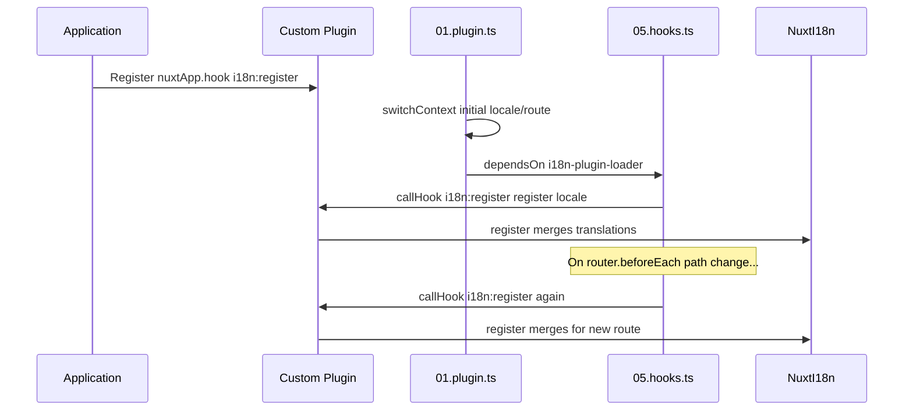

# 📢 Events

## 🔄 `i18n:register`

`i18n:register`-eventet i `Nuxt I18n Micro` muliggør dynamisk tilføjelse af oversættelser til din applikations i18n-kontekst, hvilket gør internationaliseringsprocessen sømløs og fleksibel. Dette event giver dig mulighed for at integrere nye oversættelser efter behov og forbedre din applikations lokaliseringsevner.

### 📝 Event-detaljer

- **Formål**:
  - Muliggør dynamisk indarbejdelse af yderligere oversættelser i det eksisterende sæt for en specifik locale.

- **Payload**:
  - **`register`**:
    - En funktion leveret af eventet, som tager to argumenter:
      - **`translations`** (`Translations`):
        - Et objekt, der indeholder nøgle-værdi-par, som repræsenterer oversættelser, organiseret efter `Translations`-interfacet.
      - **`locale`** (`string`, valgfri):
        - Locale-koden (f.eks. `'en'`, `'ru'`), som oversættelserne er registreret for. Standarder til den locale, der leveres af eventet, hvis ikke angivet.

- **Adfærd**:
  - Når det udløses, merger `register`-funktionen de nye oversættelser ind i den aktuelle kontekst for den specificerede locale og opdaterer de tilgængelige oversættelser på tværs af applikationen.

### ⏱️ Hvornår det udløses

Modulets hooks-plugin (`05.hooks.ts`, `dependsOn: ['i18n-plugin-loader']`) kalder `nuxtApp.callHook('i18n:register', …)`:

1. **Én gang ved opstart** — efter at hoved-i18n-pluginet (`01.plugin.ts`) har indlæst oversættelser for den oprindelige rute
2. **Ved navigation** — i `router.beforeEach`, når stien ændres, eller ved hver navigation, når `strategy: 'no_prefix'`

Registrér din listener i et normalt Nuxt-plugin med `nuxtApp.hook('i18n:register', …)`. Hooks-pluginet kører, efter loaderen er klar, så din callback kaldes, når oversættelser skal udvides.

Sæt `hooks: false` i `nuxt.config` for at deaktivere automatiske `i18n:register`-kald (se [Konfiguration — `hooks`](/guides/configuration#hooks)).

### 💡 Eksempel på brug

Det følgende eksempel demonstrerer, hvordan man bruger `i18n:register`-eventet til dynamisk at tilføje oversættelser:

```typescript
nuxt.hook('i18n:register', async (register: (translations: unknown, locale?: string) => void, locale: string) => {
  register(
    {
      greeting: 'Hello',
      farewell: 'Goodbye',
    },
    locale,
  )
})
```

### 🛠️ Forklaring



- **Udløsning af eventet**:
  - Hooks-pluginet (`05.hooks.ts`) udløser `i18n:register`, efter hoved-loaderen er klar, og ved relevante navigationer.

- **Tilføjelse af oversættelser**:
  - Eksemplet registrerer engelske oversættelser for `"greeting"` og `"farewell"`.
  - `register`-funktionen merger disse oversættelser ind i det eksisterende sæt for den angivne locale.

### 🔗 Nøglefordele

- **Dynamiske opdateringer**:
  - Opdatér eller tilføj nemt oversættelser uden at skulle redeploye hele din applikation.

- **Lokaliseringsfleksibilitet**:
  - Understøtter realtids-lokaliseringsjusteringer baseret på bruger- eller applikationsbehov.

Ved at bruge `i18n:register`-eventet kan du sikre, at din applikations lokaliseringsstrategi forbliver fleksibel og tilpasningsdygtig og forbedrer den samlede brugeroplevelse.

---

## 🛠️ Ændring af oversættelser med plugins

For dynamisk at ændre oversættelser i din Nuxt-applikation anbefales brug af plugins. Plugins giver en struktureret måde at håndtere lokaliseringsopdateringer på, især når du arbejder med moduler eller eksterne oversættelsesfiler.

### **Registrering af pluginet**

Hvis du bruger et modul, registrér pluginet, hvor oversættelses-ændringer skal ske, ved at tilføje det til dit moduls konfiguration:

```javascript
addPlugin({
  src: resolve('./plugins/extend_locales'),
})
```

Dette registrerer pluginet placeret på `./plugins/extend_locales`, som vil håndtere dynamisk indlæsning og registrering af oversættelser.

### **Implementering af pluginet**

I pluginet kan du håndtere locale-ændringer. Her er et eksempel på implementering i et Nuxt-plugin:

```typescript
import { defineNuxtPlugin } from '#app'

export default defineNuxtPlugin(async (nuxtApp) => {
  // Function to load translations from JSON files and register them
  const loadTranslations = async (lang: string) => {
    try {
      const translations = await import(`../locales/${lang}.json`)
      return translations.default
    } catch (error) {
      console.error(`Error loading translations for language: ${lang}`, error)
      return null
    }
  }

  // Hook into the 'i18n:register' event to dynamically add translations
  // eslint-disable-next-line @typescript-eslint/ban-ts-comment
  // @ts-expect-error
  nuxtApp.hook('i18n:register', async (register: (translations: unknown, locale?: string) => void, locale: string) => {
    const translations = await loadTranslations(locale)
    if (translations) {
      register(translations, locale)
    }
  })
})
```

### 📝 Detaljeret forklaring

1. **Indlæsning af oversættelser**:

- `loadTranslations`-funktionen importerer dynamisk oversættelsesfiler baseret på locale. Filerne forventes at være i `locales`-mappen og navngivet efter locale-koder (f.eks. `en.json`, `de.json`).
- Ved vellykket indlæsning returneres oversættelser; ellers logges en fejl.

2. **Registrering af oversættelser**:

- Pluginet hooker ind i `i18n:register`-eventet ved hjælp af `nuxtApp.hook`.
- Når eventet udløses, kaldes `register`-funktionen med de indlæste oversættelser og den tilsvarende locale.
- Dette merger de nye oversættelser ind i i18n-konteksten for den specificerede locale og opdaterer de tilgængelige oversættelser i hele applikationen.

### 🔗 Fordele ved at bruge plugins til ændringer af oversættelser

- **Adskillelse af ansvar**:
  - Indkapsl lokaliseringslogik adskilt fra hovedapplikationskoden, hvilket gør håndtering og vedligeholdelse lettere.

- **Dynamisk og skalerbart**:
  - Ved dynamisk at indlæse og registrere oversættelser kan du opdatere indhold uden at kræve en fuld applikations-redeployment, hvilket er særligt nyttigt for applikationer med hyppigt opdateret eller flersproget indhold.

- **Forbedret lokaliseringsfleksibilitet**:
  - Plugins giver dig mulighed for at ændre eller udvide oversættelser efter behov, hvilket giver en mere tilpasningsdygtig og responsiv lokaliseringsstrategi, der opfylder brugerpræferencer eller forretningskrav.

Ved at anvende denne tilgang kan du effektivt udvide og ændre din applikations lokalisering gennem en struktureret og vedligeholdelsesvenlig proces ved hjælp af plugins, hvilket holder internationalisering tilpasningsdygtig over for skiftende behov og forbedrer den samlede brugeroplevelse.
