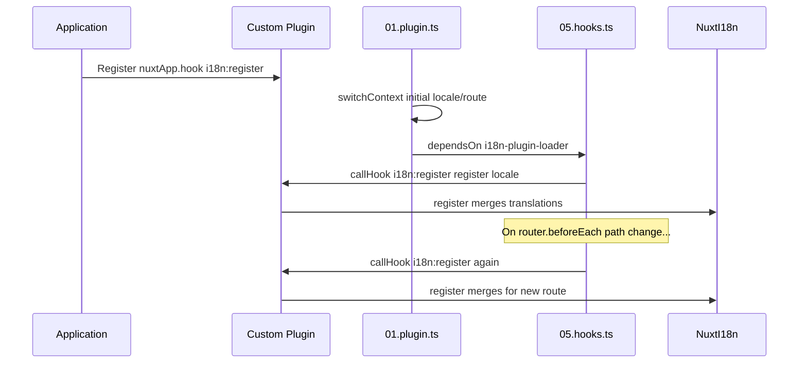

# 📢 Events

## 🔄 `i18n:register`

Eventet `i18n:register` i `Nuxt I18n Micro` muliggør dynamisk tilføjelse af oversættelser til din applikations i18n-kontekst. Det gør internationaliseringsprocessen fleksibel og problemfri. Eventet lader dig integrere nye oversættelser efter behov og styrker applikationens lokaliseringsevner.

### 📝 Detaljer om eventet

- **Formål**:
  - Muliggør dynamisk indarbejdelse af yderligere oversættelser i det eksisterende sæt for et bestemt locale.

- **Payload**:
  - **`register`**:
    - En funktion, der leveres af eventet, og som tager to argumenter:
      - **`translations`** (`Translations`):
        - Et objekt med nøgle-værdi-par, der repræsenterer oversættelser, organiseret efter interfacet `Translations`.
      - **`locale`** (`string`, valgfri):
        - Koden for det locale (f.eks. `'en'`, `'ru'`), som oversættelserne registreres for. Falder tilbage til det locale, eventet leverer, hvis det ikke angives.

- **Adfærd**:
  - Når eventet udløses, fletter `register`-funktionen de nye oversættelser ind i den nuværende kontekst for det angivne locale og opdaterer dermed de tilgængelige oversættelser i hele applikationen.

### ⏱️ Hvornår det udløses

Modulets hooks-plugin (`05.hooks.ts`, `dependsOn: ['i18n-plugin-loader']`) kalder `nuxtApp.callHook('i18n:register', …)`:

1. **Én gang ved opstart** — efter at hoved-i18n-pluginet (`01.plugin.ts`) har indlæst oversættelser for den indledende rute
2. **Ved navigation** — i `router.beforeEach`, når stien skifter, eller ved hver navigation når `strategy: 'no_prefix'`

Registrer din listener i et almindeligt Nuxt-plugin med `nuxtApp.hook('i18n:register', …)`. Hooks-pluginet kører efter loaderen er klar, så dit callback kaldes, når oversættelser skal udvides.

Sæt `hooks: false` i `nuxt.config` for at slå automatiske `i18n:register`-kald fra (se [Konfiguration — `hooks`](/guides/configuration#hooks)).

### 💡 Eksempel på brug

Følgende eksempel viser, hvordan du bruger eventet `i18n:register` til at tilføje oversættelser dynamisk:

```typescript
nuxt.hook('i18n:register', async (register: (translations: unknown, locale?: string) => void, locale: string) => {
  register(
    {
      greeting: 'Hello',
      farewell: 'Goodbye',
    },
    locale,
  )
})
```

### 🛠️ Forklaring



- **Udløsning af eventet**:
  - Hooks-pluginet (`05.hooks.ts`) udløser `i18n:register`, efter at hoved-loaderen er klar, og ved relevante navigationer.

- **Tilføjelse af oversættelser**:
  - Eksemplet registrerer engelske oversættelser for `"greeting"` og `"farewell"`.
  - `register`-funktionen fletter disse oversættelser ind i det eksisterende sæt for det angivne locale.

### 🔗 Vigtige fordele

- **Dynamiske opdateringer**:
  - Opdater eller tilføj nemt oversættelser uden at skulle gendeployere hele din applikation.

- **Fleksibel lokalisering**:
  - Understøtter justeringer af lokalisering i realtid baseret på bruger- eller applikationsbehov.

Ved at bruge eventet `i18n:register` kan du sikre, at din applikations lokaliseringsstrategi forbliver fleksibel og tilpasningsdygtig og forbedrer dermed den samlede brugeroplevelse.

---

## 🛠️ Ændring af oversættelser med plugins

For at ændre oversættelser dynamisk i din Nuxt-applikation anbefales det at bruge plugins. Plugins giver en struktureret måde at håndtere lokaliseringsopdateringer på, især når du arbejder med moduler eller eksterne oversættelsesfiler.

### **Registrering af pluginet**

Hvis du bruger et modul, registrerer du pluginet, hvor oversættelsesændringerne skal ske, ved at føje det til dit moduls konfiguration:

```javascript
addPlugin({
  src: resolve('./plugins/extend_locales'),
})
```

Dette registrerer pluginet, der ligger på `./plugins/extend_locales`, og som håndterer dynamisk indlæsning og registrering af oversættelser.

### **Implementering af pluginet**

I pluginet kan du håndtere locale-ændringer. Her er et eksempel på en implementering i et Nuxt-plugin:

```typescript
import { defineNuxtPlugin } from '#app'

export default defineNuxtPlugin(async (nuxtApp) => {
  // Function to load translations from JSON files and register them
  const loadTranslations = async (lang: string) => {
    try {
      const translations = await import(`../locales/${lang}.json`)
      return translations.default
    } catch (error) {
      console.error(`Error loading translations for language: ${lang}`, error)
      return null
    }
  }

  // Hook into the 'i18n:register' event to dynamically add translations
  // eslint-disable-next-line @typescript-eslint/ban-ts-comment
  // @ts-expect-error
  nuxtApp.hook('i18n:register', async (register: (translations: unknown, locale?: string) => void, locale: string) => {
    const translations = await loadTranslations(locale)
    if (translations) {
      register(translations, locale)
    }
  })
})
```

### 📝 Detaljeret forklaring

1. **Indlæsning af oversættelser**:

- Funktionen `loadTranslations` importerer dynamisk oversættelsesfiler baseret på locale. Filerne forventes at ligge i mappen `locales` og være navngivet efter locale-koder (f.eks. `en.json`, `de.json`).
- Ved en vellykket indlæsning returneres oversættelserne. Ellers logges en fejl.

2. **Registrering af oversættelser**:

- Pluginet lytter på eventet `i18n:register` via `nuxtApp.hook`.
- Når eventet udløses, kaldes `register`-funktionen med de indlæste oversættelser og det tilsvarende locale.
- Dette fletter de nye oversættelser ind i i18n-konteksten for det angivne locale og opdaterer de tilgængelige oversættelser i hele applikationen.

### 🔗 Fordele ved at bruge plugins til oversættelsesændringer

- **Adskillelse af ansvar**:
  - Indkapsl lokaliseringslogikken adskilt fra applikationens hovedkode. Det gør styring og vedligeholdelse lettere.

- **Dynamisk og skalerbart**:
  - Ved at indlæse og registrere oversættelser dynamisk kan du opdatere indhold uden at kræve en fuld gendeployment. Det er især nyttigt for applikationer med hyppigt opdateret eller flersproget indhold.

- **Fleksibel lokalisering**:
  - Plugins giver dig mulighed for at ændre eller udvide oversættelser efter behov. Det giver en mere tilpasningsdygtig og responsiv lokaliseringsstrategi, der matcher brugerpræferencer eller forretningsbehov.

Ved at bruge denne tilgang kan du effektivt udvide og ændre din applikations lokalisering gennem en struktureret og vedligeholdelsesvenlig proces baseret på plugins. Det holder internationaliseringen tilpasningsdygtig over for ændringer i behov og forbedrer den samlede brugeroplevelse.
