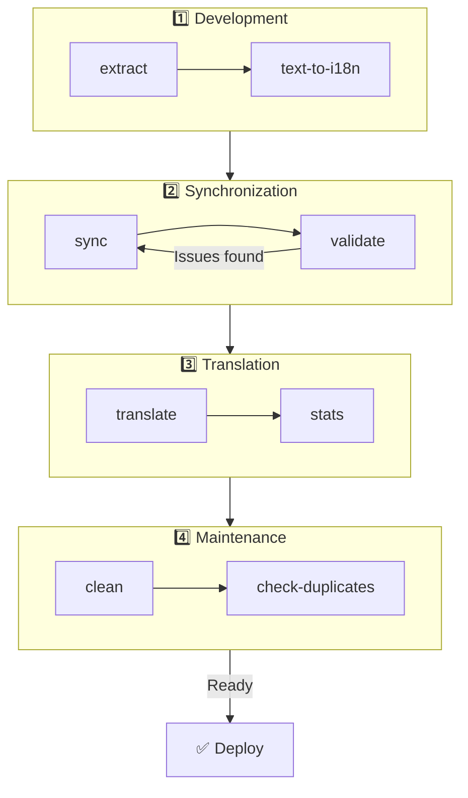

# 🌐 Guide til nuxt-i18n-micro-cli

## 📖 Introduktion

`nuxt-i18n-micro-cli` er et kommandolinjeværktøj, der er designet til at strømline lokaliserings- og internationaliseringsprocessen i Nuxt.js-projekter, som bruger `nuxt-i18n-micro`-modulet (Nuxt I18n Micro). Det leverer hjælpere til at udtrække oversættelsesnøgler fra din kodebase, styre oversættelsesfiler, synkronisere oversættelser på tværs af locales og automatisere oversættelsesprocessen ved hjælp af eksterne oversættelsestjenester.

Denne guide gennemgår installation, konfiguration og brug af `nuxt-i18n-micro-cli` for effektivt at styre dit projekts oversættelser. Pakke på [npmjs.com](https://www.npmjs.com/package/nuxt-i18n-micro-cli).

## 🔧 Installation og opsætning

### 📦 Installation af nuxt-i18n-micro-cli

Installér globalt eller som en dev-afhængighed i dit Nuxt-projekt (anbefalet til CI):

```bash
# global
npm install -g nuxt-i18n-micro-cli

# or per project
pnpm add -D nuxt-i18n-micro-cli
pnpm exec i18n-micro text-to-i18n --dryRun
```

Brug **`nuxt-i18n-micro-cli` ≥ 2.1.1**, hvis dit projekt bruger Nuxt 4's `app/`-mappe (`app/pages`, `app/components` osv.). Ældre CLI-versioner scannede kun `pages/` i projektets rod.

### 🛠 Initialisering i dit projekt

Efter installationen kan du køre `i18n-micro`-kommandoer i dit Nuxt.js-projekts mappe.

Sørg for, at dit projekt er sat op med `nuxt-i18n-micro` og har den nødvendige konfiguration i `nuxt.config.ts` (eller `nuxt.config.js`).

### 📄 Almindelige argumenter

- `--cwd`: Angiv den aktuelle arbejdsmappe (standard: `.`).
- `--logLevel`: Sæt logniveauet (`silent`, `info`, `verbose`).
- `--translationDir`: Mappe med JSON-oversættelsesfiler (standard: `locales`).

## 📊 Oversigt over CLI-workflow



### Trin i workflowet

| Fase           | Kommandoer                  | Formål                                   |
| -------------- | --------------------------- | ---------------------------------------- |
| **Udvikling**  | `extract`, `text-to-i18n`   | Find og udtræk oversættelsesnøgler       |
| **Sync**       | `sync`, `validate`          | Sikr at alle locales har samme nøgler    |
| **Oversæt**    | `translate`, `stats`        | Auto-oversæt manglende nøgler            |
| **Vedligehold** | `clean`, `check-duplicates` | Hold oversættelserne pæne                |

## 📋 Kommandoer

### 🔄 `text-to-i18n`-kommandoen

CLI-pakke: [`nuxt-i18n-micro-cli`](https://www.npmjs.com/package/nuxt-i18n-micro-cli)

**Beskrivelse**: Scanner Vue-/TS-/JS-filer for hard-kodede brugerorienterede strenge, erstatter dem med `$t('...')` og fletter nye nøgler ind i din JSON-oversættelsesfil. Kør fra **Nuxt-projektets rod** (hvor `nuxt.config` ligger).

**Brug**:

```bash
i18n-micro text-to-i18n [options]
```

**Indstillinger**:

| Indstilling             | Standard          | Beskrivelse                                                           |
| ----------------------- | ----------------- | --------------------------------------------------------------------- |
| `--translationFile`     | `locales/en.json` | JSON-fil til nye nøgler (relativ til projektets rod).                 |
| `--path`                | —                 | Behandl kun én fil eller mappe (f.eks. `app/pages/about.vue`).        |
| `--context`             | —                 | Nøglepræfiks (f.eks. `auth` → `auth.*`).                              |
| `--dryRun`              | `false`           | Forhåndsvis uden at skrive filer.                                     |
| `--verbose`             | `false`           | Ekstra logning.                                                        |
| `--interactive`         | `false`           | Bekræft eller redigér hver nøgle før anvendelse.                       |
| `--extractOnlyDirs`     | `plugins`         | Mapper hvor nøgler udtrækkes, men kildefiler **ikke** omskrives.       |
| `--extractOnlyPatterns` | —                 | Glob-lignende extract-only-mønstre (f.eks. `**/*.plugin.ts`).          |

**Eksempel**:

```bash
i18n-micro text-to-i18n --translationFile locales/en.json --context auth --dryRun
```

#### Hvilke mapper scannes?

<Info>
Siden CLI **v2.1.1** scanner `text-to-i18n` både klassiske rodmapper og `app/*`-ækvivalenter. Kør kommandoen fra **projektets rod**. Undlad at `cd app`.
</Info>

Indsamler `*.vue`, `*.js` og `*.ts` under:

| Nuxt 3 (projektets rod) | Nuxt 4 (`app/`-mappe) |
| --------------------- | ------------------------- |
| `pages/`              | `app/pages/`              |
| `components/`         | `app/components/`         |
| `plugins/`            | `app/plugins/`            |
| `layouts/`            | `app/layouts/`            |

Andre mapper (`server/`, `composables/`, `middleware/` osv.) springes over, medmindre du bruger `--path`. For Nuxt 4 skal du køre fra projektets rod (uden at `cd app`). Match `i18n.translationDir` i `--translationFile`, hvis det ikke er `locales/`.

```bash
i18n-micro text-to-i18n --path app/pages
```

#### Sådan fungerer det

1. Saml filer fra mapperne ovenfor (eller fra `--path`).
2. Erstat literaler / template-tekst med `$t('generated.key')` (`plugins/` er kun extract som standard).
3. Flet nye nøgler ind i `--translationFile` uden at fjerne eksisterende poster.

**Eksempel på transformationer**:

Før:

```vue
<template>
  <div>
    <h1>Welcome to our site</h1>
    <p>Please sign in to continue</p>
  </div>
</template>
```

Efter:

```vue
<template>
  <div>
    <h1>{{ $t('pages.home.welcome_to_our_site') }}</h1>
    <p>{{ $t('pages.home.please_sign_in') }}</p>
  </div>
</template>
```

**Bedste praksis**: kør dryRun først. Commit før en fuld kørsel. Match `--translationFile` med `i18n.translationDir` i `nuxt.config`. Behold `--extractOnlyDirs plugins` til bootstrap-kode.

**Begrænsninger**: separat npm-pakke (ikke bundlet med modulet). Læser ikke `nuxt.config` automatisk. Udsender `$t(...)`. Komplekse dynamiske strenge kan i stedet kræve `extract` / `search`.

### 📊 `stats`-kommandoen

**Beskrivelse**: `stats`-kommandoen viser statistik for oversættelser pr. locale i dit Nuxt.js-projekt. Den hjælper dig med at forstå oversættelsesfremdriften ved at vise, hvor mange nøgler der er oversat sammenlignet med det samlede antal tilgængelige nøgler.

**Brug**:

```bash
i18n-micro stats [options]
```

**Indstillinger**:

- `--full`: Vis kun samlet oversættelsesstatistik (standard: `false`).

**Eksempel**:

```bash
i18n-micro stats --full
```

### 🌍 `translate`-kommandoen

**Beskrivelse**: `translate`-kommandoen oversætter automatisk manglende nøgler via eksterne oversættelsestjenester. Kommandoen forenkler oversættelsesprocessen ved at udnytte API'er fra tjenester som Google Translate, DeepL og andre til at udfylde manglende oversættelser.

**Brug**:

```bash
i18n-micro translate [options]
```

**Indstillinger**:

- `--service`: Oversættelsestjeneste, der skal bruges (f.eks. `google`, `deepl`, `yandex`). Angives den ikke, beder kommandoen dig vælge en.
- `--token`: API-nøgle, der matcher den valgte oversættelsestjeneste. Angives den ikke, bliver du bedt om at indtaste den.
- `--options`: Yderligere indstillinger til oversættelsestjenesten, angivet som nøgle:værdi-par adskilt af kommaer (f.eks. `model:gpt-3.5-turbo,max_tokens:1000`).
- `--replace`: Oversæt alle nøgler og erstat eksisterende oversættelser (standard: `false`).

**Eksempel**:

```bash
i18n-micro translate --service deepl --token YOUR_DEEPL_API_KEY
```

#### 🌐 Understøttede oversættelsestjenester

`translate`-kommandoen understøtter flere oversættelsestjenester. Nogle af de understøttede tjenester er:

- **Google Translate** (`google`)
- **DeepL** (`deepl`)
- **Yandex Translate** (`yandex`)
- **OpenAI** (`openai`)
- **Azure Translator** (`azure`)
- **IBM Watson** (`ibm`)
- **Baidu Translate** (`baidu`)
- **LibreTranslate** (`libretranslate`)
- **MyMemory** (`mymemory`)
- **Lingva Translate** (`lingvatranslate`)
- **Papago** (`papago`)
- **Tencent Translate** (`tencent`)
- **Systran Translate** (`systran`)
- **Yandex Cloud Translate** (`yandexcloud`)
- **ModernMT** (`modernmt`)
- **Lilt** (`lilt`)
- **Unbabel** (`unbabel`)
- **Reverso Translate** (`reverso`)

#### ⚙️ Tjenestekonfiguration

Nogle tjenester kræver specifikke konfigurationer eller API-nøgler. Når du bruger `translate`-kommandoen, kan du specificere tjenesten og angive den nødvendige `--token` (API-nøgle) og eventuelle ekstra `--options`.

For eksempel:

```bash
i18n-micro translate --service openai --token YOUR_OPENAI_API_KEY --options openaiModel:gpt-3.5-turbo,max_tokens:1000
```

### 🛠️ `extract`-kommandoen

**Beskrivelse**: Udtrækker oversættelsesnøgler fra din kodebase og organiserer dem efter scope.

**Brug**:

```bash
i18n-micro extract [options]
```

**Indstillinger**:

- `--prod, -p`: Kør i produktionstilstand.

**Eksempel**:

```bash
i18n-micro extract
```

### 🔄 `sync`-kommandoen

**Beskrivelse**: Synkroniserer oversættelsesfiler på tværs af locales og sikrer, at alle locales har de samme nøgler.

**Brug**:

```bash
i18n-micro sync [options]
```

**Eksempel**:

```bash
i18n-micro sync
```

### ✅ `validate`-kommandoen

**Beskrivelse**: Validerer oversættelsesfiler for manglende eller ekstra nøgler sammenlignet med reference-locale.

**Brug**:

```bash
i18n-micro validate [options]
```

**Eksempel**:

```bash
i18n-micro validate
```

### 🧹 `clean`-kommandoen

**Beskrivelse**: Fjerner ubrugte oversættelsesnøgler fra oversættelsesfiler.

**Brug**:

```bash
i18n-micro clean [options]
```

**Eksempel**:

```bash
i18n-micro clean
```

### 📤 `import`-kommandoen

**Beskrivelse**: Konverterer PO-filer tilbage til JSON-format og gemmer dem i oversættelsesmappen.

**Brug**:

```bash
i18n-micro import [options]
```

**Indstillinger**:

- `--potsDir`: Mappe med PO-filer (standard: `pots`).

**Eksempel**:

```bash
i18n-micro import --potsDir pots
```

### 📥 `export`-kommandoen

**Beskrivelse**: Eksporterer oversættelser til PO-filer til ekstern oversættelsesstyring.

**Brug**:

```bash
i18n-micro export [options]
```

**Indstillinger**:

- `--potsDir`: Mappe hvor PO-filer gemmes (standard: `pots`).

**Eksempel**:

```bash
i18n-micro export --potsDir pots
```

### 🗂️ `export-csv`-kommandoen

**Beskrivelse**: `export-csv`-kommandoen eksporterer oversættelsesnøgler og -værdier fra JSON-filer, inklusive deres filstier, til CSV-format. Kommandoen er nyttig for teams, der foretrækker at arbejde med oversættelsesdata i regnearksprogrammer.

**Brug**:

```bash
i18n-micro export-csv [options]
```

**Indstillinger**:

- `--csvDir`: Mappe hvor de eksporterede CSV-filer gemmes.
- `--delimiter`: Angiv en separator til CSV-filen (standard: `,`).

**Eksempel**:

```bash
i18n-micro export-csv --csvDir csv_files
```

### 📑 `import-csv`-kommandoen

**Beskrivelse**: `import-csv`-kommandoen importerer oversættelsesdata fra CSV-filer og opdaterer de tilsvarende JSON-filer. Det er nyttigt til at anvende masseopdateringer af oversættelser fra regneark.

**Brug**:

```bash
i18n-micro import-csv [options]
```

**Indstillinger**:

- `--csvDir`: Mappe med CSV-filer, der skal importeres.
- `--delimiter`: Angiv separator brugt i CSV-filen (standard: `,`).

**Eksempel**:

```bash
i18n-micro import-csv --csvDir csv_files
```

### 🧾 `diff`-kommandoen

**Beskrivelse**: Sammenligner oversættelsesfiler mellem standard-locale og andre locales i samme mappe (inklusive undermapper). Kommandoen identificerer manglende nøgler og deres værdier i standard-locale sammenlignet med andre locales, hvilket gør det lettere at spore oversættelsesfremdrift eller uoverensstemmelser.

**Brug**:

```bash
i18n-micro diff [options]
```

**Eksempel**:

```bash
i18n-micro diff
```

### 🔍 `check-duplicates`-kommandoen

**Beskrivelse**: `check-duplicates`-kommandoen tjekker for duplikerede oversættelsesværdier inden for hvert locale på tværs af alle oversættelsesfiler, både på rodniveau og pr. side. Den sikrer, at forskellige nøgler i samme sprog ikke deler identiske oversættelsesværdier, hvilket bevarer klarhed og konsistens i dine oversættelser.

**Brug**:

```bash
i18n-micro check-duplicates [options]
```

**Eksempel**:

```bash
i18n-micro check-duplicates
```

**Sådan fungerer det**:

- Kommandoen tjekker både rodniveau- og sideafgrænsede oversættelsesfiler for hvert locale.
- Hvis en oversættelsesværdi optræder flere steder (enten i rodniveau-oversættelser eller på tværs af sider), rapporterer den duplikerede værdier sammen med den fil og nøgle, hvor de findes.
- Hvis der ikke findes dubletter, bekræfter kommandoen, at det pågældende locale er frit for duplikerede oversættelsesværdier.

Denne kommando hjælper med at sikre, at oversættelsesnøgler beholder unikke værdier og forhindrer utilsigtet gentagelse inden for samme locale.

### 🔄 `replace-values`-kommandoen

**Beskrivelse**: `replace-values`-kommandoen lader dig udføre masseerstatninger af oversættelsesværdier på tværs af alle locales. Den understøtter både simple teksterstatninger og avancerede erstatninger med regulære udtryk (regex). Du kan også bruge fangegrupper i regex-mønstre og referere til dem i erstatningsstrengen, hvilket gør den ideel til mere komplekse erstatningsscenarier.

**Brug**:

```bash
i18n-micro replace-values [options]
```

**Indstillinger**:

- `--search`: Teksten eller regex-mønstret, der skal søges efter i oversættelser. Denne indstilling er påkrævet.
- `--replace`: Erstatningsteksten, der skal bruges for de fundne oversættelser. Denne indstilling er påkrævet.
- `--useRegex`: Aktivér søgning med et regex-mønster (standard: `false`).

**Eksempel 1**: Simpel erstatning

Erstat strengen "Hello" med "Hi" på tværs af alle locales:

```bash
i18n-micro replace-values --search "Hello" --replace "Hi"
```

**Eksempel 2**: Regex-erstatning

Aktivér regex-søgning og erstat enhver streng, der starter med "Hello" efterfulgt af tal (f.eks. "Hello123") med "Hi" på tværs af alle locales:

```bash
i18n-micro replace-values --search "Hello\\d+" --replace "Hi" --useRegex
```

**Eksempel 3**: Brug af regex-fangegrupper

Brug fangegrupper til dynamisk at indsætte en del af den matchede streng i erstatningen. For eksempel erstattes "Hello [name]" med "Hi [name]", mens navnet bevares:

```bash
i18n-micro replace-values --search "Hello (\\w+)" --replace "Hi $1" --useRegex
```

I dette tilfælde refererer `$1` til den første fangegruppe, som matcher `[name]`-delen efter "Hello". Erstatningen bevarer navnet fra den oprindelige streng.

**Sådan fungerer det**:

- Kommandoen scanner igennem alle oversættelsesfiler (både globale og sideafgrænsede).
- Når et match findes baseret på søgestrengen eller regex-mønstret, erstattes den matchede tekst med den angivne erstatning.
- Ved brug af regex kan fangegrupper bruges i erstatningsstrengen ved at referere til dem med `$1`, `$2` osv.
- Alle ændringer logges og viser filsti, oversættelsesnøgle og før/efter-tilstanden for oversættelsesværdien.

**Logning**:
For hver erstatning logger kommandoen detaljer, herunder:

- Locale og filsti
- Den oversættelsesnøgle, der ændres
- Den gamle værdi og den nye værdi efter erstatning
- Ved brug af regex med fangegrupper viser loggene gruppematchene, og hvordan de blev erstattet.

Det giver dig mulighed for præcist at spore, hvor og hvad der er ændret under erstatningsoperationen, og giver en klar historik over ændringer i dine oversættelsesfiler.

## 🛠 Eksempler

- **Udtrækning af oversættelser**:

  ```bash
  i18n-micro extract
  ```

- **Oversættelse af manglende nøgler med Google Translate**:

  ```bash
  i18n-micro translate --service google --token YOUR_GOOGLE_API_KEY
  ```

- **Oversættelse af alle nøgler og erstatning af eksisterende oversættelser**:

  ```bash
  i18n-micro translate --service deepl --token YOUR_DEEPL_API_KEY --replace
  ```

- **Validering af oversættelsesfiler**:

  ```bash
  i18n-micro validate
  ```

- **Rensning af ubrugte oversættelsesnøgler**:

  ```bash
  i18n-micro clean
  ```

- **Synkronisering af oversættelsesfiler**:

  ```bash
  i18n-micro sync
  ```

## ⚙️ Konfigurationsguide

`nuxt-i18n-micro-cli` bruger din Nuxt.js-i18n-konfiguration i `nuxt.config.ts` (eller `nuxt.config.js`). Sørg for, at `nuxt-i18n-micro`-modulet er installeret og konfigureret.

### 🔑 Eksempel på nuxt.config.js

```ts
export default defineNuxtConfig({
  modules: ['nuxt-i18n-micro'],
  i18n: {
    locales: [
      { code: 'en', iso: 'en-US' },
      { code: 'fr', iso: 'fr-FR' },
    ],
    defaultLocale: 'en',
    fallbackLocale: 'en',
    translationDir: 'locales', // or 'app/locales' for Nuxt 4 colocation
  },
})
```

Sørg for, at `translationDir` matcher den mappe, `nuxt-i18n-micro-cli` bruger (standard er `locales`).

## 📝 Bedste praksis

### 🔑 Konsistent nøglenavngivning

Sørg for, at oversættelsesnøgler er konsistente og beskrivende for at undgå forvirring og duplikering.

### 🧹 Regelmæssig vedligeholdelse

Brug `clean`-kommandoen regelmæssigt for at fjerne ubrugte oversættelsesnøgler og holde dine oversættelsesfiler ryddelige.

### 🛠 Automatisér oversættelsesworkflowet

Integrer `nuxt-i18n-micro-cli`-kommandoer i dit udviklings-workflow eller CI/CD-pipeline for at automatisere udtræk, oversættelse, validering og synkronisering af oversættelsesfiler.

### 🛡️ Sikre API-nøgler

Når du bruger oversættelsestjenester, der kræver API-nøgler, skal du sikre dig, at dine nøgler holdes sikre og ikke committes til versionsstyringssystemer. Overvej at bruge miljøvariabler eller sikre nøgleadministrationsløsninger.

## 📞 Support og bidrag

Hvis du støder på problemer eller har forslag til forbedringer, er du velkommen til at bidrage til projektet eller åbne et issue i projektets repository.

---

Ved at følge denne guide kan du effektivt styre oversættelser i dit Nuxt.js-projekt med `nuxt-i18n-micro-cli`. Det strømliner din internationaliseringsindsats og sikrer en glat oplevelse for brugere i forskellige locales.
