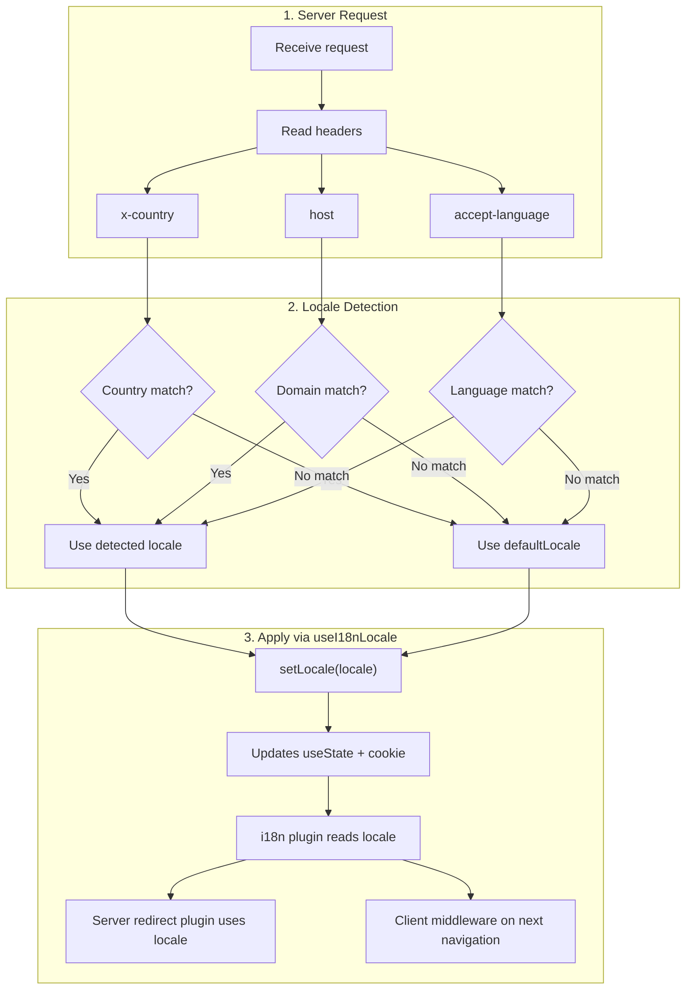

# 🔧 Brugerdefineret sprogdetektion i Nuxt I18n Micro

## 📖 Oversigt

Nuxt I18n Micro v3 giver en centraliseret composable — `useI18nLocale()` — til al locale-håndtering. Den erstatter de manuelle `useState`/`useCookie`-mønstre fra v2. Ved at bruge `useI18nLocale().setLocale()` i et server-plugin kan du implementere en hvilken som helst brugerdefineret detektionslogik og samtidig bevare fuld kompatibilitet med modulets redirect- og cookiesystemer.

## 🏗️ Arkitektur

```mermaid
flowchart TB
    subgraph Plugins["Plugin Execution Order"]
        A["Your plugin<br/>order: -10"] -->|setLocale()| B["01.plugin.ts<br/>order: -5"]
        B --> C["06.redirect.ts server<br/>order: 10"]
    end

    subgraph Client["Client SPA Navigation"]
        D["i18n-redirect.global.ts<br/>route middleware"]
    end

    subgraph State["Locale State"]
        E["useState('i18n-locale')"]
        F["localeCookie"]
    end

    A -->|"setLocale() updates both"| E
    A -->|"setLocale() updates both"| F
    B -->|reads| E
    C -->|reads| E
    C -->|reads| F
    D -->|reads target route +| E
```

**Nøgleprincip**: Kald `useI18nLocale().setLocale()` i et server-plugin med `order: -10`. Det opdaterer atomisk både `useState('i18n-locale')` og locale-cookien, så i18n-pluginet (`order: -5`) og server-redirect-pluginet (`order: 10`) ser det korrekte locale på den første SSR-request. Klient-side-auto-redirects kører i den globale rute-middleware ved efterfølgende navigationer.

## 🛠️ Deaktivering af den indbyggede auto-detektion

Hvis du vil have fuld kontrol over locale-detektionen, skal du deaktivere den indbyggede mekanisme:

```ts
export default defineNuxtConfig({
  i18n: {
    autoDetectLanguage: false,
  },
})
```

## ✨ Eksempel: server-side detektion med `useI18nLocale`

Dette er den **anbefalede tilgang** for alle strategier.

### Trin 1: Konfigurer `nuxt.config.ts`

```ts
export default defineNuxtConfig({
  modules: ['nuxt-i18n-micro'],
  i18n: {
    strategy: 'no_prefix', // Works with ANY strategy
    defaultLocale: 'en',
    localeCookie: 'user-locale',
    autoDetectLanguage: false,
    locales: [
      { code: 'en', iso: 'en-US' },
      { code: 'de', iso: 'de-DE' },
      { code: 'ja', iso: 'ja-JP' },
    ],
  },
})
```

### Trin 2: Opret `plugins/i18n-loader.server.ts`

```ts
import { defineNuxtPlugin, useRequestHeaders } from '#imports'

export default defineNuxtPlugin({
  name: 'i18n-custom-loader',
  enforce: 'pre',
  order: -10, // Execute BEFORE the i18n plugin (which has order -5)

  setup() {
    const { setLocale } = useI18nLocale()
    const headers = useRequestHeaders(['host', 'x-country', 'accept-language'])
    let detectedLocale = 'en'

    // --- YOUR DETECTION LOGIC ---

    // Example 1: By domain
    const host = headers['host']
    if (host?.includes('example.de')) {
      detectedLocale = 'de'
    }
    // Example 2: By custom header
    else if (headers['x-country'] === 'JP') {
      detectedLocale = 'ja'
    }
    // Example 3: By Accept-Language header
    else if (headers['accept-language']?.includes('de')) {
      detectedLocale = 'de'
    }

    // --- APPLY THE LOCALE ---
    setLocale(detectedLocale)
  },
})
```

### Sådan fungerer det



1. **Pluginet kører først** (`order: -10`) — detekterer locale fra headers, domæne eller andre kilder
2. **`setLocale()` opdaterer begge**: `useState('i18n-locale')` og cookie. Det sikrer øjeblikkelig synlighed for alle efterfølgende plugins
3. **i18n-pluginet** (`order: -5`) læser locale og indlæser de korrekte oversættelser
4. **Server-redirect-pluginet** (`order: 10`) bruger locale til redirect-beslutninger under SSR
5. **Klient-rute-middlewaren** (`i18n-redirect`) anvender redirects ved SPA-navigation, når URL-locale ikke matcher præferencen

## 🌐 Strategi-specifik adfærd

`useI18nLocale().setLocale()` fungerer med **alle strategier**. Redirect-adfærden afhænger af strategien:

<Tip>
| Strategi | Effekt af `setLocale('de')` |
|----------|---------------------------|
| `no_prefix` | Renderer på tysk, ingen URL-ændring |
| `prefix` | 302 → `/de/` (server-side redirect) |
| `prefix_except_default` | 302 → `/de/`, hvis `de` ≠ standard. Ingen redirect, hvis `de` = standard |
| `prefix_and_default` | Ingen redirect (både `/` og `/de/` er gyldige) |
</Tip>

**Vigtige noter:**

- Cookiebaseret locale-detektion er deaktiveret som standard (`localeCookie: null`)
- Sæt `localeCookie: 'user-locale'` for at aktivere cookie-persistens
- Hvis cookie-/state-værdien ikke findes i `locales`-listen, falder den tilbage til `defaultLocale`

## 🏢 Avanceret: domænebaseret detektion

Til multi-domæne-opsætninger, hvor hvert domæne betjener et andet locale:

```ts
import { defineNuxtPlugin, useRequestHeaders } from '#imports'

export default defineNuxtPlugin({
  name: 'i18n-domain-loader',
  enforce: 'pre',
  order: -10,

  setup() {
    const { setLocale } = useI18nLocale()
    const headers = useRequestHeaders(['host'])
    const host = headers['host'] || ''

    let detectedLocale = 'en'

    if (host.endsWith('.de') || host.includes('german.')) {
      detectedLocale = 'de'
    } else if (host.endsWith('.fr') || host.includes('french.')) {
      detectedLocale = 'fr'
    } else if (host.endsWith('.jp') || host.includes('japanese.')) {
      detectedLocale = 'ja'
    }

    setLocale(detectedLocale)
  },
})
```

## 🔄 Avanceret: respektér brugerens præference

Hvis brugere selv kan skifte sprog, skal du respektere deres valg over auto-detektion:

```ts
import { defineNuxtPlugin, useRequestHeaders } from '#imports'

export default defineNuxtPlugin({
  name: 'i18n-smart-loader',
  enforce: 'pre',
  order: -10,

  setup() {
    const { getLocale, setLocale } = useI18nLocale()

    // If user already has a preference (from cookie), respect it
    if (getLocale()) {
      return
    }

    // Otherwise, detect locale from headers
    const headers = useRequestHeaders(['accept-language'])
    let detectedLocale = 'en'

    const acceptLanguage = headers['accept-language'] || ''
    if (acceptLanguage.includes('de')) {
      detectedLocale = 'de'
    } else if (acceptLanguage.includes('ja')) {
      detectedLocale = 'ja'
    }

    setLocale(detectedLocale)
  },
})
```

## ⚙️ Kun-server- eller kun-klient-plugins

Brug [Nuxts filnavnekonventioner](https://nuxt.com/docs/getting-started/directory-structure#plugins) til at styre, hvor dit plugin kører:

- **Kun-server**: `i18n-loader.server.ts` — kører kun under SSR (anbefalet til header-baseret detektion)
- **Kun-klient**: `i18n-loader.client.ts` — kører kun i browseren (til `localStorage`- eller DOM-baseret detektion)


## ✅ Opsummering

| Funktion                              | Beskrivelse                                                       |
| ------------------------------------- | ----------------------------------------------------------------- |
| `useI18nLocale().setLocale()`         | Opdaterer `useState` + cookie atomisk. Fungerer med alle strategier |
| `useI18nLocale().getLocale()`         | Returnerer det aktuelle locale fra state eller cookie             |
| `useI18nLocale().getPreferredLocale()` | Returnerer det foretrukne locale (valideret mod `locales`-listen) |
| Plugin `order: -10`                   | Sikrer, at dit plugin kører før i18n-initialisering               |
| `enforce: 'pre'`                      | Kører i "pre"-plugin-gruppen                                       |

**Undlad at:**

- Bruge `useCookie('user-locale')` direkte — `useI18nLocale()` styrer cookies internt
- Bruge `useState('i18n-locale')` direkte — brug `useI18nLocale().setLocale()` i stedet
- Sætte `order` >= -5 — dit plugin skal køre før i18n-pluginet
