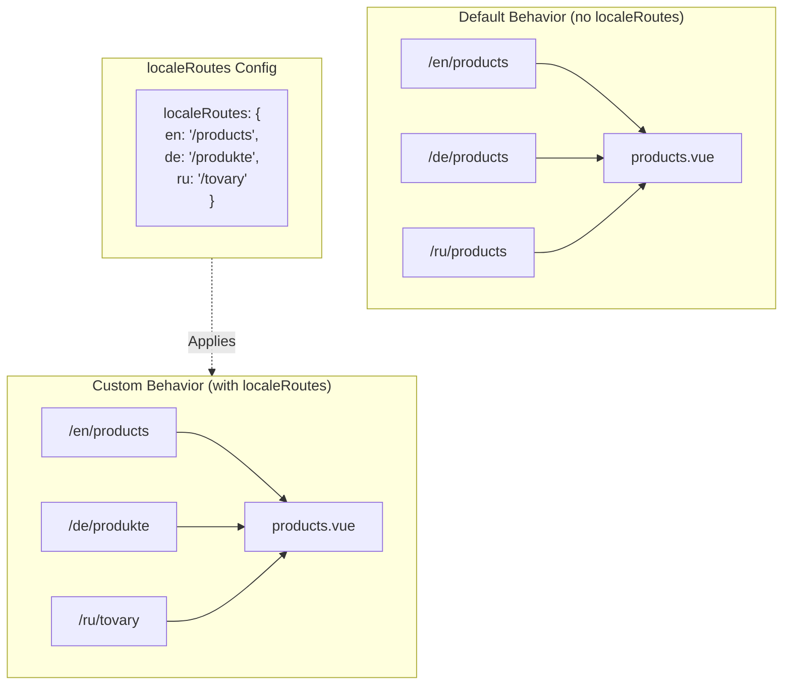

# 🔗 Brugerdefinerede lokaliserede ruter med `localeRoutes` i `Nuxt I18n Micro`

## 📖 Introduktion til `localeRoutes`

Funktionen `localeRoutes` i `Nuxt I18n Micro` giver dig mulighed for at definere brugerdefinerede ruter for bestemte locales. Det giver fleksibilitet og kontrol over routingstrukturen i din applikation. Denne funktion er særligt nyttig, når bestemte locales kræver forskellige URL-strukturer, skræddersyede stier eller skal følge specifikke regionale eller sproglige konventioner.

## 🚀 Primær brug af `localeRoutes`

Det primære brugstilfælde for `localeRoutes` er at levere distinkte ruter for forskellige locales og dermed forbedre brugeroplevelsen ved at sikre, at URL'er er intuitive og relevante for målgruppen. For eksempel kan du have forskellige stier for engelske og russiske versioner af en side, hvor det russiske locale følger et lokaliseret URL-format.

### 📄 Eksempel: Definition af `localeRoutes` i `$defineI18nRoute`

Her er et eksempel på, hvordan du kan definere brugerdefinerede ruter for bestemte locales med `localeRoutes` i `$defineI18nRoute`-funktionen:

```typescript
import { useNuxtApp } from '#imports'

const { $defineI18nRoute } = useNuxtApp()

$defineI18nRoute({
  localeRoutes: {
    ru: '/localesubpage', // Custom route path for the Russian locale
    de: '/lokaleseite', // Custom route path for the German locale
  },
})
```

> [!IMPORTANT]
> `$defineI18nRoute` er ikke en global funktion. I `script setup` skal du hente den fra `useNuxtApp()` først og derefter kalde den.

### 🔄 Sådan fungerer `localeRoutes`



- **Standard-adfærd**: Uden `localeRoutes` bruger alle locales en fælles rutestruktur defineret af den primære sti.
- **Brugerdefineret adfærd**: Med `localeRoutes` kan bestemte locales have egne ruter og overskrive standardstien med locale-specifikke ruter defineret i konfigurationen.

## 🌱 Brugstilfælde for `localeRoutes`

### 📄 Eksempel: Brug af `localeRoutes` på en side

Her er en simpel Vue-komponent, der demonstrerer brug af `$defineI18nRoute` med `localeRoutes`:

```vue
<template>
  <div>
    <!-- Display greeting message based on the current locale -->
    <p>{{ $t('greeting') }}</p>

    <!-- Navigation links -->
    <div>
      <NuxtLink :to="$localeRoute({ name: 'index' })"> Go to Index </NuxtLink>
      |
      <NuxtLink :to="$localeRoute({ name: 'about' })"> Go to About Page </NuxtLink>
    </div>
  </div>
</template>

<script setup>
import { useNuxtApp } from '#imports'

const { $getLocale, $switchLocale, $getLocales, $localeRoute, $t, $defineI18nRoute } = useNuxtApp()

// Define translations and custom routes for specific locales
$defineI18nRoute({
  localeRoutes: {
    ru: '/localesubpage', // Custom route path for Russian locale
  },
})
</script>
```

### 🛠️ Brug af `localeRoutes` i forskellige kontekster

- **Landingssider**: Brug brugerdefinerede ruter til at lokalisere URL'er til landingssider, så de matcher marketingkampagner.
- **Dokumentationssider**: Angiv forskellige ruter for hvert locale, så de bedre matcher det lokaliserede indholds struktur.
- **E-handelssider**: Skræddersy produkt- eller kategori-URL'er pr. locale for bedre SEO og brugeroplevelse.

## Navigation med `localeRoutes`

Da lokaliserede ruter ikke direkte matcher filnavne i pages-mappen, skal du referere til din navigation via objekt frem for navn.

```vue
<template>
  /**
   * Exemple page: /pages/about-us.vue
   * EN /about-us
   * ES /sobre-nosotros
   * FR /a-propos
   */

  // Using NuxtLink
  <NuxtLink :to="$localeRoute({ name: 'about-us' })">
    Go to About Page
  </NuxtLink>

  // Using I18nLink
  <I18nLink :to="{ name: 'about-us' }">
    Go to About Page
  </NuxtLink>

  // The string literal navigation wouldn't work for any locale but english
  <I18nLink to="/about-us">
    Go to About Page
  </NuxtLink>
</template>
```

### Navngivning af indlejrede sider

Som standard er dine sider navngivet efter deres fil- og stinavn. Sådan er det:

- `/pages/about-us.vue` kan tilgås med `$localeRoute(\{ name: 'about-us' \})`
- `/pages/about-us/physical-stores.vue` kan tilgås med `$localeRoute(\{ name: 'about-us-physical-stores' \})`

For at overskrive denne adfærd kan du eksplicit navngive din side med `definePageMeta`.

```vue
// /pages/about-us/physical-stores.vue
<script setup>
definePageMeta({
  name: 'our-stores'
})
```

Denne side kan nu refereres med enten `$localeRoute` eller `I18nLink` via navnet `:to='\{ name: "our-stores" \}'`.

## 🎯 Dynamiske ruter med slugs og `$setI18nRouteParams`

Når du arbejder med dynamiske ruter, der indeholder slugs eller parametre, kan du bruge `localeRoutes` med dynamiske segmenter og `$setI18nRouteParams` til at levere locale-specifikke slugs for hvert locale.

### Dynamiske rute-parametre i `localeRoutes`

Du kan definere dynamiske ruter ved hjælp af Nuxts rute-parameter-syntaks (`[...slug]` til catch-all-ruter, `[param]` til enkelt-parametre eller `:param()` til navngivne parametre):

```vue
<script setup lang="ts">
import { useNuxtApp, useRoute, useFetch, createError } from '#imports'

const { $defineI18nRoute, $setI18nRouteParams } = useNuxtApp()

// Define custom routes with dynamic segments
$defineI18nRoute({
  localeRoutes: {
    en: '/our-products/[...slug]',
    es: '/nuestros-productos/[...slug]',
  },
})
</script>
```

### Angivelse af locale-specifikke rute-parametre

Funktionen `$setI18nRouteParams` giver dig mulighed for at sætte forskellige parameterværdier (som slugs) for hvert locale. Det er særligt nyttigt, når dit indhold har locale-specifikke URL'er.

**Vigtigt**: `$setI18nRouteParams` skal kaldes efter hentning af data, der indeholder locale-specifikke slugs, typisk inde i `useFetch` eller `useAsyncData`.

```vue
<script setup lang="ts">
import { useNuxtApp, useRoute, useFetch, createError } from '#imports'

interface Product {
  title: string
  price: string
  urlEn: string // English slug
  urlEs: string // Spanish slug
}

const { $defineI18nRoute, $setI18nRouteParams } = useNuxtApp()

const route = useRoute()
const slug = Array.isArray(route.params.slug) ? route.params.slug[0] : route.params.slug

// Fetch product data that includes locale-specific slugs
const { data: product, error } = await useFetch<Product>(`/api/product/${slug}`)
if (error.value)
  throw createError({
    statusCode: error.value?.statusCode,
    statusMessage: error.value?.statusMessage,
    fatal: true,
  })

// Define custom routes with dynamic segments
$defineI18nRoute({
  localeRoutes: {
    en: '/our-products/[...slug]',
    es: '/nuestros-productos/[...slug]',
  },
})

// Set different slugs for different locales
if (product.value) {
  $setI18nRouteParams({
    en: { slug: product.value.urlEn },
    es: { slug: product.value.urlEs },
  })
}
</script>
```

### Komplet eksempel: produktsider med locale-specifikke slugs

Her er et komplet eksempel, der viser, hvordan du bruger `localeRoutes` og `$setI18nRouteParams` sammen for en produktdetalje-side:

```vue
<template>
  <div v-if="product">
    <h1>{{ product.title }}</h1>
    <p>{{ $t('price') }}: {{ product.price }}</p>
    <div class="locale-switcher">
      <a :href="$switchLocalePath('en')">English</a>
      <a :href="$switchLocalePath('es')">Español</a>
    </div>
  </div>
</template>

<script setup lang="ts">
import { useNuxtApp, useRoute, useFetch, createError } from '#imports'

interface Product {
  title: string
  price: string
  urlEn: string
  urlEs: string
}

const { $t, $defineI18nRoute, $setI18nRouteParams, $switchLocalePath } = useNuxtApp()

// Set page name for easier navigation
definePageMeta({ name: 'product-slug' })

const route = useRoute()
const slug = Array.isArray(route.params.slug) ? route.params.slug[0] : route.params.slug

// Fetch product data
const { data: product, error } = await useFetch<Product>(`/api/product/${slug}`)
if (error.value)
  throw createError({
    statusCode: error.value?.statusCode,
    statusMessage: error.value?.statusMessage,
    fatal: true,
  })

// Define locale-specific routes with dynamic segments
$defineI18nRoute({
  localeRoutes: {
    en: '/our-products/[...slug]',
    es: '/nuestros-productos/[...slug]',
  },
})

// Set locale-specific slugs so $switchLocalePath works correctly
if (product.value) {
  $setI18nRouteParams({
    en: { slug: product.value.urlEn },
    es: { slug: product.value.urlEs },
  })
}
</script>
```

### Eksempel: produktliste-side

Når du linker til dynamiske ruter fra en listeside, kan du bruge rutenavnet med parametre:

```vue
<template>
  <div>
    <h1>{{ $t('title') }}</h1>
    <ul>
      <li v-for="product in products?.[$getLocale()] || []" :key="product.id">
        <I18nLink :to="{ name: 'product-slug', params: { slug: product.url } }"> {{ product.title }} – {{ product.price }} </I18nLink>
      </li>
    </ul>
  </div>
</template>

<script setup lang="ts">
import { useNuxtApp, useFetch, createError } from '#imports'

interface Product {
  id: string
  title: string
  price: string
  url: string
}

type ProductsByLocale = Record<string, Product[]>

const { $t, $defineI18nRoute, $getLocale } = useNuxtApp()

const { data: products, error } = await useFetch<ProductsByLocale>('/api/product')
if (error.value)
  throw createError({
    statusCode: error.value?.statusCode,
    statusMessage: error.value?.statusMessage,
    fatal: true,
  })

$defineI18nRoute({
  locales: {
    en: {
      title: 'Our Product Range',
      description: 'Discover our collection of high-quality products.',
    },
    es: {
      title: 'Nuestra Gama de Productos',
      description: 'Descubra nuestra colección de productos de alta calidad.',
    },
  },
  localeRoutes: {
    en: '/our-products',
    es: '/nuestros-productos',
  },
})
</script>
```

### Sådan fungerer det

1. **Rutedefinition**: `localeRoutes` definerer base-stistrukturen for hvert locale, inklusive dynamiske segmenter som `[...slug]` eller `[id]`.

2. **Parameterindstilling**: `$setI18nRouteParams` sætter de faktiske parameterværdier for hvert locale. Når en bruger skifter locale med `$switchLocalePath`, bruger modulet disse parametre til at konstruere den korrekte URL.

3. **Parameterformat**: Parameter-objektet skal matche strukturen:

   ```typescript
   {
     [localeCode]: {
       [paramName]: paramValue
     }
   }
   ```

4. **Navigation**: Brug `I18nLink` eller `$localeRoute` med rutenavnet og parametrene til at navigere mellem lokaliserede versioner af dynamiske ruter.

### Vigtige noter

- **Timing**: `$setI18nRouteParams` skal kaldes efter hentning af data, der indeholder locale-specifikke slugs, typisk inde i `useFetch` eller `useAsyncData`.

- **Parameternavne**: Parameternavne i `$setI18nRouteParams` skal matche rute-parameternavnene (f.eks. `slug` for `[...slug]` eller `id` for `[id]`).

- **Rutenavne**: Når du bruger `definePageMeta(\{ name: 'route-name' \})`, skal du bruge dette navn, når du linker til ruten med `I18nLink` eller `$localeRoute`.

- **Catch-all-ruter**: For catch-all-ruter (`[...slug]`) skal slug-parameteren være et array eller en streng, der konverteres til et array.

## 🧩 Programmatiske ruter (`pages:extend`) — #244

Ruter oprettet i `pages:extend` har intet sted til `defineI18nRoute()`, og flere ruter deler ofte én wrapper-SFC. Fil-nøglet scanning kollapser dem så til en enkelt post.

Placer **ikke** lokaliserede stier i `route.meta` (de ville blive sendt med i klientens rutetabel). Behold ét register og projicér det to gange:

1. ind i `pages:extend` (opretter Nuxt-ruterne)
2. ind i `i18n.globalLocaleRoutes` nøglet efter rute**navn** (ikke filsti)

Brug `splitLocaleRoutes` fra `@i18n-micro/utils/split-locale-routes`:

```typescript
import { splitLocaleRoutes } from '@i18n-micro/utils/split-locale-routes'

const dynamic = splitLocaleRoutes([
  {
    name: 'products_tag',
    path: '/products/:tag',
    file: '~/pages/_dynamic.vue',
    paths: { fr: '/produits/:tag', de: '/produkte/:tag' },
  },
  {
    name: 'products_category',
    path: '/products/category/:category',
    file: '~/pages/_dynamic.vue',
    paths: { fr: '/produits/categorie/:category' },
  },
  // Disable localization for a programmatic route:
  // { name: 'internal', path: '/internal', file: '~/pages/_dynamic.vue', paths: false },
])

export default defineNuxtConfig({
  hooks: {
    'pages:extend'(pages) {
      pages.push(...dynamic.pages)
    },
  },
  i18n: {
    globalLocaleRoutes: dynamic.globalLocaleRoutes,
  },
})
```

Begge halvdele forbliver synkroniserede, og delte wrappers overskriver ikke længere hinanden. `globalLocaleRoutes` er ikke nok i sig selv — det tilpasser kun stier for ruter, der allerede findes i Nuxts sidetabel.

## 📝 Bedste praksis for brug af `localeRoutes`

- **🚀 Brug til relevante locales**: Anvend `localeRoutes` primært, hvor URL-strukturen har væsentlig betydning for brugeroplevelsen eller SEO. Undgå overforbrug til mindre forskelle.
- **🔧 Bevar konsistens**: Hold et konsistent routingmønster på tværs af locales, medmindre der er en stærk grund til at afvige. Det bevarer klarheden og reducerer kompleksiteten.
- **📚 Dokumentér brugerdefinerede ruter**: Dokumentér tydeligt eventuelle brugerdefinerede ruter, du definerer med `localeRoutes`, især i modulære applikationer, så teammedlemmer forstår routing-logikken.
