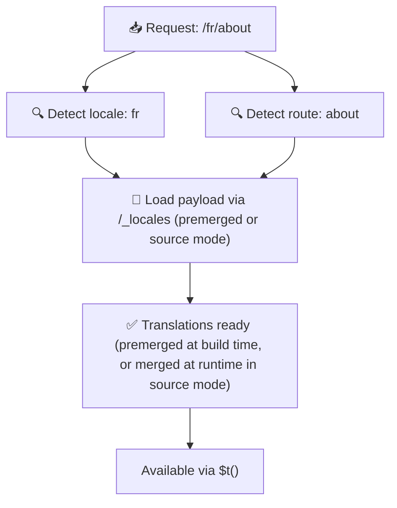

# 📂 Vejledning i mappestruktur

## 📖 Introduktion

Effektiv organisering af dine oversættelsesfiler er afgørende for at opretholde et skalerbart og effektivt internationaliserings-system (i18n). `Nuxt I18n Micro` forenkler denne proces ved at tilbyde en klar tilgang til håndtering af root-niveau- og sidespecifikke oversættelser. Denne vejledning fører dig gennem den anbefalede mappestruktur og forklarer, hvordan `Nuxt I18n Micro` håndterer disse oversættelser.

## 🗂️ Anbefalet mappestruktur

`Nuxt I18n Micro` organiserer oversættelser i root-niveau-filer og sidespecifikke filer inden i `pages`-mappen. Med `translationPayloads.mode: 'premerged'` (standard) merges root-niveau-oversættelser automatisk ind i hver side-fil ved build-tid, så hver side har et komplet sæt oversættelser uden runtime-merge-overhead.

Med `mode: 'source'` forbliver kildefiler adskilte i Nitro-assets og merges ved runtime via `/_locales`-ruten. Se [Serverless Payload Output](/guides/performance#serverless-payload-output).

### 🔧 Grundlæggende struktur

Her er et grundlæggende eksempel på den mappestruktur, du bør følge:

```text
locales/
├── pages/
│   ├── index/
│   │   ├── en.json
│   │   ├── fr.json
│   │   └── ar.json
│   ├── about/
│   │   ├── en.json
│   │   ├── fr.json
│   │   └── ar.json
├── en.json
├── fr.json
└── ar.json

```

### 📄 Forklaring af strukturen

#### 1. 🌍 Root-niveau-oversættelsesfiler

- **Sti:** `/locales/\{locale\}.json` (f.eks. `/locales/en.json`)
- **Formål:** Disse filer indeholder oversættelser, der deles på tværs af hele applikationen (navigationsmenuer, headere, footere osv.). Med `mode: 'premerged'` (standard) merges de automatisk ind i hver sidespecifik fil ved build-tid, så serveren returnerer en enkelt præbygget fil pr. side.

  **Eksempel på indhold (`/locales/en.json`):**

  ```json
  {
    "menu": {
      "home": "Home",
      "about": "About Us",
      "contact": "Contact"
    },
    "footer": {
      "copyright": "© 2024 Your Company"
    }
  }
  ```

#### 2. 📄 Sidespecifikke oversættelsesfiler

- **Sti:** `/locales/pages/\{routeName\}/\{locale\}.json` (f.eks. `/locales/pages/index/en.json`)
- **Formål:** Disse filer indeholder oversættelser specifikke for individuelle sider. Med `mode: 'premerged'` (standard) merges root-niveau-oversættelser ind som en base ved build-tid, så hver side-fil bliver selvstændig.

  **Eksempel på indhold (`/locales/pages/index/en.json`):**

  ```json
  {
    "title": "Welcome to Our Website",
    "description": "We offer a wide range of products and services to meet your needs."
  }
  ```

  **Eksempel på indhold (`/locales/pages/about/en.json`):**

  ```json
  {
    "title": "About Us",
    "description": "Learn more about our mission, vision, and values."
  }
  ```

### 📂 Håndtering af dynamiske ruter og nested stier

`Nuxt I18n Micro` transformerer automatisk dynamiske segmenter og nested stier i ruter til en flad mappestruktur ved hjælp af en specifik omdøbnings-konvention. Dette sikrer, at alle oversættelser gemmes på en konsistent og let tilgængelig måde.

#### Mappestruktur for dynamisk rute-oversættelse

Ved håndtering af dynamiske ruter, som `/products/[id]`, konverterer modulet det dynamiske segment `[id]` til et statisk format i filstrukturen.

**Eksempel på mappestruktur for dynamiske ruter:**

For en rute som `/products/[id]` vil oversættelsesfilerne blive gemt i en mappe ved navn `products-id`:

```text
locales/pages/
├── products-id/
│   ├── en.json
│   ├── fr.json
│   └── ar.json

```

**Eksempel på mappestruktur for nested dynamiske ruter:**

For en nested rute som `/products/key/[id]` vil oversættelsesfilerne blive gemt i en mappe ved navn `products-key-id`:

```text
locales/pages/
├── products-key-id/
│   ├── en.json
│   ├── fr.json
│   └── ar.json

```

**Eksempel på mappestruktur for flerniveau-nested ruter:**

For en mere kompleks nested rute som `/products/category/[id]/details` vil oversættelsesfilerne blive gemt i en mappe ved navn `products-category-id-details`:

```text
locales/pages/
├── products-category-id-details/
│   ├── en.json
│   ├── fr.json
│   └── ar.json

```

### 🛠 Tilpasning af mappestrukturen

Hvis du foretrækker at gemme oversættelser i en anden mappe, giver `Nuxt I18n Micro` dig mulighed for at tilpasse den mappe, hvor oversættelsesfiler gemmes. Du kan konfigurere dette i din `nuxt.config.ts`-fil.

**Eksempel: Tilpasning af oversættelsesmappen**

```typescript
export default defineNuxtConfig({
  i18n: {
    translationDir: 'i18n', // Custom directory path
  },
})
```

Dette instruerer `Nuxt I18n Micro` i at kigge efter oversættelsesfiler i `/i18n`-mappen i stedet for standard-`/locales`-mappen.

## ⚙️ Hvordan oversættelser indlæses

### 🌍 Dynamiske locale-ruter

`Nuxt I18n Micro` bruger dynamiske locale-ruter til at indlæse oversættelser effektivt. Når en bruger besøger en side, bestemmer modulet den passende locale og indlæser de tilsvarende oversættelsesfiler baseret på den aktuelle rute og locale.



For eksempel:

- Besøg på `/en/index` indlæser oversættelser fra `/locales/pages/index/en.json`.
- Besøg på `/fr/about` indlæser oversættelser fra `/locales/pages/about/fr.json`.

Denne metode sikrer, at kun de nødvendige oversættelser indlæses, hvilket optimerer både serverbelastning og klient-side-ydeevne.

### 💾 Caching og pre-rendering

For yderligere at forbedre ydeevnen understøtter `Nuxt I18n Micro` caching og pre-rendering af oversættelsesfiler:

- **Caching**: Når en oversættelsesfil er indlæst, cachees den til efterfølgende anmodninger, hvilket reducerer behovet for gentagne gange at hente de samme data.
- **Pre-rendering**: Under build-processen kan du pre-rendere oversættelsesfiler for alle konfigurerede locales og ruter, hvilket giver dem mulighed for at blive serveret direkte fra serveren uden runtime-forsinkelser.

## 📝 Best practices

### 📂 Brug sidespecifikke filer klogt

Udnyt sidespecifikke filer til at holde oversættelser organiserede. Dette holder hver sides oversættelser slanke og hurtige at indlæse, hvilket især er vigtigt for sider med komplekst eller stort indhold.

### 🔑 Hold oversættelsesnøgler konsistente

Brug konsistente navngivningskonventioner for dine oversættelsesnøgler på tværs af filer. Dette hjælper med at bevare klarhed og forhindrer problemer ved håndtering af oversættelser, især efterhånden som din applikation vokser.

### 🗂️ Organisér oversættelser efter kontekst

Grupér relaterede oversættelser sammen inden i dine filer. For eksempel: grupér alle knap-etiketter under en `buttons`-nøgle og alle formular-relaterede tekster under en `forms`-nøgle. Dette forbedrer ikke kun læsbarheden, men gør det også lettere at håndtere oversættelser på tværs af forskellige locales.

### ⚠️ Grænse for nesting-dybde (2 niveauer anbefales)

Under klient-side-navigation bruger `Nuxt I18n Micro` en optimeret 2-niveau-dyb merge til at kombinere oversættelser fra den side, der forlades, og den side, der ankommes til. Dette sikrer, at overlappende nested nøgler (f.eks. når begge sider har nøgler under `common.*`) bevares under transition-animationer.

**Dette fungerer korrekt for standard `Section → Key → Value`-strukturen (2 niveauer):**

```json
// Page A translations
{ "common": { "fromA": "Text A" } }

// Page B translations
{ "common": { "fromB": "Text B" } }

// During transition, both are available:
// { "common": { "fromA": "Text A", "fromB": "Text B" } }
```

**Men hvis du bruger 3+ niveauer af nesting, kan dybere nøgler blive overskrevet under transitions:**

```json
// Page A translations
{ "auth": { "form": { "login": "Login" } } }

// Page B translations
{ "auth": { "form": { "register": "Register" } } }

// During transition: "login" key is lost
// { "auth": { "form": { "register": "Register" } } }
```

<Tip>

</Tip>

### 🧹 Ryd regelmæssigt op i ubrugte oversættelser

Med tiden kan din applikation ophobe ubrugte oversættelsesnøgler, især hvis funktioner fjernes eller omstruktureres. Gennemgå og ryd op i dine oversættelsesfiler med jævne mellemrum for at holde dem slanke og vedligeholdelsesvenlige.
