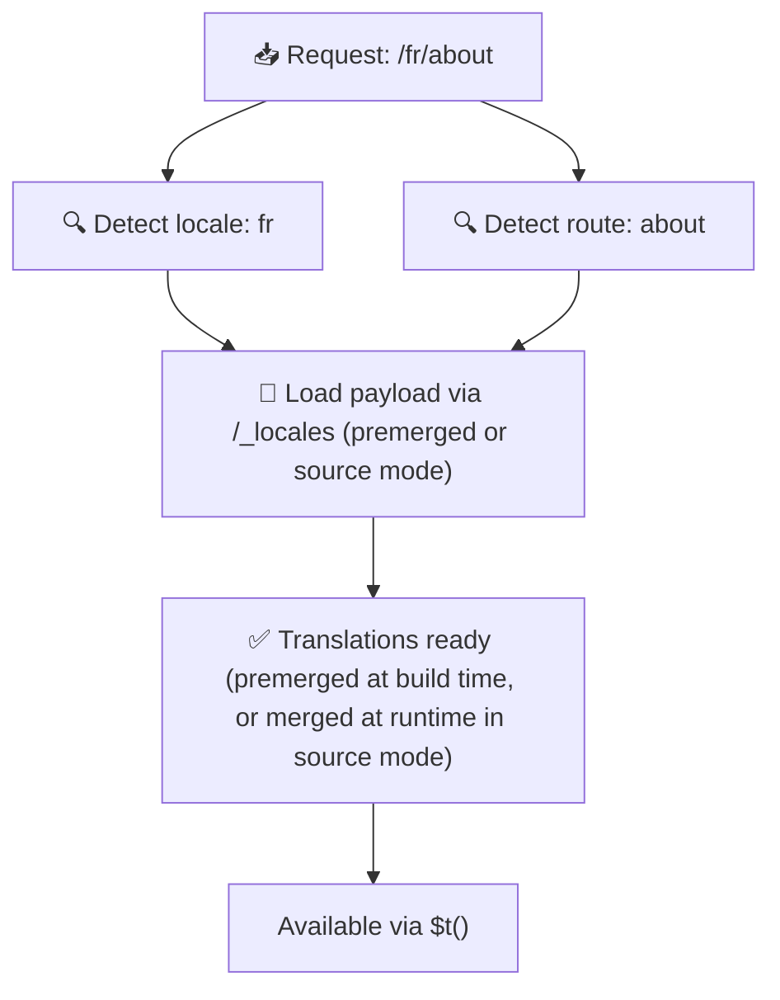

# 📂 Guide til mappestruktur

## 📖 Introduktion

Effektiv organisering af dine oversættelsesfiler er afgørende for at opretholde et skalerbart og effektivt internationaliseringssystem (i18n). `Nuxt I18n Micro` forenkler denne proces ved at tilbyde en klar tilgang til at styre oversættelser på rodniveau og pr. side. Denne guide gennemgår den anbefalede mappestruktur og forklarer, hvordan `Nuxt I18n Micro` håndterer disse oversættelser.

## 🗂️ Anbefalet mappestruktur

`Nuxt I18n Micro` organiserer oversættelser i filer på rodniveau og sideafgrænsede filer i `pages`-mappen. Med `translationPayloads.mode: 'premerged'` (standard) flettes oversættelser på rodniveau automatisk ind i hver sidefil ved buildtid, så hver side har et komplet sæt oversættelser uden runtime-merge-overhead.

Med `mode: 'source'` forbliver kildefiler separate i Nitro-assets og flettes på runtime via `/_locales`-ruten. Se [Serverless payload-output](/guides/performance#serverless-payload-output).

### 🔧 Grundlæggende struktur

Her er et grundlæggende eksempel på mappestrukturen, du bør følge:

```text
locales/
├── pages/
│   ├── index/
│   │   ├── en.json
│   │   ├── fr.json
│   │   └── ar.json
│   ├── about/
│   │   ├── en.json
│   │   ├── fr.json
│   │   └── ar.json
├── en.json
├── fr.json
└── ar.json

```

### 📄 Forklaring af strukturen

#### 1. 🌍 Oversættelsesfiler på rodniveau

- **Sti:** `/locales/\{locale\}.json` (f.eks. `/locales/en.json`)
- **Formål:** Disse filer indeholder oversættelser, der deles på tværs af hele applikationen (navigationsmenuer, headers, footers osv.). Med `mode: 'premerged'` (standard) flettes de automatisk ind i hver sideafgrænset fil ved buildtid, så serveren returnerer én forud-bygget fil pr. side.

  **Eksempel på indhold (`/locales/en.json`):**

  ```json
  {
    "menu": {
      "home": "Home",
      "about": "About Us",
      "contact": "Contact"
    },
    "footer": {
      "copyright": "© 2024 Your Company"
    }
  }
  ```

#### 2. 📄 Sideafgrænsede oversættelsesfiler

- **Sti:** `/locales/pages/\{routeName\}/\{locale\}.json` (f.eks. `/locales/pages/index/en.json`)
- **Formål:** Disse filer indeholder oversættelser, der er specifikke for enkeltsider. Med `mode: 'premerged'` (standard) flettes oversættelser på rodniveau ind som en basis ved buildtid, så hver sidefil bliver selvforsynende.

  **Eksempel på indhold (`/locales/pages/index/en.json`):**

  ```json
  {
    "title": "Welcome to Our Website",
    "description": "We offer a wide range of products and services to meet your needs."
  }
  ```

  **Eksempel på indhold (`/locales/pages/about/en.json`):**

  ```json
  {
    "title": "About Us",
    "description": "Learn more about our mission, vision, and values."
  }
  ```

### 📂 Håndtering af dynamiske ruter og indlejrede stier

`Nuxt I18n Micro` transformerer automatisk dynamiske segmenter og indlejrede stier i ruter til en flad mappestruktur ved hjælp af en bestemt omdøbningskonvention. Det sikrer, at alle oversættelser gemmes ensartet og let tilgængeligt.

#### Mappestruktur for oversættelser i dynamiske ruter

Ved dynamiske ruter som `/products/[id]` konverterer modulet det dynamiske segment `[id]` til et statisk format i filstrukturen.

**Eksempel på mappestruktur for dynamiske ruter:**

For en rute som `/products/[id]` gemmes oversættelsesfilerne i en mappe med navnet `products-id`:

```text
locales/pages/
├── products-id/
│   ├── en.json
│   ├── fr.json
│   └── ar.json

```

**Eksempel på mappestruktur for indlejrede dynamiske ruter:**

For en indlejret rute som `/products/key/[id]` gemmes oversættelsesfilerne i en mappe med navnet `products-key-id`:

```text
locales/pages/
├── products-key-id/
│   ├── en.json
│   ├── fr.json
│   └── ar.json

```

**Eksempel på mappestruktur for indlejrede ruter i flere niveauer:**

For en mere kompleks indlejret rute som `/products/category/[id]/details` gemmes oversættelsesfilerne i en mappe med navnet `products-category-id-details`:

```text
locales/pages/
├── products-category-id-details/
│   ├── en.json
│   ├── fr.json
│   └── ar.json

```

### 🛠 Tilpasning af mappestrukturen

Hvis du foretrækker at gemme oversættelser i en anden mappe, giver `Nuxt I18n Micro` dig mulighed for at tilpasse den mappe, hvor oversættelsesfiler gemmes. Du kan konfigurere dette i din `nuxt.config.ts`-fil.

**Eksempel: Tilpasning af oversættelsesmappen**

```typescript
export default defineNuxtConfig({
  i18n: {
    translationDir: 'i18n', // Custom directory path
  },
})
```

Det instruerer `Nuxt I18n Micro` i at lede efter oversættelsesfiler i `/i18n`-mappen i stedet for standardmappen `/locales`.

## ⚙️ Sådan indlæses oversættelser

### 🌍 Dynamiske locale-ruter

`Nuxt I18n Micro` bruger dynamiske locale-ruter til at indlæse oversættelser effektivt. Når en bruger besøger en side, bestemmer modulet det passende locale og indlæser de tilsvarende oversættelsesfiler baseret på den aktuelle rute og det aktuelle locale.



For eksempel:

- Ved besøg på `/en/index` indlæses oversættelser fra `/locales/pages/index/en.json`.
- Ved besøg på `/fr/about` indlæses oversættelser fra `/locales/pages/about/fr.json`.

Denne metode sikrer, at kun de nødvendige oversættelser indlæses, hvilket optimerer både serverbelastning og klient-side-performance.

### 💾 Caching og pre-rendering

For yderligere at forbedre performancen understøtter `Nuxt I18n Micro` caching og pre-rendering af oversættelsesfiler:

- **Caching**: Når en oversættelsesfil er indlæst, caches den til efterfølgende requests. Det reducerer behovet for gentagne gange at hente de samme data.
- **Pre-rendering**: Under byggeprocessen kan du prerendre oversættelsesfiler for alle konfigurerede locales og ruter, så de kan serveres direkte fra serveren uden runtime-forsinkelser.

## 📝 Bedste praksis

### 📂 Brug sideafgrænsede filer med omtanke

Brug sideafgrænsede filer til at holde oversættelser organiserede. Det holder hver sides oversættelser slanke og hurtige at indlæse, hvilket især er vigtigt for sider med komplekst eller stort indhold.

### 🔑 Hold oversættelsesnøgler konsistente

Brug konsistente navngivningskonventioner for dine oversættelsesnøgler på tværs af filer. Det bevarer klarheden og forebygger problemer, når du styrer oversættelser, især efterhånden som din applikation vokser.

### 🗂️ Organiser oversættelser efter kontekst

Grupper relaterede oversættelser sammen i dine filer. For eksempel: samle alle knap-labels under en `buttons`-nøgle og alle formular-tekster under en `forms`-nøgle. Det forbedrer læsbarheden og gør det lettere at styre oversættelser på tværs af forskellige locales.

### ⚠️ Grænse for nesting-dybde (2 niveauer anbefales)

Under klient-side-navigation bruger `Nuxt I18n Micro` en optimeret 2-niveaus dyb fletning til at kombinere oversættelser fra siden, du forlader, og siden, du kommer til. Det sikrer, at overlappende indlejrede nøgler (f.eks. begge sider har nøgler under `common.*`) bevares under overgangsanimationer.

**Dette fungerer korrekt for standardstrukturen `Sektion → Nøgle → Værdi` (2 niveauer):**

```json
// Page A translations
{ "common": { "fromA": "Text A" } }

// Page B translations
{ "common": { "fromB": "Text B" } }

// During transition, both are available:
// { "common": { "fromA": "Text A", "fromB": "Text B" } }
```

**Hvis du bruger 3+ niveauers nesting, kan dybere nøgler dog blive overskrevet under overgange:**

```json
// Page A translations
{ "auth": { "form": { "login": "Login" } } }

// Page B translations
{ "auth": { "form": { "register": "Register" } } }

// During transition: "login" key is lost
// { "auth": { "form": { "register": "Register" } } }
```


### 🧹 Ryd op i ubrugte oversættelser jævnligt

Med tiden kan din applikation ophobe ubrugte oversættelsesnøgler, især hvis funktioner fjernes eller omstruktureres. Gennemgå og ryd op i dine oversættelsesfiler jævnligt for at holde dem slanke og vedligeholdbare.
