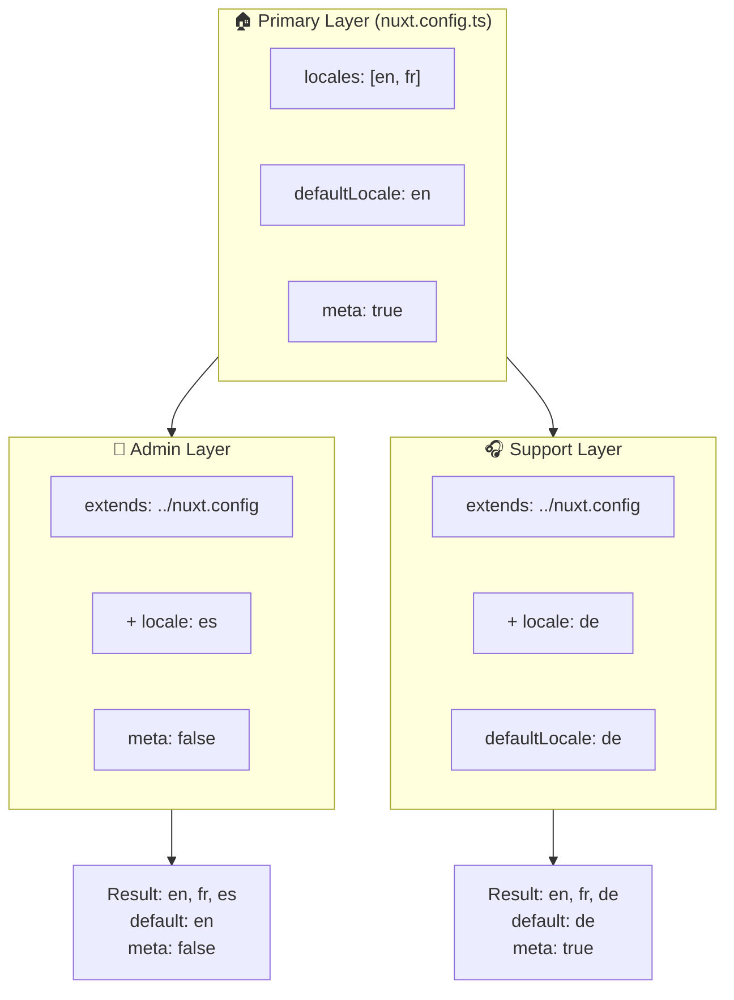

# 🗂️ Lag i `Nuxt I18n Micro`

## 📖 Introduktion til lag

Lag i `Nuxt I18n Micro` giver dig mulighed for at håndtere og tilpasse lokaliseringsindstillinger fleksibelt på tværs af forskellige dele af din applikation. Ved at definere forskellige lag kan du justere konfigurationen for forskellige kontekster, såsom at tilsidesætte indstillinger for specifikke sektioner af dit site eller oprette genbrugelige base-konfigurationer, der kan udvides af andre dele af din applikation.

### Lag-nedarvningsforløb



## 🛠️ Primært konfigurationslag

Det **primære konfigurationslag** er der, hvor du sætter standard-lokaliseringsindstillinger op for hele din applikation. Dette lag er essentielt, da det definerer den globale konfiguration, herunder de understøttede locales, standardsproget og andre kritiske i18n-indstillinger.

### 📄 Eksempel: Definition af det primære konfigurationslag

Her er et eksempel på, hvordan du kan definere det primære konfigurationslag i din `nuxt.config.ts`-fil:

```typescript
export default defineNuxtConfig({
  i18n: {
    locales: [
      { code: 'en', iso: 'en-EN', dir: 'ltr' },
      { code: 'fr', iso: 'fr-FR', dir: 'ltr' },
      { code: 'ar', iso: 'ar-SA', dir: 'rtl' },
    ],
    defaultLocale: 'en', // The default locale for the entire app
    translationDir: 'locales', // Directory where translations are stored
    meta: true, // Automatically generate SEO-related meta tags like `alternate`
    autoDetectLanguage: true, // Automatically detect and use the user's preferred language
  },
})
```

## 🌱 Child-lag

Child-lag bruges til at udvide eller tilsidesætte den primære konfiguration for specifikke dele af din applikation. For eksempel vil du måske tilføje yderligere locales eller ændre standard-locale for en bestemt sektion af dit site. Child-lag er især nyttige i modulære applikationer, hvor forskellige dele af applikationen kan have forskellige lokaliseringskrav.

### 📄 Eksempel: Udvidelse af det primære lag i et child-lag

Antag at du har en sektion af dit site, der skal understøtte yderligere locales, eller at du vil deaktivere en bestemt locale i en bestemt kontekst. Sådan kan du opnå det ved at udvide det primære konfigurationslag:

```typescript
// basic/nuxt.config.ts (Primary Layer)
export default defineNuxtConfig({
  i18n: {
    locales: [
      { code: 'en', iso: 'en-EN', dir: 'ltr' },
      { code: 'fr', iso: 'fr-FR', dir: 'ltr' },
    ],
    defaultLocale: 'en',
    meta: true,
    translationDir: 'locales',
  },
})
```

```typescript
// extended/nuxt.config.ts (Child Layer)
export default defineNuxtConfig({
  extends: '../basic', // Inherit the base configuration from the 'basic' layer
  i18n: {
    locales: [
      { code: 'en', iso: 'en-EN', dir: 'ltr' }, // Inherited from the base layer
      { code: 'fr', iso: 'fr-FR', dir: 'ltr' }, // Inherited from the base layer
      { code: 'de', iso: 'de-DE', dir: 'ltr' }, // Added in the child layer
    ],
    defaultLocale: 'fr', // Override the default locale to French for this section
    autoDetectLanguage: false, // Disable automatic language detection in this section
  },
})
```

### 🌐 Brug af lag i en modulær applikation

I en større, modulær Nuxt-applikation kan du have flere sektioner, hvor hver kræver sine egne i18n-indstillinger. Ved at udnytte lag kan du opretholde en ren og skalerbar konfigurationsstruktur.

### 📄 Eksempel: Lagdelt konfiguration i en modulær applikation

Forestil dig, at du har et e-handels-site med adskilte sektioner som hovedsitet, admin-panelet og kundesupport-portalen. Hver sektion kan have brug for et andet sæt locales eller andre i18n-indstillinger.

#### **Primært lag (global konfiguration):**

```typescript
// nuxt.config.ts
export default defineNuxtConfig({
  i18n: {
    locales: [
      { code: 'en', iso: 'en-EN', dir: 'ltr' },
      { code: 'fr', iso: 'fr-FR', dir: 'ltr' },
    ],
    defaultLocale: 'en',
    meta: true,
    translationDir: 'locales',
    autoDetectLanguage: true,
  },
})
```

#### **Child-lag for admin-panel:**

```typescript
// admin/nuxt.config.ts
export default defineNuxtConfig({
  extends: '../nuxt.config', // Inherit the global settings
  i18n: {
    locales: [
      { code: 'en', iso: 'en-EN', dir: 'ltr' }, // Inherited
      { code: 'fr', iso: 'fr-FR', dir: 'ltr' }, // Inherited
      { code: 'es', iso: 'es-ES', dir: 'ltr' }, // Specific to the admin panel
    ],
    defaultLocale: 'en',
    meta: false, // Disable automatic meta generation in the admin panel
  },
})
```

#### **Child-lag for kundesupport-portal:**

```typescript
// support/nuxt.config.ts
export default defineNuxtConfig({
  extends: '../nuxt.config', // Inherit the global settings
  i18n: {
    locales: [
      { code: 'en', iso: 'en-EN', dir: 'ltr' }, // Inherited
      { code: 'fr', iso: 'fr-FR', dir: 'ltr' }, // Inherited
      { code: 'de', iso: 'de-DE', dir: 'ltr' }, // Specific to the support portal
    ],
    defaultLocale: 'de', // Default to German in the support portal
    autoDetectLanguage: false, // Disable automatic language detection
  },
})
```

I dette modulære eksempel:

- Hver sektion (admin, support) har sine egne i18n-indstillinger, men de arver alle base-konfigurationen.
- Admin-panelet tilføjer spansk (`es`) som en locale og deaktiverer meta-tag-generering.
- Support-portalen tilføjer tysk (`de`) som en locale og har standarden sat til tysk for brugerinterfacet.

## 📝 Best practices for brug af lag

- **🔧 Hold det primære lag simpelt:** Det primære lag bør indeholde de mest almindeligt anvendte indstillinger, der gælder globalt på tværs af din applikation. Hold det ligetil for at sikre konsistens.
- **⚙️ Brug child-lag til specifikke tilpasninger:** Tilsidesæt eller udvid kun indstillinger i child-lag, når det er nødvendigt. Denne tilgang undgår unødvendig kompleksitet i din konfiguration.
- **📚 Dokumentér dine lag:** Dokumentér tydeligt formålet og detaljerne for hvert lag i dit projekt. Dette hjælper med at bevare klarhed og gør det lettere for andre (eller fremtidige dig) at forstå konfigurationen.
