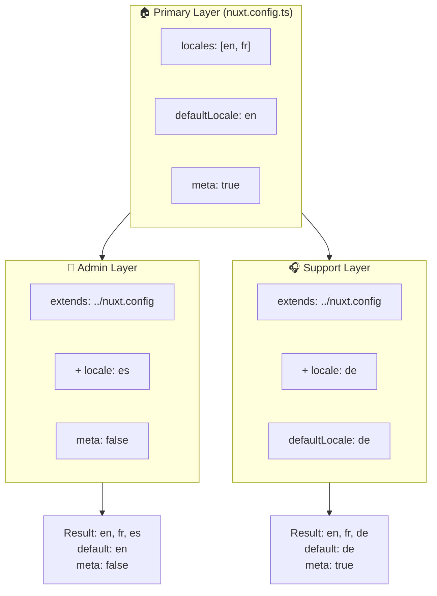

# 🗂️ Layers i `Nuxt I18n Micro`

## 📖 Introduktion til layers

Layers i `Nuxt I18n Micro` giver dig mulighed for at styre og tilpasse lokaliseringsindstillinger fleksibelt på tværs af forskellige dele af din applikation. Ved at definere forskellige layers kan du justere konfigurationen til forskellige kontekster, f.eks. ved at overskrive indstillinger for bestemte sektioner af dit site eller ved at oprette genbrugelige basiskonfigurationer, som andre dele af din applikation kan udvide.

### Nedarvningsflow for layers



## 🛠️ Primær konfigurations-layer

**Den primære konfigurations-layer** er, hvor du opsætter standardindstillinger for lokalisering for hele din applikation. Denne layer er essentiel, da den definerer den globale konfiguration, herunder de understøttede locales, standardsproget og andre kritiske i18n-indstillinger.

### 📄 Eksempel: Definition af den primære konfigurations-layer

Her er et eksempel på, hvordan du kan definere den primære konfigurations-layer i din `nuxt.config.ts`:

```typescript
export default defineNuxtConfig({
  i18n: {
    locales: [
      { code: 'en', iso: 'en-EN', dir: 'ltr' },
      { code: 'fr', iso: 'fr-FR', dir: 'ltr' },
      { code: 'ar', iso: 'ar-SA', dir: 'rtl' },
    ],
    defaultLocale: 'en', // The default locale for the entire app
    translationDir: 'locales', // Directory where translations are stored
    meta: true, // Automatically generate SEO-related meta tags like `alternate`
    autoDetectLanguage: true, // Automatically detect and use the user's preferred language
  },
})
```

## 🌱 Child-layers

Child-layers bruges til at udvide eller overskrive den primære konfiguration for bestemte dele af din applikation. For eksempel kan du tilføje yderligere locales eller ændre standard-locale for en bestemt sektion. Child-layers er især nyttige i modulære applikationer, hvor forskellige dele af applikationen kan have forskellige lokaliseringskrav.

### 📄 Eksempel: Udvidelse af den primære layer i en child-layer

Antag, at du har en sektion af dit site, der skal understøtte yderligere locales, eller at du vil deaktivere et bestemt locale i en bestemt kontekst. Sådan kan du gøre det ved at udvide den primære konfigurations-layer:

```typescript
// basic/nuxt.config.ts (Primary Layer)
export default defineNuxtConfig({
  i18n: {
    locales: [
      { code: 'en', iso: 'en-EN', dir: 'ltr' },
      { code: 'fr', iso: 'fr-FR', dir: 'ltr' },
    ],
    defaultLocale: 'en',
    meta: true,
    translationDir: 'locales',
  },
})
```

```typescript
// extended/nuxt.config.ts (Child Layer)
export default defineNuxtConfig({
  extends: '../basic', // Inherit the base configuration from the 'basic' layer
  i18n: {
    locales: [
      { code: 'en', iso: 'en-EN', dir: 'ltr' }, // Inherited from the base layer
      { code: 'fr', iso: 'fr-FR', dir: 'ltr' }, // Inherited from the base layer
      { code: 'de', iso: 'de-DE', dir: 'ltr' }, // Added in the child layer
    ],
    defaultLocale: 'fr', // Override the default locale to French for this section
    autoDetectLanguage: false, // Disable automatic language detection in this section
  },
})
```

### 🌐 Brug af layers i en modulær applikation

I en større, modulær Nuxt-applikation kan du have flere sektioner, som hver kræver deres egne i18n-indstillinger. Ved at bruge layers kan du opretholde en ren og skalerbar konfigurationsstruktur.

### 📄 Eksempel: Lagdelt konfiguration i en modulær applikation

Forestil dig, at du har et e-handelssite med forskellige sektioner som hovedwebsitet, adminpanelet og kundesupportportalen. Hver sektion kan have brug for et andet sæt locales eller andre i18n-indstillinger.

#### **Primær layer (global konfiguration):**

```typescript
// nuxt.config.ts
export default defineNuxtConfig({
  i18n: {
    locales: [
      { code: 'en', iso: 'en-EN', dir: 'ltr' },
      { code: 'fr', iso: 'fr-FR', dir: 'ltr' },
    ],
    defaultLocale: 'en',
    meta: true,
    translationDir: 'locales',
    autoDetectLanguage: true,
  },
})
```

#### **Child-layer til adminpanel:**

```typescript
// admin/nuxt.config.ts
export default defineNuxtConfig({
  extends: '../nuxt.config', // Inherit the global settings
  i18n: {
    locales: [
      { code: 'en', iso: 'en-EN', dir: 'ltr' }, // Inherited
      { code: 'fr', iso: 'fr-FR', dir: 'ltr' }, // Inherited
      { code: 'es', iso: 'es-ES', dir: 'ltr' }, // Specific to the admin panel
    ],
    defaultLocale: 'en',
    meta: false, // Disable automatic meta generation in the admin panel
  },
})
```

#### **Child-layer til kundesupportportal:**

```typescript
// support/nuxt.config.ts
export default defineNuxtConfig({
  extends: '../nuxt.config', // Inherit the global settings
  i18n: {
    locales: [
      { code: 'en', iso: 'en-EN', dir: 'ltr' }, // Inherited
      { code: 'fr', iso: 'fr-FR', dir: 'ltr' }, // Inherited
      { code: 'de', iso: 'de-DE', dir: 'ltr' }, // Specific to the support portal
    ],
    defaultLocale: 'de', // Default to German in the support portal
    autoDetectLanguage: false, // Disable automatic language detection
  },
})
```

I dette modulære eksempel:

- Hver sektion (admin, support) har sine egne i18n-indstillinger, men de arver alle basiskonfigurationen.
- Adminpanelet tilføjer spansk (`es`) som locale og deaktiverer generering af metatags.
- Supportportalen tilføjer tysk (`de`) som locale og bruger tysk som standard for brugergrænsefladen.

## 📝 Bedste praksis for brug af layers

- **🔧 Hold den primære layer enkel:** Den primære layer bør indeholde de mest brugte indstillinger, der gælder globalt. Hold den enkel for at sikre konsistens.
- **⚙️ Brug child-layers til specifikke tilpasninger:** Overskriv eller udvid kun indstillinger i child-layers, når det er nødvendigt. Det undgår unødvendig kompleksitet i konfigurationen.
- **📚 Dokumentér dine layers:** Dokumentér tydeligt formålet og detaljerne for hver layer i dit projekt. Det gør det lettere at bevare klarheden og gør det nemmere for andre (eller dig selv i fremtiden) at forstå konfigurationen.
