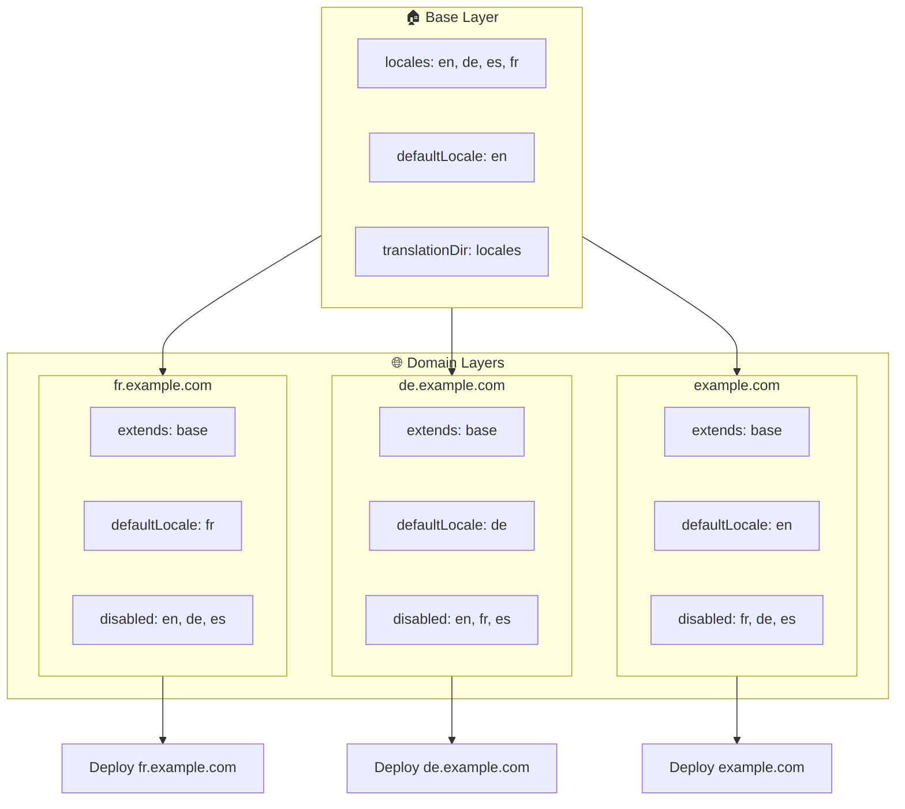

# 🌍 Opsætning af multidomæne-locales med `Nuxt I18n Micro` ved hjælp af layers

## 📝 Introduktion

Ved at udnytte layers i `Nuxt I18n Micro` kan du oprette en fleksibel og vedligeholdelsesvenlig multidomæne-lokaliseringsopsætning. Denne tilgang forenkler ikke kun domænestyring ved at fjerne behovet for kompleks funktionalitet, men muliggør også effektiv fordeling af belastning og reducerer projektets kompleksitet. Ved at køre separate projekter for forskellige locales kan din applikation nemt skalere og tilpasse sig varierende locale-krav på tværs af flere domæner. Det giver en robust og skalerbar løsning til globale applikationer.

## 🎯 Formål

At skabe en opsætning, hvor forskellige domæner betjener bestemte locales ved at tilpasse konfigurationer i child-layers. Denne metode udnytter Nuxts lag-system, så du kan vedligeholde en basiskonfiguration og samtidig udvide eller ændre den for hvert domæne.

### Multidomæne-arkitektur



## 🛠 Trin til implementering af multidomæne-locales

### 1. **Opret base-laget**

Start med at oprette en basiskonfigurations-layer, der indeholder alle de fælles locale-indstillinger for din applikation. Denne konfiguration fungerer som grundlag for andre domæne-specifikke konfigurationer.

#### **Konfiguration af base-laget**

Opret konfigurationsfilen `base/nuxt.config.ts`:

```typescript
// base/nuxt.config.ts

export default defineNuxtConfig({
  i18n: {
    locales: [
      { code: 'en', iso: 'en-US', dir: 'ltr' },
      { code: 'de', iso: 'de-DE', dir: 'ltr' },
      { code: 'es', iso: 'es-ES', dir: 'ltr' },
    ],
    defaultLocale: 'en',
    translationDir: 'locales',
    meta: true,
    autoDetectLanguage: true,
  },
})
```

### 2. **Opret domæne-specifikke child-layers**

For hvert domæne opretter du en child-layer, der ændrer basiskonfigurationen efter det pågældende domænes krav. Du kan deaktivere locales, der ikke er nødvendige for et bestemt domæne.

#### **Eksempel: Konfiguration for det franske domæne**

Opret en child-layer-konfiguration for det franske domæne i `fr/nuxt.config.ts`:

```typescript
// fr/nuxt.config.ts

export default defineNuxtConfig({
  extends: '../base', // Inherit from the base configuration

  i18n: {
    locales: [
      { code: 'en', iso: 'en-US', dir: 'ltr', disabled: true }, // Disable English
      { code: 'fr', iso: 'fr-FR', dir: 'ltr' }, // Add and enable the French locale
      { code: 'de', iso: 'de-DE', dir: 'ltr', disabled: true }, // Disable German
      { code: 'es', iso: 'es-ES', dir: 'ltr', disabled: true }, // Disable Spanish
    ],
    defaultLocale: 'fr', // Set French as the default locale
    autoDetectLanguage: false, // Disable automatic language detection
  },
})
```

#### **Eksempel: Konfiguration for det tyske domæne**

Opret på samme måde en child-layer-konfiguration for det tyske domæne i `de/nuxt.config.ts`:

```typescript
// de/nuxt.config.ts

export default defineNuxtConfig({
  extends: '../base', // Inherit from the base configuration

  i18n: {
    locales: [
      { code: 'en', iso: 'en-US', dir: 'ltr', disabled: true }, // Disable English
      { code: 'fr', iso: 'fr-FR', dir: 'ltr', disabled: true }, // Disable French
      { code: 'de', iso: 'de-DE', dir: 'ltr' }, // Use the German locale
      { code: 'es', iso: 'es-ES', dir: 'ltr', disabled: true }, // Disable Spanish
    ],
    defaultLocale: 'de', // Set German as the default locale
    autoDetectLanguage: false, // Disable automatic language detection
  },
})
```

### 3. **Deployér applikationen for hvert domæne**

Deployér applikationen med den relevante konfiguration for hvert domæne. For eksempel:

- Deployér `fr`-layerkonfigurationen til `fr.example.com`.
- Deployér `de`-layerkonfigurationen til `de.example.com`.

### 4. **Opsæt flere projekter til forskellige locales**

For hvert locale og domæne skal du køre en separat instans af applikationen. Det sikrer, at hvert domæne betjener den korrekte locale-konfiguration, optimerer fordelingen af belastning og forenkler projektets struktur. Ved at køre flere projekter, der er skræddersyet til hvert locale, kan du holde konfigurationer klart adskilt og reducere den samlede kompleksitet i opsætningen.

### 5. **Konfigurer routing baseret på domænet**

Sørg for, at din routing er konfigureret til at sende brugere til det korrekte projekt baseret på det domæne, de tilgår. Det sikrer, at hvert domæne betjener det passende locale, forbedrer brugeroplevelsen og opretholder konsistens på tværs af forskellige regioner.

### 6. **Deployér og verificér**

Efter konfiguration af layers og deployment til deres respektive domæner, skal du sikre dig, at hvert domæne betjener det korrekte locale. Test applikationen grundigt for at bekræfte, at det rigtige locale indlæses afhængigt af domænet.

## 📝 Bedste praksis

- **Hold basiskonfigurationen generisk**: Basiskonfigurationen bør dække generelle indstillinger, der gælder for alle domæner.
- **Isolér domæne-specifik logik**: Hold domæne-specifikke konfigurationer i deres respektive layers for at bevare klarhed og adskillelse af ansvar.

## 🎉 Konklusion

Ved at udnytte layers i `Nuxt I18n Micro` kan du oprette en fleksibel og vedligeholdelsesvenlig multidomæne-lokaliseringsopsætning. Denne tilgang eliminerer ikke kun behovet for kompleks domænestyringsfunktionalitet, men giver dig også mulighed for at fordele belastningen effektivt og reducere projektets kompleksitet. Ved at køre separate projekter for forskellige locales kan din applikation skalere let og tilpasse sig forskellige locale-krav på tværs af forskellige domæner. Det giver en robust og skalerbar løsning til globale applikationer.
