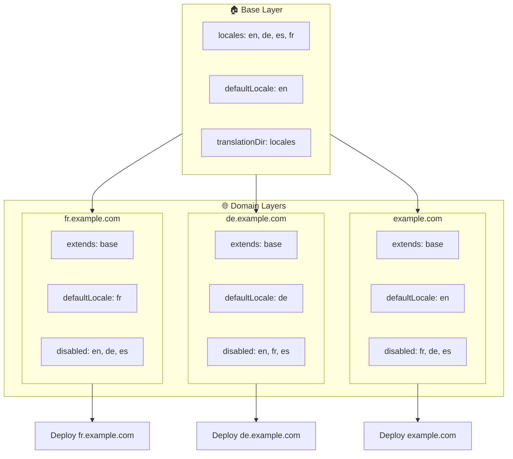

# 🌍 Opsætning af multi-domæne-locales med `Nuxt I18n Micro` ved hjælp af lag

## 📝 Introduktion

Ved at udnytte lag i `Nuxt I18n Micro` kan du skabe en fleksibel og vedligeholdelsesvenlig multi-domæne-lokaliseringsopsætning. Denne tilgang forenkler ikke kun domænehåndtering ved at eliminere behovet for kompleks funktionalitet, men muliggør også effektiv fordeling af belastning og reduceret projektkompleksitet. Ved at køre separate projekter for forskellige locales kan din applikation nemt skalere og tilpasse sig varierende locale-krav på tværs af flere domæner, hvilket tilbyder en robust og skalerbar løsning til globale applikationer.

## 🎯 Mål

At skabe en opsætning, hvor forskellige domæner serverer specifikke locales ved at tilpasse konfigurationer i child-lag. Denne metode udnytter Nuxts lag-system, hvilket giver dig mulighed for at opretholde en base-konfiguration, mens du udvider eller ændrer den for hvert domæne.

### Multi-domæne-arkitektur



## 🛠 Trin til implementering af multi-domæne-locales

### 1. **Opret base-laget**

Start med at oprette et base-konfigurationslag, der inkluderer alle de fælles locale-indstillinger for din applikation. Denne konfiguration vil fungere som fundament for andre domænespecifikke konfigurationer.

#### **Base-lag-konfiguration**

Opret base-konfigurationsfilen `base/nuxt.config.ts`:

```typescript
// base/nuxt.config.ts

export default defineNuxtConfig({
  i18n: {
    locales: [
      { code: 'en', iso: 'en-US', dir: 'ltr' },
      { code: 'de', iso: 'de-DE', dir: 'ltr' },
      { code: 'es', iso: 'es-ES', dir: 'ltr' },
    ],
    defaultLocale: 'en',
    translationDir: 'locales',
    meta: true,
    autoDetectLanguage: true,
  },
})
```

### 2. **Opret domænespecifikke child-lag**

For hvert domæne, opret et child-lag, der ændrer base-konfigurationen for at opfylde de specifikke krav for det domæne. Du kan deaktivere locales, der ikke er nødvendige for et specifikt domæne.

#### **Eksempel: Konfiguration for det franske domæne**

Opret en child-lag-konfiguration for det franske domæne i `fr/nuxt.config.ts`:

```typescript
// fr/nuxt.config.ts

export default defineNuxtConfig({
  extends: '../base', // Inherit from the base configuration

  i18n: {
    locales: [
      { code: 'en', iso: 'en-US', dir: 'ltr', disabled: true }, // Disable English
      { code: 'fr', iso: 'fr-FR', dir: 'ltr' }, // Add and enable the French locale
      { code: 'de', iso: 'de-DE', dir: 'ltr', disabled: true }, // Disable German
      { code: 'es', iso: 'es-ES', dir: 'ltr', disabled: true }, // Disable Spanish
    ],
    defaultLocale: 'fr', // Set French as the default locale
    autoDetectLanguage: false, // Disable automatic language detection
  },
})
```

#### **Eksempel: Konfiguration for det tyske domæne**

Opret på samme måde en child-lag-konfiguration for det tyske domæne i `de/nuxt.config.ts`:

```typescript
// de/nuxt.config.ts

export default defineNuxtConfig({
  extends: '../base', // Inherit from the base configuration

  i18n: {
    locales: [
      { code: 'en', iso: 'en-US', dir: 'ltr', disabled: true }, // Disable English
      { code: 'fr', iso: 'fr-FR', dir: 'ltr', disabled: true }, // Disable French
      { code: 'de', iso: 'de-DE', dir: 'ltr' }, // Use the German locale
      { code: 'es', iso: 'es-ES', dir: 'ltr', disabled: true }, // Disable Spanish
    ],
    defaultLocale: 'de', // Set German as the default locale
    autoDetectLanguage: false, // Disable automatic language detection
  },
})
```

### 3. **Deploy applikationen for hvert domæne**

Deploy applikationen med den passende konfiguration for hvert domæne. For eksempel:

- Deploy `fr`-lag-konfigurationen til `fr.example.com`.
- Deploy `de`-lag-konfigurationen til `de.example.com`.

### 4. **Sæt flere projekter op for forskellige locales**

For hver locale og hvert domæne skal du køre en separat instans af applikationen. Dette sikrer, at hvert domæne serverer den korrekte locale-konfiguration og optimerer fordelingen af belastning og forenkler projektets struktur. Ved at køre flere projekter, der er skræddersyet til hver locale, kan du opretholde en ren adskillelse mellem konfigurationer og reducere kompleksiteten af den samlede opsætning.

### 5. **Konfigurér routing baseret på domæne**

Sørg for, at din routing er konfigureret til at dirigere brugere til det korrekte projekt baseret på det domæne, de tilgår. Dette sikrer, at hvert domæne serverer den passende locale, hvilket forbedrer brugeroplevelsen og opretholder konsistens på tværs af forskellige regioner.

### 6. **Deploy og verificér**

Efter at have konfigureret lagene og deployet dem til deres respektive domæner, sørg for, at hvert domæne serverer den korrekte locale. Test applikationen grundigt for at bekræfte, at den korrekte locale indlæses afhængigt af domænet.

## 📝 Best practices

- **Hold base-konfigurationen generisk**: Base-konfigurationen bør dække generelle indstillinger, der gælder for alle domæner.
- **Isolér domænespecifik logik**: Hold domænespecifikke konfigurationer i deres respektive lag for at opretholde klarhed og adskillelse af ansvar.

## 🎉 Konklusion

Ved at udnytte lag i `Nuxt I18n Micro` kan du skabe en fleksibel og vedligeholdelsesvenlig multi-domæne-lokaliseringsopsætning. Denne tilgang eliminerer ikke kun behovet for kompleks domænehåndteringsfunktionalitet, men giver dig også mulighed for at fordele belastningen effektivt og reducere projektkompleksiteten. At køre separate projekter for forskellige locales sikrer, at din applikation kan skalere let og tilpasse sig forskellige locale-krav på tværs af forskellige domæner, hvilket giver en robust og skalerbar løsning til globale applikationer.
