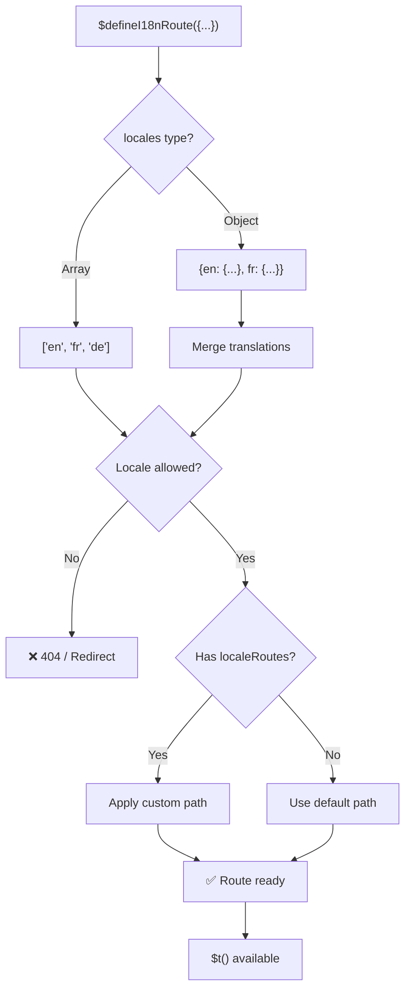
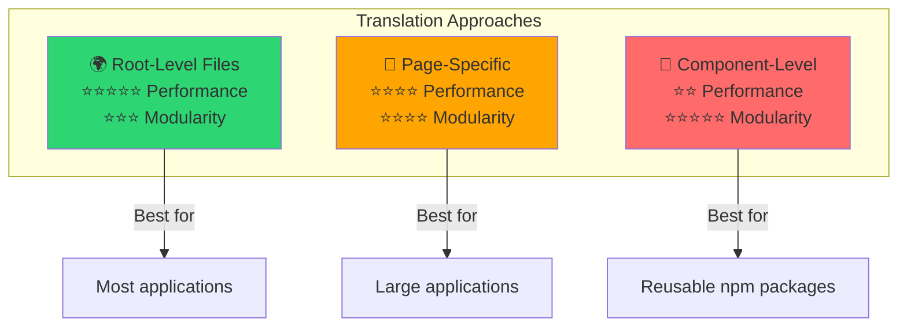

# 📖 Oversættelser pr. komponent

Lær hvordan du definerer oversættelser direkte i Vue-komponenter med `$defineI18nRoute` for en modulær og vedligeholdelsesvenlig lokalisering.

## 📖 Oversigt

Oversættelser pr. komponent i `Nuxt I18n Micro` lader dig definere oversættelser direkte i bestemte komponenter eller sider med funktionen `$defineI18nRoute`. Denne tilgang er ideel til at styre lokaliseret indhold, der er unikt for individuelle komponenter, og giver en mere modulær og vedligeholdelsesvenlig metode til at håndtere oversættelser.

## 🚀 Kom hurtigt i gang

### Grundlæggende brug

```vue
<template>
  <div>
    <h1>{{ $t('greeting') }}</h1>
    <p>{{ $t('farewell') }}</p>
  </div>
</template>

<script setup lang="ts">
import { useNuxtApp } from '#imports'

const { $defineI18nRoute, $t } = useNuxtApp()

$defineI18nRoute({
  locales: {
    en: { greeting: 'Hello', farewell: 'Goodbye' },
    fr: { greeting: 'Bonjour', farewell: 'Au revoir' },
    de: { greeting: 'Hallo', farewell: 'Auf Wiedersehen' },
  },
})
</script>
```

### Påkrævet opsætning (`script setup`)

`$defineI18nRoute` er en Nuxt-app-injektion, ikke en global makro.  
Hent den altid fra `useNuxtApp()`, før du kalder den.

```ts
import { useNuxtApp } from '#imports'

const { $defineI18nRoute } = useNuxtApp()
```

## 🏗️ Rute-metadata ved buildtid

Ved buildtid scanner et Vite-unplugin `.vue`-sidefiler for `defineI18nRoute(...)` / `$defineI18nRoute(...)`-kald og udtrækker locale-begrænsninger, `localeRoutes` og `disableMeta` til rute-metadata, som bruges af `@i18n-micro/route-strategy`.

- **Build**: unplugin (`src/unplugin-define-i18n-route.ts`) kører under Vite-transform og skriver `i18n-route-meta.json` i Nuxt-build-mappen
- **Runtime**: define-pluginet (`03.define.ts`) eksponerer stadig `$defineI18nRoute` i `script setup` til udvikling og inline-konfiguration

Du kalder normalt kun `$defineI18nRoute` i sider. Modulet håndterer buildtid-udtrækket automatisk.

## 🔧 Funktionen `$defineI18nRoute`

Funktionen `$defineI18nRoute` konfigurerer ruteadfærd baseret på det aktuelle locale og tilbyder en alsidig løsning til at:

- Kontrollere adgang til bestemte ruter baseret på tilgængelige locales
- Levere oversættelser for bestemte locales
- Sætte brugerdefinerede ruter for forskellige locales
- Styre generering af metatags

### Sådan fungerer det



### Metodesignatur

```typescript
const { $defineI18nRoute } = useNuxtApp();
$defineI18nRoute(routeDefinition: DefineI18nRouteConfig);
```

### Parametre

| Parameter      | Type                                       | Beskrivelse                        |
| -------------- | ------------------------------------------ | ---------------------------------- |
| `locales`      | `string[] \| Record<string, Translations>` | Tilgængelige locales for ruten     |
| `localeRoutes` | `Record<string, string>`                   | Brugerdefinerede ruter for locales |
| `disableMeta`  | `boolean \| string[]`                      | Styr generering af i18n-metatags   |

### Detaljerede parameterbeskrivelser

#### `locales`

Definerer hvilke locales der er tilgængelige for ruten:

<CodeGroup>
```typescript Array Format
$defineI18nRoute({
  locales: ['en', 'fr', 'de'], // Simple array of locale codes
})
```

```typescript Object Format
$defineI18nRoute({
  locales: {
    en: { greeting: 'Hello', farewell: 'Goodbye' },
    fr: { greeting: 'Bonjour', farewell: 'Au revoir' },
    de: { greeting: 'Hallo', farewell: 'Auf Wiedersehen' },
    ru: {}, // Russian locale allowed but no translations provided
  },
})
```
</CodeGroup>

#### `localeRoutes`

Tillader brugerdefinerede ruter for bestemte locales:

```typescript
$defineI18nRoute({
  localeRoutes: {
    en: '/welcome',
    fr: '/bienvenue',
    de: '/willkommen',
    ru: '/privet', // Custom route path for Russian locale
  },
})
```

#### `disableMeta`

Styrer generering af i18n-metatags:

<CodeGroup>
```typescript Disable All Meta
$defineI18nRoute({
  locales: ['en', 'fr', 'de'],
  disableMeta: true, // Disables all i18n meta tags
})
```

```typescript Disable Specific Locales
$defineI18nRoute({
  locales: ['en', 'fr', 'de'],
  disableMeta: ['en', 'fr'], // Only English and French won't have meta tags
})
```
</CodeGroup>

## 💡 Brugstilfælde

### 1. Adgangskontrol baseret på locales

Definér hvilke locales der er tilladt for bestemte ruter:

```typescript
$defineI18nRoute({
  locales: ['en', 'fr', 'de'], // Only these locales are allowed for this route
})
```

### 2. Komponentspecifikke oversættelser

Brug `locales`-objektet til at levere specifikke oversættelser for hver rute:

```typescript
$defineI18nRoute({
  locales: {
    en: {
      greeting: 'Hello',
      farewell: 'Goodbye',
      description: 'Welcome to our application',
    },
    fr: {
      greeting: 'Bonjour',
      farewell: 'Au revoir',
      description: 'Bienvenue dans notre application',
    },
    de: {
      greeting: 'Hallo',
      farewell: 'Auf Wiedersehen',
      description: 'Willkommen in unserer Anwendung',
    },
  },
})
```

### 3. Brugerdefineret routing for locales

Definér brugerdefinerede stier for bestemte locales:

```typescript
$defineI18nRoute({
  locales: ['en', 'fr', 'de'],
  localeRoutes: {
    en: '/welcome',
    fr: '/bienvenue',
    de: '/willkommen',
  },
})
```

### 4. Deaktivering af metatags

Styr SEO-metatag-generering for bestemte ruter eller locales:

```typescript
// Disable meta tags for all locales
$defineI18nRoute({
  locales: ['en', 'fr', 'de'],
  disableMeta: true,
})

// Disable meta tags only for specific locales
$defineI18nRoute({
  locales: ['en', 'fr', 'de'],
  disableMeta: ['en', 'fr'],
})
```

## ✅ Understøttede konfigurationsformater

Parseren for `$defineI18nRoute` understøtter forskellige JavaScript-konfigurationer:

### Statiske konfigurationer

<CodeGroup>
```typescript Static Arrays
$defineI18nRoute({
  locales: ['en', 'de', 'fr'],
})
```

```typescript Static Objects
$defineI18nRoute({
  locales: {
    en: { greeting: 'Hello' },
    de: { greeting: 'Hallo' },
  },
  localeRoutes: {
    en: '/welcome',
    de: '/willkommen',
  },
})
```
</CodeGroup>

### Dynamiske konfigurationer

<CodeGroup>
```typescript Variables and Functions
const locales = ['en', 'de', 'fr']
const routes = { en: '/welcome', de: '/willkommen' }

$defineI18nRoute({
  locales: locales,
  localeRoutes: routes,
})
```

```typescript Template Literals
const prefix = 'api'

$defineI18nRoute({
  locales: [`${prefix}-en`, `${prefix}-de`],
  localeRoutes: {
    [`${prefix}-en`]: `/api/welcome`,
    [`${prefix}-de`]: `/api/willkommen`,
  },
})
```
</CodeGroup>

### Avancerede konfigurationer

<CodeGroup>
```typescript Spread Operator
const baseLocales = ['en', 'de']
const additionalLocales = ['fr', 'es']

$defineI18nRoute({
  locales: [...baseLocales, ...additionalLocales],
})
```

```typescript Array of Objects
$defineI18nRoute({
  locales: [
    { code: 'en', name: 'English' },
    { code: 'de', name: 'German' },
  ],
})
```
</CodeGroup>

### Betinget logik

```typescript
$defineI18nRoute({
  locales: process.env.NODE_ENV === 'production' ? ['en', 'de'] : ['en', 'de', 'fr', 'es'],
})
```

### Komplekse indlejrede objekter

```typescript
$defineI18nRoute({
  locales: {
    'en-us': {
      region: 'US',
      currency: 'USD',
      format: {
        date: 'MM/DD/YYYY',
        time: '12h',
      },
    },
    'de-de': {
      region: 'DE',
      currency: 'EUR',
      format: {
        date: 'DD.MM.YYYY',
        time: '24h',
      },
    },
  },
})
```

### Kommentarer og formatering

```typescript
$defineI18nRoute({
  // Supported locales for this component
  locales: [
    'en', // English
    'de', // German
    'fr', // French
  ],
  // Custom routes for each locale
  localeRoutes: {
    en: '/welcome',
    de: '/willkommen',
    fr: '/bienvenue',
  },
})
```

## ❌ Ikke understøttet

Parseren har begrænsninger og kan ikke håndtere:

- **Eksterne imports** (`import`-udsagn)
- **Async/await-funktioner**
- **Klassemetoder**
- **Komplekst kontrolflow** (loops, try-catch, switch)
- **Arrow-funktioner** i konfigurationen
- **Generator-funktioner**

## 📝 Komplet eksempel

Her er et omfattende eksempel, der viser alle funktioner:

```vue
<template>
  <div class="welcome-page">
    <header>
      <h1>{{ $t('title') }}</h1>
      <p>{{ $t('subtitle') }}</p>
    </header>

    <main>
      <section>
        <h2>{{ $t('features.title') }}</h2>
        <ul>
          <li v-for="feature in $t('features.list')" :key="feature">
            {{ feature }}
          </li>
        </ul>
      </section>

      <section>
        <h2>{{ $t('contact.title') }}</h2>
        <p>{{ $t('contact.description') }}</p>
        <a :href="$t('contact.email')">{{ $t('contact.email') }}</a>
      </section>
    </main>

    <footer>
      <p>{{ $t('footer.copyright') }}</p>
    </footer>
  </div>
</template>

<script setup lang="ts">
import { useNuxtApp } from '#imports'

const { $defineI18nRoute, $t } = useNuxtApp()

// Define comprehensive i18n route configuration
$defineI18nRoute({
  locales: {
    en: {
      title: 'Welcome to Our Platform',
      subtitle: 'The best solution for your needs',
      features: {
        title: 'Key Features',
        list: ['High Performance', 'Easy to Use', 'Scalable Architecture'],
      },
      contact: {
        title: 'Get in Touch',
        description: "We'd love to hear from you",
        email: 'mailto:contact@example.com',
      },
      footer: {
        copyright: '© 2024 Example Company. All rights reserved.',
      },
    },
    fr: {
      title: 'Bienvenue sur Notre Plateforme',
      subtitle: 'La meilleure solution pour vos besoins',
      features: {
        title: 'Fonctionnalités Clés',
        list: ['Haute Performance', 'Facile à Utiliser', 'Architecture Évolutive'],
      },
      contact: {
        title: 'Contactez-Nous',
        description: 'Nous aimerions avoir de vos nouvelles',
        email: 'mailto:contact@example.com',
      },
      footer: {
        copyright: '© 2024 Example Company. Tous droits réservés.',
      },
    },
    de: {
      title: 'Willkommen auf Unserer Plattform',
      subtitle: 'Die beste Lösung für Ihre Bedürfnisse',
      features: {
        title: 'Hauptfunktionen',
        list: ['Hohe Leistung', 'Einfach zu Verwenden', 'Skalierbare Architektur'],
      },
      contact: {
        title: 'Kontaktieren Sie Uns',
        description: 'Wir würden gerne von Ihnen hören',
        email: 'mailto:contact@example.com',
      },
      footer: {
        copyright: '© 2024 Example Company. Alle Rechte vorbehalten.',
      },
    },
  },
  localeRoutes: {
    en: '/welcome',
    fr: '/bienvenue',
    de: '/willkommen',
  },
  disableMeta: false, // Enable SEO meta tags
})
</script>

<style scoped>
.welcome-page {
  max-width: 800px;
  margin: 0 auto;
  padding: 2rem;
}

header {
  text-align: center;
  margin-bottom: 3rem;
}

section {
  margin-bottom: 2rem;
}

footer {
  text-align: center;
  margin-top: 3rem;
  padding-top: 2rem;
  border-top: 1px solid #eee;
}
</style>
```

## ⚡ Performance-overvejelser

At indlejre oversættelser i Single File Components (SFC'er) kan påvirke ydeevnen:

### Mulige problemer

- **Øget filstørrelse**: Alle locales ligger i SFC'en, i modsætning til separate oversættelsesfiler, som muliggør locale-bevidst indlæsning
- **Langsommere rendering**: Inline-oversættelser behandles på runtime
- **Hukommelsesforbrug**: Alle oversættelser indlæses uanset det aktuelle locale

### Bedste praksis

- **Brug oversættelser side for side** for optimal ydeevne
- **Reservér komponent-oversættelser** til specifikke tilfælde som:
  - Genbrugelige komponenter udgivet på npm
  - Oversættelser, der ikke egner sig til rodfiler
  - Komponenter, der skal være selvforsynende

### Ydeevne vs. modularitet

Balancér dit projekts behov, når du vælger en tilgang:



| Tilgang              | Ydeevne     | Modularitet | Brugstilfælde       |
| -------------------- | ----------- | ---------- | ------------------- |
| **Rodfiler**         | ⭐⭐⭐⭐⭐  | ⭐⭐⭐     | De fleste apps      |
| **Sideafgrænsede**   | ⭐⭐⭐⭐    | ⭐⭐⭐⭐   | Store apps          |
| **Komponent-niveau** | ⭐⭐        | ⭐⭐⭐⭐⭐ | Genbrugelige komponenter |

## 🎯 Bedste praksis

### 1. Hold oversættelser tæt på komponenter

Definér oversættelser direkte i den relevante komponent for at holde lokaliseret indhold organiseret og vedligeholdbart.

### 2. Brug locale-objekter for fleksibilitet

Brug objektformatet til `locales`-egenskaben, når specifikke oversættelser eller adgangskontrol baseret på locales er nødvendige.

### 3. Dokumentér brugerdefinerede ruter

Dokumentér tydeligt eventuelle brugerdefinerede ruter for forskellige locales for at bevare klarheden og forenkle udvikling og vedligeholdelse.

### 4. Overvej ydelses-effekten

Vurdér om oversættelser på komponent-niveau er nødvendige for dit brugstilfælde, og tag højde for ydelses-effekten.

### 5. Brug TypeScript

Udnyt TypeScript for bedre type-sikkerhed og IntelliSense-understøttelse:

```typescript
interface ComponentTranslations {
  title: string
  subtitle: string
  features: {
    title: string
    list: string[]
  }
}

$defineI18nRoute({
  locales: {
    en: {
      title: 'Welcome',
      subtitle: 'Subtitle',
      features: {
        title: 'Features',
        list: ['Feature 1', 'Feature 2'],
      },
    } as ComponentTranslations,
  },
})
```

## 📚 Relaterede emner

- **[Kom hurtigt i gang](/quickstart)** — grundlæggende opsætning og konfiguration
- **[API-reference](/api/methods)** — komplet metodedokumentation
- **[Eksempler](/examples)** — praktiske brugstilfælde

## Opsummering

Funktionen oversættelser pr. komponent, drevet af `$defineI18nRoute`, giver en kraftfuld og fleksibel måde at styre lokalisering i din Nuxt-applikation. Ved at lade lokaliseret indhold og routing defineres på komponent-niveau hjælper den med at skabe en meget tilpasset og brugervenlig oplevelse tilpasset dit publikums sprog og regionale præferencer.

Vælg den tilgang, der bedst passer til dit projekts behov, med hensyn til både ydelseskrav og vedligeholdelse.
