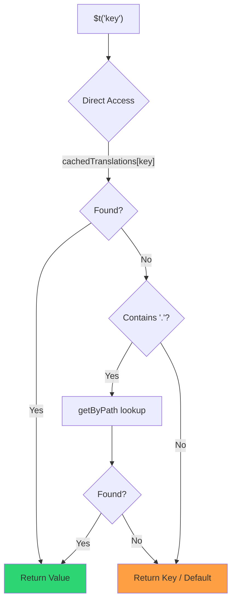

# 🚀 Performanceguide

## 📖 Introduktion

`Nuxt I18n Micro` er designet med performance for øje og tilbyder en markant forbedring i forhold til traditionelle internationaliseringsmoduler (i18n) som `nuxt-i18n`. Denne guide giver et dybdegående kig på performance-fordelene ved at bruge `Nuxt I18n Micro`, og hvordan det står i forhold til andre løsninger.

## 🤔 Hvorfor fokusere på performance?

I store projekter og miljøer med meget trafik kan performance-flaskehalse føre til langsomme byggetider, øget hukommelsesforbrug og dårlige serversvartider. Disse problemer bliver mere udtalte med komplekse i18n-opsætninger, der involverer store oversættelsesfiler. `Nuxt I18n Micro` blev bygget til at tackle disse udfordringer direkte ved at optimere for hastighed, hukommelseseffektivitet og minimal indvirkning på din applikations bundle-størrelse.

## 📊 Performance-sammenligning

Vi kørte en række tests på identiske fixtures via `pnpm test:performance` (`pnpm -C scripts cli performance`) mod **`@nuxtjs/i18n@10.6.0`**. Fuld metodologi og diagrammer: [Resultater af performance-test](/guides/performance-results).

Standard CLI-profil: **4 locales** × **2 sider** (`index`, `page`) × ~10k leaf-nøgler på index. Øg `--locales` / `--keys` for en tungere regressionsradar. Rapporten opdeler **kode**, **oversættelser** (inklusive `@nuxtjs/i18n`s `chunks/raw/*`) og **totalt** deployerbart output.

```bash
pnpm test:performance
pnpm -C scripts cli performance --only micro --skip-stress
pnpm -C scripts cli performance --locales 12 --keys 100000 --runs 3
```

### ⏱️ Byggetid og ressourceforbrug

<Accordion title="**@nuxtjs/i18n v10.6**">
- **Kode-bundle**: 2,16 MB
- **Oversættelser**: 7,21 MB (message-chunks + locale-payloads)
- **Total deployerbar**: 9,37 MB
- **Maks. hukommelsesforbrug**: 1.821 MB
- **Forløbet tid**: 8,34s (gennemsnit af 3)
</Accordion>

<Tip>
- **Kode-bundle**: 1,74 MB — **~19% mindre kode end `@nuxtjs/i18n` v10.6**
- **Oversættelser**: 6,8 MB (lazy-loaded JSON)
- **Total deployerbar**: 8,54 MB
- **Maks. hukommelsesforbrug**: 1.065 MB — **~41% mindre hukommelse end `@nuxtjs/i18n` v10.6**
- **Forløbet tid**: 5,34s — **~36% hurtigere end `@nuxtjs/i18n` v10.6** (≈ plain-nuxt-baseline)
</Tip>

> Ældre docs, der viste `@nuxtjs/i18n` "kode ≈ 15 MB / oversættelser 0 B", tællede `chunks/raw`-messagefiler som app-kode. Den aktuelle klassifikator adskiller dem. Forskellen på **kode** er mindre, og micro er stadig foran på byggetid, peak-RSS og load tests.

Se den [fulde benchmark-rapport](/guides/performance-results) for diagrammer, Autocannon-resultater og fixture-detaljer.

### 🌐 Serverydelse under belastning

Artillery (6s@6 + 60s@60) og Autocannon (10c / 10s), gennemsnit af 3 på hinanden følgende kørsler pr. fixture.

<Accordion title="**@nuxtjs/i18n v10.6**">
- **Requests pr. sekund (Artillery)**: 143 [#/sek]
- **Gennemsnitlig responstid**: 956 ms
- **Autocannon RPS / gennemsnitlig latency**: 72 / 139 ms
</Accordion>

<Tip>
- **Requests pr. sekund (Artillery)**: 275 [#/sek] — **~93% mere end `@nuxtjs/i18n` v10.6**
- **Gennemsnitlig responstid**: 483 ms — **~49% hurtigere end `@nuxtjs/i18n` v10.6**
- **Autocannon RPS / gennemsnitlig latency**: 162 / 62 ms
</Tip>

### 📈 Visuel sammenligning

<Note>
Interaktivt diagram udeladt i Mintlify-docs. Se benchmark-tabellerne på denne side eller [VitePress-docs](https://s00d.github.io/nuxt-i18n-micro/guide/performance-results) for diagrammet: `chart`.
</Note>

<Note>
Interaktivt diagram udeladt i Mintlify-docs. Se benchmark-tabellerne på denne side eller [VitePress-docs](https://s00d.github.io/nuxt-i18n-micro/guide/performance-results) for diagrammet: `chart`.
</Note>

| Metrik          | @nuxtjs/i18n v10.6 | i18n-micro | Forbedring        |
| --------------- | ------------------ | ---------- | ------------------ |
| Byggetid        | 8,34s              | 5,34s      | **~36% hurtigere**    |
| Hukommelse (build) | 1.821 MB        | 1.065 MB   | **~41% mindre**      |
| Kode-bundle     | 2,16 MB            | 1,74 MB    | **~19% mindre**   |
| Responstid      | 956 ms             | 483 ms     | **~49% hurtigere** |
| RPS (Artillery) | 143                | 275        | **~93% mere**      |

### 🔍 Fortolkning af resultater

Mod aktuel `@nuxtjs/i18n` **v10.6** (standard CLI-profil, gennemsnit af 3):

- 🗜️ **Mindre kodegraf**: ~1,74 MB vs. ~2,16 MB, når message-chunks ikke fejlagtigt klassificeres som "kode".
- 🧠 **Lavere build-RSS**: ~1,1 GB peak vs. ~1,8 GB.
- 🕒 **Hurtigere builds**: ~5,3s vs. ~8,3s (micro matcher plain-Nuxt-baselinen på denne profil).
- ⚡ **Meget bedre under belastning**: ~275 vs. ~143 Artillery RPS, ~162 vs. ~72 Autocannon RPS, lavere gennemsnitlig latency.

Absolutte tal afviger fra ældre publicerede tabeller (mindre ordbøger, ældre Nuxt og en uretfærdig "0 B oversættelser"-opdeling for `@nuxtjs/i18n`). Retningsmæssigt er billedet det samme: micro er foran på build-omkostninger og request-throughput.

## ⚙️ Vigtige optimeringer

### 🛠️ Minimalistisk design

`Nuxt I18n Micro` er bygget omkring en minimalistisk arkitektur med en lille kerne og dedikerede strategipakker. Det reducerer overhead og forenkler den interne logik og giver dermed bedre performance.

### 🚦 Effektiv routing

I v3 er rutegenerering og runtime-sti-logik opdelt i dedikerede pakker for optimal tree-shaking:

- **`@i18n-micro/route-strategy`** — rutegenerering ved buildtid: udvider Nuxt-pages med lokaliserede ruter. Kun den valgte strategi (`no_prefix`, `prefix`, `prefix_except_default`, `prefix_and_default`) inkluderes.
- **`@i18n-micro/path-strategy`** — runtime-opløsning af stier, redirects og linkgenerering. Bruger rene funktioner og forberegnede kontekst-flags for at minimere allokeringer på hot paths. Subpath-eksporter (`/prefix`, `/no-prefix` osv.) sikrer, at kun den valgte implementering bundles.

Denne tilgang holder routing-konfigurationen letvægts og sikrer hurtig ruteopløsning uanset antallet af locales.

### 📂 Strømlinet indlæsning af oversættelser

Modulet understøtter kun JSON-filer til oversættelser med en klar adskillelse mellem globale og sideafgrænsede filer. Det sikrer, at kun de nødvendige oversættelsesdata indlæses på et givet tidspunkt, hvilket yderligere forbedrer ydeevnen.

### 🔒 GlobalThis-singleton-cache

Fra v3.0.0 bruger modulet et `globalThis`-singleton-mønster med `Symbol.for` for at garantere én cache-instans i hele Node.js-processen. Det forhindrer:

- Duplikering af cachen, når det samme modul bundles flere gange
- Genskabelse af objekter pr. request, som skaber garbage-collection-tryk
- Hukommelseslæk fra forældreløse cache-instanser

```mermaid
flowchart LR
    subgraph Process["Node.js Process"]
        G["globalThis[Symbol.for('CACHE')]"]

        subgraph R1["SSR Request 1"]
            P1[Plugin Instance] --> G
        end

        subgraph R2["SSR Request 2"]
            P2[Plugin Instance] --> G
        end

        subgraph R3["SSR Request 3"]
            P3[Plugin Instance] --> G
        end
    end

    G --> Cache["Single Map Instance"]
    Cache --> D1["en:index → translations"]
    Cache --> D2["en:about → translations"
```

```typescript
// Internal implementation pattern
const CACHE_KEY = Symbol.for('__NUXT_I18N_STORAGE_CACHE__')
if (!globalThis[CACHE_KEY]) {
  globalThis[CACHE_KEY] = new Map()
}
```

### ⚡ Optimeret oversættelsesfunktion (tFast)

`$t()`-funktionen bruger en direct-lookup-strategi optimeret for hastighed:

1. **Forberegnet kontekst**: Locale og rutenavn beregnes én gang under navigation, ikke ved hvert `$t()`-kald
2. **Enkelt kilde-lookup**: Alle oversættelser (rod + sideafgrænset + fallback) er præflettet ved buildtid til én fil pr. side. Ingen lagdelt søgning nødvendig
3. **Kumulativ dyb fletning ved navigation**: Ved navigation inden for samme locale flettes nye sides oversættelser dybt (2-niveaus dybde) ind i den aktive ordbog, så nøgler fra den forrige side forbliver synlige under overgangsanimationer — selv når sider deler overlappende indlejrede præfikser (f.eks. begge sider har nøgler under `common.*`)
4. **Garbage collection via `page:transition:finish`**: Efter overgangsanimationen er helt færdig, erstattes den flettede ordbog med de rene oversættelser kun for den nye side, hvilket frigør hukommelse fra gamle nøgler
5. **Direkte egenskabsadgang**: Bruger `obj[key]` i stedet for Map-lookups på hot paths



```typescript
// Simplified lookup logic — single active dictionary
let val = cachedTranslations[key]
if (val === undefined && key.includes('.')) {
  val = getByPath(cachedTranslations, key)
}
```

### 💉 Server-side indlæsning (uden HTML-indlejring)

Oversættelser indlæst under SSR forbliver i **serverens hukommelse** til `$t` under rendering. De **kopieres ikke** ind i `nuxtApp.payload` / HTML-dokumentet (samme idé som `@nuxtjs/i18n` med `experimental.preload: false`).

På klienten venter `01.plugin.ts` på `switchContext`, som indlæser `/\{apiBaseUrl\}/:page/:locale/data.json`, før appen fortsætter. Én request, ikke en 8 MB inline-blob.

`NuxtI18n` holder stadig den aktive flettede ordbog (`cachedTranslations`) til `$t()` / `$has()`. Same-locale-navigationer dyb-fletter side-chunks, indtil `page:transition:finish` rydder op i forældede nøgler.

#### Hvor det står i dag

Tallene nedenfor læses fra budget-filen, som `pnpm run budget:payload` måler og håndhæver.

{/* generated:payload-budget — do not edit; run `pnpm run docs:generate` */}

Målt på `playground` på tværs af `/`, `/de`:

| Måling | Størrelse |
| --- | --- |
| Oversættelseskilder på disk | 15,2 MB |
| Serveret som separate payload-filer | 76,3 MB |
| Største inline `__NUXT_DATA__` | 6,9 MB |
| Klient-assets | 449,5 KB |

Playgroundet bærer en bevidst overdimensioneret ordbog, så disse er ikke tal, du kan forvente fra en rigtig applikation. De er et fast referencepunkt at måle imod. Budgettet fejler, når tallene vokser uventet, hvilket er måden, en utilsigtet ændring i det, payloaden bærer, opdages.

{/* /generated:payload-budget */}

### 💾 Caching og pre-rendering

Oversættelser passerer gennem flere caches, og at vide hvilken der svarede på en request er forskellen mellem en fem-minutters og en fem-timers debugging-session. Der er fire, i den rækkefølge en request møder dem:

| Lag | Hvor | Levetid | Ryddes af |
| --- | --- | --- | --- |
| Browser / CDN | `Cache-Control` på `/\{apiBaseUrl\}/**` | `httpCacheDuration`, `immutable` | et nyt `?v=`, dvs. en deploy, der ændrede oversættelser |
| Nitro-rutecache | `routeRules['/\{apiBaseUrl\}/**'].cache` | 60 s, stale-while-revalidate | serverens genstart |
| Server-loader | in-process `CacheControl`, nøglet `locale:routeName` | processens levetid, eller `cacheTtl` | serverens genstart, HMR i dev |
| Klient-store | `translationStorage` + den aktive chunk i `NuxtI18n` | sidens levetid | genindlæs |

To regler holder dem fra at modsige hinanden:

- **Nitro-rutecachen findes kun, når `?v=` gør.** Med en cache-buster er hver URL unik for sit indhold, så caching på serversiden er gratis at gøre uden staleness. Sæt `dateBuild: 0`, og det lag slås fra, fordi URL'en så er stabil, og responsen siger `must-revalidate`. En server-side cache ville svare fra en forældet post i op til et minut og stille sætte det ud af kraft.
- **`immutable` kræver også `?v=`.** Uden en buster er headeren `public, max-age=0, must-revalidate`, uanset hvad `httpCacheDuration` siger: en lang `max-age` på en URL, der aldrig ændrer sig, fastholder det første respons, en browser har set.

<Warning>
Med `translationPayloads.publicAssets` (standard i premerged-tilstand) kopieres payloads til `public/<apiBaseUrl>/\{page\}/\{locale\}/data.json`. En platform, der selv serverer den mappe (Cloudflare Pages, Firebase Hosting, `npx serve`), anvender egne headers. Nitro `routeRules`-headeren når kun responses, der går gennem serveren. Sæt cache-politik for disse statiske filer i platformens egen konfiguration.
</Warning>

🏁 **Pre-rendering**: i premerged-tilstand skriver `publicAssets` allerede klient-URL-træet ind i `public/`. Tilvælg kun `prerenderRoutes`, hvis du har brug for, at Nitro materialiserer handler-ruter, når den kopi er deaktiveret.

### 🗜️ Komprimerede offentlige payloads

Når `nitro.compressPublicAssets` er aktiveret, får oversættelses-payloads, der kopieres til den offentlige mappe, også `.gz`- og `.br`-søskende:

```ts
export default defineNuxtConfig({
  nitro: { compressPublicAssets: true },
})
```

Nitro komprimerer offentlige assets før hook'en, der kopierer payloads. Uden dette ville de være den ene ukomprimerede del af et statisk build. Modulet aktiverer ikke komprimering af sig selv. Det anvender kun den indstilling, du har valgt. Selektion pr. encoding (`\{ gzip: true, brotli: false \}`) respekteres.

Playground-index-payload: 6.651.984 B rå, 1.012.831 B gzip, 821.617 B brotli.

### ☁️ Serverless payload-output

På **Node** læser SSR oversættelses-JSON fra `public/<apiBaseUrl>` (`readFile`, ingen Nitro `serverAssets` / Rollup `raw:`). På **Edge** indlejrer Nitro `serverAssets` det samme træ (foretræk `mode: 'source'` til store kataloger).

```typescript
export default defineNuxtConfig({
  i18n: {
    translationPayloads: {
      serverAssets: true, // default — Node → public copy; Edge → serverAssets embed
      publicAssets: true, // default in premerged mode
    },
  },
})
```

Brug `translationPayloads.mode: 'source'` til kompakte Edge-indlejringer (og valgfrie kompakte offentlige kopier):

```typescript
export default defineNuxtConfig({
  i18n: {
    translationPayloads: {
      mode: 'source',
    },
  },
})
```

`mode: 'source'` holder lag-flettede kildefiler kompakte og fletter rod/side/fallback på runtime via den indbyggede `/_locales`-rute (eller Edge `assets:i18n`). Som standard deaktiverer den kopier til offentlige assets og prerenderede payload-ruter.

<Warning>
`prerenderRoutes` er som standard `false`. Med `mode: 'source'` er `publicAssets` også som standard `false`. Ren statisk hosting uden en Nitro/edge-runtime kan derfor ikke indlæse oversættelser på klienten, medmindre du aktiverer et af disse outputs, holder `serverHandler` tilgængelig på runtime eller hoster payloads eksternt.

Standard premerged + `publicAssets` placerer allerede `/\{apiBaseUrl\}/\{page\}/\{locale\}/data.json` under `public/`, så statiske hosts kan servere klient-fetch uden Nitro.
</Warning>

<Warning>
At sætte `apiBaseServerHost` eller `apiBaseClientHost` flytter payload-serveringen til den origin, hvilket har sine egne krav. Se [Konfiguration → Eksterne CDN-hosts](/guides/configuration#external-cdn-hosts).
</Warning>

Eller deaktivér individuelle HTTP-/offentlige outputs og host payloads eksternt:

```typescript
export default defineNuxtConfig({
  i18n: {
    apiBaseClientHost: 'https://cdn.example.com',
    apiBaseServerHost: 'https://cdn.example.com',
    translationPayloads: {
      serverHandler: false,
      publicAssets: false,
      prerenderRoutes: false,
    },
  },
})
```

Hold `serverHandler` aktiveret, når du er afhængig af den indbyggede lokale `/\{apiBaseUrl\}/:page/:locale/data.json`-rute. Deaktivér den, når payloads hostes eksternt, og `apiBaseServerHost` peger på den eksterne origin. Aktivér kun `prerenderRoutes`, når du har brug for, at Nitro materialiserer statiske payload-ruter, og `publicAssets` ikke allerede har skrevet dem.

Under build advarer modulet, når det genererede payload-output overstiger `translationPayloads.warnFileCount` (standard 500) eller `translationPayloads.warnSizeBytes` (standard 10 MB). Det advarer også, når alle lokale outputs er deaktiveret uden eksterne payload-hosts konfigureret.

## 📝 Tips til at maksimere ydeevnen

Her er et par tips til at få den bedste ydeevne ud af `Nuxt I18n Micro`:

- 📉 **Begræns locale-data**: Medtag kun de locales, du har brug for i dit projekt, for at holde bundle-størrelsen lille.
- 🗂️ **Brug sideafgrænsede oversættelser**: Organisér dine oversættelsesfiler pr. side for at undgå at indlæse unødvendige data.
- 💾 **Aktivér caching**: Udnyt caching-funktionerne til at reducere serverbelastning og forbedre svartider.
- 🏁 **Udnyt pre-rendering**: Prerender dine oversættelser for at fremskynde sideindlæsninger og reducere runtime-overhead.

For detaljerede resultater af performance-testene, se [Resultater af performance-test](/guides/performance-results).
