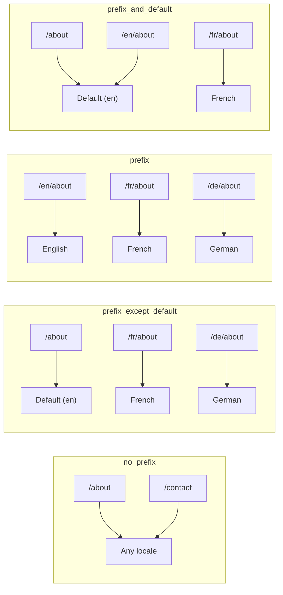
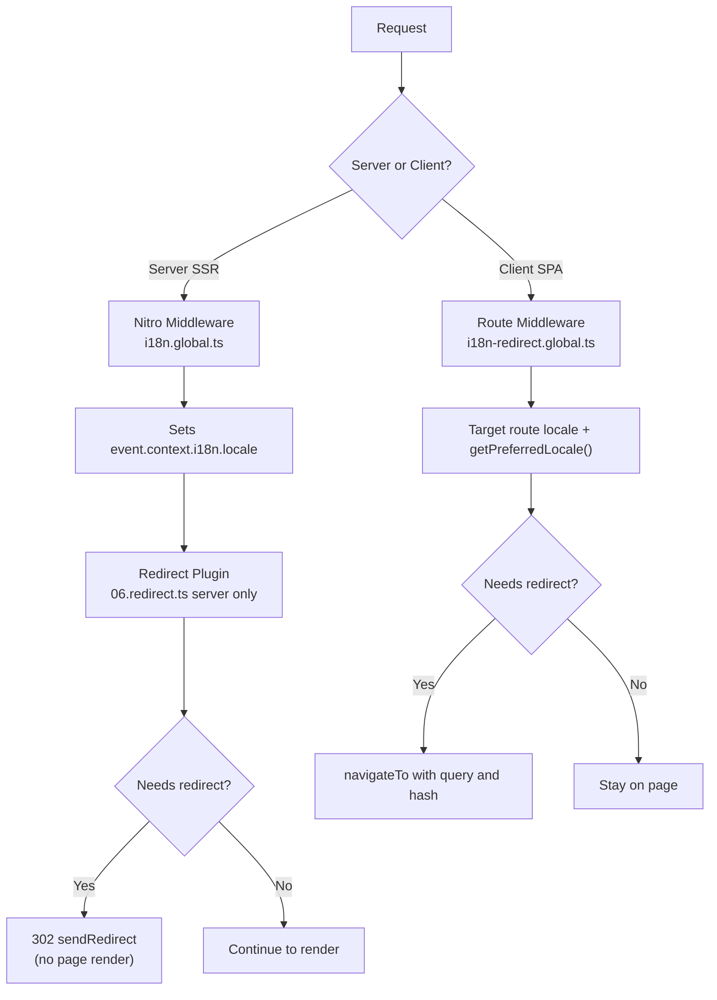

# 🗂️ Routingstrategier i Nuxt I18n Micro

## 📖 Oversigt

Nuxt I18n Micro styrer, hvordan locale-præfikser vises i URL'er via indstillingen `strategy`. Under motorhjelmen implementerer to pakker dette:

- **`@i18n-micro/route-strategy`** — rutegenerering ved buildtid (udvider Nuxt-pages med lokaliserede ruter)
- **`@i18n-micro/path-strategy`** — runtime-opløsning af stier, redirects, SEO-attributter og linkgenerering

Nuxt-modulet vælger den korrekte strategiklasse ved buildtid og aliaserer den via `#i18n-strategy`, så kun den valgte implementering bundles.

## 🚦 Tilgængelige strategier

{/* generated:option:strategy — do not edit; run `pnpm run docs:generate` */}

**Type** `Strategies` · **Standard** `'prefix_except_default'`

URL-routingstrategi for locale-præfikser.

- `'no_prefix'` — intet locale i URL. Locale gemmes i cookie.
- `'prefix_except_default'` — præfiks alle locales undtagen standard.
- `'prefix'` — præfiks altid, inklusive standard-locale.
- `'prefix_and_default'` — som `prefix`, men standard-locale er også tilgængeligt uden præfiks.

{/* /generated:option:strategy */}

### Sammenligning af strategier



### 🛑 `no_prefix`

URL'er har intet locale-segment. Locale bestemmes af cookies, `useI18nLocale()`-state eller browserdetektion.

- **Ruter**: `/about`, `/contact` — samme URL-mønster for alle locales (intet `/en/`- eller `/fr/`-præfiks)
- **Persistering af locale**: via `localeCookie` (sættes automatisk til `'user-locale'`, hvis ikke angivet)
- **Brugerdefinerede stier**: understøttes via [`globalLocaleRoutes`](/guides/configuration#globallocaleroutes) og [`defineI18nRoute`](/guides/custom-locale-routes) — lokaliserede slugs genereres uden at tilføje et locale-præfiks til URL'er (f.eks. `/about` vs. `/ueber-uns`). Indlejrede ruter, aliaser og locale-begrænsninger pr. side er enklere end i `prefix_except_default`.

<Tip>
Når du bruger `no_prefix`, sættes `localeCookie` automatisk til `'user-locale'`, hvis ikke angivet. Dette er påkrævet, fordi URL'en ikke indeholder locale-oplysninger.
</Tip>

```typescript
i18n: {
  strategy: 'no_prefix'
  // localeCookie is automatically set to 'user-locale'
}
```

### 🚧 `prefix_except_default`

Alle ruter har et locale-præfiks **undtagen** standard-locale.

- **Standard-locale**: `/about`, `/contact`
- **Andre locales**: `/fr/about`, `/de/contact`
- **Standard-locale med præfiks returnerer 404**: `/en/about` → 404 (når `en` er standard)

```typescript
i18n: {
  strategy: 'prefix_except_default' // This is the default
}
```

### 🌍 `prefix`

Hver rute har et locale-præfiks, inklusive standard-locale.

- **Alle locales**: `/en/about`, `/fr/about`, `/de/about`
- **Roden `/`**: redirecter til `/\{locale\}/` baseret på brugerens præference

```typescript
i18n: {
  strategy: 'prefix'
}
```

### 🔄 `prefix_and_default`

Standard-locale er tilgængeligt både med og uden præfiks. Ikke-standard-locales har altid et præfiks.

- **Standard-locale**: både `/about` og `/en/about` er gyldige
- **Andre locales**: `/fr/about`, `/de/about`
- **Ingen redirect fra `/`**: både `/` og `/en/` serverer standard-locale

```typescript
i18n: {
  strategy: 'prefix_and_default'
}
```

## 🔀 Redirect-arkitektur (v3)

I v3 er redirect-logikken opdelt i to lag for optimal ydeevne:

### Sådan fungerer det



### Serversiden (ingen flash)

1. **Nitro-middleware** (`i18n.global.ts`) kører først. Den detekterer locale fra URL, cookie eller `Accept-Language`-header og sætter `event.context.i18n.locale`
2. **Redirect-pluginet** (`06.redirect.ts`, kun server) tjekker, om den aktuelle sti behøver et redirect via `i18nStrategy.getClientRedirect()` og udsteder en 302 **inden** nogen sidegenerering finder sted
3. Det forhindrer "fejlflash", hvor brugere kortvarigt ser en forkert side før redirect

### Klientsiden (SPA-navigation)

1. Global rute-middleware (`i18n-redirect.global.ts`) kører ved hver klient-navigation, når `redirects` er aktiveret
2. Udleder det foretrukne locale fra **målruten** først, og falder derefter tilbage til `useI18nLocale().getPreferredLocale()`
3. Bruger `i18nStrategy.getClientRedirect()` til at afgøre, om et redirect er nødvendigt
4. Bevarer `query` og `hash`, når der redirectes

### Prioriteringsrækkefølge for locale

På serveren bestemmer redirect-pluginet det foretrukne locale i denne rækkefølge:

1. **`useState('i18n-locale')`** — højeste prioritet (sat programmatisk via `useI18nLocale().setLocale()`)
2. **Cookie** — hvis `localeCookie` er konfigureret
3. **`Accept-Language`-header** — hvis `autoDetectLanguage: true`
4. **`defaultLocale`** — endelig fallback

På klienten foretrækker rute-middlewaren det locale, der kommer fra målruten, og bruger derefter samme state/cookie-fallback-kæde.

### Redirect-adfærd pr. strategi

| Strategi                | `GET /`-adfærd                               | Cookie påkrævet? |
| ----------------------- | --------------------------------------------- | ---------------- |
| `no_prefix`             | Intet redirect (locale fra cookie/state)      | Auto-sat         |
| `prefix`                | 302 → `/\{locale\}/`                            | Anbefalet         |
| `prefix_except_default` | 302 → `/\{locale\}/` hvis locale ≠ standard    | Anbefalet         |
| `prefix_and_default`    | Intet redirect (både `/` og `/\{locale\}/` gyldige) | Valgfri     |

### Deaktivering af redirects

```typescript
i18n: {
  redirects: false // Disables automatic locale redirects
}
```

Når `redirects: false`, deaktiveres automatiske locale-redirects:

- **Server**: redirect-pluginet (`06.redirect.ts`, kun server) forbliver registreret, men springer redirect-logikken over. Det udfører stadig **404-tjek** for ugyldige locale-præfikser (f.eks. `/xx/about`, hvor `xx` ikke er et gyldigt locale) og **cookie-synkronisering** fra URL-præfiks (f.eks. besøg på `/fr/about` synkroniserer cookien til `fr`)
- **Klient**: den globale rute-middleware `i18n-redirect` er **ikke registreret** — ingen SPA-auto-redirects

## 🍪 Cookiebaseret locale-persistering

<Warning>
Når du bruger `prefix` eller `prefix_except_default` med `redirects: true` (standard), **skal** du sætte `localeCookie`, for at redirects fungerer korrekt. Uden en cookie kan redirect-pluginet ikke huske brugerens locale-præference på tværs af sideopdateringer.

```typescript
i18n: {
  strategy: 'prefix_except_default',
  localeCookie: 'user-locale' // Required for redirects to work properly
}
```
</Warning>

**Sådan fungerer `localeCookie` i v3:**

- Administreres internt af `useI18nLocale()`. **Sæt den ikke manuelt** via `useCookie()`
- Når en bruger besøger en præfikset URL (f.eks. `/fr/about`), synkroniseres cookien automatisk til `fr`
- Ved næste besøg på `/` bruges cookieværdien til at redirecte til `/\{locale\}/`
- Hvis cookien indeholder et ugyldigt locale (ikke i `locales`-listen), falder den tilbage til `defaultLocale`

| Strategi                | Standard for `localeCookie` | Bemærkninger                          |
| ----------------------- | --------------------------- | ------------------------------------- |
| `no_prefix`             | Auto: `'user-locale'`       | Påkrævet. Sættes automatisk           |
| `prefix`                | `null` (deaktiveret)        | Sæt til `'user-locale'` for redirects |
| `prefix_except_default` | `null` (deaktiveret)        | Sæt til `'user-locale'` for redirects |
| `prefix_and_default`    | `null` (deaktiveret)        | Valgfri                               |

## 🔍 `autoDetectLanguage` og `autoDetectPath`

### `autoDetectLanguage`

{/* generated:option:autoDetectLanguage — do not edit; run `pnpm run docs:generate` */}

**Type** `boolean` · **Standard** `true`

Detektér automatisk brugerens foretrukne sprog fra HTTP-headeren `Accept-Language`. Bruges sammen med `autoDetectPath` til at afgøre, hvornår detektion sker.

{/* /generated:option:autoDetectLanguage */}

Tjekket kører i server-middlewaren og er en fallback: en cookie eller eksisterende state vinder.

```typescript
i18n: {
  autoDetectLanguage: true
}
```

### `autoDetectPath`

{/* generated:option:autoDetectPath — do not edit; run `pnpm run docs:generate` */}

**Type** `string` · **Standard** `'/'`

Hvor cookie-/Accept-Language-præference-redirects må køre (når `redirects` er aktiveret).

- `'/'` — kun `/` (deep links i standard-locale forbliver tilgængelige. Standard)
- `'no_prefix'` — kun stier uden locale-præfiks
- `'*'` — hver sti, inklusive omskrivning af et eksplicit locale-præfiks
  (f.eks. `/fr/about` → `/de/about`, når cookien foretrækker `de`)

- enhver anden streng — eksakt sti-match (f.eks. `'/welcome'`)

Oprydning for præfiksstrategi (f.eks. `/en` → `/` under `prefix_except_default`) er ikke betinget.

{/* /generated:option:autoDetectPath */}

```typescript
i18n: {
  autoDetectPath: '/' // Default: only root
  // autoDetectPath: '*' // All paths — redirects even /fr/about to /de/about
}
```

<Warning>
Med `autoDetectPath: '*'` redirectes selv URL'er med et eksplicit locale-præfiks (f.eks. `/fr/about`), hvis brugerens foretrukne locale afviger. Det kan være nyttigt til domænebaserede opsætninger, men kan forvirre brugere, der deler URL'er.
</Warning>

Med standard `autoDetectPath: '/'` og en locale-cookie:

| request | cookie | resultat |
| --- | --- | --- |
| `/` | `de` | 302 → `/de` |
| `/about` | `de` | 200, standard-locale (ingen omskrivning) |

```typescript
i18n: {
  localeCookie: 'user-locale',
  strategy: 'prefix_except_default',
  // Default — remember language on entry, keep deep links stable
  autoDetectPath: '/',
  // Or redirect on every unprefixed path (but not /de/… → /fr/…):
  // autoDetectPath: 'no_prefix',
}
```

## ⚠️ Kendte problemer og bedste praksis

### 1. Hydration-mismatch i `no_prefix`-strategien

Når du bruger `no_prefix`, bestemmes locale dynamisk. Hvis server og klient er uenige om locale, får du en hydration-mismatch.

**Løsning**: Brug `useI18nLocale().setLocale()` i et server-plugin (med `order: -10`) til at sætte locale før i18n-initialisering:

```ts
// plugins/i18n-loader.server.ts
export default defineNuxtPlugin({
  name: 'i18n-custom-loader',
  enforce: 'pre',
  order: -10,
  setup() {
    const { setLocale } = useI18nLocale()
    setLocale('ja') // Your detection logic here
  },
})
```

Se [Brugerdefineret sprogdetektion](/guides/custom-language-detection) for detaljerede eksempler.

### 2. Brug navngivne ruter med `localeRoute`

Sti-baseret routing kan give problemer med ruteopløsning:

```typescript
// May cause issues
$localeRoute('/page')

// Preferred approach
$localeRoute({ name: 'page' })
```

### 3. Brug af `pages: false` med i18n

Når du bruger Nuxt med `pages: false`:

```typescript
export default defineNuxtConfig({
  pages: false,
  i18n: {
    strategy: 'no_prefix', // Recommended
    disablePageLocales: true, // Required
    localeCookie: 'user-locale', // Required for persistence
  },
})
```

**Begrænsninger med `pages: false`:**

- Ingen automatiske redirects
- Ingen URL-baseret locale-detektion
- Klient-side locale-skift kræver en sideopdatering eller manuel indlæsning af oversættelser

### 4. Håndtering af ugyldige cookies

Hvis en cookie indeholder et ugyldigt locale (ikke i `locales`-listen), falder modulet elegant tilbage til `defaultLocale`. Der kastes ingen fejl.

## 📝 Opsummering af bedste praksis

| Anbefaling                | Detaljer                                                                             |
| ------------------------- | ----------------------------------------------------------------------------------- |
| **Sæt `localeCookie`**    | Sæt altid ved præfiksstrategier med `redirects: true`                                |
| **Brug `useI18nLocale()`** | Den centraliserede måde at styre locale-state (erstatter manuel `useState`/`useCookie`) |
| **Brug navngivne ruter**  | `$localeRoute(\{ name: 'page' \})` frem for `$localeRoute('/page')`                    |
| **Programmatisk locale**  | Brug `useI18nLocale().setLocale()` i et server-plugin med `order: -10`              |
| **Undgå manuelle cookies** | Brug ikke `useCookie('user-locale')` direkte. `useI18nLocale()` styrer dette      |
