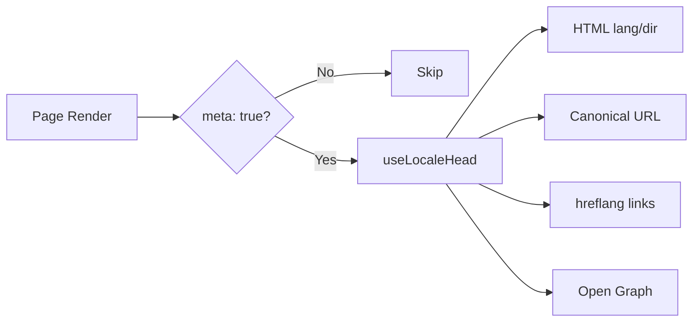

# 🌐 SEO-guide for Nuxt I18n Micro

## 📖 Introduktion

Effektiv SEO (søgemaskineoptimering) er afgørende for at sikre, at dit flersprogede site er tilgængeligt og synligt for brugere verden over via søgemaskiner. `Nuxt I18n Micro` forenkler processen med at styre SEO for flersprogede sider ved automatisk at generere essentielle metatags og attributter, der informerer søgemaskiner om dit sites struktur og indhold.

Denne guide forklarer, hvordan `Nuxt I18n Micro` håndterer SEO for at forbedre dit sites synlighed og brugeroplevelse uden yderligere konfiguration.

## ⚙️ Automatisk SEO-håndtering

### Flow for SEO-metagenerering



**Genererede tags:**

| Tag             | Eksempel                                                 |
| --------------- | -------------------------------------------------------- |
| HTML-attributter | `<html lang="en" dir="ltr">`                             |
| Canonical       | `<link rel="canonical" href="...">`                      |
| hreflang        | `<link rel="alternate" hreflang="en" href="...">`        |
| x-default       | `<link rel="alternate" hreflang="x-default" href="...">` |
| Open Graph      | `<meta property="og:locale" content="en_US">`            |

#### `og` pr. locale (`og:locale` vs. BCP 47)

`<html lang>` og `hreflang` bruger **BCP 47** via `locale.iso` (f.eks. `ar-AE`).  
Open Graph kræver **`language_TERRITORY`** med **underscore** (`ar_AE`), jf. [OG-protokollen](https://ogp.me/).

Som standard udledes `og:locale` fra `iso`, når mappingen er entydig (`en-US` → `en_US`).  
Sæt en eksplicit **`og`**-streng, når du har brug for en brugerdefineret værdi (f.eks. `zh-Hans` → `zh_CN`).  
Hvis hverken `og` eller et konvertérbart `iso` er tilgængeligt, genereres `og:locale`-tags ikke. I udvikling får du en konsoladvarsel (respekterer `missingWarn`).

```typescript
i18n: {
  meta: true,
  locales: [
    { code: 'ar', iso: 'ar-AE', og: 'ar_AE', dir: 'rtl' },
    { code: 'en', iso: 'en-US' }, // og:locale → en_US
    { code: 'zh', iso: 'zh-Hans', og: 'zh_CN' }, // script tags need explicit og
  ],
}
```

### 🔑 Vigtige SEO-funktioner

Når `meta`-indstillingen er aktiveret i `Nuxt I18n Micro`, håndterer modulet automatisk følgende SEO-aspekter:

1. **🌍 Sprog- og retningsattributter**:
   - Modulet sætter `lang`- og `dir`-attributterne på `<html>`-tagget efter det aktuelle locale og tekstretning (f.eks. `ltr` for engelsk eller `rtl` for arabisk).

2. **🔗 Canoniske URL'er**:
   - Modulet genererer et canonical-link (`<link rel="canonical">`) for hver side, så søgemaskiner kan identificere den primære version af indholdet.

3. **🌐 Alternative sproglinks (`hreflang`)**:
   - Modulet genererer automatisk `<link rel="alternate" hreflang="">`-tags for alle tilgængelige locales. Det hjælper søgemaskiner med at forstå, hvilke sprogversioner af dit indhold der findes, og forbedrer brugeroplevelsen for globale målgrupper.
   - Hvert locale udsender **ét** tag: `hreflang = iso || code`. Når `iso` er sat, bruges routing-`code` aldrig som `hreflang` (så markedsnøgler som `mx` ikke bliver til ugyldige sprogtags).
   - Valgfri `hreflangBaseLanguage: true` udsender også et bare-sprog-tag udledt af `iso` (f.eks. `es-ES` → `es`), som claimes af den første regionale locale i `locales`.

4. **🌏 `x-default`-hreflang**:
   - Modulet genererer automatisk et `<link rel="alternate" hreflang="x-default">`-tag, der peger på standard-locales URL. Det fortæller søgemaskiner, hvilken URL brugere skal se, når deres sprog ikke matcher nogen af de definerede locales. Ingen yderligere konfiguration er nødvendig. Det fungerer automatisk, når `meta: true`.

5. **🔖 Open Graph-metadata**:
   - Modulet genererer Open Graph-metatags (`og:locale`, `og:url` osv.) for hvert locale, hvilket er særligt nyttigt til deling på sociale medier og søgemaskineindeksering.

### 🛠️ Konfiguration

For at aktivere disse SEO-funktioner skal du sikre, at `meta`-indstillingen er `true` i din `nuxt.config.ts`:

```typescript
export default defineNuxtConfig({
  modules: ['nuxt-i18n-micro'],
  i18n: {
    locales: [
      { code: 'en', iso: 'en-US', dir: 'ltr' },
      { code: 'fr', iso: 'fr-FR', dir: 'ltr' },
      { code: 'ar', iso: 'ar-SA', dir: 'rtl' },
    ],
    defaultLocale: 'en',
    translationDir: 'locales',
    meta: true, // Enables automatic SEO management
  },
})
```

### 🌍 Dynamisk `metaBaseUrl` til multi-domæne-deployments

Når `metaBaseUrl` ikke er sat, resolveres absolutte SEO-URL'er i denne rækkefølge (#240):

1. `site.url` fra [`nuxt-site-config`](https://nuxtseo.com/docs/site-config) (hvis det modul er til stede — f.eks. via `@nuxtjs/seo`)
2. Ellers hostnavnet fra den aktuelle request (`useRequestURL()` / `window.location.origin`)

Fallback via request-origin respekterer reverse-proxy-headers (`X-Forwarded-Host`, `X-Forwarded-Proto`), så det fungerer korrekt bag nginx, Cloudflare, AWS ALB og lignende proxies.

Det betyder, at apps, der allerede sætter `site.url` til sitemap / robots / schema.org, **ikke** behøver en ekstra `metaBaseUrl`-deklaration:

```typescript
export default defineNuxtConfig({
  site: {
    url: process.env.NUXT_SITE_URL, // also used by micro for canonical / og:url / hreflang
  },
  i18n: {
    meta: true,
    // metaBaseUrl omitted — picks up site.url, then request origin
  },
})
```

Uden `site.url` kan én applikationsinstans stadig betjene **flere domæner** med korrekte SEO-tags for hver enkelt via request-origin:

```typescript
export default defineNuxtConfig({
  i18n: {
    meta: true,
    // metaBaseUrl is undefined by default — resolved dynamically from the request
  },
})
```

For eksempel vil en request til `https://site-a.com/en/about` producere:

```html
<link rel="canonical" href="https://site-a.com/en/about" /> <meta property="og:url" content="https://site-a.com/en/about" />
```

Mens samme app, der betjener `https://site-b.com/en/about`, vil producere:

```html
<link rel="canonical" href="https://site-b.com/en/about" /> <meta property="og:url" content="https://site-b.com/en/about" />
```

Hvis du har brug for en fast base-URL, der altid vinder over `site.url`, kan du sende en statisk streng ind:

```typescript
metaBaseUrl: 'https://example.com'
```

### 🔍 Whitelist for canoniske query-parametre

Som standard fjernes query-parametre fra canonical og `og:url` for at undgå duplicate content. Du kan whiteliste bestemte query-parametre, der skal bevares:

```typescript
i18n: {
  canonicalQueryWhitelist: ['page', 'sort', 'filter', 'search', 'q', 'query', 'tag']
}
```

Kun parametre i `canonicalQueryWhitelist` optræder i canoniske URL'er. Alle andre query-parametre (f.eks. tracking, session-ID'er) fjernes.

### 🚫 Deaktivering af metatags pr. side

Du kan deaktivere SEO-metatag-generering for bestemte sider med `defineI18nRoute()`:

```vue
<script setup>
// Disable all SEO meta tags for this page
defineI18nRoute({
  disableMeta: true,
})
</script>
```

Du kan også kun deaktivere meta for bestemte locales:

```vue
<script setup>
// Disable meta tags only for English locale on this page
defineI18nRoute({
  disableMeta: ['en'],
})
</script>
```

Når `disableMeta` er aktiv, genereres ingen `hreflang`, `canonical`, `og:locale`, `og:url` eller `x-default`-tags for den pågældende side/locale.

### 🔇 Deaktiverede locales

Locales med `disabled: true` udelades automatisk fra al SEO-tag-generering. Der oprettes hverken `hreflang`, `og:locale:alternate` eller alternate-links for dem:

```typescript
i18n: {
  locales: [
    { code: 'en', iso: 'en-US' },
    { code: 'fr', iso: 'fr-FR', disabled: true }, // excluded from SEO tags
  ]
}
```

### 🙈 Fravalgs-locales (`seo: false`)

For locales, der stadig skal være rutbare og oversat, men ikke skal optræde i cross-locale discovery-tags, kan du sætte `seo: false`. Disse locales udelades fra `hreflang`-alternater og `og:locale:alternate`. Hvis dit konfigurerede **standard**-locale har `seo: false`, udsendes `x-default`-linket heller ikke.

```typescript
i18n: {
  locales: [
    { code: 'en', iso: 'en-US' },
    { code: 'ru', iso: 'ru-RU', seo: false }, // internal / non-indexed locale
  ]
}
```

### 📌 Strategi-specifik adfærd

| Strategi                | hreflang-links   | x-default             | canonical      | og:url |
| ----------------------- | ---------------- | --------------------- | -------------- | ------ |
| `prefix`                | ✅ Alle locales  | ✅ URL for standard-locale | ✅ Aktuel URL | ✅     |
| `prefix_except_default` | ✅ Alle locales  | ✅ Uden præfiks       | ✅ Aktuel URL | ✅     |
| `prefix_and_default`    | ✅ Alle locales  | ✅ URL for standard-locale | ✅ Aktuel URL | ✅     |
| `no_prefix`             | ❌ Ikke genereret | ❌ Ikke genereret     | ✅ Aktuel URL | ✅     |

For `no_prefix`-strategien genereres kun `canonical`, `og:url`, `og:locale` og `html`-attributter (`lang`, `dir`). Alternative sproglinks (`hreflang`) og `x-default` genereres ikke, fordi der ikke findes forskellige URL'er pr. locale.

## Overrides på sideniveau (`useI18nHead`)

For **artikler, guides eller andet CMS-indhold**, hvor ikke alle locales findes, eller URL'er kommer fra et API, skal du bruge [`useI18nHead`](/api/composables/use-i18n-head) på siden i stedet for et brugerdefineret i18n-head-plugin.

### Artikel med delvise oversættelser

```vue
<script setup lang="ts">
const article = await loadArticle()
// article.locales = { en: '...', de: '...' } — only translated locales

useI18nHead({
  meta: [{ property: 'og:title', content: article.title }],
  replace: {
    hreflang: Object.entries(article.locales).map(([locale, href]) => ({
      rel: 'alternate',
      hreflang: locale,
      href,
    })),
    ogAlternates: Object.keys(article.locales),
  },
})
</script>
```

### Slugs pr. locale med `$setI18nRouteParams`

Når slugs afviger pr. sprog, skal du først sætte rute-params og derefter overskrive alternater med de rigtige URL'er:

```vue
<script setup lang="ts">
const { $defineI18nRoute, $setI18nRouteParams } = useNuxtApp()
const { data: article } = await useFetch(`/api/articles/${slug}`)

$defineI18nRoute({
  localeRoutes: { en: '/blog/[slug]', de: '/de/blog/[slug]' },
})

$setI18nRouteParams({
  en: { slug: article.value.slugEn },
  de: { slug: article.value.slugDe },
})

useI18nHead({
  replace: {
    hreflang: ['en', 'de'].map((locale) => ({
      rel: 'alternate',
      hreflang: locale,
      href: article.value.urls[locale],
    })),
    ogAlternates: ['en', 'de'],
  },
})
</script>
```

### HTTPS-origin bag en proxy

For korrekte absolutte URL'er under SSR uden en brugerdefineret origin-composable:

```ts
i18n: {
  meta: true,
  metaBaseUrl: undefined,
  metaTrustForwardedHost: true,
  metaTrustForwardedProto: true,
}
```

Flere eksempler (canonical-override, `x-default`, reaktiv fetch, delte hjælpere): [Composablen useI18nHead](/api/composables/use-i18n-head).

### ⚠️ Trailing slash

Modulet genererer canonical- og `hreflang`-URL'er baseret på den faktiske sti fra `useRoute().fullPath`. Hvis din applikation bruger trailing slash (f.eks. via Nuxts `router.options`), afspejles det i de genererede URL'er. Dog kan `$switchLocalePath` normalisere stier og fjerne trailing slash. Hvis konsistens omkring trailing slash er kritisk for din SEO, skal du verificere, at de genererede URL'er matcher din applikations URL-struktur.

### 🎯 Fordele

Ved at aktivere `meta`-indstillingen får du:

- **📈 Forbedrede søgemaskineresultater**: Søgemaskiner kan bedre indeksere dit site og forstå relationerne mellem forskellige sprogversioner.
- **👥 Bedre brugeroplevelse**: Brugere serveres den korrekte sprogversion baseret på deres præferencer, hvilket giver en mere personlig oplevelse.
- **🔧 Mindre manuel konfiguration**: Modulet håndterer SEO-opgaver automatisk, så du slipper for manuelt at tilføje SEO-relaterede metatags og attributter.

## 🔗 Nuxt SEO (`@nuxtjs/seo`)

[`@nuxtjs/seo`](https://nuxtseo.com/) samler sitemap, robots, schema.org, OG images og relaterede moduler. Det integreres med **nuxt-i18n-micro** gennem [`nuxt-site-config`](https://nuxtseo.com/docs/site-config/guides/i18n) (v4+).

### Krav

- **`@nuxtjs/seo` 3+** (aktuelle udgivelser bruger `nuxt-site-config` 4+, som registrerer `nuxt-site-config:i18n`-pluginet for micro)
- **`i18n.meta: true`** (anbefalet — micro leverer locale-bevidste head-tags. Nuxt SEO tilføjer sitemap, schema.org osv.)

### Modulrækkefølge

Placer **nuxt-i18n-micro før `@nuxtjs/seo`**, så site config kan læse din locale-opsætning:

```typescript
export default defineNuxtConfig({
  modules: ['nuxt-i18n-micro', '@nuxtjs/seo'],
  site: {
    url: 'https://example.com',
    name: 'My Site',
  },
  i18n: {
    meta: true,
    defaultLocale: 'en',
    locales: [
      { code: 'en', iso: 'en-US' },
      { code: 'de', iso: 'de-DE' },
    ],
  },
})
```

### Oversat sitenavn og -beskrivelse

Nuxt Site Config læser valgfrie oversættelsesnøgler fra dine locale-filer:

```json
{
  "nuxtSiteConfig": {
    "name": "My Site",
    "description": "My site description"
  }
}
```

Værdier pr. locale i `locales/en.json`, `locales/de.json` osv. opsamles automatisk.

### Fejlfinding

Hvis du ser `Plugin nuxt-seo:defaults depends on nuxt-site-config:i18n but they are not registered`, skal du opgradere **`@nuxtjs/seo` til 3+** (se [issue #133](https://github.com/s00d/nuxt-i18n-micro/issues/133)). Ældre `nuxt-site-config` 3.x koblede kun i18n op på `@nuxtjs/i18n`, ikke micro.

Mere: [Sitemap i18n-guide](https://nuxtseo.com/docs/sitemap/guides/i18n), [Site Config i18n-guide](https://nuxtseo.com/docs/site-config/guides/i18n).
