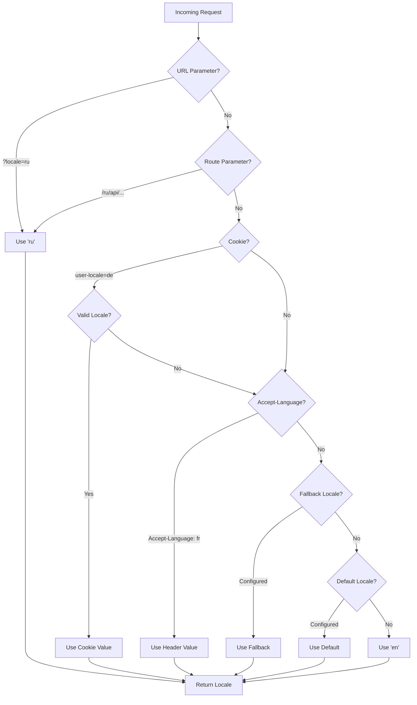

# 🌍 Server-side oversættelser og locale-oplysninger i Nuxt I18n Micro

## 📖 Oversigt

Nuxt I18n Micro understøtter server-side oversættelser og locale-oplysninger og lader dig oversætte indhold og tilgå locale-detaljer på serveren. Det er særligt nyttigt til API'er eller server-renderede applikationer, hvor lokalisering er nødvendig, før indholdet når klienten.

Oversættelserne bruger locale-meddelelser defineret i Nuxt I18n-konfigurationen og resolveres dynamisk baseret på det detekterede locale.

Som standard (`translationPayloads.mode: 'premerged'`) bages rodfiler ind i hver sides payload ved buildtid som `\{page\}/\{locale\}/data.json`. Serveren indlæser de samme forud-byggede filer, som klienten henter under `/\{apiBaseUrl\}/...`, så alle nøgler (både delte og sideafgrænsede) er tilgængelige i server-handlers.

Med `translationPayloads.mode: 'source'` flettes kompakte kildefiler på runtime, når `loadTranslationsFromServer()` (eller `/_locales`-ruten) kaldes. På **Edge** via Nitro `serverAssets`, på **Node** fra den valgfrie offentlige kopi. Se [Performanceguiden — Serverless payload-output](/guides/performance#serverless-payload-output) og [Arkitektur for cache og lagring](/api/cache) for detaljer.

For en samlet liste over runtime- og server-API'er, se [API-referencen](/api/overview).

## 🛠️ Opsætning af server-side middleware

For at aktivere server-side oversættelser og locale-oplysninger skal du bruge de medfølgende middleware-funktioner:

- `useTranslationServerMiddleware` — til at oversætte indhold
- `useLocaleServerMiddleware` — til at tilgå locale-oplysninger

Begge middleware-funktioner er automatisk tilgængelige i alle serverruter.

Logikken til locale-detektion deles mellem begge middleware-funktioner gennem hjælpefunktionen `detectCurrentLocale` for at sikre konsistens på tværs af modulet.

## ✨ Brug af oversættelser i server-handlers

Du kan problemfrit oversætte indhold i enhver `eventHandler` med translation-middlewaren.

### Eksempel: Grundlæggende brug af oversættelser

```typescript
import { defineEventHandler } from 'h3'

export default defineEventHandler(async (event) => {
  const t = await useTranslationServerMiddleware(event)
  return {
    message: t('greeting'), // Returns the translated value for the key "greeting"
  }
})
```

I dette eksempel:

- Brugerens locale detekteres automatisk fra query-parametre, cookies eller headers.
- `t`-funktionen henter den relevante oversættelse for det detekterede locale.

## 🌍 Brug af locale-oplysninger i server-handlers

### Grundlæggende brug af locale-oplysninger

```typescript
import { defineEventHandler } from 'h3'

export default defineEventHandler((event) => {
  const localeInfo = useLocaleServerMiddleware(event)

  return {
    success: true,
    data: localeInfo,
    timestamp: new Date().toISOString(),
  }
})
```

### Angivelse af brugerdefinerede locale-parametre

```typescript
import { defineEventHandler } from 'h3'

export default defineEventHandler((event) => {
  // Force specific locale with custom default
  const localeInfo = useLocaleServerMiddleware(event, 'en', 'ru')

  return {
    success: true,
    data: localeInfo,
    timestamp: new Date().toISOString(),
  }
})
```

### Responsstruktur

Locale-middlewaren returnerer et `LocaleInfo`-objekt med følgende egenskaber:

```typescript
interface LocaleInfo {
  current: string // Current detected locale code
  default: string // Default locale code
  fallback: string // Fallback locale code
  available: string[] // Array of all available locale codes
  locale: Locale | null // Full locale configuration object
  isDefault: boolean // Whether current locale is the default
  isFallback: boolean // Whether current locale is the fallback
}
```

### Eksempel på respons

```json
{
  "success": true,
  "data": {
    "current": "ru",
    "default": "en",
    "fallback": "en",
    "available": ["en", "ru", "de"],
    "locale": {
      "code": "ru",
      "iso": "ru-RU",
      "dir": "ltr",
      "displayName": "Русский"
    },
    "isDefault": false,
    "isFallback": false
  },
  "timestamp": "2024-01-15T10:30:00.000Z"
}
```

## 🌐 Angivelse af et brugerdefineret locale

Hvis du har brug for at specificere et locale manuelt (f.eks. til test eller bestemte requests), kan du sende det til translation-middlewaren:

### Eksempel: Brugerdefineret locale

```typescript
import { defineEventHandler } from 'h3'

function detectLocale(event): string | null {
  const urlSearchParams = new URLSearchParams(event.node.req.url?.split('?')[1])
  const localeFromQuery = urlSearchParams.get('locale')
  if (localeFromQuery) return localeFromQuery

  return 'en'
}

export default defineEventHandler(async (event) => {
  const t = await useTranslationServerMiddleware(event, 'en', detectLocale(event)) // Force French local, en - default locale
  return {
    message: t('welcome'), // Returns the French translation for "welcome"
  }
})
```

## 📋 Logik for locale-detektion

Begge middleware-funktioner bestemmer automatisk brugerens locale ved hjælp af følgende prioritering:



1. **URL-parametre**: `?locale=ru`
2. **Rute-parametre**: `/ru/api/endpoint`
3. **Cookies**: cookien `user-locale`
4. **HTTP-headers**: `Accept-Language`-headeren
5. **Fallback-locale**: som konfigureret i modulindstillinger
6. **Standard-locale**: som konfigureret i modulindstillinger
7. **Hard-kodet fallback**: `'en'`

> **Bemærk**: Logikken til locale-detektion deles mellem `useLocaleServerMiddleware` og `useTranslationServerMiddleware` for at sikre konsistens på tværs af modulet.

## 📋 Avancerede brugseksempler

### Betinget respons baseret på locale

```typescript
import { defineEventHandler } from 'h3'

export default defineEventHandler((event) => {
  const { current, isDefault, locale } = useLocaleServerMiddleware(event)

  // Return different content based on locale
  if (current === 'ru') {
    return {
      message: 'Привет, мир!',
      locale: current,
      isDefault,
    }
  }

  if (current === 'de') {
    return {
      message: 'Hallo, Welt!',
      locale: current,
      isDefault,
    }
  }

  // Default English response
  return {
    message: 'Hello, World!',
    locale: current,
    isDefault,
  }
})
```

### Brugerdefineret locale-detektion

```typescript
import { defineEventHandler } from 'h3'

export default defineEventHandler((event) => {
  // Force German locale with English as fallback
  const { current, isDefault, locale } = useLocaleServerMiddleware(event, 'en', 'de')

  return {
    message: 'Hallo, Welt!',
    locale: current,
    isDefault: false, // Will be false since we forced German
  }
})
```

### Locale-bevidst API med validering

```typescript
import { defineEventHandler, createError } from 'h3'

export default defineEventHandler((event) => {
  const { current, available, locale } = useLocaleServerMiddleware(event)

  // Validate if the detected locale is supported
  if (!available.includes(current)) {
    throw createError({
      statusCode: 400,
      statusMessage: `Unsupported locale: ${current}. Available locales: ${available.join(', ')}`,
    })
  }

  // Return locale-specific configuration
  return {
    locale: current,
    direction: locale?.dir || 'ltr',
    displayName: locale?.displayName || current,
    availableLocales: available,
  }
})
```

### Integration med translation-middleware

Du kan kombinere locale-oplysninger med translation-middleware for omfattende internationalisering:

```typescript
import { defineEventHandler } from 'h3'

export default defineEventHandler(async (event) => {
  const localeInfo = useLocaleServerMiddleware(event)
  const t = await useTranslationServerMiddleware(event)

  return {
    locale: localeInfo.current,
    message: t('welcome_message'),
    availableLocales: localeInfo.available,
    isDefault: localeInfo.isDefault,
  }
})
```

## 📝 Bedste praksis

1. **Validér altid locales**: Tjek at det detekterede locale findes i din liste over tilgængelige locales
2. **Brug fallback-logik**: Angiv fornuftige standarder, når locale-detektion fejler
3. **Cache locale-oplysninger**: For performance-kritiske applikationer kan du overveje at cache resultater af locale-detektion
4. **Håndter kanttilfælde**: Tag højde for ikke-understøttede locales, og lever passende fejlresponses
5. **Kombinér med oversættelser**: Brug locale-oplysninger sammen med translation-middleware for fuld i18n-understøttelse

## 🚀 Performance-overvejelser

- Begge middleware-funktioner er letvægts og designet til hurtig eksekvering
- Locale-detektion bruger effektive fallback-kæder
- Der foretages ingen eksterne API-kald under locale-detektion
- Resultater beregnes synkront for optimal ydeevne
