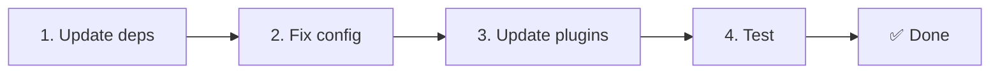

# 📦 Opgradering fra v2.x til v3.x

<Tip>
Se [Migration fra nuxt-i18n](/migration/from-nuxtjs-i18n) — den vejledning dækker flytning fra vue-i18n-økosystemet, ikke fra nuxt-i18n-micro v2.
</Tip>

v3.0.0 indfører fundamentale arkitektoniske ændringer: strategy-pakker, et nyt caching-system, centraliseret locale-håndtering via `useI18nLocale()` og en redesignet redirect-pipeline. Denne sektion dækker alle breaking changes og hvordan du opdaterer din kode.

## Migrationstrin



## Oversigt over breaking changes

- **Locale-state** — `useState` / `useCookie` manuelt → `useI18nLocale()`-composable
- **Config-adgang** — `useRuntimeConfig().public.i18nConfig` → `getI18nConfig()` fra `#build/i18n.strategy.mjs`
- **Redirect-komponent** — `fallbackRedirectComponentPath`-option → Server-redirect-plugin + klient-rute-middleware (automatisk)
- **`includeDefaultLocaleRoute`** — Understøttet (deprekeret) → Fjernet, brug `strategy`-option
- **`experimental.hmr`** — Under `experimental` → Root-niveau-option
- **`previousPageFallback`** — Fjernet helt (kumulativ merge-strategi håndterer dette automatisk)
- **Caching** — `useStorage('cache')` → `TranslationStorage`-singleton (`Symbol.for` på `globalThis`)
- **SSR-overførsel** — Runtime-config → Nuxt-payload (v3 brugte `useState`; chunks lever nu i `payload.data`, se [Performance](/guides/performance#server-side-payload-transfer))
- **Strategy-klasser** — Interne → Separate pakker (`@i18n-micro/route-strategy`, `@i18n-micro/path-strategy`)

## Fjernet: `fallbackRedirectComponentPath`

`fallbackRedirectComponentPath`-optionen og `locale-redirect.vue`-fallback-komponenten er fjernet. Redirect-logik håndteres nu af:

1. **Server-middleware** (`i18n.global.ts`) — sætter `event.context.i18n.locale`
2. **Server-redirect-plugin** (`06.redirect.ts`, server-only) — 302-redirects før render
3. **Klient-rute-middleware** (`i18n-redirect.global.ts`) — SPA-redirects efter hydration

```diff
 i18n: {
   strategy: 'prefix_except_default',
-  fallbackRedirectComponentPath: '~/components/MyRedirect.vue',
 }
```

Hvis du havde brugerdefineret redirect-logik i fallback-komponenten, implementér den i et server-plugin i stedet:

```ts
// plugins/i18n-loader.server.ts
export default defineNuxtPlugin({
  name: 'i18n-custom-redirect',
  enforce: 'pre',
  order: -10,
  setup() {
    const { setLocale } = useI18nLocale()
    // Your custom detection logic
    setLocale(detectedLocale)
  },
})
```

## Fjernet: `includeDefaultLocaleRoute`

Brug `strategy`-optionen i stedet:

- `includeDefaultLocaleRoute: true` → `strategy: 'prefix'`
- `includeDefaultLocaleRoute: false` → `strategy: 'prefix_except_default'` (standarden)

```diff
 i18n: {
-  includeDefaultLocaleRoute: true,
+  strategy: 'prefix',
 }
```

## Config-adgang: `getI18nConfig()` erstatter `useRuntimeConfig`

```diff
- const config = useRuntimeConfig()
- const cookieName = config.public.i18nConfig?.localeCookie || 'user-locale'
+ import { getI18nConfig } from '#build/i18n.strategy.mjs'
+ const { localeCookie: configCookie } = getI18nConfig()
+ const cookieName = configCookie ?? 'user-locale'
```

## Locale-håndtering: `useI18nLocale()` erstatter manuel state

I v2 kan du have brugt `useState('i18n-locale')` eller `useCookie('user-locale')` direkte. I v3 skal du bruge den centraliserede `useI18nLocale()`-composable:

```diff
- const locale = useState('i18n-locale')
- const cookie = useCookie('user-locale')
- locale.value = 'fr'
- cookie.value = 'fr'
+ const { setLocale } = useI18nLocale()
+ setLocale('fr') // Updates both state and cookie atomically
```

Se [Brugerdefineret sprogdetektering](/guides/custom-language-detection) for detaljerede eksempler.

## Eksperimentelle options flyttet / fjernet

`hmr` er flyttet fra `experimental` til root-niveau. `previousPageFallback` er fjernet helt — modulet bruger nu en kumulativ deep-merge-strategi (2-niveau-dybde), der automatisk bevarer oversættelser fra den forrige side under transition-animationer, selv når sider deler overlappende nested nøgler. Efter transition-animationen er færdig, rydder `page:transition:finish`-hooken gamle sides nøgler fra hukommelsen.

```diff
 i18n: {
-  experimental: {
-    hmr: true,
-    previousPageFallback: true
-  }
+  hmr: true,
+  // previousPageFallback removed — handled automatically
 }
```

## Redirect-arkitektur (v3)

Redirects håndteres nu automatisk af to komponenter:

1. **Server-side** (`06.redirect.ts`, server-only): Kører under SSR, udsteder 302-redirects før nogen side-rendering — ingen "error flash"
2. **Klient-side** (`i18n-redirect.global.ts`): Global rute-middleware ved SPA-navigation; bevarer query-string og hash

Locale-prioritet for redirects:

1. `useState('i18n-locale')` — sat via `useI18nLocale().setLocale()`
2. Cookie — hvis `localeCookie` er konfigureret
3. `Accept-Language`-header — hvis `autoDetectLanguage: true`
4. `defaultLocale` — fallback

Ingen kodeændringer nødvendige for standard-opsætninger.

<Warning>
For `prefix`- og `prefix_except_default`-strategier med `redirects: true`, sæt `localeCookie: 'user-locale'` for at aktivere locale-persistens på tværs af side-reloads. Uden den bruger redirects kun `Accept-Language` eller `defaultLocale`.
</Warning>

## TypeScript: Interne modultyper (valgfrit)

Hvis du støder på type-fejl relateret til interne imports som `#i18n-internal/plural`, `#i18n-internal/strategy` eller `#i18n-internal/config`, tilføj `imports`-sektionen til dit projekts `package.json`:

```json
{
  "imports": {
    "#i18n-internal/plural": "nuxt-i18n-micro/internals",
    "#i18n-internal/strategy": "nuxt-i18n-micro/internals",
    "#i18n-internal/config": "nuxt-i18n-micro/internals"
  }
}
```

<Tip>

</Tip>
