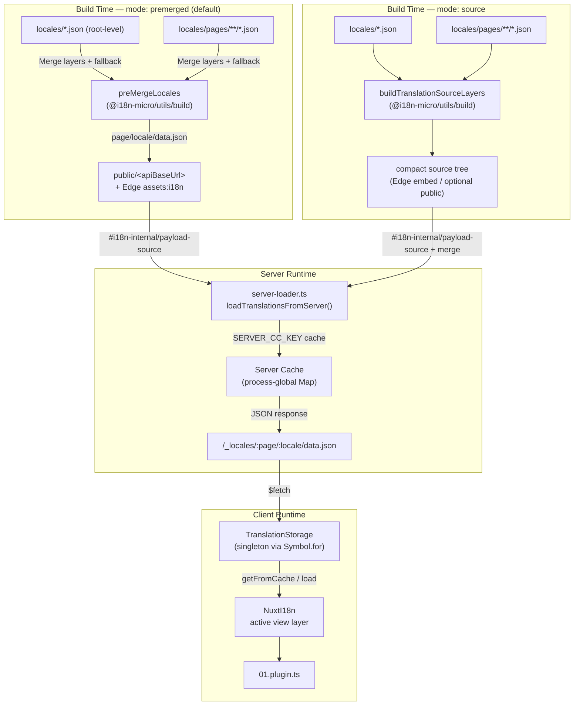

# 🗄️ Architektur von Übersetzungscache und -speicher

## 📖 Übersicht

Nuxt I18n Micro v3 verwendet eine mehrschichtige Caching-Architektur für Übersetzungen. Das Laden der Payloads hängt vom `translationPayloads.mode` ab:

- **`premerged`** (Standard) — Root-, Seiten-, Fallback- und Layer-Dateien werden zur Build-Zeit über `@i18n-micro/utils/build` zu `\{page\}/\{locale\}/data.json` zusammengeführt.
- **`source`** — Kompakte Quelldateien werden für das Zusammenführen zur Laufzeit über `@i18n-micro/utils/source-loader` und `@i18n-micro/utils/merge-source` beibehalten (Edge bettet sie in Nitro `serverAssets` ein; Node liest sie aus `public/`, sofern kopiert).

Diese Seite beschreibt, wie der integrierte Cache funktioniert und wie du ihn für individuelle Anwendungsfälle erweiterst (Admin-Tools, externe APIs, Cache-Invalidierung).

## 📊 Architekturübersicht

### Datenfluss



## 🧱 Kernkomponenten

### 1. `TranslationStorage` (Client + Server)

**Datei**: `src/runtime/utils/storage.ts`

Eine Singleton-Klasse, die einheitlichen Übersetzungsspeicher für Client und Server bereitstellt. Sie verwendet `Symbol.for('__NUXT_I18N_STORAGE_CACHE__')` auf `globalThis`, um sicherzustellen, dass nur eine Instanz existiert, selbst wenn mehrere Bundles geladen sind.

**Zentrale Methoden:**

| Methode                             | Beschreibung                                                                    |
| ----------------------------------- | ------------------------------------------------------------------------------- |
| `getFromCache(locale, routeName?)`  | Synchrone Prüfung: gibt zwischengespeicherte In-Memory-Daten oder `null` zurück |
| `load(locale, routeName?, options)` | Asynchrones Laden mit Caching: prüft zuerst den Cache, dann Abruf via `$fetch`  |
| `clear()`                           | Leert den gesamten Cache                                                        |

**Format des Cache-Schlüssels**: `\{locale\}:\{routeName\}` (z. B. `en:index`, `fr:about`)

```typescript
import { translationStorage } from '../utils/storage'

// Synchronous cache check
const cached = translationStorage.getFromCache('en', 'index')

// Async load (with automatic caching)
const result = await translationStorage.load('en', 'index', {
  apiBaseUrl: '_locales',
  baseURL: '/',
  dateBuild: '2024-01-01',
})
// result.data — merged translations
// result.cacheKey — cache key used
```

### ⚙️ Deterministisches Cache-Busting (`i18n.dateBuild`)

Standardmäßig erzeugt dieses Modul `dateBuild` zur Build-Zeit mithilfe von `Date.now()`. Der Wert wird anschließend in das generierte `#build/i18n.strategy.mjs` eingebettet und als Query-Parameter (`?v=...`) verwendet, um Fetch-Caches für Übersetzungen nach Rebuilds zu invalidieren.

Wenn du reproduzierbare Builds benötigst (etwa um die Chunk-Cache-Trefferquoten bei Rolling-Deployments zu verbessern), setze einen stabilen Wert in `nuxt.config`:

```ts
export default defineNuxtConfig({
  i18n: {
    // Any stable string/number (git SHA, CI build number, release tag, etc.)
    dateBuild: process.env.GIT_SHA ?? 'local-dev',
  },
})
```

### 2. `loadTranslationsFromServer()` (nur Server)

**Datei**: `src/runtime/server/utils/server-loader.ts`

Lädt Übersetzungen für eine Locale/Seite und speichert das zusammengeführte Ergebnis in einer prozessglobalen `CacheControl`-Map, die per `@i18n-micro/hmr/cache-keys` (`SERVER_CC_KEY`) verschlüsselt ist.

Verhalten: SSR lädt aus `#i18n-internal/payload-source` — **Node** `readFile` unter `public/<apiBaseUrl>` (`\{page\}/\{locale\}/data.json` im Premerged-Modus), **Edge** `assets:i18n`. `premerged` liest eine einzelne Datei; `source` führt Root/Seite/Fallback über `@i18n-micro/utils/source-loader` zusammen.

```typescript
import { loadTranslationsFromServer } from '../server/utils/server-loader'

// Returns { data: Translations, json: string }
const { data, json } = await loadTranslationsFromServer('en', 'index')
```

### 3. Client-Ladevorgang (kein HTML-Embed)

Wörterbücher werden **nicht** in `nuxtApp.payload` geschrieben. Der Server hält sie beim SSR-Rendering im Speicher; das Client-Plugin `await`et `switchContext`, das `/\{apiBaseUrl\}/:page/:locale/data.json` lädt (gleiche Standardhaltung wie `@nuxtjs/i18n` mit `experimental.preload: false`).

`NuxtI18n` hält das aktive View-Layer-Wörterbuch, das von `$t()` und `$has()` verwendet wird. `NuxtTranslationLoader` wechselt den Locale/Routen-Kontext und führt Chunks in diese Schicht zusammen.

### 4. Server-API-Route

**Route**: `/_locales/\{page\}/\{locale\}/data.json`

**Datei**: `src/runtime/server/routes/i18n.ts`

Diese Nitro-Route liefert zusammengeführte Übersetzungen für den aktiven Payload-Modus. Sie ruft `loadTranslationsFromServer()` auf und gibt das Ergebnis als JSON zurück.

In der Produktion setzt sie zusätzlich:

```http
Cache-Control: public, max-age={httpCacheDuration}, immutable
```

Der Standardwert für `httpCacheDuration` ist `31536000` (1 Jahr). Das ist sicher, weil Clients Payloads mit Cache-Busting über `?v=\{dateBuild\}` anfordern. Setze `httpCacheDuration: 0`, um den Header zu unterdrücken. Im Entwicklungsmodus wird der Header nicht angewendet.

## 📥 Erweiterung: Benutzerdefiniertes Laden von Übersetzungen

### Aus dem Cache lesen (Server-Route)

```ts
// server/api/i18n/load-cache.[post].ts
import { defineEventHandler, readBody } from 'h3'
import { loadTranslationsFromServer } from '#imports'

export default defineEventHandler(async (event) => {
  const { page, locale } = await readBody<{ page: string; locale: string }>(event)
  const { data } = await loadTranslationsFromServer(locale, page)
  return { locale, page, data }
})
```

### Übersetzungen aktualisieren (Datei + Cache invalidieren)

```ts
// server/api/i18n/update.[post].ts
import { defineEventHandler, readBody, createError } from 'h3'
import { join } from 'node:path'
import { readFile, writeFile } from 'node:fs/promises'
import { deepMergeTranslations } from '@i18n-micro/utils/deep-merge'

export default defineEventHandler(async (event) => {
  const { path, updates } = await readBody<{ path: string; updates: Record<string, unknown> }>(event)

  if (!path || !updates) {
    throw createError({ statusCode: 400, statusMessage: 'Missing path or updates' })
  }

  const fullPath = join('locales', path)
  let existing: Record<string, unknown> = {}

  try {
    const content = await readFile(fullPath, 'utf-8')
    existing = JSON.parse(content) as Record<string, unknown>
  } catch {
    // File does not exist — create new
  }

  const merged = deepMergeTranslations(existing, updates)
  await writeFile(fullPath, JSON.stringify(merged, null, 2), 'utf-8')

  return { success: true, path, updated: merged }
})
```


## 🧹 Cache leeren

### Programmatisches Leeren des Caches (Client)

Nutze die eingebaute Methode `$clearCache`:

```vue
<script setup>
const { $clearCache } = useNuxtApp()

// Clears both TranslationStorage and plugin-level cache
$clearCache()
</script>
```

### Verhalten des Server-Caches

Der serverseitige Cache (`loadTranslationsFromServer`) ist prozessglobal und bleibt bestehen, bis:

- Der Server-Prozess neu gestartet wird.
- Ein neues Deployment erkannt wird (anderer `dateBuild`-Wert).

In Serverless-Umgebungen startet jeder Cold-Start mit einem frischen Cache.

## ⚙️ Serverless-Konfiguration

Für Serverless-Umgebungen (Cloudflare Workers, AWS Lambda) nutzt der eingebaute Cache In-Memory-`Map`-Objekte. Für den Übersetzungscache selbst ist keine externe Speicherkonfiguration nötig.

Der Nitro-Speicher für Quell-Übersetzungsdateien kann jedoch konfiguriert werden:

```ts
export default defineNuxtConfig({
  nitro: {
    storage: {
      // Only needed if default file-system storage is unavailable
      'assets:server': {
        driver: 'cloudflare-kv-binding',
        binding: 'MY_KV_NAMESPACE',
      },
    },
  },
})
```

## 💡 Zentrale Unterschiede zu v2

| Aspekt              | v2                                | v3                                                                       |
| ------------------- | --------------------------------- | ------------------------------------------------------------------------ |
| Client-Cache        | `useStorage('cache')`             | `TranslationStorage`-Singleton (Symbol.for auf globalThis)               |
| SSR-Transfer        | Runtime-Konfiguration             | Vollständige Chunks über `payload.data` (v3.0 nutzte `useState`)         |
| Server-Cache        | Nitro-Cache-Speicher              | Prozessglobale `Map` via `Symbol.for`                                    |
| Merge-Logik         | Client-seitig                     | Zur Build-Zeit (`premerged`) oder Laufzeit (`source`) via `@i18n-micro/utils/*` |
| Format Cache-Schlüssel | `i18n:merged:\{page\}:\{locale\}` | `\{locale\}:\{routeName\}`                                               |

## 📚 Verwandt

- [Performance-Leitfaden](/guides/performance) — Wie Caching die Performance beeinflusst
- [Serverseitige Übersetzungen](/guides/server-side-translations) — Übersetzungen in Server-Routen verwenden
- [Firebase-Deployment](/guides/firebase) — Deployment-spezifische Cache-Aspekte
