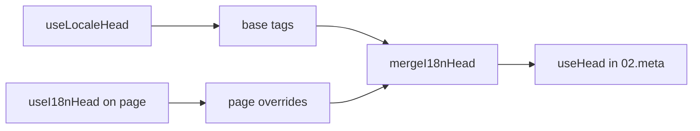

# Composable `useI18nHead`

`useI18nHead` erlaubt es dir, i18n-SEO-Tags **pro Seite** anzupassen, ohne ein eigenes Meta-Plugin. Bei `meta: true` mischt das Modul deine Angaben über die Ausgabe von [`useLocaleHead`](/api/composables/use-locale-head).

Typische Anwendungsfälle:

- **CMS- und Blogartikel**: Nur einige Locales sind übersetzt. Alternate-URLs unterscheiden sich je nach Sprache (unterschiedliche Slugs oder Pfade).
- **Dynamisches Canonical**: Die Canonical-URL muss der Artikel-URL aus der API entsprechen, nicht `$switchLocalePath`.
- **Zusätzliche Open-Graph-Tags**: `og:title`, `og:description`, `og:image` neben automatisch erzeugtem `og:locale` und `og:url`.
- **Teilweise Kontrolle**: Vom Modul erzeugtes Canonical und `og:url` behalten, aber nur `hreflang` und `og:locale:alternate` ersetzen.

---

## Signatur

{/* generated:symbol:useI18nHead — do not edit; run `pnpm run docs:generate` */}

```ts
useI18nHead(input?: MaybeRefOrGetter<I18nHeadInput | null>): { pageHead: any; resetPageHead: () => void }
```

Registriert seitenweite Überschreibungen für i18n-SEO-Head-Tags.
Wird vom Plugin `02.meta` über die Ausgabe von `useLocaleHead` gemischt.

| Parameter | Typ | Beschreibung |
| --- | --- | --- |
| `input` *(optional)* | `MaybeRefOrGetter<I18nHeadInput \| null>` |  |

{/* /generated:symbol:useI18nHead */}

## Einordnung in die Pipeline



Du rufst `useI18nHead` in einer Seitenkomponente auf. Das Plugin `02.meta` wendet die Überschreibungen nach jedem `updateMeta()` an (Routenwechsel, `$setI18nRouteParams`, `page:finish` clientseitig).

---

## Beispiel 1: Artikel mit Übersetzungen nur in einigen Locales

Ein häufiges Muster: Die API liefert, welche Locales existieren, und deren absolute oder relative URLs.

```ts
interface Article {
  title: string
  slug: string
  /** Locale code → page URL (absolute or site-relative) */
  locales: Record<string, string>
}
```

```vue
<script setup lang="ts">
const route = useRoute()
const { data: article } = await useFetch<Article>(`/api/articles/${route.params.slug}`)

const localeCodes = computed(() => Object.keys(article.value?.locales ?? {}))

useI18nHead(() => {
  if (!article.value) return null

  return {
    meta: [
      { property: 'og:title', content: article.value.title },
      { property: 'og:type', content: 'article' },
    ],
    replace: {
      hreflang: localeCodes.value.map((locale) => ({
        rel: 'alternate',
        hreflang: locale,
        href: article.value!.locales[locale]!,
      })),
      ogAlternates: localeCodes.value,
    },
  }
})
</script>
```

`ogAlternates` nimmt **Locale-Codes** aus deiner Konfiguration `i18n.locales`. Werte für `og:locale:alternate` werden über `locale.og` oder `iso` aufgelöst (Open-Graph-Format `en_US`).

---

## Beispiel 2: Artikel mit Slugs je Locale (`$defineI18nRoute` + `$setI18nRouteParams`)

Wenn URLs aus lokalisierten Routen-Templates und dynamischen Parametern gebaut werden:

```vue
<script setup lang="ts">
const { $defineI18nRoute, $setI18nRouteParams } = useNuxtApp()
const route = useRoute()

const { data: article } = await useFetch(`/api/articles/${route.params.slug}`)

$defineI18nRoute({
  localeRoutes: {
    en: '/blog/[slug]',
    de: '/de/blog/[slug]',
    fr: '/fr/blog/[slug]',
  },
})

if (article.value) {
  $setI18nRouteParams({
    en: { slug: article.value.slugEn },
    de: { slug: article.value.slugDe },
    fr: { slug: article.value.slugFr },
  })

  const availableLocales = article.value.availableLocales as string[]

  useI18nHead({
    meta: [{ property: 'og:title', content: article.value.title }],
    replace: {
      hreflang: availableLocales.map((locale) => ({
        rel: 'alternate',
        hreflang: locale,
        href: article.value!.urls[locale],
      })),
      ogAlternates: availableLocales,
    },
  })
}
</script>
```

Vom Modul erzeugte Alternates würden **alle** konfigurierten Locales auflisten. `replace.hreflang` beschränkt die Tags auf Locales, die tatsächlich eine Übersetzung haben.

---

## Beispiel 3: Eigenes `x-default` für die Artikel-URL der Standard-Locale

Standardmäßig verweist `x-default` auf die URL der Standard-Locale aus `$switchLocalePath`. Für Artikel setzt du es auf die URL der Standardübersetzung:

```vue
<script setup lang="ts">
const { $defaultLocale } = useNuxtApp()
const article = await loadArticle()

const defaultLocale = $defaultLocale() ?? 'en'
const defaultHref = article.locales[defaultLocale]

useI18nHead({
  replace: {
    hreflang: Object.entries(article.locales).map(([locale, href]) => ({
      rel: 'alternate',
      hreflang: locale,
      href,
    })),
    xDefault: defaultHref ? { rel: 'alternate', hreflang: 'x-default', href: defaultHref } : false,
    ogAlternates: Object.keys(article.locales),
  },
})
</script>
```

---

## Beispiel 4: Canonical und `og:url` aus API-Daten ersetzen

Wenn das Canonical mit einer vom CMS gelieferten URL übereinstimmen muss (Multi-Domain, eigener Pfad oder fertige absolute URL):

```vue
<script setup lang="ts">
const article = await loadArticle()
const canonical = article.canonicalUrl // e.g. https://www.example.com/en/blog/my-post

useI18nHead({
  replace: {
    canonical,
    ogUrl: canonical,
    hreflang: buildAlternateLinks(article),
    ogAlternates: Object.keys(article.locales),
  },
  meta: [
    { property: 'og:title', content: article.title },
    { name: 'description', content: article.excerpt },
  ],
})
</script>
```

---

## Beispiel 5: Automatisches Canonical und `og:url` behalten, nur Alternates ersetzen

Wenn `$switchLocalePath` und `$setI18nRouteParams` bereits korrekte Werte für Canonical und `og:url` erzeugen, ersetzt du nur die Discovery-Tags:

```vue
<script setup lang="ts">
const article = await loadArticle()

useI18nHead({
  replace: {
    hreflang: buildAlternateLinks(article),
    ogAlternates: Object.keys(article.locales),
  },
})
</script>
```

---

## Beispiel 6: Kompletter Head für eine Content-Detailseite (Meta plus Links)

Ein Muster, das dem Aufteilen in „Page Meta“ und „Alternate Links“ ähnelt, hier in einem einzigen Aufruf kombiniert:

```vue
<script setup lang="ts">
const article = await loadArticle()
const alternates = Object.entries(article.locales).map(([locale, href]) => ({
  rel: 'alternate' as const,
  hreflang: locale,
  href: normalizeSeoUrl(href), // strip ?query and #hash if needed
}))

useI18nHead({
  meta: [
    { property: 'og:title', content: article.title },
    { property: 'og:description', content: article.description },
    { property: 'og:image', content: article.imageUrl },
    { name: 'twitter:card', content: 'summary_large_image' },
    { name: 'twitter:title', content: article.title },
  ],
  replace: {
    canonical: article.canonicalUrl,
    ogUrl: article.canonicalUrl,
    hreflang: alternates,
    ogAlternates: Object.keys(article.locales),
  },
})
</script>
```

```ts
/** Remove query and hash — useful when CMS URLs must be clean for SEO */
function normalizeSeoUrl(href: string): string {
  try {
    const url = new URL(href, 'https://placeholder.local')
    url.search = ''
    url.hash = ''
    return href.startsWith('http') ? url.href : `${url.pathname}`
  } catch {
    return href.split(/[?#]/)[0] ?? href
  }
}
```

---

## Beispiel 7: Zwei Inhaltstypen, gleiches Muster (News vs. Guides)

Gleiche API-Form, unterschiedliche Routennamen. Nutze eine kleine Hilfsfunktion:

```ts
// composables/useArticleHead.ts
import type { I18nHeadInput } from '@i18n-micro/types'

interface LocalizedContent {
  title: string
  locales: Record<string, string>
  canonicalUrl?: string
}

export function buildArticleHead(content: LocalizedContent): I18nHeadInput {
  const localeCodes = Object.keys(content.locales)
  const canonical = content.canonicalUrl ?? content.locales.en

  return {
    meta: [{ property: 'og:title', content: content.title }],
    replace: {
      canonical,
      ogUrl: canonical,
      hreflang: localeCodes.map((locale) => ({
        rel: 'alternate',
        hreflang: locale,
        href: content.locales[locale]!,
      })),
      ogAlternates: localeCodes,
    },
  }
}
```

```vue
<!-- pages/blog/[slug].vue -->
<script setup lang="ts">
const article = await loadArticle()
useI18nHead(buildArticleHead(article))
</script>
```

```vue
<!-- pages/guides/[slug].vue -->
<script setup lang="ts">
const guide = await loadGuide()
useI18nHead(buildArticleHead(guide))
</script>
```

---

## Beispiel 8: Eingebaute Alternates deaktivieren und eigene Liste liefern

Entspricht dem Deaktivieren des hreflang-Generators und dem Übergeben einer eigenen Liste (keine doppelten Alternate-Sets):

```vue
<script setup lang="ts">
const article = await loadArticle()

useI18nHead({
  disable: ['hreflang', 'x-default', 'og-alternates'],
  link: Object.entries(article.locales).map(([locale, href]) => ({
    rel: 'alternate',
    hreflang: locale,
    href,
  })),
  replace: {
    ogAlternates: Object.keys(article.locales),
  },
})
</script>
```

Alternativ kannst du `replace.hreflang` ohne `disable` verwenden. Damit werden alle `rel="alternate"`-Links in einem Schritt ersetzt.

---

## Beispiel 9: Landingpage: nur zusätzliche OG-Tags, alle i18n-Tags behalten

```vue
<script setup lang="ts">
const { t } = useI18n()

useI18nHead({
  meta: [
    { property: 'og:title', content: t('landing.ogTitle') },
    { property: 'og:description', content: t('landing.ogDescription') },
  ],
})
</script>
```

---

## Beispiel 10: Produktseite: hreflang für ein Experiment auf einer Locale deaktivieren

```vue
<script setup lang="ts">
useI18nHead({
  disable: ['hreflang', 'x-default'],
  // canonical, og:locale, og:url still generated
})
</script>
```

---

## Beispiel 11: Reaktive Updates nach clientseitigem Fetch

```vue
<script setup lang="ts">
const article = ref<Article | null>(null)

onMounted(async () => {
  article.value = await $fetch('/api/articles/latest')
})

useI18nHead(() => {
  if (!article.value) return null
  return {
    meta: [{ property: 'og:title', content: article.value.title }],
    replace: {
      hreflang: Object.entries(article.value.locales).map(([locale, href]) => ({
        rel: 'alternate',
        hreflang: locale,
        href,
      })),
    },
  }
})
</script>
```

Der Head aktualisiert sich bei `page:finish` und wenn sich der Zustand `pageHead` ändert.

---

## Beispiel 12: HTTPS-Origin hinter einem Reverse Proxy

Wenn du zuvor ein Composable für einen „Public Origin“ für Canonical- und Alternate-URLs aufgelöst hast, verwende stattdessen die Modulkonfiguration:

```ts
// nuxt.config.ts
export default defineNuxtConfig({
  i18n: {
    meta: true,
    // undefined = origin from current request (multi-domain friendly)
    metaBaseUrl: undefined,
    metaTrustForwardedHost: true,
    metaTrustForwardedProto: true,
  },
})
```

Übergib dann **Pfade oder vollständige URLs** in `replace.hreflang` und `replace.canonical`. Das Modul nutzt `useRequestURL` mit `X-Forwarded-Host` und `X-Forwarded-Proto` bei SSR.

---

## API-Referenz

### `meta`

Zusätzliche `<meta>`-Tags. Dedupliziert per `id`, `property` oder `name`.

### `link`

Zusätzliche `<link>`-Tags. Dedupliziert per `id` oder `rel` + `hreflang`.

### `htmlAttrs`

Wird in die `<html>`-Attribute aus `useLocaleHead` (`lang`, `dir`) gemischt.

### `replace`

| Schlüssel      | Typ                       | Wirkung                                             |
| -------------- | ------------------------- | --------------------------------------------------- |
| `canonical`    | `string \| false`         | Canonical-Link ersetzen oder entfernen              |
| `hreflang`     | `I18nHeadLink[] \| false` | Alle `rel="alternate"`-Links ersetzen oder entfernen |
| `xDefault`     | `I18nHeadLink \| false`   | `hreflang="x-default"` ersetzen oder entfernen      |
| `ogLocale`     | `string \| false`         | `og:locale` ersetzen oder entfernen                 |
| `ogUrl`        | `string \| false`         | `og:url` ersetzen oder entfernen                    |
| `ogAlternates` | `string[] \| false`       | `og:locale:alternate` für Locale-Codes neu bauen    |

### `disable`

| Wert            | Entfernt                                       |
| --------------- | ---------------------------------------------- |
| `hreflang`      | Alternate-Links der Locales (nicht `x-default`) |
| `x-default`     | Link `hreflang="x-default"`                    |
| `canonical`     | Canonical-Link                                 |
| `og`            | `og:locale` und `og:url`                       |
| `og-alternates` | `og:locale:alternate`-Tags                     |
| `html`          | `lang` und `dir` an `<html>`                   |

---

## `useLocaleHead` vs. `useI18nHead`

| Composable      | Scope                     | Wann verwenden                                        |
| --------------- | ------------------------- | ----------------------------------------------------- |
| `useLocaleHead` | Global bzw. manueller Head | `meta: false`, komplett eigenes `useHead`-Setup       |
| `useI18nHead`   | Überschreibungen pro Seite | `meta: true`, einzelne Seiten anpassen                |

Bei `meta: true` brauchst du `useLocaleHead` auf Seiten, die nur `useI18nHead` nutzen, **nicht**.

---

## Migration von einem eigenen i18n-Head-Plugin

Viele Projekte pflegen ein eigenes Plugin, das:

- seitenbezogene Alternate-Links aus einem gemeinsamen State mischt,
- doppelte regionale `hreflang`-Einträge filtert,
- `og:locale`-Werte normalisiert,
- Query-Strings aus SEO-URLs entfernt.

All das lässt sich durch `useI18nHead` auf jeder Content-Seite plus Modul-Defaults ersetzen.

| Bisheriger Ansatz                                        | Mit `useI18nHead`                                     |
| -------------------------------------------------------- | ----------------------------------------------------- |
| Gemeinsamer State + „welche Locales gibt es für diesen Artikel“ | `replace: \{ ogAlternates: localeCodes \}`             |
| Separate Hilfsfunktion für `rel="alternate"`-Links      | `replace: \{ hreflang: links \}`                       |
| Eigenes Plugin, das Seiten-State in den Head mischt      | Eingebautes Mergen in `02.meta`                       |
| Eigener „Public Origin“ für absolute URLs                | `metaBaseUrl` und Forwarded-Header (siehe Beispiel 12) |
| Kurzes `og:locale` (`en` statt `en_US`)                  | `locale.og` setzen oder `iso` nutzen (`en_US`, OG-Protokoll) |

**`hreflang` aus `iso`:** Jede Locale emittiert einen Alternate mit `hreflang = iso || code`. Der Routing-`code` wird nicht verwendet, wenn `iso` gesetzt ist (vermeidet ungültige Tags wie `hreflang="mx"`). Für Basissprache-Fallbacks (`es-ES` → auch `es`) aktivierst du `hreflangBaseLanguage: true`. Der Fallback wird aus `iso`, nicht aus `code` abgeleitet. Für vollständig eigene Listen nutzt du `replace.hreflang`.

**JSON-LD:** `useI18nHead` erzeugt keine strukturierten Daten. Nutze weiterhin `useHead(\{ script: [...] \})` oder eine dedizierte JSON-LD-Hilfsfunktion daneben.

---

## Siehe auch

- [SEO-Guide](/guides/seo): automatische Meta-Erzeugung und seitenbezogene Überschreibungen
- [`useLocaleHead`](/api/composables/use-locale-head): Low-Level-Head-API
