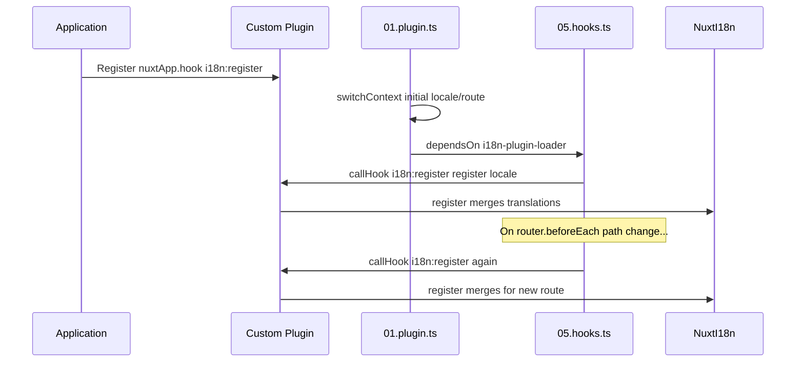

# 📢 Events

## 🔄 `i18n:register`

Das Event `i18n:register` in `Nuxt I18n Micro` ermöglicht das dynamische Hinzufügen von Übersetzungen zum i18n-Kontext deiner Anwendung und macht den Internationalisierungsprozess nahtlos und flexibel. Mit diesem Event kannst du bei Bedarf neue Übersetzungen einbinden und die Lokalisierungsfähigkeiten deiner Anwendung erweitern.

### 📝 Event-Details

- **Zweck**:
  - Ermöglicht die dynamische Einbindung zusätzlicher Übersetzungen in die bestehende Menge für eine bestimmte Locale.

- **Payload**:
  - **`register`**:
    - Eine vom Event bereitgestellte Funktion, die zwei Argumente entgegennimmt:
      - **`translations`** (`Translations`):
        - Ein Objekt mit Schlüssel-Wert-Paaren, die Übersetzungen entsprechend dem Interface `Translations` darstellen.
      - **`locale`** (`string`, optional):
        - Der Locale-Code (z. B. `'en'`, `'ru'`), für den die Übersetzungen registriert werden. Standardmäßig wird die vom Event bereitgestellte Locale verwendet, sofern nicht angegeben.

- **Verhalten**:
  - Beim Auslösen führt die Funktion `register` die neuen Übersetzungen in den aktuellen Kontext der angegebenen Locale ein und aktualisiert damit die in der gesamten Anwendung verfügbaren Übersetzungen.

### ⏱️ Wann es ausgelöst wird

Das Hooks-Plugin des Moduls (`05.hooks.ts`, `dependsOn: ['i18n-plugin-loader']`) ruft `nuxtApp.callHook('i18n:register', …)` auf:

1. **Einmal beim Start** — nachdem das i18n-Hauptplugin (`01.plugin.ts`) Übersetzungen für die initiale Route geladen hat.
2. **Bei Navigation** — in `router.beforeEach`, wenn sich der Pfad ändert, oder bei jeder Navigation, wenn `strategy: 'no_prefix'`.

Registriere deinen Listener in einem normalen Nuxt-Plugin mit `nuxtApp.hook('i18n:register', …)`. Das Hooks-Plugin läuft nach dem Loader, sodass dein Callback aufgerufen wird, sobald Übersetzungen erweitert werden müssen.

Setze `hooks: false` in `nuxt.config`, um automatische `i18n:register`-Aufrufe zu deaktivieren (siehe [Konfiguration — `hooks`](/guides/configuration#hooks)).

### 💡 Anwendungsbeispiel

Das folgende Beispiel zeigt, wie du das Event `i18n:register` verwendest, um Übersetzungen dynamisch hinzuzufügen:

```typescript
nuxt.hook('i18n:register', async (register: (translations: unknown, locale?: string) => void, locale: string) => {
  register(
    {
      greeting: 'Hello',
      farewell: 'Goodbye',
    },
    locale,
  )
})
```

### 🛠️ Erklärung



- **Auslösen des Events**:
  - Das Hooks-Plugin (`05.hooks.ts`) löst `i18n:register` aus, sobald der Haupt-Loader bereit ist und bei relevanten Navigationen.

- **Übersetzungen hinzufügen**:
  - Das Beispiel registriert englische Übersetzungen für `"greeting"` und `"farewell"`.
  - Die Funktion `register` führt diese Übersetzungen in die bestehende Menge der angegebenen Locale ein.

### 🔗 Zentrale Vorteile

- **Dynamische Aktualisierungen**:
  - Übersetzungen lassen sich einfach aktualisieren oder hinzufügen, ohne die gesamte Anwendung erneut auszurollen.

- **Lokalisierungsflexibilität**:
  - Unterstützt Anpassungen der Lokalisierung in Echtzeit basierend auf Nutzer- oder Anwendungsanforderungen.

Mit dem Event `i18n:register` bleibt die Lokalisierungsstrategie deiner Anwendung flexibel und anpassbar und verbessert damit das Nutzererlebnis insgesamt.

---

## 🛠️ Übersetzungen mit Plugins ändern

Um Übersetzungen in deiner Nuxt-Anwendung dynamisch anzupassen, empfiehlt sich der Einsatz von Plugins. Plugins bieten einen strukturierten Weg, Lokalisierungsaktualisierungen zu handhaben, insbesondere in Kombination mit Modulen oder externen Übersetzungsdateien.

### **Plugin registrieren**

Wenn du ein Modul verwendest, registriere das Plugin, in dem die Übersetzungsänderungen stattfinden, indem du es zur Konfiguration deines Moduls hinzufügst:

```javascript
addPlugin({
  src: resolve('./plugins/extend_locales'),
})
```

Damit wird das Plugin unter `./plugins/extend_locales` registriert, das das dynamische Laden und Registrieren von Übersetzungen übernimmt.

### **Plugin implementieren**

Im Plugin kannst du Locale-Änderungen verwalten. Hier ist eine Beispielimplementierung als Nuxt-Plugin:

```typescript
import { defineNuxtPlugin } from '#app'

export default defineNuxtPlugin(async (nuxtApp) => {
  // Function to load translations from JSON files and register them
  const loadTranslations = async (lang: string) => {
    try {
      const translations = await import(`../locales/${lang}.json`)
      return translations.default
    } catch (error) {
      console.error(`Error loading translations for language: ${lang}`, error)
      return null
    }
  }

  // Hook into the 'i18n:register' event to dynamically add translations
  // eslint-disable-next-line @typescript-eslint/ban-ts-comment
  // @ts-expect-error
  nuxtApp.hook('i18n:register', async (register: (translations: unknown, locale?: string) => void, locale: string) => {
    const translations = await loadTranslations(locale)
    if (translations) {
      register(translations, locale)
    }
  })
})
```

### 📝 Detaillierte Erklärung

1. **Übersetzungen laden**:

- Die Funktion `loadTranslations` importiert Übersetzungsdateien dynamisch basierend auf der Locale. Die Dateien werden im Verzeichnis `locales` erwartet und tragen die Namen der Locale-Codes (z. B. `en.json`, `de.json`).
- Bei erfolgreichem Laden werden die Übersetzungen zurückgegeben; andernfalls wird ein Fehler protokolliert.

2. **Übersetzungen registrieren**:

- Das Plugin registriert sich per `nuxtApp.hook` am Event `i18n:register`.
- Beim Auslösen des Events wird die Funktion `register` mit den geladenen Übersetzungen und der zugehörigen Locale aufgerufen.
- Dadurch werden die neuen Übersetzungen für die angegebene Locale in den i18n-Kontext eingefügt und die in der gesamten Anwendung verfügbaren Übersetzungen aktualisiert.

### 🔗 Vorteile von Plugins bei Übersetzungsänderungen

- **Trennung der Zuständigkeiten**:
  - Kapsel die Lokalisierungslogik getrennt vom Hauptanwendungscode, um Verwaltung und Wartung zu vereinfachen.

- **Dynamisch und skalierbar**:
  - Durch das dynamische Laden und Registrieren von Übersetzungen kannst du Inhalte aktualisieren, ohne die Anwendung komplett neu ausrollen zu müssen. Das ist besonders nützlich für Anwendungen mit häufig aktualisierten oder mehrsprachigen Inhalten.

- **Erweiterte Flexibilität bei der Lokalisierung**:
  - Mit Plugins kannst du Übersetzungen bei Bedarf anpassen oder erweitern und so eine anpassbarere und reaktivere Lokalisierungsstrategie umsetzen, die Nutzerpräferenzen oder geschäftliche Anforderungen erfüllt.

Mit diesem Ansatz kannst du die Lokalisierung deiner Anwendung durch einen strukturierten und wartbaren Plugin-Prozess effizient erweitern und anpassen. So bleibt die Internationalisierung flexibel gegenüber wechselnden Anforderungen und verbessert das Nutzererlebnis insgesamt.
