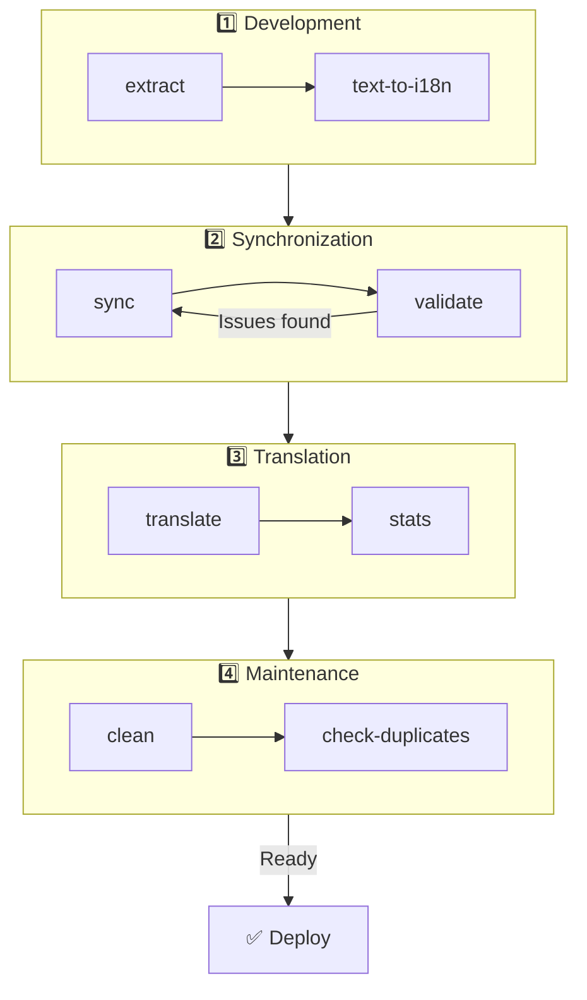

# 🌐 Leitfaden zu nuxt-i18n-micro-cli

## 📖 Einführung

`nuxt-i18n-micro-cli` ist ein Kommandozeilentool, das den Lokalisierungs- und Internationalisierungsprozess in Nuxt.js-Projekten mit dem Modul `nuxt-i18n-micro` (Nuxt I18n Micro) vereinfacht. Es stellt Werkzeuge bereit, um Übersetzungsschlüssel aus Ihrer Codebasis zu extrahieren, Übersetzungsdateien zu verwalten, Übersetzungen zwischen Locales zu synchronisieren und den Übersetzungsprozess über externe Übersetzungsdienste zu automatisieren.

Dieser Leitfaden führt Sie durch Installation, Konfiguration und Nutzung von `nuxt-i18n-micro-cli`, um Übersetzungen in Ihrem Projekt effektiv zu verwalten. Paket auf [npmjs.com](https://www.npmjs.com/package/nuxt-i18n-micro-cli).

## 🔧 Installation und Einrichtung

### 📦 nuxt-i18n-micro-cli installieren

Installieren Sie es global oder als Dev-Abhängigkeit in Ihrem Nuxt-Projekt (für CI empfohlen):

```bash
# global
npm install -g nuxt-i18n-micro-cli

# or per project
pnpm add -D nuxt-i18n-micro-cli
pnpm exec i18n-micro text-to-i18n --dryRun
```

Verwenden Sie **`nuxt-i18n-micro-cli` ≥ 2.1.1**, wenn Ihr Projekt das Nuxt-4-Verzeichnis `app/` nutzt (`app/pages`, `app/components`, …). Ältere CLI-Versionen haben nur `pages/` im Projektstamm gescannt.

### 🛠 Initialisierung in Ihrem Projekt

Nach der Installation können Sie die Befehle von `i18n-micro` im Verzeichnis Ihres Nuxt.js-Projekts ausführen.

Stellen Sie sicher, dass Ihr Projekt mit `nuxt-i18n-micro` eingerichtet ist und die notwendige Konfiguration in `nuxt.config.ts` (oder `nuxt.config.js`) enthält.

### 📄 Häufige Argumente

- `--cwd`: Legt das aktuelle Arbeitsverzeichnis fest (Standard: `.`).
- `--logLevel`: Setzt den Log-Level (`silent`, `info`, `verbose`).
- `--translationDir`: Verzeichnis mit den JSON-Übersetzungsdateien (Standard: `locales`).

## 📊 Überblick zum CLI-Workflow



### Workflow-Schritte

| Phase | Befehle | Zweck |
| --- | --- | --- |
| **Entwicklung** | `extract`, `text-to-i18n` | Übersetzungsschlüssel finden und extrahieren |
| **Synchronisation** | `sync`, `validate` | Sicherstellen, dass alle Locales dieselben Schlüssel haben |
| **Übersetzen** | `translate`, `stats` | Fehlende Schlüssel automatisch übersetzen |
| **Wartung** | `clean`, `check-duplicates` | Übersetzungen aufgeräumt halten |

## 📋 Befehle

### 🔄 Befehl `text-to-i18n`

CLI-Paket: [`nuxt-i18n-micro-cli`](https://www.npmjs.com/package/nuxt-i18n-micro-cli)

**Beschreibung**: Durchsucht Vue-/TS-/JS-Dateien nach fest eingebauten, für Nutzer sichtbaren Strings, ersetzt sie durch `$t('...')` und fügt neue Schlüssel in Ihre JSON-Übersetzungsdatei ein. Ausführen vom **Nuxt-Projektstamm** (dort, wo `nuxt.config` liegt).

**Verwendung**:

```bash
i18n-micro text-to-i18n [options]
```

**Optionen**:

| Option | Standard | Beschreibung |
| --- | --- | --- |
| `--translationFile` | `locales/en.json` | JSON-Datei für neue Schlüssel (relativ zum Projektstamm). |
| `--path` | — | Nur eine bestimmte Datei oder ein Verzeichnis verarbeiten (z. B. `app/pages/about.vue`). |
| `--context` | — | Schlüsselpräfix (z. B. `auth` → `auth.*`). |
| `--dryRun` | `false` | Vorschau ohne Schreiben von Dateien. |
| `--verbose` | `false` | Zusätzliche Protokollierung. |
| `--interactive` | `false` | Jeden Schlüssel vor der Anwendung bestätigen oder bearbeiten. |
| `--extractOnlyDirs` | `plugins` | Verzeichnisse, aus denen Schlüssel extrahiert werden, deren Quelldateien aber **nicht** umgeschrieben werden. |
| `--extractOnlyPatterns` | — | Glob-ähnliche Muster für ausschließliches Extrahieren (z. B. `**/*.plugin.ts`). |

**Beispiel**:

```bash
i18n-micro text-to-i18n --translationFile locales/en.json --context auth --dryRun
```

#### Welche Ordner werden gescannt?

<Info>
Seit CLI **v2.1.1** scannt `text-to-i18n` sowohl die klassischen Root-Ordner als auch deren `app/*`-Pendants. Führen Sie den Befehl vom **Projektstamm** aus aus – nicht mit `cd app`.
</Info>

Es werden `*.vue`-, `*.js`- und `*.ts`-Dateien in folgenden Verzeichnissen erfasst:

| Nuxt 3 (Projektstamm) | Nuxt 4 (Verzeichnis `app/`) |
| --- | --- |
| `pages/` | `app/pages/` |
| `components/` | `app/components/` |
| `plugins/` | `app/plugins/` |
| `layouts/` | `app/layouts/` |

Andere Ordner (`server/`, `composables/`, `middleware/`, …) werden übersprungen, sofern Sie nicht `--path` verwenden. Für Nuxt 4 vom Projektstamm ausführen (kein `cd app` nötig). Passen Sie `--translationFile` an `i18n.translationDir` an, falls dieses nicht `locales/` ist.

```bash
i18n-micro text-to-i18n --path app/pages
```

#### So funktioniert es

1. Dateien aus den oben genannten Verzeichnissen (oder aus `--path`) einsammeln.
2. Literale/Templatetexte durch `$t('generated.key')` ersetzen (`plugins/` ist standardmäßig „extract only“).
3. Neue Schlüssel in `--translationFile` einfügen, ohne bestehende Einträge zu entfernen.

**Beispielhafte Umwandlungen**:

Vorher:

```vue
<template>
  <div>
    <h1>Welcome to our site</h1>
    <p>Please sign in to continue</p>
  </div>
</template>
```

Nachher:

```vue
<template>
  <div>
    <h1>{{ $t('pages.home.welcome_to_our_site') }}</h1>
    <p>{{ $t('pages.home.please_sign_in') }}</p>
  </div>
</template>
```

**Best Practices**: zuerst ein Dry Run; vor einem vollständigen Lauf committen; `--translationFile` an `i18n.translationDir` in `nuxt.config` anpassen; `--extractOnlyDirs plugins` für Bootstrap-Code beibehalten.

**Einschränkungen**: separates npm-Paket (nicht mit dem Modul gebündelt); liest `nuxt.config` nicht automatisch; gibt `$t(...)` aus; komplexe dynamische Strings erfordern möglicherweise stattdessen `extract` / `search`.

### 📊 Befehl `stats`

**Beschreibung**: Der Befehl `stats` zeigt Übersetzungsstatistiken für jede Locale in Ihrem Nuxt.js-Projekt an. Er hilft, den Fortschritt Ihrer Übersetzungen einzuschätzen, indem er zeigt, wie viele Schlüssel bereits übersetzt sind – im Verhältnis zur Gesamtzahl.

**Verwendung**:

```bash
i18n-micro stats [options]
```

**Optionen**:

- `--full`: Zeigt nur kombinierte Übersetzungsstatistiken an (Standard: `false`).

**Beispiel**:

```bash
i18n-micro stats --full
```

### 🌍 Befehl `translate`

**Beschreibung**: Der Befehl `translate` übersetzt fehlende Schlüssel automatisch über externe Übersetzungsdienste. Er vereinfacht den Übersetzungsprozess, indem er APIs von Diensten wie Google Translate, DeepL und anderen nutzt, um fehlende Übersetzungen zu ergänzen.

**Verwendung**:

```bash
i18n-micro translate [options]
```

**Optionen**:

- `--service`: Zu verwendender Übersetzungsdienst (z. B. `google`, `deepl`, `yandex`). Ohne Angabe fordert der Befehl zur Auswahl auf.
- `--token`: API-Schlüssel für den gewählten Dienst. Ohne Angabe werden Sie zur Eingabe aufgefordert.
- `--options`: Zusätzliche Optionen für den Übersetzungsdienst als key:value-Paare, durch Kommas getrennt (z. B. `model:gpt-3.5-turbo,max_tokens:1000`).
- `--replace`: Übersetzt alle Schlüssel und ersetzt vorhandene Übersetzungen (Standard: `false`).

**Beispiel**:

```bash
i18n-micro translate --service deepl --token YOUR_DEEPL_API_KEY
```

#### 🌐 Unterstützte Übersetzungsdienste

Der Befehl `translate` unterstützt zahlreiche Dienste. Einige davon sind:

- **Google Translate** (`google`)
- **DeepL** (`deepl`)
- **Yandex Translate** (`yandex`)
- **OpenAI** (`openai`)
- **Azure Translator** (`azure`)
- **IBM Watson** (`ibm`)
- **Baidu Translate** (`baidu`)
- **LibreTranslate** (`libretranslate`)
- **MyMemory** (`mymemory`)
- **Lingva Translate** (`lingvatranslate`)
- **Papago** (`papago`)
- **Tencent Translate** (`tencent`)
- **Systran Translate** (`systran`)
- **Yandex Cloud Translate** (`yandexcloud`)
- **ModernMT** (`modernmt`)
- **Lilt** (`lilt`)
- **Unbabel** (`unbabel`)
- **Reverso Translate** (`reverso`)

#### ⚙️ Dienstkonfiguration

Einige Dienste benötigen bestimmte Konfigurationen oder API-Schlüssel. Beim Befehl `translate` können Sie den Dienst angeben und den erforderlichen `--token` (API-Schlüssel) sowie weitere `--options` mitgeben.

Zum Beispiel:

```bash
i18n-micro translate --service openai --token YOUR_OPENAI_API_KEY --options openaiModel:gpt-3.5-turbo,max_tokens:1000
```

### 🛠️ Befehl `extract`

**Beschreibung**: Extrahiert Übersetzungsschlüssel aus Ihrer Codebasis und organisiert sie nach Geltungsbereich.

**Verwendung**:

```bash
i18n-micro extract [options]
```

**Optionen**:

- `--prod, -p`: Im Produktionsmodus ausführen.

**Beispiel**:

```bash
i18n-micro extract
```

### 🔄 Befehl `sync`

**Beschreibung**: Synchronisiert Übersetzungsdateien zwischen Locales und stellt sicher, dass alle Locales dieselben Schlüssel besitzen.

**Verwendung**:

```bash
i18n-micro sync [options]
```

**Beispiel**:

```bash
i18n-micro sync
```

### ✅ Befehl `validate`

**Beschreibung**: Validiert Übersetzungsdateien im Hinblick auf fehlende oder überzählige Schlüssel im Vergleich zur Referenz-Locale.

**Verwendung**:

```bash
i18n-micro validate [options]
```

**Beispiel**:

```bash
i18n-micro validate
```

### 🧹 Befehl `clean`

**Beschreibung**: Entfernt ungenutzte Übersetzungsschlüssel aus Übersetzungsdateien.

**Verwendung**:

```bash
i18n-micro clean [options]
```

**Beispiel**:

```bash
i18n-micro clean
```

### 📤 Befehl `import`

**Beschreibung**: Wandelt PO-Dateien zurück in das JSON-Format um und speichert sie im Übersetzungsverzeichnis.

**Verwendung**:

```bash
i18n-micro import [options]
```

**Optionen**:

- `--potsDir`: Verzeichnis mit den PO-Dateien (Standard: `pots`).

**Beispiel**:

```bash
i18n-micro import --potsDir pots
```

### 📥 Befehl `export`

**Beschreibung**: Exportiert Übersetzungen in PO-Dateien zur externen Übersetzungsverwaltung.

**Verwendung**:

```bash
i18n-micro export [options]
```

**Optionen**:

- `--potsDir`: Verzeichnis zum Speichern der PO-Dateien (Standard: `pots`).

**Beispiel**:

```bash
i18n-micro export --potsDir pots
```

### 🗂️ Befehl `export-csv`

**Beschreibung**: Der Befehl `export-csv` exportiert Übersetzungsschlüssel und -werte aus JSON-Dateien einschließlich ihrer Dateipfade ins CSV-Format. Er ist nützlich für Teams, die Übersetzungsdaten lieber in Tabellenkalkulationsprogrammen bearbeiten.

**Verwendung**:

```bash
i18n-micro export-csv [options]
```

**Optionen**:

- `--csvDir`: Verzeichnis, in dem die exportierten CSV-Dateien gespeichert werden.
- `--delimiter`: Trennzeichen für die CSV-Datei (Standard: `,`).

**Beispiel**:

```bash
i18n-micro export-csv --csvDir csv_files
```

### 📑 Befehl `import-csv`

**Beschreibung**: Der Befehl `import-csv` importiert Übersetzungsdaten aus CSV-Dateien und aktualisiert die entsprechenden JSON-Dateien. Das ist nützlich, um Massenaktualisierungen aus Tabellenkalkulationen anzuwenden.

**Verwendung**:

```bash
i18n-micro import-csv [options]
```

**Optionen**:

- `--csvDir`: Verzeichnis mit den zu importierenden CSV-Dateien.
- `--delimiter`: In der CSV-Datei verwendetes Trennzeichen (Standard: `,`).

**Beispiel**:

```bash
i18n-micro import-csv --csvDir csv_files
```

### 🧾 Befehl `diff`

**Beschreibung**: Vergleicht Übersetzungsdateien zwischen der Standard-Locale und den übrigen Locales im selben Verzeichnis (inklusive Unterverzeichnissen). Der Befehl weist auf fehlende Schlüssel und deren Werte in der Standard-Locale im Vergleich zu anderen Locales hin – das erleichtert die Nachverfolgung des Übersetzungsfortschritts oder von Abweichungen.

**Verwendung**:

```bash
i18n-micro diff [options]
```

**Beispiel**:

```bash
i18n-micro diff
```

### 🔍 Befehl `check-duplicates`

**Beschreibung**: Der Befehl `check-duplicates` sucht nach doppelten Übersetzungswerten innerhalb jeder Locale in allen Übersetzungsdateien, sowohl auf Root-Ebene als auch seitenspezifisch. Er stellt sicher, dass unterschiedliche Schlüssel innerhalb derselben Sprache keine identischen Werte teilen – so bleiben Ihre Übersetzungen klar und konsistent.

**Verwendung**:

```bash
i18n-micro check-duplicates [options]
```

**Beispiel**:

```bash
i18n-micro check-duplicates
```

**So funktioniert es**:

- Der Befehl prüft sowohl Root-Level- als auch seitenspezifische Übersetzungsdateien für jede Locale.
- Erscheint ein Übersetzungswert an mehreren Stellen (innerhalb der Root-Übersetzungen oder auf verschiedenen Seiten), werden die Duplikate zusammen mit Datei und Schlüssel gemeldet.
- Wenn keine Duplikate gefunden werden, bestätigt der Befehl, dass die Locale frei von doppelten Übersetzungswerten ist.

Dieser Befehl hilft dabei, eindeutige Werte für Übersetzungsschlüssel sicherzustellen und ungewollte Wiederholungen innerhalb derselben Locale zu vermeiden.

### 🔄 Befehl `replace-values`

**Beschreibung**: Der Befehl `replace-values` ermöglicht Massenaustausch von Übersetzungswerten über alle Locales hinweg. Er unterstützt einfache Textersetzungen ebenso wie erweiterte Ersetzungen über reguläre Ausdrücke (Regex). Sie können auch Erfassungsgruppen im Regex-Muster verwenden und im Ersatz-String referenzieren – ideal für komplexere Ersetzungsszenarien.

**Verwendung**:

```bash
i18n-micro replace-values [options]
```

**Optionen**:

- `--search`: Der zu suchende Text oder Regex-Ausdruck in den Übersetzungen. Diese Option ist erforderlich.
- `--replace`: Der Ersatztext für die gefundenen Übersetzungen. Diese Option ist erforderlich.
- `--useRegex`: Sucht mit einem regulären Ausdruck (Standard: `false`).

**Beispiel 1**: Einfache Ersetzung

Ersetzt den Text „Hello“ durch „Hi“ in allen Locales:

```bash
i18n-micro replace-values --search "Hello" --replace "Hi"
```

**Beispiel 2**: Regex-Ersetzung

Aktivieren Sie die Regex-Suche und ersetzen Sie jeden String, der mit „Hello“ beginnt und von Zahlen gefolgt wird (z. B. „Hello123“), durch „Hi“ in allen Locales:

```bash
i18n-micro replace-values --search "Hello\\d+" --replace "Hi" --useRegex
```

**Beispiel 3**: Verwendung von Regex-Erfassungsgruppen

Verwenden Sie Erfassungsgruppen, um Teile des Treffers dynamisch in den Ersatz einzufügen. Ersetzen Sie z. B. „Hello [name]“ durch „Hi [name]“ und behalten Sie den Namen bei:

```bash
i18n-micro replace-values --search "Hello (\\w+)" --replace "Hi $1" --useRegex
```

Hier verweist `$1` auf die erste Erfassungsgruppe, die den `[name]`-Teil nach „Hello“ trifft. Der Ersatz behält den Namen aus dem Original-String bei.

**So funktioniert es**:

- Der Befehl durchsucht alle Übersetzungsdateien (sowohl globale als auch seitenspezifische).
- Bei einem Treffer basierend auf dem Suchstring oder Regex-Muster wird der Fund durch den angegebenen Ersatz ersetzt.
- Bei Regex können Erfassungsgruppen im Ersatz mit `$1`, `$2` usw. referenziert werden.
- Alle Änderungen werden protokolliert und zeigen den Dateipfad, den Übersetzungsschlüssel sowie den Vor- und Nach-Zustand des Wertes.

**Protokollierung**:
Für jede Ersetzung protokolliert der Befehl u. a.:

- Locale und Dateipfad
- Den geänderten Übersetzungsschlüssel
- Den alten und den neuen Wert
- Bei Regex mit Erfassungsgruppen werden auch die Gruppenübereinstimmungen protokolliert.

So können Sie exakt nachvollziehen, wo und was während der Ersetzung geändert wurde – eine klare Historie aller Änderungen in Ihren Übersetzungsdateien.

## 🛠 Beispiele

- **Übersetzungen extrahieren**:

  ```bash
  i18n-micro extract
  ```

- **Fehlende Schlüssel mit Google Translate übersetzen**:

  ```bash
  i18n-micro translate --service google --token YOUR_GOOGLE_API_KEY
  ```

- **Alle Schlüssel übersetzen und vorhandene Übersetzungen ersetzen**:

  ```bash
  i18n-micro translate --service deepl --token YOUR_DEEPL_API_KEY --replace
  ```

- **Übersetzungsdateien validieren**:

  ```bash
  i18n-micro validate
  ```

- **Ungenutzte Übersetzungsschlüssel bereinigen**:

  ```bash
  i18n-micro clean
  ```

- **Übersetzungsdateien synchronisieren**:

  ```bash
  i18n-micro sync
  ```

## ⚙️ Konfigurationsleitfaden

`nuxt-i18n-micro-cli` stützt sich auf Ihre Nuxt.js-i18n-Konfiguration in `nuxt.config.ts` (oder `nuxt.config.js`). Stellen Sie sicher, dass Sie das Modul `nuxt-i18n-micro` installiert und konfiguriert haben.

### 🔑 Beispiel für nuxt.config.js

```ts
export default defineNuxtConfig({
  modules: ['nuxt-i18n-micro'],
  i18n: {
    locales: [
      { code: 'en', iso: 'en-US' },
      { code: 'fr', iso: 'fr-FR' },
    ],
    defaultLocale: 'en',
    fallbackLocale: 'en',
    translationDir: 'locales', // or 'app/locales' for Nuxt 4 colocation
  },
})
```

Stellen Sie sicher, dass `translationDir` mit dem von `nuxt-i18n-micro-cli` verwendeten Verzeichnis übereinstimmt (Standard: `locales`).

## 📝 Best Practices

### 🔑 Konsistente Schlüsselbenennung

Sorgen Sie für konsistente und sprechende Übersetzungsschlüssel, um Verwirrung und Doppelungen zu vermeiden.

### 🧹 Regelmäßige Wartung

Nutzen Sie den Befehl `clean` regelmäßig, um ungenutzte Schlüssel zu entfernen und Ihre Übersetzungsdateien sauber zu halten.

### 🛠 Übersetzungs-Workflow automatisieren

Integrieren Sie `nuxt-i18n-micro-cli`-Befehle in Ihren Entwicklungs-Workflow oder Ihre CI/CD-Pipeline, um Extraktion, Übersetzung, Validierung und Synchronisation zu automatisieren.

### 🛡️ API-Schlüssel absichern

Wenn Übersetzungsdienste API-Schlüssel erfordern, halten Sie diese sicher und committen Sie sie nicht in die Versionskontrolle. Nutzen Sie Umgebungsvariablen oder sichere Key-Management-Lösungen.

## 📞 Support und Mitwirkung

Wenn Sie auf Probleme stoßen oder Verbesserungsvorschläge haben, tragen Sie gerne zum Projekt bei oder öffnen Sie ein Issue im Repository.

---

Mit diesem Leitfaden können Sie Übersetzungen in Ihrem Nuxt.js-Projekt mit `nuxt-i18n-micro-cli` effizient verwalten, Ihre Internationalisierungsarbeit vereinfachen und Nutzerinnen und Nutzern in unterschiedlichen Locales eine reibungslose Erfahrung bieten.
