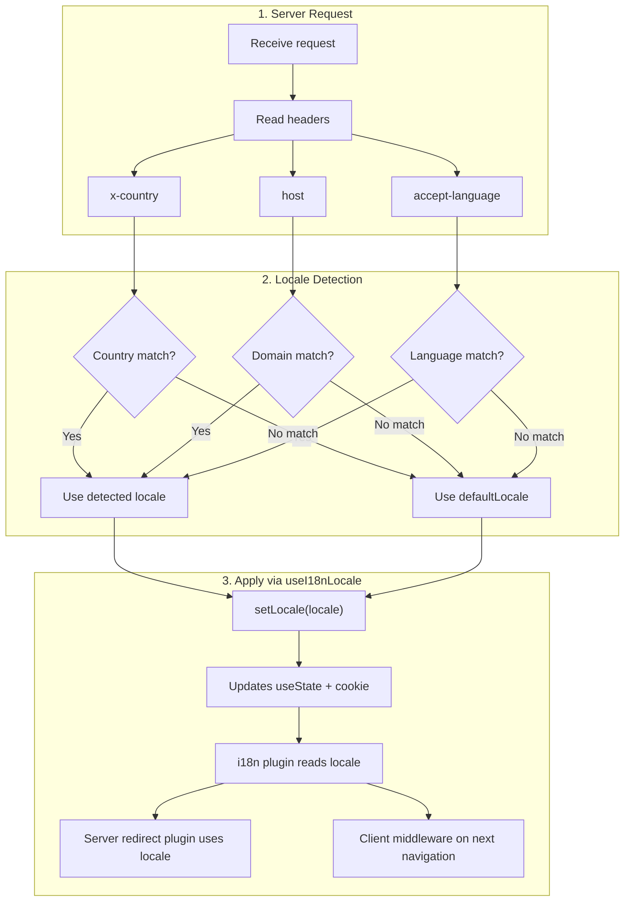

# 🔧 Eigene Spracherkennung in Nuxt I18n Micro

## 📖 Überblick

Nuxt I18n Micro v3 bietet mit dem Composable `useI18nLocale()` einen zentralen Zugang für das Locale-Management. Es ersetzt die manuellen `useState`- und `useCookie`-Muster aus v2. Über `useI18nLocale().setLocale()` in einem Server-Plugin setzt du beliebige eigene Erkennungslogik um und bleibst voll kompatibel mit dem Redirect- und Cookie-System des Moduls.

## 🏗️ Architektur

```mermaid
flowchart TB
    subgraph Plugins["Plugin Execution Order"]
        A["Your plugin<br/>order: -10"] -->|setLocale()| B["01.plugin.ts<br/>order: -5"]
        B --> C["06.redirect.ts server<br/>order: 10"]
    end

    subgraph Client["Client SPA Navigation"]
        D["i18n-redirect.global.ts<br/>route middleware"]
    end

    subgraph State["Locale State"]
        E["useState('i18n-locale')"]
        F["localeCookie"]
    end

    A -->|"setLocale() updates both"| E
    A -->|"setLocale() updates both"| F
    B -->|reads| E
    C -->|reads| E
    C -->|reads| F
    D -->|reads target route +| E
```

**Kernprinzip**: Rufe `useI18nLocale().setLocale()` in einem Server-Plugin mit `order: -10` auf. Damit werden `useState('i18n-locale')` und das Locale-Cookie atomar aktualisiert. Das i18n-Plugin (`order: -5`) und das Server-Redirect-Plugin (`order: 10`) sehen die richtige Locale schon beim ersten SSR-Request. Clientseitige Auto-Redirects laufen in der globalen Route-Middleware bei folgenden Navigationen.

## 🛠️ Eingebaute Auto-Erkennung deaktivieren

Wenn du die Locale-Erkennung vollständig selbst steuern willst, deaktiviere den eingebauten Mechanismus:

```ts
export default defineNuxtConfig({
  i18n: {
    autoDetectLanguage: false,
  },
})
```

## ✨ Beispiel: Server-Erkennung mit `useI18nLocale`

Das ist der **empfohlene Ansatz** für alle Strategien.

### Schritt 1: `nuxt.config.ts` konfigurieren

```ts
export default defineNuxtConfig({
  modules: ['nuxt-i18n-micro'],
  i18n: {
    strategy: 'no_prefix', // Works with ANY strategy
    defaultLocale: 'en',
    localeCookie: 'user-locale',
    autoDetectLanguage: false,
    locales: [
      { code: 'en', iso: 'en-US' },
      { code: 'de', iso: 'de-DE' },
      { code: 'ja', iso: 'ja-JP' },
    ],
  },
})
```

### Schritt 2: `plugins/i18n-loader.server.ts` anlegen

```ts
import { defineNuxtPlugin, useRequestHeaders } from '#imports'

export default defineNuxtPlugin({
  name: 'i18n-custom-loader',
  enforce: 'pre',
  order: -10, // Execute BEFORE the i18n plugin (which has order -5)

  setup() {
    const { setLocale } = useI18nLocale()
    const headers = useRequestHeaders(['host', 'x-country', 'accept-language'])
    let detectedLocale = 'en'

    // --- YOUR DETECTION LOGIC ---

    // Example 1: By domain
    const host = headers['host']
    if (host?.includes('example.de')) {
      detectedLocale = 'de'
    }
    // Example 2: By custom header
    else if (headers['x-country'] === 'JP') {
      detectedLocale = 'ja'
    }
    // Example 3: By Accept-Language header
    else if (headers['accept-language']?.includes('de')) {
      detectedLocale = 'de'
    }

    // --- APPLY THE LOCALE ---
    setLocale(detectedLocale)
  },
})
```

### So funktioniert es



1. **Plugin läuft zuerst** (`order: -10`): erkennt die Locale aus Headern, Domain oder anderen Quellen.
2. **`setLocale()` aktualisiert beides**: `useState('i18n-locale')` und das Cookie. So sehen alle folgenden Plugins den Wert sofort.
3. **i18n-Plugin** (`order: -5`) liest die Locale und lädt die richtigen Übersetzungen.
4. **Server-Redirect-Plugin** (`order: 10`) nutzt die Locale für Redirect-Entscheidungen bei SSR.
5. **Client-Route-Middleware** (`i18n-redirect`) wendet Redirects bei SPA-Navigation an, wenn die URL-Locale nicht der Präferenz entspricht.

## 🌐 Strategieabhängiges Verhalten

`useI18nLocale().setLocale()` funktioniert mit **allen Strategien**. Das Redirect-Verhalten hängt von der Strategie ab:

<Tip>
| Strategie | Wirkung von `setLocale('de')` |
|----------|---------------------------|
| `no_prefix` | Rendert auf Deutsch, keine URL-Änderung |
| `prefix` | 302 → `/de/` (serverseitiger Redirect) |
| `prefix_except_default` | 302 → `/de/`, wenn `de` ≠ Default; kein Redirect, wenn `de` = Default |
| `prefix_and_default` | Kein Redirect (sowohl `/` als auch `/de/` sind gültig) |
</Tip>

**Wichtige Hinweise:**

- Cookie-basierte Locale-Erkennung ist standardmäßig deaktiviert (`localeCookie: null`).
- Setze `localeCookie: 'user-locale'`, um die Cookie-Persistenz zu aktivieren.
- Steht der Cookie-/State-Wert nicht in der `locales`-Liste, fällt das Modul auf `defaultLocale` zurück.

## 🏢 Fortgeschritten: Domainbasierte Erkennung

Für Multi-Domain-Setups, in denen jede Domain eine andere Locale ausliefert:

```ts
import { defineNuxtPlugin, useRequestHeaders } from '#imports'

export default defineNuxtPlugin({
  name: 'i18n-domain-loader',
  enforce: 'pre',
  order: -10,

  setup() {
    const { setLocale } = useI18nLocale()
    const headers = useRequestHeaders(['host'])
    const host = headers['host'] || ''

    let detectedLocale = 'en'

    if (host.endsWith('.de') || host.includes('german.')) {
      detectedLocale = 'de'
    } else if (host.endsWith('.fr') || host.includes('french.')) {
      detectedLocale = 'fr'
    } else if (host.endsWith('.jp') || host.includes('japanese.')) {
      detectedLocale = 'ja'
    }

    setLocale(detectedLocale)
  },
})
```

## 🔄 Fortgeschritten: Nutzerpräferenz respektieren

Wenn Nutzer die Sprache manuell wechseln können, respektiere ihre Wahl gegenüber der Auto-Erkennung:

```ts
import { defineNuxtPlugin, useRequestHeaders } from '#imports'

export default defineNuxtPlugin({
  name: 'i18n-smart-loader',
  enforce: 'pre',
  order: -10,

  setup() {
    const { getLocale, setLocale } = useI18nLocale()

    // If user already has a preference (from cookie), respect it
    if (getLocale()) {
      return
    }

    // Otherwise, detect locale from headers
    const headers = useRequestHeaders(['accept-language'])
    let detectedLocale = 'en'

    const acceptLanguage = headers['accept-language'] || ''
    if (acceptLanguage.includes('de')) {
      detectedLocale = 'de'
    } else if (acceptLanguage.includes('ja')) {
      detectedLocale = 'ja'
    }

    setLocale(detectedLocale)
  },
})
```

## ⚙️ Server- oder Client-Only-Plugins

Nutze die [Namenskonventionen von Nuxt](https://nuxt.com/docs/getting-started/directory-structure#plugins), um zu steuern, wo dein Plugin läuft:

- **Nur Server**: `i18n-loader.server.ts`: läuft nur bei SSR (empfohlen für Header-basierte Erkennung).
- **Nur Client**: `i18n-loader.client.ts`: läuft nur im Browser (für `localStorage`- oder DOM-basierte Erkennung).


## ✅ Zusammenfassung

| Funktion                                | Beschreibung                                                       |
| --------------------------------------- | ------------------------------------------------------------------ |
| `useI18nLocale().setLocale()`           | Aktualisiert `useState` und Cookie atomar. Funktioniert mit allen Strategien. |
| `useI18nLocale().getLocale()`           | Liefert die aktuelle Locale aus State oder Cookie.                  |
| `useI18nLocale().getPreferredLocale()`  | Liefert die bevorzugte Locale (gegen die `locales`-Liste validiert). |
| Plugin `order: -10`                     | Stellt sicher, dass dein Plugin vor der i18n-Initialisierung läuft. |
| `enforce: 'pre'`                        | Läuft in der Plugin-Gruppe „pre“.                                  |

**Vermeide:**

- `useCookie('user-locale')` direkt zu verwenden. `useI18nLocale()` verwaltet Cookies intern.
- `useState('i18n-locale')` direkt zu verwenden. Nimm stattdessen `useI18nLocale().setLocale()`.
- `order` >= -5 zu setzen. Dein Plugin muss vor dem i18n-Plugin laufen.
