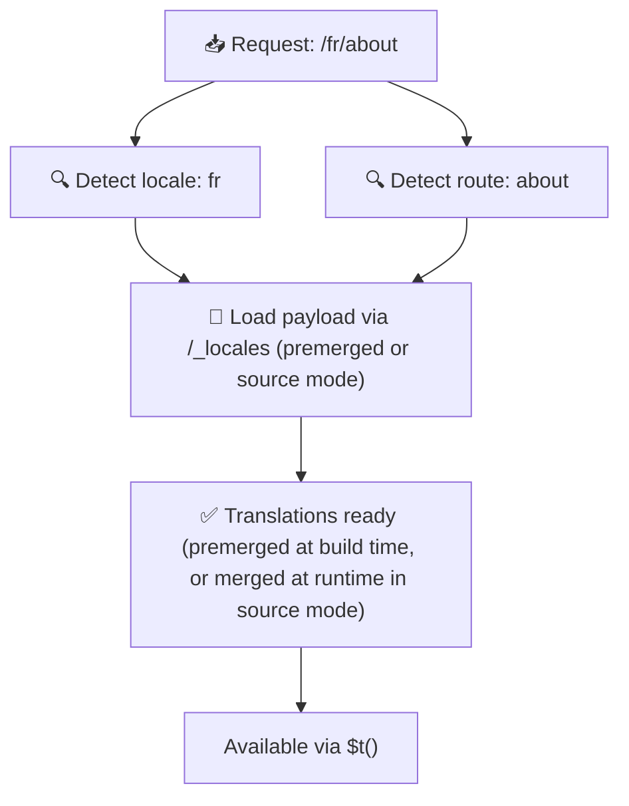

# 📂 Ordnerstruktur-Guide

## 📖 Einführung

Deine Übersetzungsdateien sinnvoll zu organisieren ist entscheidend für ein skalierbares und effizientes Internationalisierungssystem (i18n). `Nuxt I18n Micro` vereinfacht das mit einem klaren Ansatz für Root- und seitenspezifische Übersetzungen. Dieser Guide führt dich durch die empfohlene Ordnerstruktur und erklärt, wie `Nuxt I18n Micro` diese Übersetzungen behandelt.

## 🗂️ Empfohlene Ordnerstruktur

`Nuxt I18n Micro` organisiert Übersetzungen in Root-Dateien und seitenspezifische Dateien im Verzeichnis `pages`. Mit `translationPayloads.mode: 'premerged'` (Standard) werden Root-Übersetzungen zur Buildzeit automatisch in jede Seitendatei eingemischt. Jede Seite verfügt damit über einen vollständigen Übersetzungssatz ohne Runtime-Merge-Overhead.

Mit `mode: 'source'` bleiben Quelldateien getrennt in den Nitro-Assets und werden zur Laufzeit über die Route `/_locales` gemischt. Siehe [Serverless-Payload-Ausgabe](/guides/performance#serverless-payload-output).

### 🔧 Basisstruktur

Ein einfaches Beispiel für die Ordnerstruktur, der du folgen solltest:

```text
locales/
├── pages/
│   ├── index/
│   │   ├── en.json
│   │   ├── fr.json
│   │   └── ar.json
│   ├── about/
│   │   ├── en.json
│   │   ├── fr.json
│   │   └── ar.json
├── en.json
├── fr.json
└── ar.json

```

### 📄 Erklärung der Struktur

#### 1. 🌍 Root-Übersetzungsdateien

- **Pfad:** `/locales/\{locale\}.json` (zum Beispiel `/locales/en.json`)
- **Zweck:** Diese Dateien enthalten Übersetzungen, die in der gesamten Anwendung geteilt werden (Navigation, Header, Footer usw.). Mit `mode: 'premerged'` (Standard) werden sie zur Buildzeit automatisch in jede seitenspezifische Datei eingemischt. Der Server liefert dann pro Seite eine einzige, vorgemergte Datei aus.

  **Beispielinhalt (`/locales/en.json`):**

  ```json
  {
    "menu": {
      "home": "Home",
      "about": "About Us",
      "contact": "Contact"
    },
    "footer": {
      "copyright": "© 2024 Your Company"
    }
  }
  ```

#### 2. 📄 Seitenspezifische Übersetzungsdateien

- **Pfad:** `/locales/pages/\{routeName\}/\{locale\}.json` (zum Beispiel `/locales/pages/index/en.json`)
- **Zweck:** Diese Dateien enthalten Übersetzungen speziell für einzelne Seiten. Mit `mode: 'premerged'` (Standard) werden die Root-Übersetzungen zur Buildzeit als Basis eingemischt, sodass jede Seitendatei in sich abgeschlossen ist.

  **Beispielinhalt (`/locales/pages/index/en.json`):**

  ```json
  {
    "title": "Welcome to Our Website",
    "description": "We offer a wide range of products and services to meet your needs."
  }
  ```

  **Beispielinhalt (`/locales/pages/about/en.json`):**

  ```json
  {
    "title": "About Us",
    "description": "Learn more about our mission, vision, and values."
  }
  ```

### 📂 Dynamische Routen und verschachtelte Pfade

`Nuxt I18n Micro` überführt dynamische Segmente und verschachtelte Pfade in Routen automatisch in eine flache Ordnerstruktur, mit einer festen Umbenennungskonvention. So werden alle Übersetzungen konsistent und leicht auffindbar gespeichert.

#### Ordnerstruktur für dynamische Routen

Bei dynamischen Routen wie `/products/[id]` wandelt das Modul das dynamische Segment `[id]` innerhalb der Dateistruktur in eine statische Form um.

**Beispiel für dynamische Routen:**

Für eine Route wie `/products/[id]` liegen die Übersetzungsdateien im Ordner `products-id`:

```text
locales/pages/
├── products-id/
│   ├── en.json
│   ├── fr.json
│   └── ar.json

```

**Beispiel für verschachtelte dynamische Routen:**

Für eine verschachtelte Route wie `/products/key/[id]` liegen die Übersetzungsdateien im Ordner `products-key-id`:

```text
locales/pages/
├── products-key-id/
│   ├── en.json
│   ├── fr.json
│   └── ar.json

```

**Beispiel für mehrfach verschachtelte Routen:**

Für eine komplexere verschachtelte Route wie `/products/category/[id]/details` liegen die Übersetzungsdateien im Ordner `products-category-id-details`:

```text
locales/pages/
├── products-category-id-details/
│   ├── en.json
│   ├── fr.json
│   └── ar.json

```

### 🛠 Verzeichnisstruktur anpassen

Wenn du Übersetzungen in einem anderen Verzeichnis speichern willst, kannst du das Verzeichnis für Übersetzungsdateien in `Nuxt I18n Micro` anpassen. Konfiguriere das in deiner `nuxt.config.ts`.

**Beispiel: Übersetzungsverzeichnis anpassen**

```typescript
export default defineNuxtConfig({
  i18n: {
    translationDir: 'i18n', // Custom directory path
  },
})
```

Damit sucht `Nuxt I18n Micro` Übersetzungsdateien im Verzeichnis `/i18n` statt im Standard `/locales`.

## ⚙️ Wie Übersetzungen geladen werden

### 🌍 Dynamische Locale-Routen

`Nuxt I18n Micro` nutzt dynamische Locale-Routen, um Übersetzungen effizient zu laden. Beim Seitenaufruf ermittelt das Modul die passende Locale und lädt die entsprechenden Übersetzungsdateien anhand von aktueller Route und Locale.



Zum Beispiel:

- Beim Besuch von `/en/index` werden Übersetzungen aus `/locales/pages/index/en.json` geladen.
- Beim Besuch von `/fr/about` werden Übersetzungen aus `/locales/pages/about/fr.json` geladen.

So werden nur die nötigen Übersetzungen geladen, was Serverlast und Client-Performance optimiert.

### 💾 Caching und Pre-Rendering

Für noch bessere Performance unterstützt `Nuxt I18n Micro` Caching und Pre-Rendering von Übersetzungsdateien:

- **Caching**: Einmal geladene Übersetzungsdateien werden für nachfolgende Anfragen gecached, sodass dieselben Daten nicht erneut geladen werden müssen.
- **Pre-Rendering**: Beim Build kannst du Übersetzungsdateien für alle konfigurierten Locales und Routen vorrendern. Sie werden dann ohne Runtime-Verzögerung direkt vom Server ausgeliefert.

## 📝 Best Practices

### 📂 Seitenspezifische Dateien gezielt einsetzen

Nutze seitenspezifische Dateien, um Übersetzungen übersichtlich zu halten. So bleiben die Übersetzungen jeder Seite schlank und laden schnell. Das ist besonders wichtig für Seiten mit komplexen oder umfangreichen Inhalten.

### 🔑 Konsistente Übersetzungsschlüssel

Verwende in allen Dateien konsistente Namensschemata für Übersetzungsschlüssel. Das schafft Klarheit und beugt Problemen beim Verwalten der Übersetzungen vor, gerade wenn die Anwendung wächst.

### 🗂️ Übersetzungen nach Kontext organisieren

Gruppiere zusammengehörige Übersetzungen in deinen Dateien. Zum Beispiel alle Button-Labels unter einem Schlüssel `buttons` und alle Formular-Texte unter `forms`. Das verbessert die Lesbarkeit und erleichtert die Verwaltung über verschiedene Locales hinweg.

### ⚠️ Grenzen der Verschachtelungstiefe (2 Ebenen empfohlen)

Während der clientseitigen Navigation kombiniert `Nuxt I18n Micro` per optimiertem 2-stufigem Deep-Merge die Übersetzungen der verlassenen und der neuen Seite. So bleiben überlappende verschachtelte Schlüssel (zum Beispiel Schlüssel unter `common.*` auf beiden Seiten) während der Übergangsanimation erhalten.

**Das funktioniert für die Standardstruktur `Bereich → Schlüssel → Wert` (2 Ebenen) korrekt:**

```json
// Page A translations
{ "common": { "fromA": "Text A" } }

// Page B translations
{ "common": { "fromB": "Text B" } }

// During transition, both are available:
// { "common": { "fromA": "Text A", "fromB": "Text B" } }
```

**Bei 3+ Verschachtelungsebenen können tiefere Schlüssel während des Übergangs jedoch überschrieben werden:**

```json
// Page A translations
{ "auth": { "form": { "login": "Login" } } }

// Page B translations
{ "auth": { "form": { "register": "Register" } } }

// During transition: "login" key is lost
// { "auth": { "form": { "register": "Register" } } }
```


### 🧹 Unbenutzte Übersetzungen regelmäßig entfernen

Mit der Zeit sammelt deine Anwendung womöglich unbenutzte Übersetzungsschlüssel an, besonders wenn Features entfernt oder umstrukturiert werden. Prüfe und bereinige deine Übersetzungsdateien regelmäßig, um sie schlank und wartbar zu halten.
