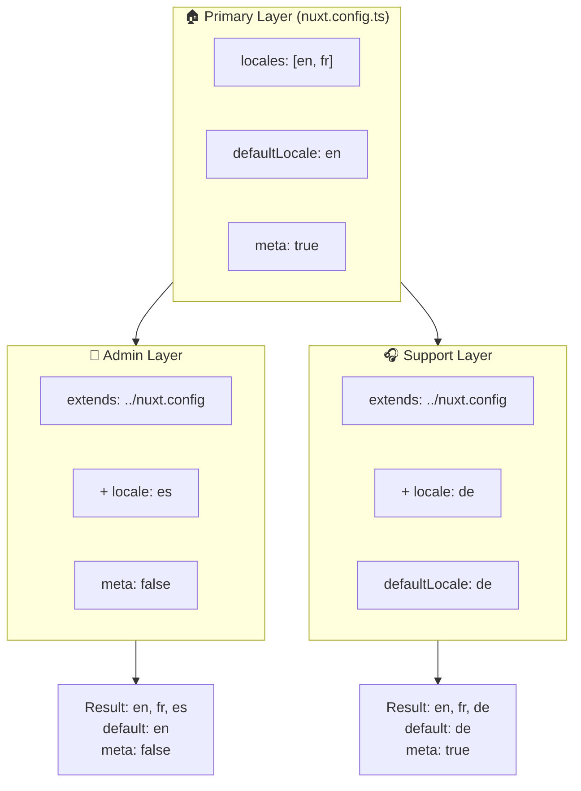

# 🗂️ Layer in `Nuxt I18n Micro`

## 📖 Einführung in Layer

Layer in `Nuxt I18n Micro` erlauben dir, Lokalisierungseinstellungen flexibel über verschiedene Teile deiner Anwendung zu verwalten und anzupassen. Über unterschiedliche Layer stimmst du die Konfiguration auf verschiedene Kontexte ab. Du überschreibst zum Beispiel Einstellungen für bestimmte Bereiche deiner Seite oder erstellst wiederverwendbare Basiskonfigurationen, die andere Teile der Anwendung erweitern.

### Ablauf der Layer-Vererbung



## 🛠️ Primärer Konfigurations-Layer

Im **primären Konfigurations-Layer** setzt du die Standard-Lokalisierungseinstellungen für deine gesamte Anwendung. Dieser Layer ist zentral. Er definiert die globale Konfiguration, einschließlich unterstützter Locales, Standardsprache und weiterer kritischer i18n-Einstellungen.

### 📄 Beispiel: Primären Layer definieren

Ein Beispiel, wie du den primären Layer in deiner `nuxt.config.ts` definierst:

```typescript
export default defineNuxtConfig({
  i18n: {
    locales: [
      { code: 'en', iso: 'en-EN', dir: 'ltr' },
      { code: 'fr', iso: 'fr-FR', dir: 'ltr' },
      { code: 'ar', iso: 'ar-SA', dir: 'rtl' },
    ],
    defaultLocale: 'en', // The default locale for the entire app
    translationDir: 'locales', // Directory where translations are stored
    meta: true, // Automatically generate SEO-related meta tags like `alternate`
    autoDetectLanguage: true, // Automatically detect and use the user's preferred language
  },
})
```

## 🌱 Child-Layer

Child-Layer erweitern oder überschreiben die primäre Konfiguration für bestimmte Teile deiner Anwendung. Du fügst zum Beispiel zusätzliche Locales hinzu oder passt die Standard-Locale für einen bestimmten Bereich an. Besonders nützlich sind Child-Layer in modularen Anwendungen, in denen einzelne Teile unterschiedliche Lokalisierungsanforderungen haben.

### 📄 Beispiel: Primären Layer in einem Child-Layer erweitern

Nehmen wir an, ein Bereich deiner Seite braucht zusätzliche Locales oder du willst eine bestimmte Locale in einem bestimmten Kontext deaktivieren. So erreichst du das durch Erweitern des primären Layers:

```typescript
// basic/nuxt.config.ts (Primary Layer)
export default defineNuxtConfig({
  i18n: {
    locales: [
      { code: 'en', iso: 'en-EN', dir: 'ltr' },
      { code: 'fr', iso: 'fr-FR', dir: 'ltr' },
    ],
    defaultLocale: 'en',
    meta: true,
    translationDir: 'locales',
  },
})
```

```typescript
// extended/nuxt.config.ts (Child Layer)
export default defineNuxtConfig({
  extends: '../basic', // Inherit the base configuration from the 'basic' layer
  i18n: {
    locales: [
      { code: 'en', iso: 'en-EN', dir: 'ltr' }, // Inherited from the base layer
      { code: 'fr', iso: 'fr-FR', dir: 'ltr' }, // Inherited from the base layer
      { code: 'de', iso: 'de-DE', dir: 'ltr' }, // Added in the child layer
    ],
    defaultLocale: 'fr', // Override the default locale to French for this section
    autoDetectLanguage: false, // Disable automatic language detection in this section
  },
})
```

### 🌐 Layer in einer modularen Anwendung

In einer größeren, modularen Nuxt-Anwendung hast du möglicherweise mehrere Bereiche mit je eigenen i18n-Einstellungen. Mit Layern hältst du die Konfiguration sauber und skalierbar.

### 📄 Beispiel: Layer-Konfiguration in einer modularen Anwendung

Stell dir eine E-Commerce-Seite mit klar abgegrenzten Bereichen wie Hauptseite, Admin-Panel und Kundensupport-Portal vor. Jeder Bereich kann eigene Locales oder andere i18n-Einstellungen benötigen.

#### **Primary-Layer (globale Konfiguration):**

```typescript
// nuxt.config.ts
export default defineNuxtConfig({
  i18n: {
    locales: [
      { code: 'en', iso: 'en-EN', dir: 'ltr' },
      { code: 'fr', iso: 'fr-FR', dir: 'ltr' },
    ],
    defaultLocale: 'en',
    meta: true,
    translationDir: 'locales',
    autoDetectLanguage: true,
  },
})
```

#### **Child-Layer für das Admin-Panel:**

```typescript
// admin/nuxt.config.ts
export default defineNuxtConfig({
  extends: '../nuxt.config', // Inherit the global settings
  i18n: {
    locales: [
      { code: 'en', iso: 'en-EN', dir: 'ltr' }, // Inherited
      { code: 'fr', iso: 'fr-FR', dir: 'ltr' }, // Inherited
      { code: 'es', iso: 'es-ES', dir: 'ltr' }, // Specific to the admin panel
    ],
    defaultLocale: 'en',
    meta: false, // Disable automatic meta generation in the admin panel
  },
})
```

#### **Child-Layer für das Kundensupport-Portal:**

```typescript
// support/nuxt.config.ts
export default defineNuxtConfig({
  extends: '../nuxt.config', // Inherit the global settings
  i18n: {
    locales: [
      { code: 'en', iso: 'en-EN', dir: 'ltr' }, // Inherited
      { code: 'fr', iso: 'fr-FR', dir: 'ltr' }, // Inherited
      { code: 'de', iso: 'de-DE', dir: 'ltr' }, // Specific to the support portal
    ],
    defaultLocale: 'de', // Default to German in the support portal
    autoDetectLanguage: false, // Disable automatic language detection
  },
})
```

In diesem modularen Beispiel:

- Jeder Bereich (Admin, Support) hat eigene i18n-Einstellungen, erbt aber die Basiskonfiguration.
- Das Admin-Panel ergänzt Spanisch (`es`) als Locale und deaktiviert die Meta-Tag-Erzeugung.
- Das Support-Portal ergänzt Deutsch (`de`) als Locale und nutzt Deutsch als Standard für die Oberfläche.

## 📝 Best Practices für Layer

- **🔧 Primary-Layer einfach halten:** Der Primary-Layer sollte die häufigsten Einstellungen enthalten, die global für die gesamte Anwendung gelten. Halte ihn schlicht, um Konsistenz zu wahren.
- **⚙️ Child-Layer für spezifische Anpassungen:** Überschreibe oder erweitere Einstellungen in Child-Layern nur, wenn nötig. So vermeidest du unnötige Komplexität in deiner Konfiguration.
- **📚 Layer dokumentieren:** Halte Zweck und Details jedes Layers in deinem Projekt klar fest. Das erhält die Übersicht und erleichtert anderen (oder dir selbst später) das Verständnis der Konfiguration.
