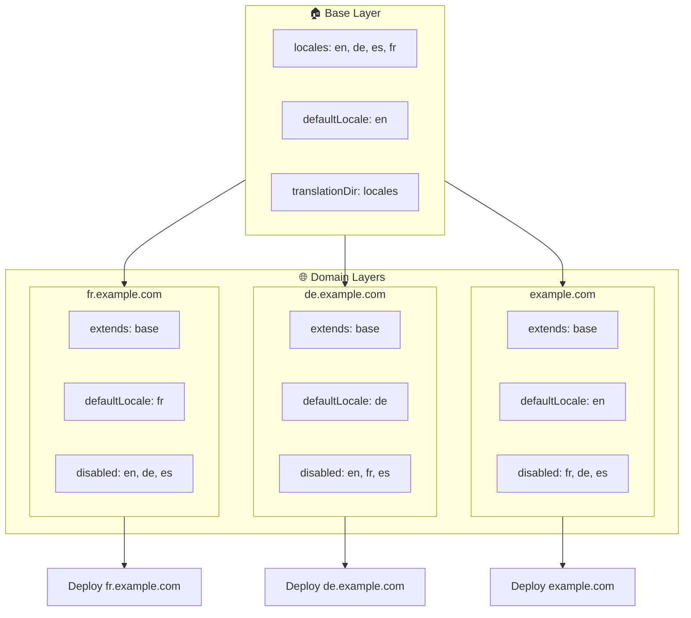

# 🌍 Multi-Domain-Locales mit `Nuxt I18n Micro` und Layern einrichten

## 📝 Einführung

Mit Layern in `Nuxt I18n Micro` erstellst du ein flexibles und wartbares Multi-Domain-Lokalisierungs-Setup. Dieser Ansatz vereinfacht die Domain-Verwaltung, weil komplexe Funktionalitäten entfallen. Er verteilt die Last effizient und reduziert die Projektkomplexität. Wenn du für unterschiedliche Locales separate Projekte betreibst, skaliert deine Anwendung leicht und passt sich unterschiedlichen Locale-Anforderungen über mehrere Domains an. Das ist eine robuste und skalierbare Lösung für globale Anwendungen.

## 🎯 Ziel

Ein Setup schaffen, bei dem verschiedene Domains gezielt bestimmte Locales ausliefern, indem Konfigurationen in Child-Layern angepasst werden. Diese Methode nutzt Nuxts Layer-System: Du pflegst eine Basiskonfiguration und erweiterst oder änderst sie pro Domain.

### Multi-Domain-Architektur



## 🛠 Schritte zur Umsetzung von Multi-Domain-Locales

### 1. **Basis-Layer erstellen**

Beginne mit einem Basis-Konfigurations-Layer, der alle gemeinsamen Locale-Einstellungen deiner Anwendung enthält. Diese Konfiguration bildet das Fundament für alle domainspezifischen Konfigurationen.

#### **Konfiguration des Basis-Layers**

Erstelle die Basis-Konfigurationsdatei `base/nuxt.config.ts`:

```typescript
// base/nuxt.config.ts

export default defineNuxtConfig({
  i18n: {
    locales: [
      { code: 'en', iso: 'en-US', dir: 'ltr' },
      { code: 'de', iso: 'de-DE', dir: 'ltr' },
      { code: 'es', iso: 'es-ES', dir: 'ltr' },
    ],
    defaultLocale: 'en',
    translationDir: 'locales',
    meta: true,
    autoDetectLanguage: true,
  },
})
```

### 2. **Domainspezifische Child-Layer erstellen**

Erstelle für jede Domain einen Child-Layer, der die Basiskonfiguration an die Anforderungen dieser Domain anpasst. Locales, die für eine bestimmte Domain nicht gebraucht werden, deaktivierst du dort.

#### **Beispiel: Konfiguration für die französische Domain**

Erstelle eine Child-Layer-Konfiguration für die französische Domain in `fr/nuxt.config.ts`:

```typescript
// fr/nuxt.config.ts

export default defineNuxtConfig({
  extends: '../base', // Inherit from the base configuration

  i18n: {
    locales: [
      { code: 'en', iso: 'en-US', dir: 'ltr', disabled: true }, // Disable English
      { code: 'fr', iso: 'fr-FR', dir: 'ltr' }, // Add and enable the French locale
      { code: 'de', iso: 'de-DE', dir: 'ltr', disabled: true }, // Disable German
      { code: 'es', iso: 'es-ES', dir: 'ltr', disabled: true }, // Disable Spanish
    ],
    defaultLocale: 'fr', // Set French as the default locale
    autoDetectLanguage: false, // Disable automatic language detection
  },
})
```

#### **Beispiel: Konfiguration für die deutsche Domain**

Analog dazu eine Child-Layer-Konfiguration für die deutsche Domain in `de/nuxt.config.ts`:

```typescript
// de/nuxt.config.ts

export default defineNuxtConfig({
  extends: '../base', // Inherit from the base configuration

  i18n: {
    locales: [
      { code: 'en', iso: 'en-US', dir: 'ltr', disabled: true }, // Disable English
      { code: 'fr', iso: 'fr-FR', dir: 'ltr', disabled: true }, // Disable French
      { code: 'de', iso: 'de-DE', dir: 'ltr' }, // Use the German locale
      { code: 'es', iso: 'es-ES', dir: 'ltr', disabled: true }, // Disable Spanish
    ],
    defaultLocale: 'de', // Set German as the default locale
    autoDetectLanguage: false, // Disable automatic language detection
  },
})
```

### 3. **Anwendung für jede Domain deployen**

Deploye die Anwendung mit der passenden Konfiguration pro Domain. Zum Beispiel:

- Die `fr`-Layer-Konfiguration auf `fr.example.com` deployen.
- Die `de`-Layer-Konfiguration auf `de.example.com` deployen.

### 4. **Mehrere Projekte für verschiedene Locales aufsetzen**

Für jede Locale und Domain betreibst du eine eigene Instanz der Anwendung. So liefert jede Domain die korrekte Locale-Konfiguration, die Last wird optimal verteilt und die Projektstruktur bleibt einfach. Mit mehreren, auf die jeweilige Locale zugeschnittenen Projekten trennst du die Konfigurationen sauber und reduzierst die Gesamtkomplexität.

### 5. **Routing anhand der Domain konfigurieren**

Stelle sicher, dass dein Routing Nutzer je nach aufgerufener Domain zum richtigen Projekt leitet. So liefert jede Domain die passende Locale aus. Das verbessert das Nutzungserlebnis und wahrt die Konsistenz über Regionen hinweg.

### 6. **Deployen und verifizieren**

Nach dem Konfigurieren der Layer und dem Deployen auf die jeweiligen Domains prüfst du, ob jede Domain die richtige Locale ausliefert. Teste die Anwendung gründlich, um zu bestätigen, dass abhängig von der Domain die richtige Locale geladen wird.

## 📝 Best Practices

- **Basiskonfiguration allgemein halten**: Die Basiskonfiguration sollte allgemeine Einstellungen abdecken, die für alle Domains gelten.
- **Domainspezifische Logik isolieren**: Domainspezifische Konfigurationen bleiben in ihren jeweiligen Layern, um Klarheit und Trennung der Belange zu wahren.

## 🎉 Fazit

Mit Layern in `Nuxt I18n Micro` schaffst du ein flexibles, wartbares Multi-Domain-Lokalisierungs-Setup. Der Ansatz spart komplexe Domain-Verwaltungsfunktionen, verteilt die Last effizient und reduziert die Projektkomplexität. Wenn du für unterschiedliche Locales separate Projekte betreibst, skaliert deine Anwendung leicht und passt sich unterschiedlichen Locale-Anforderungen an verschiedenen Domains an. Das ergibt eine robuste, skalierbare Lösung für globale Anwendungen.
