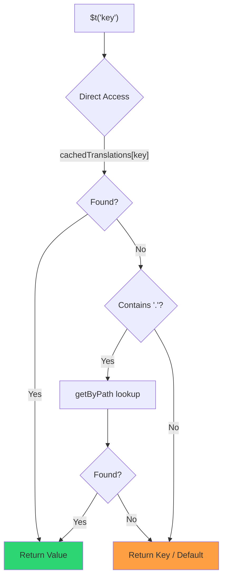

# 🚀 Performance-Guide

## 📖 Einführung

`Nuxt I18n Micro` ist auf Performance ausgelegt und bringt gegenüber klassischen i18n-Modulen wie `nuxt-i18n` deutliche Verbesserungen. Dieser Guide gibt einen tieferen Einblick in die Performance-Vorteile von `Nuxt I18n Micro` und den Vergleich mit anderen Lösungen.

## 🤔 Warum Fokus auf Performance?

In großen Projekten und in Umgebungen mit viel Traffic können Performance-Engpässe zu langen Build-Zeiten, hohem Speicherverbrauch und schlechten Serverantwortzeiten führen. Bei komplexen i18n-Setups mit großen Übersetzungsdateien werden diese Probleme deutlicher. `Nuxt I18n Micro` löst diese Herausforderungen konsequent, indem es auf Geschwindigkeit, Speichereffizienz und minimale Auswirkungen auf die Bundle-Größe optimiert ist.

## 📊 Performance-Vergleich

Wir haben eine Testreihe auf identischen Fixtures per `pnpm test:performance` (`pnpm -C scripts cli performance`) gegen **`@nuxtjs/i18n@10.6.0`** durchgeführt. Vollständige Methodik und Diagramme: [Performance-Testergebnisse](/guides/performance-results).

Standard-CLI-Profil: **4 Locales** × **2 Seiten** (`index`, `page`) × ~10k Index-Blattschlüssel. Erhöhe `--locales` bzw. `--keys` für eine höhere Regressions-Radar-Last. Der Report trennt **Code**, **Übersetzungen** (inklusive `@nuxtjs/i18n` `chunks/raw/*`) und **Gesamt**-Deploybare Ausgabe.

```bash
pnpm test:performance
pnpm -C scripts cli performance --only micro --skip-stress
pnpm -C scripts cli performance --locales 12 --keys 100000 --runs 3
```

### ⏱️ Build-Zeit und Ressourcenverbrauch

<Accordion title="**@nuxtjs/i18n v10.6**">
- **Code Bundle**: 2,16 MB
- **Translations**: 7,21 MB (Message-Chunks + Locale-Payloads)
- **Total deployable**: 9,37 MB
- **Max Memory Usage**: 1.821 MB
- **Elapsed Time**: 8,34s (Mittelwert aus 3)
</Accordion>

<Tip>
- **Code Bundle**: 1,74 MB: **~19% weniger Code als `@nuxtjs/i18n` v10.6**
- **Translations**: 6,8 MB (lazy geladenes JSON)
- **Total deployable**: 8,54 MB
- **Max Memory Usage**: 1.065 MB: **~41% weniger Speicher als `@nuxtjs/i18n` v10.6**
- **Elapsed Time**: 5,34s: **~36% schneller als `@nuxtjs/i18n` v10.6** (≈ Plain-Nuxt-Basislinie)
</Tip>

> Ältere Docs, die für `@nuxtjs/i18n` „code ≈ 15 MB / translations 0 B“ zeigten, haben `chunks/raw`-Message-Dateien als App-Code gewertet. Der aktuelle Klassifikator trennt sie. Der Abstand beim **Code** ist kleiner. Micro liegt bei Build-Zeit, Peak-RSS und Load-Tests weiterhin vorn.

Den [vollständigen Benchmark-Bericht](/guides/performance-results) findest du mit Charts, Autocannon-Ergebnissen und Fixture-Details.

### 🌐 Server-Performance unter Last

Artillery (6s @6 + 60s @60) und Autocannon (10c / 10s), Mittelwert aus 3 aufeinanderfolgenden Läufen je Fixture.

<Accordion title="**@nuxtjs/i18n v10.6**">
- **Requests per Second (Artillery)**: 143 [#/sec]
- **Average Response Time**: 956 ms
- **Autocannon RPS / avg latency**: 72 / 139 ms
</Accordion>

<Tip>
- **Requests per Second (Artillery)**: 275 [#/sec]: **~93% mehr als `@nuxtjs/i18n` v10.6**
- **Average Response Time**: 483 ms: **~49% schneller als `@nuxtjs/i18n` v10.6**
- **Autocannon RPS / avg latency**: 162 / 62 ms
</Tip>

### 📈 Visueller Vergleich

<Note>
Interaktives Chart in der Mintlify-Doku ausgelassen. Sieh dir die Benchmark-Tabellen auf dieser Seite oder die [VitePress-Doku](https://s00d.github.io/nuxt-i18n-micro/guide/performance-results) für das Chart an: `chart`.
</Note>

<Note>
Interaktives Chart in der Mintlify-Doku ausgelassen. Sieh dir die Benchmark-Tabellen auf dieser Seite oder die [VitePress-Doku](https://s00d.github.io/nuxt-i18n-micro/guide/performance-results) für das Chart an: `chart`.
</Note>

| Metrik          | @nuxtjs/i18n v10.6 | i18n-micro | Verbesserung        |
| --------------- | ------------------ | ---------- | ------------------- |
| Build Time      | 8.34s              | 5.34s      | **~36% schneller**  |
| Memory (build)  | 1,821 MB           | 1,065 MB   | **~41% weniger**    |
| Code Bundle     | 2.16 MB            | 1.74 MB    | **~19% kleiner**    |
| Response Time   | 956 ms             | 483 ms     | **~49% schneller**  |
| RPS (Artillery) | 143                | 275        | **~93% mehr**       |

### 🔍 Interpretation der Ergebnisse

Gegen das aktuelle `@nuxtjs/i18n` **v10.6** (Standard-CLI-Profil, Mittelwert aus 3):

- 🗜️ **Kleinerer Code-Graph**: ~1,74 MB vs. ~2,16 MB, sobald Message-Chunks nicht mehr fälschlich als „Code“ eingeordnet werden.
- 🧠 **Geringerer Build-RSS**: ~1,1 GB Peak vs. ~1,8 GB.
- 🕒 **Schnellere Builds**: ~5,3s vs. ~8,3s (Micro erreicht in diesem Profil die Plain-Nuxt-Basislinie).
- ⚡ **Deutlich besser unter Last**: ~275 vs. ~143 Artillery-RPS, ~162 vs. ~72 Autocannon-RPS, geringere Durchschnittslatenz.

Absolute Zahlen unterscheiden sich von älteren veröffentlichten Tabellen (kleinere Wörterbücher, ältere Nuxt-Version und die unfaire „0 B translations“-Aufteilung für `@nuxtjs/i18n`). Die Richtung bleibt gleich: Micro liegt bei Build-Kosten und Durchsatz vorn.

## ⚙️ Zentrale Optimierungen

### 🛠️ Minimalistisches Design

`Nuxt I18n Micro` folgt einer minimalistischen Architektur mit einem kleinen Kern und dedizierten Strategie-Paketen. Das reduziert Overhead und vereinfacht die interne Logik, was die Performance verbessert.

### 🚦 Effizientes Routing

In v3 sind Routen-Erzeugung und Runtime-Pfadlogik für optimales Tree-Shaking in eigene Pakete aufgeteilt:

- **`@i18n-micro/route-strategy`**: Routen-Erzeugung zur Buildzeit. Erweitert Nuxt-Seiten um lokalisierte Routen. Nur die gewählte Strategie (`no_prefix`, `prefix`, `prefix_except_default`, `prefix_and_default`) wird eingebunden.
- **`@i18n-micro/path-strategy`**: Pfadauflösung, Redirects und Link-Erzeugung zur Laufzeit. Nutzt pure Funktionen und vorab berechnete Kontext-Flags, um Allokationen auf Hot-Paths zu minimieren. Subpath-Exports (`/prefix`, `/no-prefix` usw.) sorgen dafür, dass nur die gewählte Implementierung im Bundle landet.

Das hält die Routing-Konfiguration schlank und garantiert schnelle Routenauflösung, unabhängig von der Anzahl der Locales.

### 📂 Optimiertes Laden der Übersetzungen

Das Modul unterstützt Übersetzungen ausschließlich als JSON-Dateien, mit klarer Trennung zwischen globalen und seitenspezifischen Dateien. So werden immer nur die tatsächlich benötigten Übersetzungsdaten geladen, was die Performance weiter verbessert.

### 🔒 GlobalThis-Singleton-Cache

Seit v3.0.0 nutzt das Modul ein `globalThis`-Singleton-Muster mit `Symbol.for`, um eine einzige Cache-Instanz über den gesamten Node.js-Prozess sicherzustellen. Das verhindert:

- Cache-Duplikate, wenn dasselbe Modul mehrfach gebundlet wird.
- Objekt-Neuanlage pro Request, was Garbage-Collection-Druck erzeugt.
- Speicherlecks durch verwaiste Cache-Instanzen.

```mermaid
flowchart LR
    subgraph Process["Node.js Process"]
        G["globalThis[Symbol.for('CACHE')]"]

        subgraph R1["SSR Request 1"]
            P1[Plugin Instance] --> G
        end

        subgraph R2["SSR Request 2"]
            P2[Plugin Instance] --> G
        end

        subgraph R3["SSR Request 3"]
            P3[Plugin Instance] --> G
        end
    end

    G --> Cache["Single Map Instance"]
    Cache --> D1["en:index → translations"]
    Cache --> D2["en:about → translations"
```

```typescript
// Internal implementation pattern
const CACHE_KEY = Symbol.for('__NUXT_I18N_STORAGE_CACHE__')
if (!globalThis[CACHE_KEY]) {
  globalThis[CACHE_KEY] = new Map()
}
```

### ⚡ Optimierte Übersetzungsfunktion (tFast)

Die Funktion `$t()` verwendet eine auf Geschwindigkeit optimierte Direktzugriffs-Strategie:

1. **Vorberechneter Kontext**: Locale und Routenname werden einmalig während der Navigation berechnet, nicht bei jedem `$t()`-Aufruf.
2. **Suche in einer Quelle**: Alle Übersetzungen (Root, seitenspezifisch, Fallback) werden zur Buildzeit pro Seite in eine einzige Datei vorgemergt. Keine geschichtete Suche nötig.
3. **Kumulativer Deep-Merge bei Navigation**: Bei Navigation innerhalb derselben Locale werden neue Seiten-Übersetzungen tief in das aktive Wörterbuch gemischt (Tiefe 2), sodass Schlüssel der vorherigen Seite während der Übergangsanimation sichtbar bleiben, selbst wenn Seiten überlappende verschachtelte Präfixe teilen (zum Beispiel `common.*` auf beiden Seiten).
4. **Garbage Collection über `page:transition:finish`**: Nach vollständigem Abschluss der Übergangsanimation wird das gemischte Wörterbuch durch die sauberen Übersetzungen der neuen Seite ersetzt und Speicher für alte Seitenschlüssel freigegeben.
5. **Direkter Property-Zugriff**: Nutzt `obj[key]` statt Map-Lookups auf Hot-Paths.



```typescript
// Simplified lookup logic — single active dictionary
let val = cachedTranslations[key]
if (val === undefined && key.includes('.')) {
  val = getByPath(cachedTranslations, key)
}
```

### 💉 Serverseitiges Laden (kein HTML-Embed)

Während SSR geladene Übersetzungen bleiben im **Server-Speicher** für `$t` beim Rendern. Sie werden **nicht** in `nuxtApp.payload` oder das HTML kopiert (dieselbe Idee wie `@nuxtjs/i18n` mit `experimental.preload: false`).

Auf dem Client wartet `01.plugin.ts` per `await` auf `switchContext`, das `/\{apiBaseUrl\}/:page/:locale/data.json` lädt, bevor die App fortfährt. Ein Request, kein 8-MB-Inline-Blob.

`NuxtI18n` hält weiterhin das aktive gemischte Wörterbuch (`cachedTranslations`) für `$t()`/`$has()`. Navigationen innerhalb derselben Locale mergen Seitenchunks tief ein, bis `page:transition:finish` alte Schlüssel bereinigt.

#### Aktueller Stand

Die Zahlen unten stammen aus der Budgetdatei, die `pnpm run budget:payload` misst und durchsetzt.

{/* generated:payload-budget — do not edit; run `pnpm run docs:generate` */}

Gemessen im `playground` über `/`, `/de`:

| Messung | Größe |
| --- | --- |
| Übersetzungsquellen auf der Platte | 15,2 MB |
| Als separate Payload-Dateien ausgeliefert | 76,3 MB |
| Größtes inline `__NUXT_DATA__` | 6,9 MB |
| Client-Assets | 449,5 KB |

Das Playground trägt ein bewusst überdimensioniertes Wörterbuch. Das sind also keine Werte, die du bei einer echten Anwendung erwarten solltest. Sie dienen als fester Bezugspunkt für Messungen. Das Budget schlägt fehl, wenn diese Zahlen unerwartet wachsen. Auf diese Weise fällt ein versehentliches Ändern des Payload-Inhalts auf.

{/* /generated:payload-budget */}

### 💾 Caching und Pre-Rendering

Übersetzungen durchlaufen mehrere Caches. Zu wissen, welcher davon einen Request beantwortet hat, entscheidet zwischen fünf Minuten und fünf Stunden Debugging. Es gibt vier, in der Reihenfolge, in der ein Request sie trifft:

| Ebene | Wo | Lebensdauer | Wird geleert durch |
| --- | --- | --- | --- |
| Browser/CDN | `Cache-Control` auf `/\{apiBaseUrl\}/**` | `httpCacheDuration`, `immutable` | ein neues `?v=`, also ein Deploy, das Übersetzungen ändert |
| Nitro-Route-Cache | `routeRules['/\{apiBaseUrl\}/**'].cache` | 60 s, stale-while-revalidate | Server-Neustart |
| Server-Loader | prozessinternes `CacheControl`, verschlüsselt per `locale:routeName` | Prozesslebensdauer oder `cacheTtl` | Server-Neustart, HMR in dev |
| Client-Store | `translationStorage` und der aktive Chunk in `NuxtI18n` | Seitenlebensdauer | Reload |

Zwei Regeln verhindern Widersprüche:

- **Der Nitro-Route-Cache existiert nur, wenn `?v=` existiert.** Mit einem Cache-Buster ist jede URL an ihren Inhalt gebunden. Serverseitiges Cachen ist damit ohne Staleness. Setze `dateBuild: 0`, und diese Ebene ist aus, weil die URL stabil ist und die Antwort `must-revalidate` sagt. Ein serverseitiger Cache würde bis zu eine Minute lang mit einem veralteten Eintrag antworten und die Direktive lautlos aushebeln.
- **`immutable` erfordert ebenfalls `?v=`.** Ohne Buster lautet der Header unabhängig von `httpCacheDuration` `public, max-age=0, must-revalidate`: Ein langes `max-age` auf einer URL, die sich nie ändert, würde die allererste Antwort im Browser festnageln.

<Warning>
Mit `translationPayloads.publicAssets` (Standard im Premerged-Modus) werden Payloads nach `public/<apiBaseUrl>/\{page\}/\{locale\}/data.json` kopiert. Eine Plattform, die dieses Verzeichnis selbst ausliefert (Cloudflare Pages, Firebase Hosting, `npx serve`), setzt eigene Header. Die Nitro-`routeRules`-Header greifen nur bei Antworten, die durch den Server laufen. Setze die Cache-Policy für diese statischen Dateien in der Konfiguration der jeweiligen Plattform.
</Warning>

🏁 **Pre-Rendering**: Im Premerged-Modus schreibt `publicAssets` den Client-URL-Baum bereits nach `public/`. Aktiviere `prerenderRoutes` nur, wenn Nitro Handler-Routen materialisieren soll, während diese Kopie deaktiviert ist.

### 🗜️ Komprimierte Public-Payloads

Wenn `nitro.compressPublicAssets` aktiv ist, erhalten die ins Public-Verzeichnis kopierten Übersetzungs-Payloads zusätzlich `.gz`- und `.br`-Geschwister:

```ts
export default defineNuxtConfig({
  nitro: { compressPublicAssets: true },
})
```

Nitro komprimiert Public-Assets, bevor der Hook die Payloads kopiert. Ohne diese Einstellung wären sie der einzige unkomprimierte Teil eines statischen Builds. Das Modul aktiviert die Kompression nicht selbst. Es wendet nur die Einstellung an, die du gewählt hast. Auswahl je Kodierung (`\{ gzip: true, brotli: false \}`) wird respektiert.

Playground-Index-Payload: 6.651.984 B roh, 1.012.831 B gzip, 821.617 B brotli.

### ☁️ Ausgabe für Serverless-Payloads

Auf **Node** liest SSR die Übersetzungs-JSON aus `public/<apiBaseUrl>` (`readFile`, keine Nitro-`serverAssets`/Rollup-`raw:`). Auf **Edge** bettet Nitro-`serverAssets` denselben Baum ein (bevorzuge `mode: 'source'` für große Kataloge).

```typescript
export default defineNuxtConfig({
  i18n: {
    translationPayloads: {
      serverAssets: true, // default — Node → public copy; Edge → serverAssets embed
      publicAssets: true, // default in premerged mode
    },
  },
})
```

Nutze `translationPayloads.mode: 'source'` für kompakte Edge-Embeds (und optionale kompakte Public-Kopien):

```typescript
export default defineNuxtConfig({
  i18n: {
    translationPayloads: {
      mode: 'source',
    },
  },
})
```

`mode: 'source'` hält layer-gemergte Quelldateien kompakt und mischt Root, Page und Fallback zur Laufzeit über die eingebaute `/_locales`-Route (oder Edge-`assets:i18n`). Standardmäßig deaktiviert das die Public-Asset-Kopien und die vorgerenderten Payload-Routen.

<Warning>
`prerenderRoutes` ist standardmäßig `false`. Mit `mode: 'source'` ist auch `publicAssets` standardmäßig `false`. Reines statisches Hosting ohne Nitro-/Edge-Runtime kann Übersetzungen auf dem Client daher nicht laden, es sei denn, du aktivierst eine dieser Ausgaben, hältst `serverHandler` zur Laufzeit verfügbar oder hostest Payloads extern.

Standard Premerged + `publicAssets` legt `/\{apiBaseUrl\}/\{page\}/\{locale\}/data.json` bereits unter `public/` ab. Statische Hosts können Client-Fetches damit ohne Nitro bedienen.
</Warning>

<Warning>
Das Setzen von `apiBaseServerHost` oder `apiBaseClientHost` verlagert das Ausliefern der Payloads auf diese Origin. Das hat eigene Anforderungen. Siehe [Konfiguration, Externe CDN-Hosts](/guides/configuration#external-cdn-hosts).
</Warning>

Oder deaktiviere einzelne HTTP-/Public-Ausgaben und hoste Payloads extern:

```typescript
export default defineNuxtConfig({
  i18n: {
    apiBaseClientHost: 'https://cdn.example.com',
    apiBaseServerHost: 'https://cdn.example.com',
    translationPayloads: {
      serverHandler: false,
      publicAssets: false,
      prerenderRoutes: false,
    },
  },
})
```

Lasse `serverHandler` aktiv, wenn du dich auf die eingebaute lokale Route `/\{apiBaseUrl\}/:page/:locale/data.json` verlässt. Deaktiviere sie, wenn Payloads extern gehostet werden und `apiBaseServerHost` auf diese externe Origin zeigt. Aktiviere `prerenderRoutes` nur, wenn Nitro statische Payload-Routen materialisieren soll und `publicAssets` sie nicht bereits geschrieben hat.

Während des Builds warnt das Modul, wenn die Payload-Ausgabe `translationPayloads.warnFileCount` (Standard 500) oder `translationPayloads.warnSizeBytes` (Standard 10 MB) überschreitet. Es warnt außerdem, wenn alle lokalen Ausgaben deaktiviert sind, ohne dass externe Payload-Hosts konfiguriert wurden.

## 📝 Tipps für maximale Performance

Ein paar Tipps, um das Meiste aus `Nuxt I18n Micro` herauszuholen:

- 📉 **Locale-Daten begrenzen**: Nimm nur die Locales auf, die du wirklich brauchst, um die Bundle-Größe klein zu halten.
- 🗂️ **Seitenspezifische Übersetzungen nutzen**: Organisiere Übersetzungsdateien nach Seiten, um unnötige Daten zu vermeiden.
- 💾 **Caching aktivieren**: Nutze die Caching-Funktionen, um Serverlast zu senken und Antwortzeiten zu verbessern.
- 🏁 **Pre-Rendering einsetzen**: Rendere Übersetzungen vor, um Seiten-Ladezeiten zu beschleunigen und Runtime-Overhead zu senken.

Detaillierte Ergebnisse der Performance-Tests findest du unter [Performance-Testergebnisse](/guides/performance-results).
