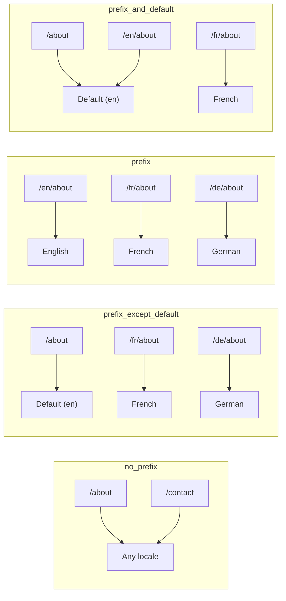
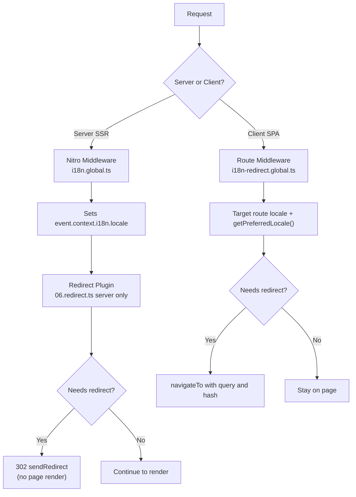

# 🗂️ Routing-Strategien in Nuxt I18n Micro

## 📖 Überblick

Nuxt I18n Micro steuert über die Option `strategy`, wie Locale-Präfixe in URLs erscheinen. Zwei Pakete setzen das unter der Haube um:

- **`@i18n-micro/route-strategy`**: Routen-Erzeugung zur Buildzeit (erweitert Nuxt-Seiten um lokalisierte Routen).
- **`@i18n-micro/path-strategy`**: Pfadauflösung, Redirects, SEO-Attribute und Link-Erzeugung zur Laufzeit.

Das Nuxt-Modul wählt die passende Strategieklasse zur Buildzeit aus und aliasiert sie über `#i18n-strategy`, sodass nur die gewählte Implementierung im Bundle landet.

## 🚦 Verfügbare Strategien

{/* generated:option:strategy — do not edit; run `pnpm run docs:generate` */}

**Typ** `Strategies` · **Standard** `'prefix_except_default'`

URL-Routing-Strategie für Locale-Präfixe.

- `'no_prefix'`: kein Locale in der URL. Locale liegt im Cookie.
- `'prefix_except_default'`: alle Locales außer der Standard-Locale mit Präfix.
- `'prefix'`: immer mit Präfix, inklusive der Standard-Locale.
- `'prefix_and_default'`: wie `prefix`, aber die Standard-Locale ist zusätzlich ohne Präfix erreichbar.

{/* /generated:option:strategy */}

### Strategievergleich



### 🛑 `no_prefix`

URLs enthalten kein Locale-Segment. Die Locale wird über Cookies, den State von `useI18nLocale()` oder Browser-Erkennung bestimmt.

- **Routen**: `/about`, `/contact`: dasselbe URL-Muster für alle Locales (kein `/en/`- oder `/fr/`-Präfix).
- **Locale-Persistenz**: über `localeCookie` (wird automatisch auf `'user-locale'` gesetzt, wenn nicht angegeben).
- **Eigene Pfade**: unterstützt über [`globalLocaleRoutes`](/guides/configuration#globallocaleroutes) und [`defineI18nRoute`](/guides/custom-locale-routes). Lokalisierte Slugs werden erzeugt, ohne dass die URL ein Locale-Präfix erhält (zum Beispiel `/about` vs. `/ueber-uns`). Verschachtelte Routen, Aliase und Einschränkungen je Locale sind einfacher als bei `prefix_except_default`.

<Tip>
Bei `no_prefix` wird `localeCookie` automatisch auf `'user-locale'` gesetzt, wenn nicht angegeben. Das ist nötig, weil die URL keine Locale-Information enthält.
</Tip>

```typescript
i18n: {
  strategy: 'no_prefix'
  // localeCookie is automatically set to 'user-locale'
}
```

### 🚧 `prefix_except_default`

Alle Routen haben ein Locale-Präfix, **außer** der Standard-Locale.

- **Standard-Locale**: `/about`, `/contact`
- **Andere Locales**: `/fr/about`, `/de/contact`
- **Standard-Locale mit Präfix liefert 404**: `/en/about` → 404 (wenn `en` Standard ist)

```typescript
i18n: {
  strategy: 'prefix_except_default' // This is the default
}
```

### 🌍 `prefix`

Jede Route hat ein Locale-Präfix, auch die Standard-Locale.

- **Alle Locales**: `/en/about`, `/fr/about`, `/de/about`
- **Root `/`**: Redirect auf `/\{locale\}/` gemäß Nutzerpräferenz.

```typescript
i18n: {
  strategy: 'prefix'
}
```

### 🔄 `prefix_and_default`

Die Standard-Locale ist sowohl mit als auch ohne Präfix verfügbar. Nicht-Standard-Locales haben stets ein Präfix.

- **Standard-Locale**: sowohl `/about` als auch `/en/about` sind gültig.
- **Andere Locales**: `/fr/about`, `/de/about`
- **Kein Redirect von `/`**: Sowohl `/` als auch `/en/` liefern die Standard-Locale aus.

```typescript
i18n: {
  strategy: 'prefix_and_default'
}
```

## 🔀 Redirect-Architektur (v3)

In v3 ist die Redirect-Logik für optimale Performance in zwei Schichten aufgeteilt:

### So funktioniert es



### Serverseitig (kein Flash)

1. **Nitro-Middleware** (`i18n.global.ts`) läuft zuerst. Sie erkennt die Locale aus URL, Cookie oder dem `Accept-Language`-Header und setzt `event.context.i18n.locale`.
2. **Redirect-Plugin** (`06.redirect.ts`, nur Server) prüft mit `i18nStrategy.getClientRedirect()`, ob der aktuelle Pfad einen Redirect benötigt, und sendet einen 302 **vor** dem Rendern.
3. So gibt es keinen „Error-Flash“, bei dem Nutzer kurz eine falsche Seite sehen, bevor umgeleitet wird.

### Clientseitig (SPA-Navigation)

1. Die globale Route-Middleware (`i18n-redirect.global.ts`) läuft bei jeder Client-Navigation, wenn `redirects` aktiv ist.
2. Sie leitet die bevorzugte Locale zuerst aus der **Zielroute** ab und fällt dann auf `useI18nLocale().getPreferredLocale()` zurück.
3. Mit `i18nStrategy.getClientRedirect()` entscheidet sie, ob ein Redirect nötig ist.
4. `query` und `hash` bleiben beim Redirect erhalten.

### Priorität der Locale

Auf dem Server ermittelt das Redirect-Plugin die bevorzugte Locale in dieser Reihenfolge:

1. **`useState('i18n-locale')`**: höchste Priorität (programmatisch über `useI18nLocale().setLocale()` gesetzt).
2. **Cookie**: wenn `localeCookie` konfiguriert ist.
3. **`Accept-Language`-Header**: wenn `autoDetectLanguage: true`.
4. **`defaultLocale`**: finaler Fallback.

Auf dem Client bevorzugt die Route-Middleware die Locale der Zielroute und nutzt dann dieselbe State-/Cookie-Kette.

### Redirect-Verhalten je Strategie

| Strategie               | Verhalten bei `GET /`                          | Cookie erforderlich? |
| ----------------------- | --------------------------------------------- | -------------------- |
| `no_prefix`             | Kein Redirect (Locale aus Cookie/State)       | Automatisch gesetzt  |
| `prefix`                | 302 → `/\{locale\}/`                            | Empfohlen            |
| `prefix_except_default` | 302 → `/\{locale\}/`, wenn Locale ≠ Standard   | Empfohlen            |
| `prefix_and_default`    | Kein Redirect (sowohl `/` als auch `/\{locale\}/` gültig) | Optional             |

### Redirects deaktivieren

```typescript
i18n: {
  redirects: false // Disables automatic locale redirects
}
```

Bei `redirects: false` sind automatische Locale-Redirects aus:

- **Server**: Das Redirect-Plugin (`06.redirect.ts`, nur Server) bleibt registriert, überspringt aber die Redirect-Logik. Es führt weiterhin **404-Prüfungen** für ungültige Locale-Präfixe durch (zum Beispiel `/xx/about`, wenn `xx` keine gültige Locale ist) und **synchronisiert Cookies** vom URL-Präfix aus (zum Beispiel synchronisiert der Besuch von `/fr/about` das Cookie auf `fr`).
- **Client**: Die globale Route-Middleware `i18n-redirect` wird **nicht** registriert. Keine SPA-Auto-Redirects.

## 🍪 Cookie-basierte Locale-Persistenz

<Warning>
Wenn du `prefix` oder `prefix_except_default` mit `redirects: true` (Standard) nutzt, **musst** du `localeCookie` setzen, damit Redirects korrekt funktionieren. Ohne Cookie kann sich das Redirect-Plugin die Locale-Präferenz des Nutzers nicht über Seiten-Reloads hinweg merken.

```typescript
i18n: {
  strategy: 'prefix_except_default',
  localeCookie: 'user-locale' // Required for redirects to work properly
}
```
</Warning>

**So funktioniert `localeCookie` in v3:**

- Wird intern von `useI18nLocale()` verwaltet. **Setze das Cookie nicht manuell** über `useCookie()`.
- Wenn ein Nutzer eine präfixierte URL besucht (zum Beispiel `/fr/about`), wird das Cookie automatisch auf `fr` synchronisiert.
- Beim nächsten Besuch von `/` wird der Cookie-Wert genutzt, um auf `/\{locale\}/` umzuleiten.
- Enthält das Cookie eine ungültige Locale (nicht in der `locales`-Liste), fällt das Modul auf `defaultLocale` zurück.

| Strategie               | Default für `localeCookie` | Hinweise                              |
| ----------------------- | -------------------------- | ------------------------------------- |
| `no_prefix`             | Auto: `'user-locale'`      | Erforderlich, wird automatisch gesetzt |
| `prefix`                | `null` (deaktiviert)       | Für Redirects auf `'user-locale'` setzen |
| `prefix_except_default` | `null` (deaktiviert)       | Für Redirects auf `'user-locale'` setzen |
| `prefix_and_default`    | `null` (deaktiviert)       | Optional                              |

## 🔍 `autoDetectLanguage` und `autoDetectPath`

### `autoDetectLanguage`

{/* generated:option:autoDetectLanguage — do not edit; run `pnpm run docs:generate` */}

**Typ** `boolean` · **Standard** `true`

Erkennt die bevorzugte Sprache automatisch aus dem HTTP-Header `Accept-Language`.
Wird zusammen mit `autoDetectPath` verwendet, um zu entscheiden, wann die Erkennung greift.

{/* /generated:option:autoDetectLanguage */}

Die Prüfung läuft in der Server-Middleware und ist ein Fallback: Cookie oder bestehender State gewinnen.

```typescript
i18n: {
  autoDetectLanguage: true
}
```

### `autoDetectPath`

{/* generated:option:autoDetectPath — do not edit; run `pnpm run docs:generate` */}

**Typ** `string` · **Standard** `'/'`

Wo Cookie- oder Accept-Language-Präferenz-Redirects greifen dürfen (wenn `redirects` aktiv ist).

- `'/'`: nur `/` (Deep Links in der Standard-Locale bleiben erreichbar; Standard).
- `'no_prefix'`: nur Pfade ohne Locale-Präfix.
- `'*'`: jeder Pfad, inklusive Umschreiben eines expliziten Locale-Präfix (zum Beispiel `/fr/about` → `/de/about`, wenn das Cookie `de` bevorzugt).

- Beliebiger anderer String: exakter Pfadvergleich (zum Beispiel `'/welcome'`).

Aufräumaktionen für Prefix-Strategien (zum Beispiel `/en` → `/` unter `prefix_except_default`) sind nicht durch diese Option gedeckelt.

{/* /generated:option:autoDetectPath */}

```typescript
i18n: {
  autoDetectPath: '/' // Default: only root
  // autoDetectPath: '*' // All paths — redirects even /fr/about to /de/about
}
```

<Warning>
Mit `autoDetectPath: '*'` werden auch URLs mit explizitem Locale-Präfix (zum Beispiel `/fr/about`) umgeleitet, wenn die bevorzugte Locale des Nutzers abweicht. Das kann bei domainbasierten Setups hilfreich sein, aber Nutzer, die URLs teilen, verwirren.
</Warning>

Mit dem Standard `autoDetectPath: '/'` und einem Locale-Cookie:

| Request  | Cookie | Ergebnis |
| ---      | ---    | ---      |
| `/`      | `de`   | 302 → `/de` |
| `/about` | `de`   | 200, Standard-Locale (kein Rewrite) |

```typescript
i18n: {
  localeCookie: 'user-locale',
  strategy: 'prefix_except_default',
  // Default — remember language on entry, keep deep links stable
  autoDetectPath: '/',
  // Or redirect on every unprefixed path (but not /de/… → /fr/…):
  // autoDetectPath: 'no_prefix',
}
```

## ⚠️ Bekannte Probleme und Best Practices

### 1. Hydration-Mismatch bei `no_prefix`

Bei `no_prefix` wird die Locale dynamisch ermittelt. Wenn Server und Client die Locale unterschiedlich bestimmen, entsteht ein Hydration-Mismatch.

**Lösung**: Setze die Locale in einem Server-Plugin (mit `order: -10`) über `useI18nLocale().setLocale()` vor der i18n-Initialisierung:

```ts
// plugins/i18n-loader.server.ts
export default defineNuxtPlugin({
  name: 'i18n-custom-loader',
  enforce: 'pre',
  order: -10,
  setup() {
    const { setLocale } = useI18nLocale()
    setLocale('ja') // Your detection logic here
  },
})
```

Ausführliche Beispiele findest du unter [Eigene Spracherkennung](/guides/custom-language-detection).

### 2. Benannte Routen mit `localeRoute`

Pfadbasiertes Routing kann bei der Routenauflösung Probleme machen:

```typescript
// May cause issues
$localeRoute('/page')

// Preferred approach
$localeRoute({ name: 'page' })
```

### 3. `pages: false` mit i18n

Bei Nuxt mit `pages: false`:

```typescript
export default defineNuxtConfig({
  pages: false,
  i18n: {
    strategy: 'no_prefix', // Recommended
    disablePageLocales: true, // Required
    localeCookie: 'user-locale', // Required for persistence
  },
})
```

**Einschränkungen mit `pages: false`:**

- Keine automatischen Redirects.
- Keine URL-basierte Locale-Erkennung.
- Ein clientseitiger Locale-Wechsel erfordert einen Page-Reload oder das manuelle Laden von Übersetzungen.

### 4. Umgang mit ungültigen Cookies

Enthält ein Cookie eine ungültige Locale (nicht in der `locales`-Liste), fällt das Modul sauber auf `defaultLocale` zurück. Es werden keine Fehler geworfen.

## 📝 Zusammenfassung der Best Practices

| Empfehlung                | Details                                                                             |
| ------------------------- | ----------------------------------------------------------------------------------- |
| **`localeCookie` setzen** | Für Prefix-Strategien mit `redirects: true` immer setzen.                            |
| **`useI18nLocale()` nutzen** | Der zentrale Weg zum Verwalten des Locale-States (ersetzt manuelles `useState`/`useCookie`). |
| **Benannte Routen**       | `$localeRoute(\{ name: 'page' \})` gegenüber `$localeRoute('/page')`.                 |
| **Locale programmatisch** | Nutze `useI18nLocale().setLocale()` in einem Server-Plugin mit `order: -10`.        |
| **Keine manuellen Cookies** | Verwende `useCookie('user-locale')` nicht direkt. `useI18nLocale()` erledigt das.  |
