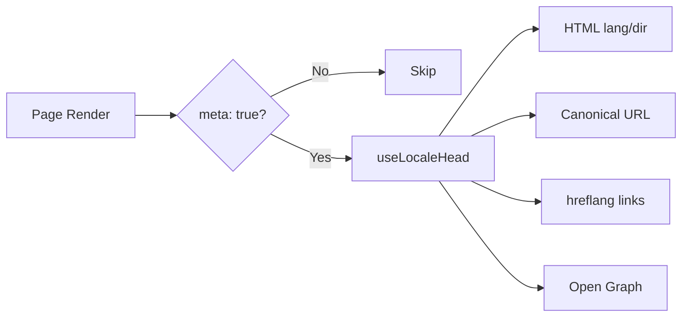

# 🌐 SEO-Guide für Nuxt I18n Micro

## 📖 Einführung

Effektive SEO (Search Engine Optimization) ist entscheidend, damit deine mehrsprachige Website weltweit über Suchmaschinen erreichbar und sichtbar ist. `Nuxt I18n Micro` vereinfacht das SEO-Management für mehrsprachige Sites, indem es automatisch die wichtigsten Meta-Tags und Attribute erzeugt, die Suchmaschinen über Struktur und Inhalt deiner Seite informieren.

Dieser Guide zeigt, wie `Nuxt I18n Micro` SEO handhabt, um die Sichtbarkeit deiner Seite und das Nutzungserlebnis zu verbessern, ohne dass du weiter konfigurieren musst.

## ⚙️ Automatisches SEO-Handling

### Ablauf der SEO-Meta-Erzeugung



**Erzeugte Tags:**

| Tag             | Beispiel                                                  |
| --------------- | -------------------------------------------------------- |
| HTML-Attribute  | `<html lang="en" dir="ltr">`                              |
| Canonical       | `<link rel="canonical" href="...">`                       |
| hreflang        | `<link rel="alternate" hreflang="en" href="...">`         |
| x-default       | `<link rel="alternate" hreflang="x-default" href="...">`  |
| Open Graph      | `<meta property="og:locale" content="en_US">`             |

#### `og` je Locale (`og:locale` vs. BCP 47)

`<html lang>` und `hreflang` verwenden **BCP 47** über `locale.iso` (zum Beispiel `ar-AE`).  
Open Graph erwartet **`language_TERRITORY`** mit **Unterstrich** (`ar_AE`), gemäß [OG-Protokoll](https://ogp.me/).

Standardmäßig wird `og:locale` aus `iso` abgeleitet, wenn das Mapping eindeutig ist (`en-US` → `en_US`).  
Setze einen expliziten **`og`**-String, wenn du einen eigenen Wert brauchst (zum Beispiel `zh-Hans` → `zh_CN`).  
Wenn weder `og` noch ein konvertierbares `iso` verfügbar ist, werden keine `og:locale`-Tags erzeugt. Im Entwicklungsmodus erscheint eine Konsolenwarnung (achtet auf `missingWarn`).

```typescript
i18n: {
  meta: true,
  locales: [
    { code: 'ar', iso: 'ar-AE', og: 'ar_AE', dir: 'rtl' },
    { code: 'en', iso: 'en-US' }, // og:locale → en_US
    { code: 'zh', iso: 'zh-Hans', og: 'zh_CN' }, // script tags need explicit og
  ],
}
```

### 🔑 Wichtige SEO-Funktionen

Wenn die Option `meta` in `Nuxt I18n Micro` aktiv ist, verwaltet das Modul automatisch folgende SEO-Aspekte:

1. **🌍 Sprache und Schreibrichtung**:
   - Das Modul setzt die Attribute `lang` und `dir` am `<html>`-Tag gemäß aktueller Locale und Textrichtung (zum Beispiel `ltr` für Englisch oder `rtl` für Arabisch).

2. **🔗 Canonical-URLs**:
   - Für jede Seite wird ein Canonical-Link (`<link rel="canonical">`) erzeugt, damit Suchmaschinen die primäre Version des Inhalts erkennen.

3. **🌐 Alternative Sprachlinks (`hreflang`)**:
   - Das Modul erzeugt automatisch `<link rel="alternate" hreflang="">`-Tags für alle verfügbaren Locales. So verstehen Suchmaschinen, welche Sprachversionen deiner Inhalte existieren. Das verbessert das Erlebnis für globale Zielgruppen.
   - Jede Locale emittiert **ein** Tag: `hreflang = iso || code`. Bei gesetztem `iso` wird der Routing-`code` nie als `hreflang` verwendet (Markt-Keys wie `mx` werden also keine ungültigen Sprach-Tags).
   - Optional emittiert `hreflangBaseLanguage: true` zusätzlich ein Bare-Language-Tag, abgeleitet aus `iso` (zum Beispiel `es-ES` → `es`). Es wird der ersten regionalen Locale in `locales` zugewiesen.

4. **🌏 `x-default`-hreflang**:
   - Das Modul erzeugt automatisch ein `<link rel="alternate" hreflang="x-default">`-Tag, das auf die URL der Standard-Locale zeigt. So weiß eine Suchmaschine, welche URL Nutzern gezeigt werden soll, deren Sprache zu keiner definierten Locale passt. Keine zusätzliche Konfiguration nötig: Das läuft automatisch, wenn `meta: true` gesetzt ist.

5. **🔖 Open-Graph-Metadaten**:
   - Das Modul erzeugt Open-Graph-Meta-Tags (`og:locale`, `og:url` usw.) je Locale. Das ist besonders nützlich für Social-Media-Sharing und die Indexierung durch Suchmaschinen.

### 🛠️ Konfiguration

Um diese SEO-Funktionen zu aktivieren, setzt du die Option `meta` in `nuxt.config.ts` auf `true`:

```typescript
export default defineNuxtConfig({
  modules: ['nuxt-i18n-micro'],
  i18n: {
    locales: [
      { code: 'en', iso: 'en-US', dir: 'ltr' },
      { code: 'fr', iso: 'fr-FR', dir: 'ltr' },
      { code: 'ar', iso: 'ar-SA', dir: 'rtl' },
    ],
    defaultLocale: 'en',
    translationDir: 'locales',
    meta: true, // Enables automatic SEO management
  },
})
```

### 🌍 Dynamische `metaBaseUrl` für Multi-Domain-Deployments

Wenn `metaBaseUrl` nicht gesetzt ist, werden absolute SEO-URLs in folgender Reihenfolge aufgelöst (#240):

1. `site.url` aus [`nuxt-site-config`](https://nuxtseo.com/docs/site-config), sofern dieses Modul vorhanden ist (zum Beispiel über `@nuxtjs/seo`).
2. Sonst der Hostname des aktuellen Requests (`useRequestURL()` / `window.location.origin`).

Der Fallback auf die Request-Origin berücksichtigt Reverse-Proxy-Header (`X-Forwarded-Host`, `X-Forwarded-Proto`) und funktioniert korrekt hinter nginx, Cloudflare, AWS ALB und ähnlichen Proxies.

Anwendungen, die `site.url` bereits für Sitemap, robots oder schema.org setzen, brauchen also **keine** zweite Deklaration `metaBaseUrl`:

```typescript
export default defineNuxtConfig({
  site: {
    url: process.env.NUXT_SITE_URL, // also used by micro for canonical / og:url / hreflang
  },
  i18n: {
    meta: true,
    // metaBaseUrl omitted — picks up site.url, then request origin
  },
})
```

Ohne `site.url` kann eine einzige Anwendungsinstanz weiterhin **mehrere Domains** mit korrekten SEO-Tags je Domain aus der Request-Origin bedienen:

```typescript
export default defineNuxtConfig({
  i18n: {
    meta: true,
    // metaBaseUrl is undefined by default — resolved dynamically from the request
  },
})
```

Zum Beispiel erzeugt eine Anfrage an `https://site-a.com/en/about`:

```html
<link rel="canonical" href="https://site-a.com/en/about" /> <meta property="og:url" content="https://site-a.com/en/about" />
```

Dieselbe App liefert unter `https://site-b.com/en/about` dann:

```html
<link rel="canonical" href="https://site-b.com/en/about" /> <meta property="og:url" content="https://site-b.com/en/about" />
```

Wenn du eine feste Basis-URL brauchst, die stets Vorrang vor `site.url` hat, übergib einen statischen String:

```typescript
metaBaseUrl: 'https://example.com'
```

### 🔍 Canonical-Query-Whitelist

Standardmäßig werden Query-Parameter aus Canonical- und `og:url` entfernt, um Duplicate Content zu vermeiden. Du kannst gezielt bestimmte Parameter erlauben:

```typescript
i18n: {
  canonicalQueryWhitelist: ['page', 'sort', 'filter', 'search', 'q', 'query', 'tag']
}
```

Nur die in `canonicalQueryWhitelist` gelisteten Parameter erscheinen in Canonical-URLs. Alle anderen Query-Parameter (etwa Tracking oder Session-IDs) werden entfernt.

### 🚫 Meta-Tags je Seite deaktivieren

Für einzelne Seiten deaktivierst du die SEO-Meta-Erzeugung mit `defineI18nRoute()`:

```vue
<script setup>
// Disable all SEO meta tags for this page
defineI18nRoute({
  disableMeta: true,
})
</script>
```

Du kannst Meta auch nur für bestimmte Locales deaktivieren:

```vue
<script setup>
// Disable meta tags only for English locale on this page
defineI18nRoute({
  disableMeta: ['en'],
})
</script>
```

Ist `disableMeta` aktiv, werden für die betroffene Seite oder Locale keine `hreflang`-, `canonical`-, `og:locale`-, `og:url`- oder `x-default`-Tags erzeugt.

### 🔇 Deaktivierte Locales

Locales mit `disabled: true` werden automatisch aus jeder SEO-Tag-Erzeugung ausgeschlossen. Für sie werden keine `hreflang`-, `og:locale:alternate`- oder Alternate-Links erzeugt:

```typescript
i18n: {
  locales: [
    { code: 'en', iso: 'en-US' },
    { code: 'fr', iso: 'fr-FR', disabled: true }, // excluded from SEO tags
  ]
}
```

### 🙈 Locales aus dem SEO ausnehmen (`seo: false`)

Für Locales, die weiterhin routbar und übersetzt bleiben sollen, aber nicht in den locale-übergreifenden Discovery-Tags erscheinen sollen, setze `seo: false`. Sie werden aus `hreflang`-Alternates und `og:locale:alternate` ausgelassen. Hat deine konfigurierte **Default**-Locale `seo: false`, wird auch der `x-default`-Link nicht emittiert.

```typescript
i18n: {
  locales: [
    { code: 'en', iso: 'en-US' },
    { code: 'ru', iso: 'ru-RU', seo: false }, // internal / non-indexed locale
  ]
}
```

### 📌 Strategieabhängiges Verhalten

| Strategie               | hreflang-Links   | x-default               | canonical      | og:url |
| ----------------------- | ---------------- | ----------------------- | -------------- | ------ |
| `prefix`                | ✅ Alle Locales  | ✅ URL der Standard-Locale | ✅ Aktuelle URL | ✅     |
| `prefix_except_default` | ✅ Alle Locales  | ✅ URL ohne Präfix       | ✅ Aktuelle URL | ✅     |
| `prefix_and_default`    | ✅ Alle Locales  | ✅ URL der Standard-Locale | ✅ Aktuelle URL | ✅     |
| `no_prefix`             | ❌ Nicht erzeugt | ❌ Nicht erzeugt         | ✅ Aktuelle URL | ✅     |

Bei der Strategie `no_prefix` werden nur `canonical`, `og:url`, `og:locale` sowie die `html`-Attribute (`lang`, `dir`) erzeugt. Alternative Sprachlinks (`hreflang`) und `x-default` entstehen nicht, weil es keine unterschiedlichen URLs je Locale gibt.

## Seitenweise Überschreibungen (`useI18nHead`)

Für **Artikel, Guides oder beliebige CMS-Inhalte**, bei denen nicht jede Locale existiert oder URLs aus einer API kommen, nutze [`useI18nHead`](/api/composables/use-i18n-head) direkt auf der Seite statt eines eigenen i18n-Head-Plugins.

### Artikel mit teilweiser Übersetzung

```vue
<script setup lang="ts">
const article = await loadArticle()
// article.locales = { en: '...', de: '...' } — only translated locales

useI18nHead({
  meta: [{ property: 'og:title', content: article.title }],
  replace: {
    hreflang: Object.entries(article.locales).map(([locale, href]) => ({
      rel: 'alternate',
      hreflang: locale,
      href,
    })),
    ogAlternates: Object.keys(article.locales),
  },
})
</script>
```

### Slugs je Locale mit `$setI18nRouteParams`

Wenn die Slugs je Sprache abweichen, setze zuerst die Route-Params und überschreibe dann die Alternates mit den tatsächlichen URLs:

```vue
<script setup lang="ts">
const { $defineI18nRoute, $setI18nRouteParams } = useNuxtApp()
const { data: article } = await useFetch(`/api/articles/${slug}`)

$defineI18nRoute({
  localeRoutes: { en: '/blog/[slug]', de: '/de/blog/[slug]' },
})

$setI18nRouteParams({
  en: { slug: article.value.slugEn },
  de: { slug: article.value.slugDe },
})

useI18nHead({
  replace: {
    hreflang: ['en', 'de'].map((locale) => ({
      rel: 'alternate',
      hreflang: locale,
      href: article.value.urls[locale],
    })),
    ogAlternates: ['en', 'de'],
  },
})
</script>
```

### HTTPS-Origin hinter einem Proxy

Für korrekte absolute URLs bei SSR ohne eigenes Origin-Composable:

```ts
i18n: {
  meta: true,
  metaBaseUrl: undefined,
  metaTrustForwardedHost: true,
  metaTrustForwardedProto: true,
}
```

Weitere Beispiele (Canonical überschreiben, `x-default`, reaktives Fetching, geteilte Helfer) findest du im [Composable useI18nHead](/api/composables/use-i18n-head).

### ⚠️ Trailing Slash

Das Modul erzeugt Canonical- und `hreflang`-URLs anhand des tatsächlichen Pfads aus `useRoute().fullPath`. Wenn deine Anwendung Trailing Slashes verwendet (zum Beispiel über Nuxts `router.options`), spiegeln die erzeugten URLs das wider. `$switchLocalePath` kann Pfade normalisieren und Trailing Slashes entfernen. Wenn Trailing-Slash-Konsistenz für dein SEO wichtig ist, prüfe, ob die erzeugten URLs zur URL-Struktur deiner Anwendung passen.

### 🎯 Nutzen

Mit aktiver `meta`-Option profitierst du von:

- **📈 Besseren Suchmaschinen-Rankings**: Suchmaschinen indizieren deine Seite besser, weil sie die Beziehungen der Sprachversionen erkennen.
- **👥 Besserem Nutzungserlebnis**: Nutzer erhalten die korrekte Sprachversion gemäß ihren Präferenzen.
- **🔧 Weniger manueller Konfiguration**: Das Modul erledigt SEO-Aufgaben automatisch. Du musst SEO-Meta-Tags und -Attribute nicht selbst pflegen.

## 🔗 Nuxt SEO (`@nuxtjs/seo`)

[`@nuxtjs/seo`](https://nuxtseo.com/) bündelt Sitemap, robots, schema.org, OG-Bilder und verwandte Module. Es integriert sich mit **nuxt-i18n-micro** über [`nuxt-site-config`](https://nuxtseo.com/docs/site-config/guides/i18n) (v4+).

### Voraussetzungen

- **`@nuxtjs/seo` 3+** (aktuelle Releases nutzen `nuxt-site-config` 4+, das das Plugin `nuxt-site-config:i18n` für Micro registriert).
- **`i18n.meta: true`** (empfohlen; Micro liefert locale-bewusste Head-Tags, Nuxt SEO ergänzt Sitemap, schema.org usw.).

### Reihenfolge der Module

Führe **nuxt-i18n-micro vor `@nuxtjs/seo`** auf, damit die Site-Config dein Locale-Setup lesen kann:

```typescript
export default defineNuxtConfig({
  modules: ['nuxt-i18n-micro', '@nuxtjs/seo'],
  site: {
    url: 'https://example.com',
    name: 'My Site',
  },
  i18n: {
    meta: true,
    defaultLocale: 'en',
    locales: [
      { code: 'en', iso: 'en-US' },
      { code: 'de', iso: 'de-DE' },
    ],
  },
})
```

### Übersetzter Site-Name und Beschreibung

Nuxt Site Config liest optionale Übersetzungs-Schlüssel aus deinen Locale-Dateien:

```json
{
  "nuxtSiteConfig": {
    "name": "My Site",
    "description": "My site description"
  }
}
```

Werte je Locale in `locales/en.json`, `locales/de.json` usw. werden automatisch übernommen.

### Fehlersuche

Wenn du `Plugin nuxt-seo:defaults depends on nuxt-site-config:i18n but they are not registered` siehst, aktualisiere **`@nuxtjs/seo` auf 3+** (siehe [Issue #133](https://github.com/s00d/nuxt-i18n-micro/issues/133)). Ältere `nuxt-site-config` 3.x verdrahteten i18n nur mit `@nuxtjs/i18n`, nicht mit Micro.

Mehr: [Sitemap i18n-Guide](https://nuxtseo.com/docs/sitemap/guides/i18n), [Site Config i18n-Guide](https://nuxtseo.com/docs/site-config/guides/i18n).
