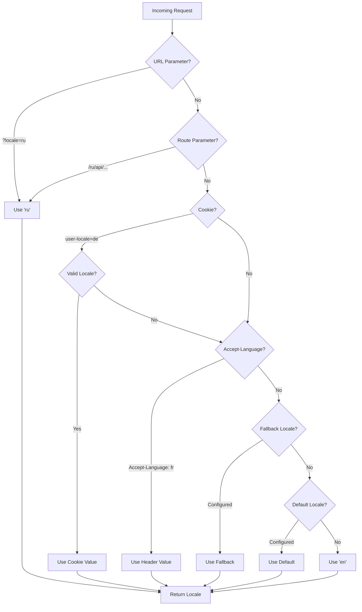

# 🌍 Serverseitige Übersetzungen und Locale-Informationen in Nuxt I18n Micro

## 📖 Überblick

Nuxt I18n Micro unterstützt serverseitige Übersetzungen und Locale-Informationen. So kannst du Inhalte übersetzen und auf Locale-Details bereits auf dem Server zugreifen. Das ist besonders nützlich für APIs oder serverseitig gerenderte Anwendungen, in denen die Lokalisierung vor dem Erreichen des Clients erfolgen muss.

Die Übersetzungen basieren auf den in der Nuxt-I18n-Konfiguration definierten Locale-Nachrichten und werden dynamisch anhand der erkannten Locale aufgelöst.

Standardmäßig (`translationPayloads.mode: 'premerged'`) werden Root-Dateien zur Buildzeit in jedes Seiten-Payload eingebrannt als `\{page\}/\{locale\}/data.json`. Der Server lädt dieselben vorgemergten Dateien wie der Client sie unter `/\{apiBaseUrl\}/...` abruft. Damit sind alle Schlüssel (geteilte und seitenspezifische) in Server-Handlern verfügbar.

Mit `translationPayloads.mode: 'source'` werden kompakte Quelldateien zur Laufzeit gemischt, wenn `loadTranslationsFromServer()` (oder die Route `/_locales`) aufgerufen wird. Auf **Edge** über Nitro-`serverAssets`, auf **Node** aus der optionalen Public-Kopie. Details siehe [Performance-Guide, Serverless-Payload-Ausgabe](/guides/performance#serverless-payload-output) und [Cache- und Storage-Architektur](/api/cache).

Für eine konsolidierte Liste von Runtime- und Server-APIs siehe die [API-Referenz](/api/overview).

## 🛠️ Serverseitige Middleware einrichten

Um serverseitige Übersetzungen und Locale-Informationen zu aktivieren, nutzt du die bereitgestellten Middleware-Funktionen:

- `useTranslationServerMiddleware`: zum Übersetzen von Inhalten
- `useLocaleServerMiddleware`: zum Zugriff auf Locale-Informationen

Beide Middleware-Funktionen sind in allen Server-Routen automatisch verfügbar.

Die Locale-Erkennung ist zwischen beiden Middleware-Funktionen über die Utility-Funktion `detectCurrentLocale` geteilt, damit das Verhalten im Modul konsistent bleibt.

## ✨ Übersetzungen in Server-Handlern nutzen

In jedem `eventHandler` übersetzt du Inhalte nahtlos über die Übersetzungs-Middleware.

### Beispiel: Grundlegende Verwendung

```typescript
import { defineEventHandler } from 'h3'

export default defineEventHandler(async (event) => {
  const t = await useTranslationServerMiddleware(event)
  return {
    message: t('greeting'), // Returns the translated value for the key "greeting"
  }
})
```

In diesem Beispiel:

- Die Locale des Nutzers wird automatisch aus Query-Parametern, Cookies oder Headern erkannt.
- Die `t`-Funktion liefert die passende Übersetzung für die erkannte Locale.

## 🌍 Locale-Informationen in Server-Handlern nutzen

### Grundlegende Verwendung

```typescript
import { defineEventHandler } from 'h3'

export default defineEventHandler((event) => {
  const localeInfo = useLocaleServerMiddleware(event)

  return {
    success: true,
    data: localeInfo,
    timestamp: new Date().toISOString(),
  }
})
```

### Eigene Locale-Parameter übergeben

```typescript
import { defineEventHandler } from 'h3'

export default defineEventHandler((event) => {
  // Force specific locale with custom default
  const localeInfo = useLocaleServerMiddleware(event, 'en', 'ru')

  return {
    success: true,
    data: localeInfo,
    timestamp: new Date().toISOString(),
  }
})
```

### Antwortstruktur

Die Locale-Middleware liefert ein `LocaleInfo`-Objekt mit folgenden Eigenschaften:

```typescript
interface LocaleInfo {
  current: string // Current detected locale code
  default: string // Default locale code
  fallback: string // Fallback locale code
  available: string[] // Array of all available locale codes
  locale: Locale | null // Full locale configuration object
  isDefault: boolean // Whether current locale is the default
  isFallback: boolean // Whether current locale is the fallback
}
```

### Beispielantwort

```json
{
  "success": true,
  "data": {
    "current": "ru",
    "default": "en",
    "fallback": "en",
    "available": ["en", "ru", "de"],
    "locale": {
      "code": "ru",
      "iso": "ru-RU",
      "dir": "ltr",
      "displayName": "Русский"
    },
    "isDefault": false,
    "isFallback": false
  },
  "timestamp": "2024-01-15T10:30:00.000Z"
}
```

## 🌐 Eigene Locale angeben

Wenn du eine Locale manuell angeben musst (zum Beispiel für Tests oder bestimmte Requests), übergibst du sie an die Übersetzungs-Middleware:

### Beispiel: Eigene Locale

```typescript
import { defineEventHandler } from 'h3'

function detectLocale(event): string | null {
  const urlSearchParams = new URLSearchParams(event.node.req.url?.split('?')[1])
  const localeFromQuery = urlSearchParams.get('locale')
  if (localeFromQuery) return localeFromQuery

  return 'en'
}

export default defineEventHandler(async (event) => {
  const t = await useTranslationServerMiddleware(event, 'en', detectLocale(event)) // Force French local, en - default locale
  return {
    message: t('welcome'), // Returns the French translation for "welcome"
  }
})
```

## 📋 Logik der Locale-Erkennung

Beide Middleware-Funktionen ermitteln die Locale des Nutzers automatisch in folgender Priorität:



1. **URL-Parameter**: `?locale=ru`
2. **Route-Parameter**: `/ru/api/endpoint`
3. **Cookies**: Cookie `user-locale`
4. **HTTP-Header**: Header `Accept-Language`
5. **Fallback-Locale**: wie in den Moduloptionen konfiguriert
6. **Default-Locale**: wie in den Moduloptionen konfiguriert
7. **Hardcoded Fallback**: `'en'`

> **Hinweis**: Die Locale-Erkennung ist zwischen `useLocaleServerMiddleware` und `useTranslationServerMiddleware` geteilt, damit das Modul konsistent arbeitet.

## 📋 Fortgeschrittene Verwendungsbeispiele

### Bedingte Antworten anhand der Locale

```typescript
import { defineEventHandler } from 'h3'

export default defineEventHandler((event) => {
  const { current, isDefault, locale } = useLocaleServerMiddleware(event)

  // Return different content based on locale
  if (current === 'ru') {
    return {
      message: 'Привет, мир!',
      locale: current,
      isDefault,
    }
  }

  if (current === 'de') {
    return {
      message: 'Hallo, Welt!',
      locale: current,
      isDefault,
    }
  }

  // Default English response
  return {
    message: 'Hello, World!',
    locale: current,
    isDefault,
  }
})
```

### Eigene Locale-Erkennung

```typescript
import { defineEventHandler } from 'h3'

export default defineEventHandler((event) => {
  // Force German locale with English as fallback
  const { current, isDefault, locale } = useLocaleServerMiddleware(event, 'en', 'de')

  return {
    message: 'Hallo, Welt!',
    locale: current,
    isDefault: false, // Will be false since we forced German
  }
})
```

### Locale-bewusste API mit Validierung

```typescript
import { defineEventHandler, createError } from 'h3'

export default defineEventHandler((event) => {
  const { current, available, locale } = useLocaleServerMiddleware(event)

  // Validate if the detected locale is supported
  if (!available.includes(current)) {
    throw createError({
      statusCode: 400,
      statusMessage: `Unsupported locale: ${current}. Available locales: ${available.join(', ')}`,
    })
  }

  // Return locale-specific configuration
  return {
    locale: current,
    direction: locale?.dir || 'ltr',
    displayName: locale?.displayName || current,
    availableLocales: available,
  }
})
```

### Integration mit der Übersetzungs-Middleware

Für umfassende Internationalisierung kombinierst du Locale-Informationen mit der Übersetzungs-Middleware:

```typescript
import { defineEventHandler } from 'h3'

export default defineEventHandler(async (event) => {
  const localeInfo = useLocaleServerMiddleware(event)
  const t = await useTranslationServerMiddleware(event)

  return {
    locale: localeInfo.current,
    message: t('welcome_message'),
    availableLocales: localeInfo.available,
    isDefault: localeInfo.isDefault,
  }
})
```

## 📝 Best Practices

1. **Locales immer validieren**: Prüfe, ob die erkannte Locale in deiner Liste verfügbarer Locales enthalten ist.
2. **Fallback-Logik nutzen**: Setze sinnvolle Defaults, wenn die Locale-Erkennung scheitert.
3. **Locale-Informationen cachen**: In performancekritischen Anwendungen kann das Cachen der Erkennungsergebnisse sinnvoll sein.
4. **Randfälle behandeln**: Berücksichtige nicht unterstützte Locales und liefere passende Fehlerantworten.
5. **Mit Übersetzungen kombinieren**: Nutze Locale-Informationen zusammen mit der Übersetzungs-Middleware für vollständige i18n-Unterstützung.

## 🚀 Performance-Hinweise

- Beide Middleware-Funktionen sind schlank und auf schnelle Ausführung ausgelegt.
- Die Locale-Erkennung nutzt effiziente Fallback-Ketten.
- Bei der Erkennung fallen keine externen API-Aufrufe an.
- Ergebnisse werden synchron berechnet, für optimale Performance.
