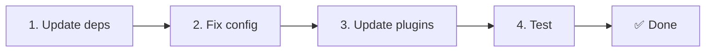

# 📦 Upgrade von v2.x auf v3.x

<Tip>
Siehe [Migration von nuxt-i18n](/migration/from-nuxtjs-i18n). Dieser Guide behandelt den Umstieg vom vue-i18n-Ökosystem, nicht das Upgrade von nuxt-i18n-micro v2.
</Tip>

v3.0.0 bringt grundlegende architektonische Änderungen: Strategie-Pakete, ein neues Caching-System, zentrales Locale-Management über `useI18nLocale()` und eine überarbeitete Redirect-Pipeline. Dieser Abschnitt beschreibt alle Breaking Changes und zeigt, wie du deinen Code anpasst.

## Migrationsschritte



## Zusammenfassung der Breaking Changes

- **Locale-State**: `useState`/`useCookie` manuell → Composable `useI18nLocale()`
- **Config-Zugriff**: `useRuntimeConfig().public.i18nConfig` → `getI18nConfig()` aus `#build/i18n.strategy.mjs`
- **Redirect-Komponente**: Option `fallbackRedirectComponentPath` → Server-Redirect-Plugin und Client-Route-Middleware (automatisch)
- **`includeDefaultLocaleRoute`**: unterstützt (deprecated) → entfernt, nutze die Option `strategy`
- **`experimental.hmr`**: unter `experimental` → Root-Ebene
- **`previousPageFallback`**: vollständig entfernt (die kumulative Merge-Strategie erledigt das automatisch)
- **Caching**: `useStorage('cache')` → Singleton `TranslationStorage` (`Symbol.for` auf `globalThis`)
- **SSR-Transfer**: Runtime-Config → Nuxt-Payload (v3 nutzte `useState`; Chunks liegen jetzt in `payload.data`, siehe [Performance](/guides/performance#server-side-payload-transfer))
- **Strategy-Klassen**: intern → eigene Pakete (`@i18n-micro/route-strategy`, `@i18n-micro/path-strategy`)

## Entfernt: `fallbackRedirectComponentPath`

Die Option `fallbackRedirectComponentPath` und die Fallback-Komponente `locale-redirect.vue` wurden entfernt. Redirect-Logik übernehmen jetzt:

1. **Server-Middleware** (`i18n.global.ts`): setzt `event.context.i18n.locale`.
2. **Server-Redirect-Plugin** (`06.redirect.ts`, nur Server): 302-Redirects vor dem Rendern.
3. **Client-Route-Middleware** (`i18n-redirect.global.ts`): SPA-Redirects nach der Hydration.

```diff
 i18n: {
   strategy: 'prefix_except_default',
-  fallbackRedirectComponentPath: '~/components/MyRedirect.vue',
 }
```

Wenn du in der Fallback-Komponente eigene Redirect-Logik hattest, setze sie stattdessen in einem Server-Plugin um:

```ts
// plugins/i18n-loader.server.ts
export default defineNuxtPlugin({
  name: 'i18n-custom-redirect',
  enforce: 'pre',
  order: -10,
  setup() {
    const { setLocale } = useI18nLocale()
    // Your custom detection logic
    setLocale(detectedLocale)
  },
})
```

## Entfernt: `includeDefaultLocaleRoute`

Nutze stattdessen die Option `strategy`:

- `includeDefaultLocaleRoute: true` → `strategy: 'prefix'`
- `includeDefaultLocaleRoute: false` → `strategy: 'prefix_except_default'` (Standard)

```diff
 i18n: {
-  includeDefaultLocaleRoute: true,
+  strategy: 'prefix',
 }
```

## Config-Zugriff: `getI18nConfig()` ersetzt `useRuntimeConfig`

```diff
- const config = useRuntimeConfig()
- const cookieName = config.public.i18nConfig?.localeCookie || 'user-locale'
+ import { getI18nConfig } from '#build/i18n.strategy.mjs'
+ const { localeCookie: configCookie } = getI18nConfig()
+ const cookieName = configCookie ?? 'user-locale'
```

## Locale-Management: `useI18nLocale()` ersetzt manuellen State

In v2 hast du eventuell `useState('i18n-locale')` oder `useCookie('user-locale')` direkt verwendet. In v3 nutzt du das zentrale Composable `useI18nLocale()`:

```diff
- const locale = useState('i18n-locale')
- const cookie = useCookie('user-locale')
- locale.value = 'fr'
- cookie.value = 'fr'
+ const { setLocale } = useI18nLocale()
+ setLocale('fr') // Updates both state and cookie atomically
```

Ausführliche Beispiele findest du unter [Eigene Spracherkennung](/guides/custom-language-detection).

## Experimentelle Optionen verschoben oder entfernt

`hmr` ist aus `experimental` auf Root-Ebene gewandert. `previousPageFallback` wurde vollständig entfernt. Das Modul nutzt jetzt eine kumulative Deep-Merge-Strategie (Tiefe 2), die Übersetzungen der vorherigen Seite während der Übergangsanimation automatisch bewahrt, selbst wenn Seiten sich überlappende verschachtelte Schlüssel teilen. Nach Ende der Übergangsanimation räumt der Hook `page:transition:finish` die Schlüssel der alten Seite aus dem Speicher.

```diff
 i18n: {
-  experimental: {
-    hmr: true,
-    previousPageFallback: true
-  }
+  hmr: true,
+  // previousPageFallback removed — handled automatically
 }
```

## Redirect-Architektur (v3)

Redirects laufen jetzt automatisch über zwei Komponenten:

1. **Serverseitig** (`06.redirect.ts`, nur Server): Läuft während SSR und gibt 302-Redirects vor jedem Seiten-Rendering aus. Kein „Fehler-Flash“.
2. **Clientseitig** (`i18n-redirect.global.ts`): Globale Route-Middleware bei SPA-Navigation. Query-String und Hash bleiben erhalten.

Locale-Priorität für Redirects:

1. `useState('i18n-locale')`: gesetzt über `useI18nLocale().setLocale()`.
2. Cookie: wenn `localeCookie` konfiguriert ist.
3. `Accept-Language`-Header: wenn `autoDetectLanguage: true`.
4. `defaultLocale`: Fallback.

Für Standard-Setups sind keine Codeänderungen nötig.

<Warning>
Für die Strategien `prefix` und `prefix_except_default` mit `redirects: true` setzt du `localeCookie: 'user-locale'`, um die Locale-Persistenz über Seiten-Reloads hinweg zu aktivieren. Andernfalls basieren Redirects nur auf `Accept-Language` oder `defaultLocale`.
</Warning>

## TypeScript: interne Modultypen (optional)

Falls du Typfehler bei internen Imports wie `#i18n-internal/plural`, `#i18n-internal/strategy` oder `#i18n-internal/config` bekommst, ergänze den `imports`-Abschnitt in der `package.json` deines Projekts:

```json
{
  "imports": {
    "#i18n-internal/plural": "nuxt-i18n-micro/internals",
    "#i18n-internal/strategy": "nuxt-i18n-micro/internals",
    "#i18n-internal/config": "nuxt-i18n-micro/internals"
  }
}
```
