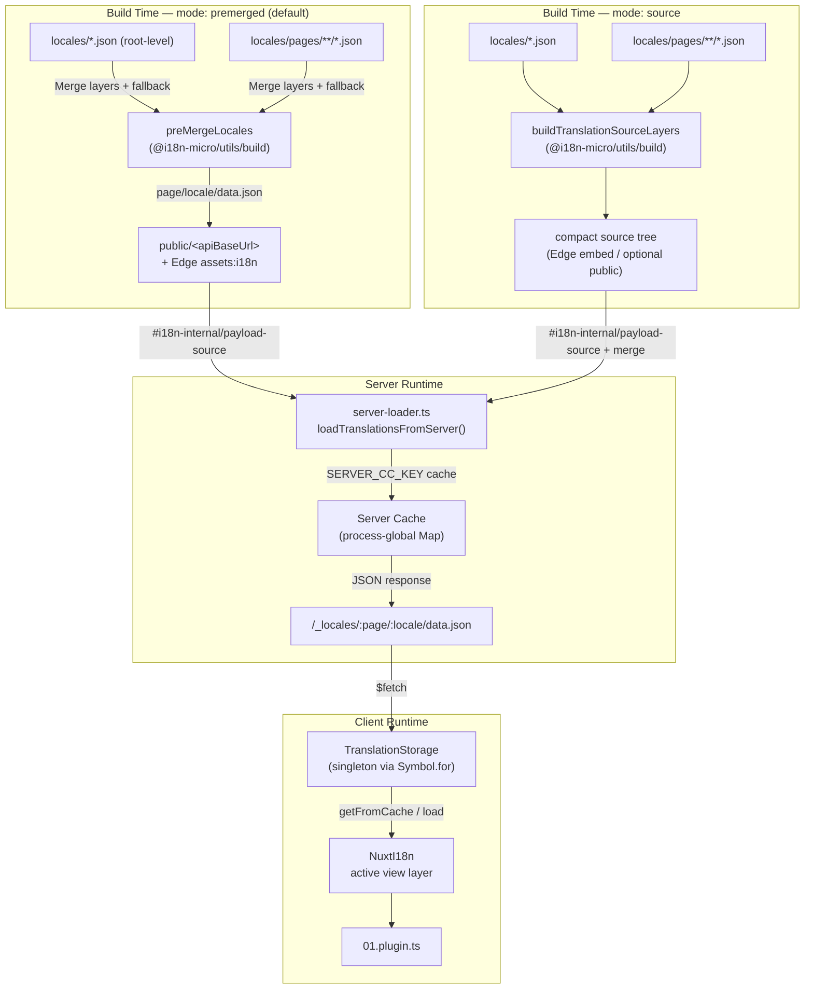

# 🗄️ Arquitectura de caché y almacenamiento de traducciones

## 📖 Descripción general

Nuxt I18n Micro v3 usa una arquitectura de caché multicapa para las traducciones. La carga de payloads depende de `translationPayloads.mode`:

- **`premerged`** (por defecto) — los archivos de raíz, página, fallback y capas se fusionan en tiempo de compilación mediante `@i18n-micro/utils/build` en `\{page\}/\{locale\}/data.json`.
- **`source`** — se mantienen archivos fuente compactos para fusionarlos en runtime mediante `@i18n-micro/utils/source-loader` y `@i18n-micro/utils/merge-source` (Edge los incrusta en `serverAssets` de Nitro; Node los lee desde `public/` cuando se copian).

Esta página describe cómo funciona la caché integrada y cómo extenderla para casos de uso personalizados (herramientas de administración, APIs externas, invalidación de caché).

## 📊 Descripción de la arquitectura

### Flujo de datos



## 🧱 Componentes principales

### 1. `TranslationStorage` (cliente + servidor)

**Archivo**: `src/runtime/utils/storage.ts`

Una clase singleton que proporciona almacenamiento unificado de traducciones tanto para cliente como para servidor. Usa `Symbol.for('__NUXT_I18N_STORAGE_CACHE__')` en `globalThis` para asegurar que solo existe una instancia, incluso cuando se cargan varios bundles.

**Métodos principales:**

| Método                              | Descripción                                                             |
| ----------------------------------- | ----------------------------------------------------------------------- |
| `getFromCache(locale, routeName?)`  | Comprobación síncrona: devuelve los datos en memoria en caché, o `null` |
| `load(locale, routeName?, options)` | Carga asíncrona con caché: primero comprueba la caché, luego usa `$fetch` |
| `clear()`                           | Vacía la caché completa                                                 |

**Formato de la clave de caché**: `\{locale\}:\{routeName\}` (por ejemplo, `en:index`, `fr:about`)

```typescript
import { translationStorage } from '../utils/storage'

// Synchronous cache check
const cached = translationStorage.getFromCache('en', 'index')

// Async load (with automatic caching)
const result = await translationStorage.load('en', 'index', {
  apiBaseUrl: '_locales',
  baseURL: '/',
  dateBuild: '2024-01-01',
})
// result.data — merged translations
// result.cacheKey — cache key used
```

### ⚙️ Invalidación de caché determinista (`i18n.dateBuild`)

Por defecto, este módulo genera `dateBuild` en tiempo de compilación usando `Date.now()`. Después se incrusta en el `#build/i18n.strategy.mjs` generado y se usa como parámetro de consulta (`?v=...`) para invalidar las cachés de fetch de traducciones tras las recompilaciones.

Si necesitas compilaciones reproducibles (por ejemplo, para mejorar las tasas de acierto de caché de chunks en despliegues progresivos), establece un valor estable en `nuxt.config`:

```ts
export default defineNuxtConfig({
  i18n: {
    // Any stable string/number (git SHA, CI build number, release tag, etc.)
    dateBuild: process.env.GIT_SHA ?? 'local-dev',
  },
})
```

### 2. `loadTranslationsFromServer()` (solo servidor)

**Archivo**: `src/runtime/server/utils/server-loader.ts`

Carga las traducciones para un idioma/página y almacena en caché el resultado fusionado en un map global de proceso `CacheControl` con clave `@i18n-micro/hmr/cache-keys` (`SERVER_CC_KEY`).

Comportamiento: SSR carga desde `#i18n-internal/payload-source` — en **Node** `readFile` bajo `public/<apiBaseUrl>` (`\{page\}/\{locale\}/data.json` en modo premerged), en **Edge** `assets:i18n`. `premerged` lee un solo archivo; `source` fusiona raíz/página/fallback mediante `@i18n-micro/utils/source-loader`.

```typescript
import { loadTranslationsFromServer } from '../server/utils/server-loader'

// Returns { data: Translations, json: string }
const { data, json } = await loadTranslationsFromServer('en', 'index')
```

### 3. Carga en cliente (sin incrustación en HTML)

Los diccionarios **no** se escriben en `nuxtApp.payload`. El servidor los mantiene en memoria para el renderizado SSR; el plugin del cliente hace `await` a `switchContext`, que carga `/\{apiBaseUrl\}/:page/:locale/data.json` (la misma postura por defecto que `@nuxtjs/i18n` con `experimental.preload: false`).

`NuxtI18n` mantiene el diccionario activo de la capa de vista usado por `$t()` y `$has()`. `NuxtTranslationLoader` cambia el contexto de idioma/ruta y fusiona los chunks en esa capa.

### 4. Ruta de API del servidor

**Ruta**: `/_locales/\{page\}/\{locale\}/data.json`

**Archivo**: `src/runtime/server/routes/i18n.ts`

Esta ruta de Nitro sirve traducciones fusionadas para el modo de payload activo. Llama a `loadTranslationsFromServer()` y devuelve el resultado como JSON.

En producción también establece:

```http
Cache-Control: public, max-age={httpCacheDuration}, immutable
```

El `httpCacheDuration` por defecto es `31536000` (1 año). Es seguro porque los clientes solicitan payloads con cache-busting `?v=\{dateBuild\}`. Establece `httpCacheDuration: 0` para omitir el encabezado. El encabezado no se aplica en desarrollo.

## 📥 Extensión: carga personalizada de traducciones

### Leer desde caché (ruta del servidor)

```ts
// server/api/i18n/load-cache.[post].ts
import { defineEventHandler, readBody } from 'h3'
import { loadTranslationsFromServer } from '#imports'

export default defineEventHandler(async (event) => {
  const { page, locale } = await readBody<{ page: string; locale: string }>(event)
  const { data } = await loadTranslationsFromServer(locale, page)
  return { locale, page, data }
})
```

### Actualizar traducciones (archivo + invalidar caché)

```ts
// server/api/i18n/update.[post].ts
import { defineEventHandler, readBody, createError } from 'h3'
import { join } from 'node:path'
import { readFile, writeFile } from 'node:fs/promises'
import { deepMergeTranslations } from '@i18n-micro/utils/deep-merge'

export default defineEventHandler(async (event) => {
  const { path, updates } = await readBody<{ path: string; updates: Record<string, unknown> }>(event)

  if (!path || !updates) {
    throw createError({ statusCode: 400, statusMessage: 'Missing path or updates' })
  }

  const fullPath = join('locales', path)
  let existing: Record<string, unknown> = {}

  try {
    const content = await readFile(fullPath, 'utf-8')
    existing = JSON.parse(content) as Record<string, unknown>
  } catch {
    // File does not exist — create new
  }

  const merged = deepMergeTranslations(existing, updates)
  await writeFile(fullPath, JSON.stringify(merged, null, 2), 'utf-8')

  return { success: true, path, updated: merged }
})
```


## 🧹 Limpiar la caché

### Limpieza programática de caché (cliente)

Usa el método integrado `$clearCache`:

```vue
<script setup>
const { $clearCache } = useNuxtApp()

// Clears both TranslationStorage and plugin-level cache
$clearCache()
</script>
```

### Comportamiento de la caché del servidor

La caché del lado del servidor (`loadTranslationsFromServer`) es global al proceso y persiste hasta que:

- El proceso del servidor se reinicie.
- Se detecte un nuevo despliegue (valor diferente de `dateBuild`).

Para entornos serverless, cada cold start tiene una caché nueva.

## ⚙️ Configuración serverless

Para entornos serverless (Cloudflare Workers, AWS Lambda), la caché integrada usa objetos `Map` en memoria. No se necesita configuración externa de almacenamiento para la caché de traducciones en sí.

Sin embargo, el almacenamiento de Nitro para los archivos fuente de traducción puede requerir configuración:

```ts
export default defineNuxtConfig({
  nitro: {
    storage: {
      // Only needed if default file-system storage is unavailable
      'assets:server': {
        driver: 'cloudflare-kv-binding',
        binding: 'MY_KV_NAMESPACE',
      },
    },
  },
})
```

## 💡 Diferencias clave con respecto a v2

| Aspecto            | v2                             | v3                                                                        |
| ------------------ | ------------------------------ | ------------------------------------------------------------------------- |
| Caché de cliente   | `useStorage('cache')`          | Singleton `TranslationStorage` (Symbol.for en globalThis)                 |
| Transferencia SSR  | Runtime config                 | Chunks completos vía `payload.data` (v3.0 usaba `useState`)               |
| Caché de servidor  | Nitro cache storage            | `Map` global de proceso vía `Symbol.for`                                  |
| Lógica de fusión   | Lado cliente                   | Tiempo de compilación (`premerged`) o runtime (`source`) mediante `@i18n-micro/utils/*` |
| Formato de clave   | `i18n:merged:\{page\}:\{locale\}` | `\{locale\}:\{routeName\}`                                                    |

## 📚 Relacionado

- [Guía de rendimiento](/guides/performance) — Cómo afecta la caché al rendimiento
- [Traducciones del lado del servidor](/guides/server-side-translations) — Usar traducciones en rutas del servidor
- [Despliegue en Firebase](/guides/firebase) — Consideraciones de caché específicas del despliegue
