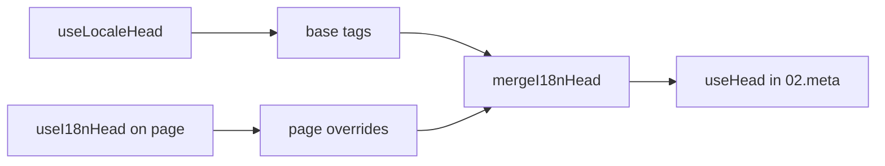

# Composable `useI18nHead`

`useI18nHead` te permite personalizar las etiquetas SEO de i18n **por página** sin un plugin de meta personalizado. Cuando `meta: true`, el módulo fusiona tu entrada sobre la salida de [`useLocaleHead`](/api/composables/use-locale-head).

Casos típicos:

- **Artículos de CMS / blog** — solo algunos idiomas están traducidos; las URLs alternativas difieren por idioma (slugs o paths distintos).
- **Canonical dinámica** — la URL canónica debe coincidir con la URL del artículo de la API, no con `$switchLocalePath`.
- **Open Graph adicional** — `og:title`, `og:description`, `og:image` junto a los `og:locale` / `og:url` autogenerados.
- **Control parcial** — mantén el canonical y `og:url` generados por el módulo, pero reemplaza solo `hreflang` y `og:locale:alternate`.

---

## Firma

{/* generated:symbol:useI18nHead — do not edit; run `pnpm run docs:generate` */}

```ts
useI18nHead(input?: MaybeRefOrGetter<I18nHeadInput | null>): { pageHead: any; resetPageHead: () => void }
```

Registra anulaciones a nivel de página para las etiquetas head de SEO i18n. Se fusiona encima de la salida de `useLocaleHead` por el plugin `02.meta`.

| Parámetro | Tipo | Descripción |
| --- | --- | --- |
| `input` *(opcional)* | `MaybeRefOrGetter<I18nHeadInput \| null>` |  |

{/* /generated:symbol:useI18nHead */}

## Cómo encaja en el pipeline



Llamas a `useI18nHead` en un componente de página. El plugin `02.meta` aplica las anulaciones tras cada `updateMeta()` (cambio de ruta, `$setI18nRouteParams`, `page:finish` en cliente).

---

## Ejemplo 1: artículo con traducciones solo en algunos idiomas

Patrón habitual: la API devuelve qué idiomas existen y sus URLs absolutas o relativas.

```ts
interface Article {
  title: string
  slug: string
  /** Locale code → page URL (absolute or site-relative) */
  locales: Record<string, string>
}
```

```vue
<script setup lang="ts">
const route = useRoute()
const { data: article } = await useFetch<Article>(`/api/articles/${route.params.slug}`)

const localeCodes = computed(() => Object.keys(article.value?.locales ?? {}))

useI18nHead(() => {
  if (!article.value) return null

  return {
    meta: [
      { property: 'og:title', content: article.value.title },
      { property: 'og:type', content: 'article' },
    ],
    replace: {
      hreflang: localeCodes.value.map((locale) => ({
        rel: 'alternate',
        hreflang: locale,
        href: article.value!.locales[locale]!,
      })),
      ogAlternates: localeCodes.value,
    },
  }
})
</script>
```

`ogAlternates` toma **códigos de idioma** de tu configuración `i18n.locales`. Los valores para `og:locale:alternate` se resuelven mediante `locale.og` o `iso` (formato Open Graph `en_US`).

---

## Ejemplo 2: artículo con slugs por idioma (`$defineI18nRoute` + `$setI18nRouteParams`)

Cuando las URLs se construyen a partir de plantillas de ruta localizadas y parámetros dinámicos:

```vue
<script setup lang="ts">
const { $defineI18nRoute, $setI18nRouteParams } = useNuxtApp()
const route = useRoute()

const { data: article } = await useFetch(`/api/articles/${route.params.slug}`)

$defineI18nRoute({
  localeRoutes: {
    en: '/blog/[slug]',
    de: '/de/blog/[slug]',
    fr: '/fr/blog/[slug]',
  },
})

if (article.value) {
  $setI18nRouteParams({
    en: { slug: article.value.slugEn },
    de: { slug: article.value.slugDe },
    fr: { slug: article.value.slugFr },
  })

  const availableLocales = article.value.availableLocales as string[]

  useI18nHead({
    meta: [{ property: 'og:title', content: article.value.title }],
    replace: {
      hreflang: availableLocales.map((locale) => ({
        rel: 'alternate',
        hreflang: locale,
        href: article.value!.urls[locale],
      })),
      ogAlternates: availableLocales,
    },
  })
}
</script>
```

Los alternates generados por el módulo listarían **todos** los idiomas configurados. `replace.hreflang` limita las etiquetas a los idiomas que realmente tienen traducción.

---

## Ejemplo 3: `x-default` personalizado para la URL del artículo en idioma por defecto

Por defecto, `x-default` apunta a la URL del idioma por defecto desde `$switchLocalePath`. Para artículos, apúntalo a la URL de la traducción por defecto:

```vue
<script setup lang="ts">
const { $defaultLocale } = useNuxtApp()
const article = await loadArticle()

const defaultLocale = $defaultLocale() ?? 'en'
const defaultHref = article.locales[defaultLocale]

useI18nHead({
  replace: {
    hreflang: Object.entries(article.locales).map(([locale, href]) => ({
      rel: 'alternate',
      hreflang: locale,
      href,
    })),
    xDefault: defaultHref ? { rel: 'alternate', hreflang: 'x-default', href: defaultHref } : false,
    ogAlternates: Object.keys(article.locales),
  },
})
</script>
```

---

## Ejemplo 4: reemplazar canonical y `og:url` desde datos de la API

Cuando el canonical debe coincidir con una URL proporcionada por el CMS (multidominio, path personalizado o URL absoluta preconstruida):

```vue
<script setup lang="ts">
const article = await loadArticle()
const canonical = article.canonicalUrl // e.g. https://www.example.com/en/blog/my-post

useI18nHead({
  replace: {
    canonical,
    ogUrl: canonical,
    hreflang: buildAlternateLinks(article),
    ogAlternates: Object.keys(article.locales),
  },
  meta: [
    { property: 'og:title', content: article.title },
    { name: 'description', content: article.excerpt },
  ],
})
</script>
```

---

## Ejemplo 5: mantener canonical / `og:url` automáticos, reemplazar solo alternates

Si `$switchLocalePath` + `$setI18nRouteParams` ya producen canonical y `og:url` correctos, reemplaza solo las etiquetas de discovery:

```vue
<script setup lang="ts">
const article = await loadArticle()

useI18nHead({
  replace: {
    hreflang: buildAlternateLinks(article),
    ogAlternates: Object.keys(article.locales),
  },
})
</script>
```

---

## Ejemplo 6: head completo para una página de detalle de contenido (meta + links)

Patrón similar a dividir "page meta" y "alternate links" en helpers separados, combinado en una sola llamada:

```vue
<script setup lang="ts">
const article = await loadArticle()
const alternates = Object.entries(article.locales).map(([locale, href]) => ({
  rel: 'alternate' as const,
  hreflang: locale,
  href: normalizeSeoUrl(href), // strip ?query and #hash if needed
}))

useI18nHead({
  meta: [
    { property: 'og:title', content: article.title },
    { property: 'og:description', content: article.description },
    { property: 'og:image', content: article.imageUrl },
    { name: 'twitter:card', content: 'summary_large_image' },
    { name: 'twitter:title', content: article.title },
  ],
  replace: {
    canonical: article.canonicalUrl,
    ogUrl: article.canonicalUrl,
    hreflang: alternates,
    ogAlternates: Object.keys(article.locales),
  },
})
</script>
```

```ts
/** Remove query and hash — useful when CMS URLs must be clean for SEO */
function normalizeSeoUrl(href: string): string {
  try {
    const url = new URL(href, 'https://placeholder.local')
    url.search = ''
    url.hash = ''
    return href.startsWith('http') ? url.href : `${url.pathname}`
  } catch {
    return href.split(/[?#]/)[0] ?? href
  }
}
```

---

## Ejemplo 7: dos tipos de contenido, mismo patrón (news vs guides)

Misma forma de API, distintos nombres de ruta. Reutiliza un pequeño helper:

```ts
// composables/useArticleHead.ts
import type { I18nHeadInput } from '@i18n-micro/types'

interface LocalizedContent {
  title: string
  locales: Record<string, string>
  canonicalUrl?: string
}

export function buildArticleHead(content: LocalizedContent): I18nHeadInput {
  const localeCodes = Object.keys(content.locales)
  const canonical = content.canonicalUrl ?? content.locales.en

  return {
    meta: [{ property: 'og:title', content: content.title }],
    replace: {
      canonical,
      ogUrl: canonical,
      hreflang: localeCodes.map((locale) => ({
        rel: 'alternate',
        hreflang: locale,
        href: content.locales[locale]!,
      })),
      ogAlternates: localeCodes,
    },
  }
}
```

```vue
<!-- pages/blog/[slug].vue -->
<script setup lang="ts">
const article = await loadArticle()
useI18nHead(buildArticleHead(article))
</script>
```

```vue
<!-- pages/guides/[slug].vue -->
<script setup lang="ts">
const guide = await loadGuide()
useI18nHead(buildArticleHead(guide))
</script>
```

---

## Ejemplo 8: desactivar alternates integrados, aportar tu propia lista

Equivalente a desactivar el generador de hreflang del módulo y pasar una lista personalizada (sin conjuntos duplicados de alternate):

```vue
<script setup lang="ts">
const article = await loadArticle()

useI18nHead({
  disable: ['hreflang', 'x-default', 'og-alternates'],
  link: Object.entries(article.locales).map(([locale, href]) => ({
    rel: 'alternate',
    hreflang: locale,
    href,
  })),
  replace: {
    ogAlternates: Object.keys(article.locales),
  },
})
</script>
```

O prefiere `replace.hreflang` sin `disable`. Reemplaza todos los enlaces `rel="alternate"` en un solo paso.

---

## Ejemplo 9: landing page: solo OG extra, mantén todas las etiquetas i18n

```vue
<script setup lang="ts">
const { t } = useI18n()

useI18nHead({
  meta: [
    { property: 'og:title', content: t('landing.ogTitle') },
    { property: 'og:description', content: t('landing.ogDescription') },
  ],
})
</script>
```

---

## Ejemplo 10: página de producto: desactivar hreflang para un experimento en un solo idioma

```vue
<script setup lang="ts">
useI18nHead({
  disable: ['hreflang', 'x-default'],
  // canonical, og:locale, og:url still generated
})
</script>
```

---

## Ejemplo 11: actualizaciones reactivas tras un fetch en el cliente

```vue
<script setup lang="ts">
const article = ref<Article | null>(null)

onMounted(async () => {
  article.value = await $fetch('/api/articles/latest')
})

useI18nHead(() => {
  if (!article.value) return null
  return {
    meta: [{ property: 'og:title', content: article.value.title }],
    replace: {
      hreflang: Object.entries(article.value.locales).map(([locale, href]) => ({
        rel: 'alternate',
        hreflang: locale,
        href,
      })),
    },
  }
})
</script>
```

El head se refresca en `page:finish` y cuando el estado `pageHead` cambia.

---

## Ejemplo 12: origen HTTPS detrás de un proxy inverso

Si antes resolvías un composable de "origen público" para URLs absolutas canónicas / alternates, usa la configuración del módulo en su lugar:

```ts
// nuxt.config.ts
export default defineNuxtConfig({
  i18n: {
    meta: true,
    // undefined = origin from current request (multi-domain friendly)
    metaBaseUrl: undefined,
    metaTrustForwardedHost: true,
    metaTrustForwardedProto: true,
  },
})
```

Después, pasa **paths o URLs completas** en `replace.hreflang` / `replace.canonical`. El módulo usa `useRequestURL` con `X-Forwarded-Host` / `X-Forwarded-Proto` en SSR.

---

## Referencia de la API

### `meta`

Etiquetas `<meta>` adicionales. Deduplicadas por `id`, `property` o `name`.

### `link`

Etiquetas `<link>` adicionales. Deduplicadas por `id` o `rel` + `hreflang`.

### `htmlAttrs`

Se fusiona en los atributos de `<html>` de `useLocaleHead` (`lang`, `dir`).

### `replace`

| Clave          | Tipo                      | Efecto                                          |
| -------------- | ------------------------- | ----------------------------------------------- |
| `canonical`    | `string \| false`         | Reemplazar o eliminar el enlace canonical.      |
| `hreflang`     | `I18nHeadLink[] \| false` | Reemplazar o eliminar todos los enlaces `rel="alternate"`. |
| `xDefault`     | `I18nHeadLink \| false`   | Reemplazar o eliminar `hreflang="x-default"`.   |
| `ogLocale`     | `string \| false`         | Reemplazar o eliminar `og:locale`.              |
| `ogUrl`        | `string \| false`         | Reemplazar o eliminar `og:url`.                 |
| `ogAlternates` | `string[] \| false`       | Reconstruir `og:locale:alternate` para los códigos de idioma. |

### `disable`

| Valor           | Elimina                                          |
| --------------- | ------------------------------------------------ |
| `hreflang`      | Enlaces alternate de idioma (no `x-default`).    |
| `x-default`     | Enlace `hreflang="x-default"`.                   |
| `canonical`     | Enlace canonical.                                |
| `og`            | `og:locale` y `og:url`.                          |
| `og-alternates` | Etiquetas `og:locale:alternate`.                 |
| `html`          | `lang` / `dir` en `<html>`.                      |

---

## `useLocaleHead` frente a `useI18nHead`

| Composable      | Ámbito                | Cuándo usar                                     |
| --------------- | --------------------- | ----------------------------------------------- |
| `useLocaleHead` | Global / head manual  | `meta: false`, configuración `useHead` totalmente personalizada. |
| `useI18nHead`   | Anulaciones por página | `meta: true`, personalizar páginas específicas. |

Cuando `meta: true`, **no** necesitas `useLocaleHead` en páginas que solo usan `useI18nHead`.

---

## Migrar desde un plugin de head i18n personalizado

Muchos proyectos mantienen un plugin personalizado que:

- fusiona enlaces alternate específicos de página desde estado compartido;
- filtra entradas `hreflang` regionales duplicadas;
- normaliza valores de `og:locale`;
- elimina query strings de las URLs SEO.

Puedes reemplazar eso con `useI18nHead` en cada página de contenido y con los valores por defecto del módulo.

| Enfoque anterior                                       | Con `useI18nHead`                                    |
| ------------------------------------------------------ | ---------------------------------------------------- |
| Estado compartido + "qué idiomas existen para este artículo" | `replace: \{ ogAlternates: localeCodes \}`             |
| Helper separado que construye enlaces `rel="alternate"` | `replace: \{ hreflang: links \}`                       |
| Plugin personalizado que fusiona el estado de página en el head | Fusión integrada en `02.meta`                        |
| "Origen público" personalizado para URLs absolutas     | `metaBaseUrl` + encabezados forwarded (ver Ejemplo 12) |
| `og:locale` corto (`en` en lugar de `en_US`)           | Establece `locale.og` o usa `iso` → `en_US` (protocolo OG) |

**`hreflang` desde `iso`:** cada idioma emite un alternate con `hreflang = iso || code`. El `code` de enrutamiento nunca se usa cuando `iso` está establecido (evita etiquetas inválidas como `hreflang="mx"`). Opta por fallbacks de idioma desnudo (`es-ES` → también `es`) con `hreflangBaseLanguage: true` — derivado de `iso`, no de `code`. Para listas totalmente personalizadas, usa `replace.hreflang`.

**JSON-LD:** `useI18nHead` no genera datos estructurados. Mantén `useHead(\{ script: [...] \})` o un helper JSON-LD dedicado junto a él.

---

## Ver también

- [Guía de SEO](/guides/seo) — generación automática de meta y anulaciones a nivel de página.
- [`useLocaleHead`](/api/composables/use-locale-head) — API de head de bajo nivel.
