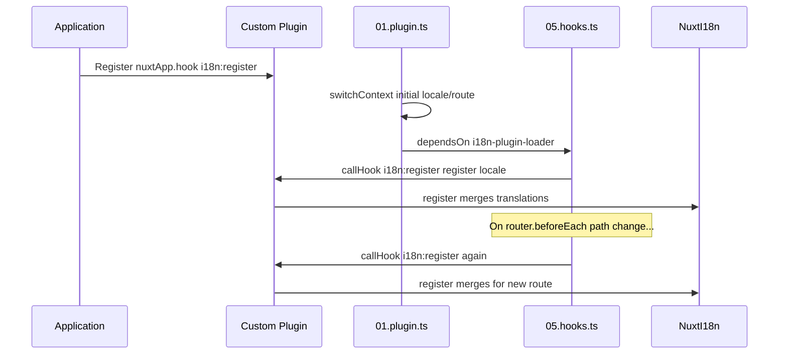

# 📢 Eventos

## 🔄 `i18n:register`

El evento `i18n:register` en `Nuxt I18n Micro` permite añadir dinámicamente traducciones al contexto i18n de tu aplicación, haciendo el proceso de internacionalización fluido y flexible. Este evento te permite integrar nuevas traducciones según sea necesario, mejorando las capacidades de localización de tu aplicación.

### 📝 Detalles del evento

- **Propósito**:
  - Permite incorporar dinámicamente traducciones adicionales al conjunto existente para un idioma específico.

- **Payload**:
  - **`register`**:
    - Una función proporcionada por el evento que toma dos argumentos:
      - **`translations`** (`Translations`):
        - Un objeto que contiene pares clave-valor con traducciones, organizados según la interfaz `Translations`.
      - **`locale`** (`string`, opcional):
        - El código de idioma (por ejemplo, `'en'`, `'ru'`) para el que se registran las traducciones. Por defecto, el idioma proporcionado por el evento si no se especifica.

- **Comportamiento**:
  - Cuando se activa, la función `register` fusiona las nuevas traducciones en el contexto actual para el idioma especificado, actualizando las traducciones disponibles en toda la aplicación.

### ⏱️ Cuándo se dispara

El plugin de hooks del módulo (`05.hooks.ts`, `dependsOn: ['i18n-plugin-loader']`) llama a `nuxtApp.callHook('i18n:register', …)`:

1. **Una vez al inicio** — después de que el plugin principal de i18n (`01.plugin.ts`) haya cargado las traducciones de la ruta inicial.
2. **En la navegación** — en `router.beforeEach` cuando la ruta cambia, o en cada navegación cuando `strategy: 'no_prefix'`.

Registra tu listener en un plugin normal de Nuxt con `nuxtApp.hook('i18n:register', …)`. El plugin de hooks se ejecuta después de que el loader esté listo, por lo que tu callback se invoca cuando las traducciones necesitan ampliarse.

Establece `hooks: false` en `nuxt.config` para desactivar las llamadas automáticas a `i18n:register` (consulta [Configuración — `hooks`](/guides/configuration#hooks)).

### 💡 Ejemplo de uso

El siguiente ejemplo muestra cómo usar el evento `i18n:register` para añadir traducciones dinámicamente:

```typescript
nuxt.hook('i18n:register', async (register: (translations: unknown, locale?: string) => void, locale: string) => {
  register(
    {
      greeting: 'Hello',
      farewell: 'Goodbye',
    },
    locale,
  )
})
```

### 🛠️ Explicación



- **Disparo del evento**:
  - El plugin de hooks (`05.hooks.ts`) dispara `i18n:register` después de que el loader principal esté listo y en las navegaciones relevantes.

- **Añadir traducciones**:
  - El ejemplo registra traducciones en inglés para `"greeting"` y `"farewell"`.
  - La función `register` fusiona estas traducciones en el conjunto existente para el idioma proporcionado.

### 🔗 Beneficios clave

- **Actualizaciones dinámicas**:
  - Actualiza o añade traducciones fácilmente sin necesidad de volver a desplegar toda tu aplicación.

- **Flexibilidad de localización**:
  - Admite ajustes de localización en tiempo real según las necesidades del usuario o de la aplicación.

Usando el evento `i18n:register`, puedes asegurar que la estrategia de localización de tu aplicación siga siendo flexible y adaptable, mejorando la experiencia general del usuario.

---

## 🛠️ Modificar traducciones con plugins

Para modificar dinámicamente las traducciones en tu aplicación Nuxt, se recomienda usar plugins. Los plugins proporcionan una forma estructurada de manejar las actualizaciones de localización, especialmente cuando se trabaja con módulos o archivos de traducción externos.

### **Registrar el plugin**

Si estás usando un módulo, registra el plugin donde ocurrirán las modificaciones de traducción añadiéndolo a la configuración de tu módulo:

```javascript
addPlugin({
  src: resolve('./plugins/extend_locales'),
})
```

Esto registra el plugin ubicado en `./plugins/extend_locales`, que se encargará de la carga y registro dinámicos de traducciones.

### **Implementar el plugin**

En el plugin puedes gestionar modificaciones de idioma. Aquí tienes un ejemplo de implementación en un plugin de Nuxt:

```typescript
import { defineNuxtPlugin } from '#app'

export default defineNuxtPlugin(async (nuxtApp) => {
  // Function to load translations from JSON files and register them
  const loadTranslations = async (lang: string) => {
    try {
      const translations = await import(`../locales/${lang}.json`)
      return translations.default
    } catch (error) {
      console.error(`Error loading translations for language: ${lang}`, error)
      return null
    }
  }

  // Hook into the 'i18n:register' event to dynamically add translations
  // eslint-disable-next-line @typescript-eslint/ban-ts-comment
  // @ts-expect-error
  nuxtApp.hook('i18n:register', async (register: (translations: unknown, locale?: string) => void, locale: string) => {
    const translations = await loadTranslations(locale)
    if (translations) {
      register(translations, locale)
    }
  })
})
```

### 📝 Explicación detallada

1. **Carga de traducciones**:

- La función `loadTranslations` importa dinámicamente los archivos de traducción según el idioma. Se espera que los archivos estén en el directorio `locales` y se nombren según los códigos de idioma (por ejemplo, `en.json`, `de.json`).
- En caso de carga exitosa, se devuelven las traducciones; de lo contrario, se registra un error.

2. **Registro de traducciones**:

- El plugin se engancha al evento `i18n:register` usando `nuxtApp.hook`.
- Cuando se dispara el evento, se llama a la función `register` con las traducciones cargadas y el idioma correspondiente.
- Esto fusiona las nuevas traducciones en el contexto i18n para el idioma especificado, actualizando las traducciones disponibles en toda la aplicación.

### 🔗 Beneficios de usar plugins para modificaciones de traducción

- **Separación de responsabilidades**:
  - Encapsula la lógica de localización de forma separada del código principal de la aplicación, facilitando la gestión y el mantenimiento.

- **Dinámico y escalable**:
  - Al cargar y registrar traducciones dinámicamente, puedes actualizar contenido sin requerir un redespliegue completo de la aplicación, lo cual es especialmente útil para aplicaciones con contenido frecuentemente actualizado o multilingüe.

- **Mayor flexibilidad de localización**:
  - Los plugins te permiten modificar o extender las traducciones según sea necesario, proporcionando una estrategia de localización más adaptable y receptiva que se ajusta a las preferencias del usuario o los requisitos del negocio.

Al adoptar este enfoque, puedes expandir y modificar eficientemente la localización de tu aplicación mediante un proceso estructurado y mantenible utilizando plugins, manteniendo la internacionalización adaptativa a las necesidades cambiantes y mejorando la experiencia general del usuario.
