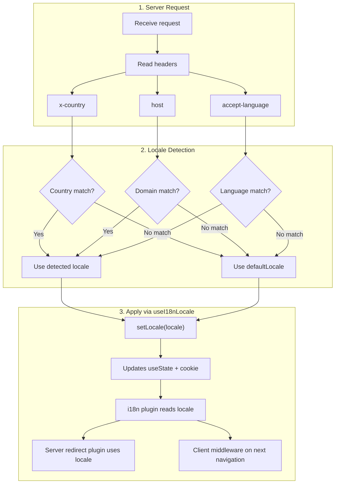

# 🔧 Detección de idioma personalizada en Nuxt I18n Micro

## 📖 Descripción general

Nuxt I18n Micro v3 proporciona un composable centralizado — `useI18nLocale()` — para toda la gestión del idioma. Esto reemplaza los patrones manuales de `useState`/`useCookie` de v2. Al usar `useI18nLocale().setLocale()` en un plugin del servidor, puedes implementar cualquier lógica de detección personalizada manteniendo la compatibilidad completa con los sistemas de redirección y cookies del módulo.

## 🏗️ Arquitectura

```mermaid
flowchart TB
    subgraph Plugins["Plugin Execution Order"]
        A["Your plugin<br/>order: -10"] -->|setLocale()| B["01.plugin.ts<br/>order: -5"]
        B --> C["06.redirect.ts server<br/>order: 10"]
    end

    subgraph Client["Client SPA Navigation"]
        D["i18n-redirect.global.ts<br/>route middleware"]
    end

    subgraph State["Locale State"]
        E["useState('i18n-locale')"]
        F["localeCookie"]
    end

    A -->|"setLocale() updates both"| E
    A -->|"setLocale() updates both"| F
    B -->|reads| E
    C -->|reads| E
    C -->|reads| F
    D -->|reads target route +| E
```

**Principio clave**: Llama a `useI18nLocale().setLocale()` en un plugin del servidor con `order: -10`. Esto actualiza tanto `useState('i18n-locale')` como la cookie de idioma de forma atómica, para que el plugin i18n (`order: -5`) y el plugin de redirección del servidor (`order: 10`) vean el idioma correcto en la primera solicitud SSR. Las auto-redirecciones del lado cliente se ejecutan en el middleware global de rutas en navegaciones posteriores.

## 🛠️ Desactivar la detección automática integrada

Si quieres control total sobre la detección de idioma, desactiva el mecanismo integrado:

```ts
export default defineNuxtConfig({
  i18n: {
    autoDetectLanguage: false,
  },
})
```

## ✨ Ejemplo: detección del lado del servidor con `useI18nLocale`

Este es el **enfoque recomendado** para todas las estrategias.

### Paso 1: configurar `nuxt.config.ts`

```ts
export default defineNuxtConfig({
  modules: ['nuxt-i18n-micro'],
  i18n: {
    strategy: 'no_prefix', // Works with ANY strategy
    defaultLocale: 'en',
    localeCookie: 'user-locale',
    autoDetectLanguage: false,
    locales: [
      { code: 'en', iso: 'en-US' },
      { code: 'de', iso: 'de-DE' },
      { code: 'ja', iso: 'ja-JP' },
    ],
  },
})
```

### Paso 2: crear `plugins/i18n-loader.server.ts`

```ts
import { defineNuxtPlugin, useRequestHeaders } from '#imports'

export default defineNuxtPlugin({
  name: 'i18n-custom-loader',
  enforce: 'pre',
  order: -10, // Execute BEFORE the i18n plugin (which has order -5)

  setup() {
    const { setLocale } = useI18nLocale()
    const headers = useRequestHeaders(['host', 'x-country', 'accept-language'])
    let detectedLocale = 'en'

    // --- YOUR DETECTION LOGIC ---

    // Example 1: By domain
    const host = headers['host']
    if (host?.includes('example.de')) {
      detectedLocale = 'de'
    }
    // Example 2: By custom header
    else if (headers['x-country'] === 'JP') {
      detectedLocale = 'ja'
    }
    // Example 3: By Accept-Language header
    else if (headers['accept-language']?.includes('de')) {
      detectedLocale = 'de'
    }

    // --- APPLY THE LOCALE ---
    setLocale(detectedLocale)
  },
})
```

### Cómo funciona



1. **El plugin se ejecuta primero** (`order: -10`) — detecta el idioma desde encabezados, dominio u otras fuentes.
2. **`setLocale()` actualiza ambos**: `useState('i18n-locale')` y cookie. Asegura visibilidad inmediata para todos los plugins posteriores.
3. **Plugin i18n** (`order: -5`) lee el idioma y carga las traducciones correctas.
4. **Plugin de redirección del servidor** (`order: 10`) usa el idioma para decisiones de redirección en SSR.
5. **Middleware de ruta del cliente** (`i18n-redirect`) aplica redirecciones en la navegación SPA cuando el idioma de la URL no coincide con la preferencia.

## 🌐 Comportamiento específico por estrategia

`useI18nLocale().setLocale()` funciona con **todas las estrategias**. El comportamiento de redirección depende de la estrategia:

<Tip>
| Estrategia | Efecto de `setLocale('de')` |
|----------|---------------------------|
| `no_prefix` | Renderiza en alemán, sin cambio de URL. |
| `prefix` | 302 → `/de/` (redirección del lado del servidor). |
| `prefix_except_default` | 302 → `/de/` si `de` ≠ default; sin redirección si `de` = default. |
| `prefix_and_default` | Sin redirección (tanto `/` como `/de/` son válidas). |
</Tip>

**Notas importantes:**

- La detección de idioma basada en cookies está desactivada por defecto (`localeCookie: null`).
- Establece `localeCookie: 'user-locale'` para habilitar la persistencia por cookies.
- Si el valor de la cookie/estado no está en la lista `locales`, recurre a `defaultLocale`.

## 🏢 Avanzado: detección basada en dominio

Para configuraciones multidominio donde cada dominio sirve un idioma diferente:

```ts
import { defineNuxtPlugin, useRequestHeaders } from '#imports'

export default defineNuxtPlugin({
  name: 'i18n-domain-loader',
  enforce: 'pre',
  order: -10,

  setup() {
    const { setLocale } = useI18nLocale()
    const headers = useRequestHeaders(['host'])
    const host = headers['host'] || ''

    let detectedLocale = 'en'

    if (host.endsWith('.de') || host.includes('german.')) {
      detectedLocale = 'de'
    } else if (host.endsWith('.fr') || host.includes('french.')) {
      detectedLocale = 'fr'
    } else if (host.endsWith('.jp') || host.includes('japanese.')) {
      detectedLocale = 'ja'
    }

    setLocale(detectedLocale)
  },
})
```

## 🔄 Avanzado: respetar la preferencia del usuario

Si los usuarios pueden cambiar de idioma manualmente, respeta su elección sobre la autodetección:

```ts
import { defineNuxtPlugin, useRequestHeaders } from '#imports'

export default defineNuxtPlugin({
  name: 'i18n-smart-loader',
  enforce: 'pre',
  order: -10,

  setup() {
    const { getLocale, setLocale } = useI18nLocale()

    // If user already has a preference (from cookie), respect it
    if (getLocale()) {
      return
    }

    // Otherwise, detect locale from headers
    const headers = useRequestHeaders(['accept-language'])
    let detectedLocale = 'en'

    const acceptLanguage = headers['accept-language'] || ''
    if (acceptLanguage.includes('de')) {
      detectedLocale = 'de'
    } else if (acceptLanguage.includes('ja')) {
      detectedLocale = 'ja'
    }

    setLocale(detectedLocale)
  },
})
```

## ⚙️ Plugins solo de servidor o solo de cliente

Usa las [convenciones de nombres de archivo de Nuxt](https://nuxt.com/docs/getting-started/directory-structure#plugins) para controlar dónde se ejecuta tu plugin:

- **Solo servidor**: `i18n-loader.server.ts` — se ejecuta solo durante SSR (recomendado para detección basada en encabezados).
- **Solo cliente**: `i18n-loader.client.ts` — se ejecuta solo en el navegador (para detección basada en `localStorage` o DOM).


## ✅ Resumen

| Función                                | Descripción                                                            |
| -------------------------------------- | ---------------------------------------------------------------------- |
| `useI18nLocale().setLocale()`          | Actualiza `useState` + cookie atómicamente; funciona con todas las estrategias. |
| `useI18nLocale().getLocale()`          | Devuelve el idioma actual desde el estado o la cookie.                 |
| `useI18nLocale().getPreferredLocale()` | Devuelve el idioma preferido (validado contra la lista `locales`).     |
| Plugin `order: -10`                    | Asegura que tu plugin se ejecute antes de la inicialización de i18n.    |
| `enforce: 'pre'`                       | Se ejecuta en el grupo de plugins "pre".                                |

**NO hagas:**

- Usar `useCookie('user-locale')` directamente. `useI18nLocale()` gestiona las cookies internamente.
- Usar `useState('i18n-locale')` directamente. Usa `useI18nLocale().setLocale()` en su lugar.
- Establecer `order` >= -5. Tu plugin debe ejecutarse antes del plugin i18n.
