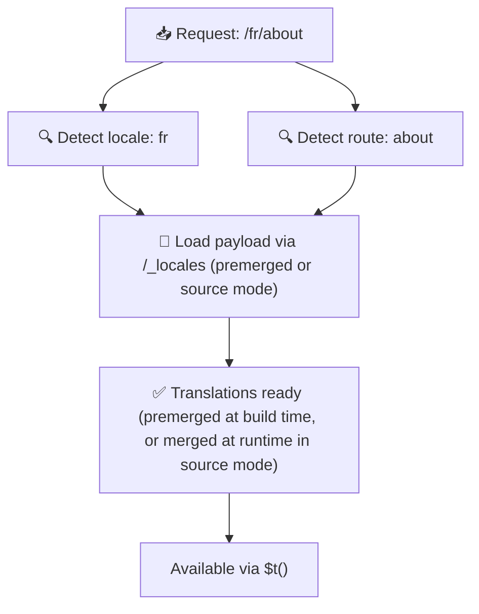

# 📂 Guía de la estructura de carpetas

## 📖 Introducción

Organizar tus archivos de traducción de forma eficaz es esencial para mantener un sistema de internacionalización (i18n) escalable y eficiente. `Nuxt I18n Micro` simplifica este proceso ofreciendo un enfoque claro para gestionar traducciones de nivel raíz y específicas por página. Esta guía te muestra la estructura de carpetas recomendada y explica cómo `Nuxt I18n Micro` gestiona estas traducciones.

## 🗂️ Estructura de carpetas recomendada

`Nuxt I18n Micro` organiza las traducciones en archivos de nivel raíz y archivos específicos por página dentro del directorio `pages`. Con `translationPayloads.mode: 'premerged'` (predeterminado), las traducciones de nivel raíz se fusionan automáticamente en cada archivo de página en tiempo de compilación, de modo que cada página dispone de un conjunto completo de traducciones sin la sobrecarga de fusión en tiempo de ejecución.

Con `mode: 'source'`, los archivos fuente permanecen separados en los assets de Nitro y se fusionan en tiempo de ejecución mediante la ruta `/_locales`. Consulta [Salida de payload sin servidor](/guides/performance#serverless-payload-output).

### 🔧 Estructura básica

A continuación se muestra un ejemplo básico de la estructura de carpetas que debes seguir:

```text
locales/
├── pages/
│   ├── index/
│   │   ├── en.json
│   │   ├── fr.json
│   │   └── ar.json
│   ├── about/
│   │   ├── en.json
│   │   ├── fr.json
│   │   └── ar.json
├── en.json
├── fr.json
└── ar.json

```

### 📄 Explicación de la estructura

#### 1. 🌍 Archivos de traducción de nivel raíz

- **Ruta:** `/locales/\{locale\}.json` (por ejemplo, `/locales/en.json`).
- **Propósito:** estos archivos contienen traducciones compartidas por toda la aplicación (menús de navegación, cabeceras, pies de página, etc.). Con `mode: 'premerged'` (predeterminado), se fusionan automáticamente en cada archivo específico por página en tiempo de compilación, de modo que el servidor devuelve un único archivo precompilado por página.

  **Contenido de ejemplo (`/locales/en.json`):**

  ```json
  {
    "menu": {
      "home": "Home",
      "about": "About Us",
      "contact": "Contact"
    },
    "footer": {
      "copyright": "© 2024 Your Company"
    }
  }
  ```

#### 2. 📄 Archivos de traducción específicos por página

- **Ruta:** `/locales/pages/\{routeName\}/\{locale\}.json` (por ejemplo, `/locales/pages/index/en.json`).
- **Propósito:** estos archivos contienen traducciones específicas de páginas concretas. Con `mode: 'premerged'` (predeterminado), las traducciones de nivel raíz se fusionan como base en tiempo de compilación, por lo que cada archivo de página resulta autocontenido.

  **Contenido de ejemplo (`/locales/pages/index/en.json`):**

  ```json
  {
    "title": "Welcome to Our Website",
    "description": "We offer a wide range of products and services to meet your needs."
  }
  ```

  **Contenido de ejemplo (`/locales/pages/about/en.json`):**

  ```json
  {
    "title": "About Us",
    "description": "Learn more about our mission, vision, and values."
  }
  ```

### 📂 Gestión de rutas dinámicas y rutas anidadas

`Nuxt I18n Micro` transforma automáticamente los segmentos dinámicos y las rutas anidadas en una estructura de carpetas plana mediante una convención de renombrado específica. Esto asegura que todas las traducciones se almacenen de forma coherente y fácilmente accesible.

#### Estructura de carpetas de traducción para rutas dinámicas

Cuando trabajas con rutas dinámicas, como `/products/[id]`, el módulo convierte el segmento dinámico `[id]` a un formato estático dentro de la estructura de archivos.

**Ejemplo de estructura de carpetas para rutas dinámicas:**

Para una ruta como `/products/[id]`, los archivos de traducción se almacenarían en una carpeta llamada `products-id`:

```text
locales/pages/
├── products-id/
│   ├── en.json
│   ├── fr.json
│   └── ar.json

```

**Ejemplo de estructura de carpetas para rutas dinámicas anidadas:**

Para una ruta anidada como `/products/key/[id]`, los archivos de traducción se almacenarían en una carpeta llamada `products-key-id`:

```text
locales/pages/
├── products-key-id/
│   ├── en.json
│   ├── fr.json
│   └── ar.json

```

**Ejemplo de estructura de carpetas para rutas anidadas multinivel:**

Para una ruta anidada más compleja como `/products/category/[id]/details`, los archivos de traducción se almacenarían en una carpeta llamada `products-category-id-details`:

```text
locales/pages/
├── products-category-id-details/
│   ├── en.json
│   ├── fr.json
│   └── ar.json

```

### 🛠 Personalizar la estructura de directorios

Si prefieres almacenar las traducciones en un directorio distinto, `Nuxt I18n Micro` te permite personalizar el directorio donde se almacenan los archivos de traducción. Puedes configurarlo en tu archivo `nuxt.config.ts`.

**Ejemplo: personalización del directorio de traducciones**

```typescript
export default defineNuxtConfig({
  i18n: {
    translationDir: 'i18n', // Custom directory path
  },
})
```

Esto indicará a `Nuxt I18n Micro` que busque los archivos de traducción en el directorio `/i18n` en lugar del directorio predeterminado `/locales`.

## ⚙️ Cómo se cargan las traducciones

### 🌍 Rutas de locale dinámicas

`Nuxt I18n Micro` usa rutas de locale dinámicas para cargar traducciones de forma eficiente. Cuando un usuario visita una página, el módulo determina el locale apropiado y carga los archivos de traducción correspondientes según la ruta actual y el locale.



Por ejemplo:

- Visitar `/en/index` cargará las traducciones desde `/locales/pages/index/en.json`.
- Visitar `/fr/about` cargará las traducciones desde `/locales/pages/about/fr.json`.

Este método asegura que solo se carguen las traducciones necesarias, optimizando tanto la carga del servidor como el rendimiento del lado del cliente.

### 💾 Caché y pre-renderizado

Para mejorar aún más el rendimiento, `Nuxt I18n Micro` admite el almacenamiento en caché y el pre-renderizado de los archivos de traducción:

- **Caché**: una vez cargado un archivo de traducción, se almacena en caché para las peticiones posteriores, reduciendo la necesidad de volver a obtener los mismos datos.
- **Pre-renderizado**: durante el proceso de compilación, puedes pre-renderizar los archivos de traducción para todos los locales y rutas configurados, permitiendo que se sirvan directamente desde el servidor sin retrasos en tiempo de ejecución.

## 📝 Buenas prácticas

### 📂 Usa los archivos por página con criterio

Aprovecha los archivos específicos por página para mantener las traducciones organizadas. Esto mantiene las traducciones de cada página ligeras y rápidas de cargar, lo cual es especialmente importante para páginas con contenido complejo o extenso.

### 🔑 Mantén las claves de traducción coherentes

Utiliza convenciones de nomenclatura coherentes para tus claves de traducción entre archivos. Esto ayuda a mantener la claridad y evita problemas al gestionar traducciones, especialmente a medida que tu aplicación crece.

### 🗂️ Organiza las traducciones por contexto

Agrupa traducciones relacionadas dentro de tus archivos. Por ejemplo, agrupa todas las etiquetas de botones bajo una clave `buttons` y todos los textos relacionados con formularios bajo una clave `forms`. Esto no solo mejora la legibilidad, sino que también facilita la gestión de traducciones entre distintos locales.

### ⚠️ Límite de profundidad de anidamiento (se recomiendan 2 niveles)

Durante la navegación del lado del cliente, `Nuxt I18n Micro` utiliza una fusión profunda optimizada de 2 niveles para combinar las traducciones de las páginas de salida y de entrada. Esto asegura que las claves anidadas superpuestas (por ejemplo, si ambas páginas tienen claves bajo `common.*`) se conservan durante las animaciones de transición.

**Esto funciona correctamente para la estructura estándar `Sección → Clave → Valor` (2 niveles):**

```json
// Page A translations
{ "common": { "fromA": "Text A" } }

// Page B translations
{ "common": { "fromB": "Text B" } }

// During transition, both are available:
// { "common": { "fromA": "Text A", "fromB": "Text B" } }
```

**Sin embargo, si usas 3 o más niveles de anidamiento, las claves más profundas pueden sobrescribirse durante las transiciones:**

```json
// Page A translations
{ "auth": { "form": { "login": "Login" } } }

// Page B translations
{ "auth": { "form": { "register": "Register" } } }

// During transition: "login" key is lost
// { "auth": { "form": { "register": "Register" } } }
```

<Tip>

</Tip>

### 🧹 Limpia regularmente las traducciones no utilizadas

Con el tiempo, tu aplicación puede acumular claves de traducción no utilizadas, especialmente si se eliminan o reestructuran funcionalidades. Revisa y limpia periódicamente tus archivos de traducción para mantenerlos ligeros y fáciles de mantener.
