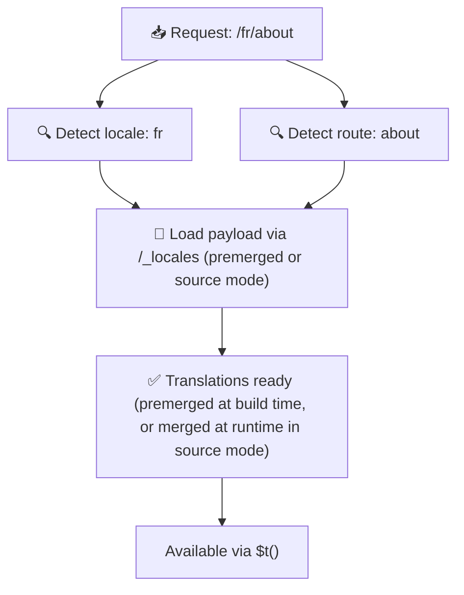

# 📂 Guía de estructura de carpetas

## 📖 Introducción

Organizar tus archivos de traducción de forma eficaz es esencial para mantener un sistema de internacionalización (i18n) escalable y eficiente. `Nuxt I18n Micro` simplifica este proceso ofreciendo un enfoque claro para gestionar traducciones raíz y por página. Esta guía te llevará por la estructura de carpetas recomendada y explicará cómo `Nuxt I18n Micro` gestiona estas traducciones.

## 🗂️ Estructura de carpetas recomendada

`Nuxt I18n Micro` organiza las traducciones en archivos raíz y archivos por página dentro del directorio `pages`. Con `translationPayloads.mode: 'premerged'` (por defecto), las traducciones raíz se fusionan automáticamente en cada archivo de página en tiempo de compilación, por lo que cada página tiene un conjunto completo de traducciones sin sobrecarga de fusión en runtime.

Con `mode: 'source'`, los archivos fuente permanecen separados en los assets de Nitro y se fusionan en runtime mediante la ruta `/_locales`. Consulta [Salida de payload serverless](/guides/performance#serverless-payload-output).

### 🔧 Estructura básica

Aquí tienes un ejemplo básico de la estructura de carpetas que debes seguir:

```text
locales/
├── pages/
│   ├── index/
│   │   ├── en.json
│   │   ├── fr.json
│   │   └── ar.json
│   ├── about/
│   │   ├── en.json
│   │   ├── fr.json
│   │   └── ar.json
├── en.json
├── fr.json
└── ar.json

```

### 📄 Explicación de la estructura

#### 1. 🌍 Archivos de traducción raíz

- **Ruta:** `/locales/\{locale\}.json` (por ejemplo, `/locales/en.json`)
- **Propósito:** Estos archivos contienen traducciones compartidas por toda la aplicación (menús de navegación, encabezados, pies de página, etc.). Con `mode: 'premerged'` (por defecto), se fusionan automáticamente en cada archivo específico de página en tiempo de compilación, por lo que el servidor devuelve un único archivo preconstruido por página.

  **Contenido de ejemplo (`/locales/en.json`):**

  ```json
  {
    "menu": {
      "home": "Home",
      "about": "About Us",
      "contact": "Contact"
    },
    "footer": {
      "copyright": "© 2024 Your Company"
    }
  }
  ```

#### 2. 📄 Archivos de traducción por página

- **Ruta:** `/locales/pages/\{routeName\}/\{locale\}.json` (por ejemplo, `/locales/pages/index/en.json`)
- **Propósito:** Estos archivos contienen traducciones específicas de páginas individuales. Con `mode: 'premerged'` (por defecto), las traducciones raíz se fusionan como base en tiempo de compilación, por lo que cada archivo de página se vuelve autocontenido.

  **Contenido de ejemplo (`/locales/pages/index/en.json`):**

  ```json
  {
    "title": "Welcome to Our Website",
    "description": "We offer a wide range of products and services to meet your needs."
  }
  ```

  **Contenido de ejemplo (`/locales/pages/about/en.json`):**

  ```json
  {
    "title": "About Us",
    "description": "Learn more about our mission, vision, and values."
  }
  ```

### 📂 Manejo de rutas dinámicas y rutas anidadas

`Nuxt I18n Micro` transforma automáticamente segmentos dinámicos y rutas anidadas en una estructura de carpetas plana usando una convención de renombrado específica. Esto asegura que todas las traducciones se almacenen de forma consistente y de fácil acceso.

#### Estructura de carpetas de traducción para rutas dinámicas

Al tratar con rutas dinámicas, como `/products/[id]`, el módulo convierte el segmento dinámico `[id]` a un formato estático dentro de la estructura de archivos.

**Estructura de carpetas de ejemplo para rutas dinámicas:**

Para una ruta como `/products/[id]`, los archivos de traducción se almacenarían en una carpeta llamada `products-id`:

```text
locales/pages/
├── products-id/
│   ├── en.json
│   ├── fr.json
│   └── ar.json

```

**Estructura de carpetas de ejemplo para rutas dinámicas anidadas:**

Para una ruta anidada como `/products/key/[id]`, los archivos de traducción se almacenarían en una carpeta llamada `products-key-id`:

```text
locales/pages/
├── products-key-id/
│   ├── en.json
│   ├── fr.json
│   └── ar.json

```

**Estructura de carpetas de ejemplo para rutas anidadas multinivel:**

Para una ruta anidada más compleja como `/products/category/[id]/details`, los archivos de traducción se almacenarían en una carpeta llamada `products-category-id-details`:

```text
locales/pages/
├── products-category-id-details/
│   ├── en.json
│   ├── fr.json
│   └── ar.json

```

### 🛠 Personalizar la estructura del directorio

Si prefieres almacenar las traducciones en un directorio diferente, `Nuxt I18n Micro` te permite personalizar el directorio donde se almacenan los archivos de traducción. Puedes configurarlo en tu archivo `nuxt.config.ts`.

**Ejemplo: personalizar el directorio de traducción**

```typescript
export default defineNuxtConfig({
  i18n: {
    translationDir: 'i18n', // Custom directory path
  },
})
```

Esto le indicará a `Nuxt I18n Micro` que busque los archivos de traducción en el directorio `/i18n` en lugar del `/locales` por defecto.

## ⚙️ Cómo se cargan las traducciones

### 🌍 Rutas de idioma dinámicas

`Nuxt I18n Micro` usa rutas de idioma dinámicas para cargar traducciones de forma eficiente. Cuando un usuario visita una página, el módulo determina el idioma apropiado y carga los archivos de traducción correspondientes según la ruta y el idioma actuales.



Por ejemplo:

- Visitar `/en/index` cargará las traducciones desde `/locales/pages/index/en.json`.
- Visitar `/fr/about` cargará las traducciones desde `/locales/pages/about/fr.json`.

Este método asegura que solo se cargan las traducciones necesarias, optimizando tanto la carga del servidor como el rendimiento del cliente.

### 💾 Caché y prerenderizado

Para mejorar aún más el rendimiento, `Nuxt I18n Micro` admite caché y prerenderizado de archivos de traducción:

- **Caché**: Una vez cargado un archivo de traducción, se almacena en caché para solicitudes posteriores, reduciendo la necesidad de obtener repetidamente los mismos datos.
- **Prerenderizado**: Durante el proceso de compilación, puedes prerenderizar los archivos de traducción para todos los idiomas y rutas configurados, permitiendo que se sirvan directamente desde el servidor sin retrasos en runtime.

## 📝 Buenas prácticas

### 📂 Usa archivos por página con criterio

Aprovecha los archivos por página para mantener las traducciones organizadas. Esto mantiene las traducciones de cada página ligeras y rápidas de cargar, lo que es especialmente importante para páginas con contenido complejo o extenso.

### 🔑 Mantén las claves de traducción consistentes

Usa convenciones de nombres consistentes para tus claves de traducción entre archivos. Esto ayuda a mantener la claridad y previene problemas al gestionar traducciones, especialmente a medida que crece tu aplicación.

### 🗂️ Organiza las traducciones por contexto

Agrupa las traducciones relacionadas dentro de tus archivos. Por ejemplo, agrupa todas las etiquetas de botones bajo una clave `buttons` y todos los textos relacionados con formularios bajo una clave `forms`. Esto no solo mejora la legibilidad, sino que también facilita la gestión de traducciones entre distintos idiomas.

### ⚠️ Límite de profundidad de anidación (se recomiendan 2 niveles)

Durante la navegación del lado del cliente, `Nuxt I18n Micro` usa una fusión profunda optimizada de 2 niveles para combinar traducciones de las páginas saliente y entrante. Esto asegura que las claves anidadas solapadas (por ejemplo, ambas páginas tienen claves bajo `common.*`) se conservan durante las animaciones de transición.

**Esto funciona correctamente para la estructura estándar `Sección → Clave → Valor` (2 niveles):**

```json
// Page A translations
{ "common": { "fromA": "Text A" } }

// Page B translations
{ "common": { "fromB": "Text B" } }

// During transition, both are available:
// { "common": { "fromA": "Text A", "fromB": "Text B" } }
```

**Sin embargo, si usas 3+ niveles de anidación, las claves más profundas pueden sobreescribirse durante las transiciones:**

```json
// Page A translations
{ "auth": { "form": { "login": "Login" } } }

// Page B translations
{ "auth": { "form": { "register": "Register" } } }

// During transition: "login" key is lost
// { "auth": { "form": { "register": "Register" } } }
```


### 🧹 Limpia regularmente las traducciones no usadas

Con el tiempo, tu aplicación puede acumular claves de traducción no usadas, especialmente si se eliminan o reestructuran funcionalidades. Revisa y limpia periódicamente tus archivos de traducción para mantenerlos ligeros y mantenibles.
