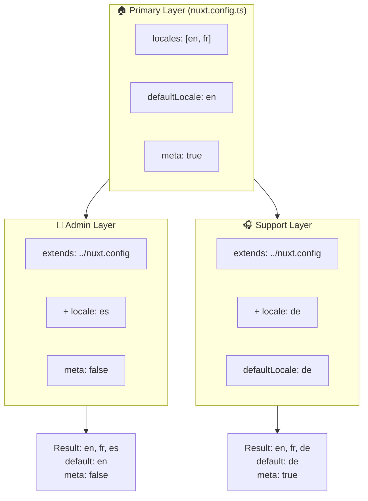

# 🗂️ Capas en `Nuxt I18n Micro`

## 📖 Introducción a las capas

Las capas en `Nuxt I18n Micro` te permiten gestionar y personalizar los ajustes de localización de forma flexible en distintas partes de tu aplicación. Al definir distintas capas, puedes ajustar la configuración para varios contextos, como anular los ajustes en secciones específicas de tu sitio o crear configuraciones base reutilizables que pueden ser extendidas por otras partes de tu aplicación.

### Flujo de herencia de capas



## 🛠️ Capa de configuración principal

La **capa de configuración principal** es donde se definen los ajustes de localización por defecto para toda tu aplicación. Esta capa es esencial ya que define la configuración global, incluidos los idiomas admitidos, el idioma por defecto y otros ajustes críticos de i18n.

### 📄 Ejemplo: definir la capa de configuración principal

Aquí tienes un ejemplo de cómo podrías definir la capa de configuración principal en tu archivo `nuxt.config.ts`:

```typescript
export default defineNuxtConfig({
  i18n: {
    locales: [
      { code: 'en', iso: 'en-EN', dir: 'ltr' },
      { code: 'fr', iso: 'fr-FR', dir: 'ltr' },
      { code: 'ar', iso: 'ar-SA', dir: 'rtl' },
    ],
    defaultLocale: 'en', // The default locale for the entire app
    translationDir: 'locales', // Directory where translations are stored
    meta: true, // Automatically generate SEO-related meta tags like `alternate`
    autoDetectLanguage: true, // Automatically detect and use the user's preferred language
  },
})
```

## 🌱 Capas hijas

Las capas hijas se usan para extender o anular la configuración principal en partes específicas de tu aplicación. Por ejemplo, podrías querer añadir idiomas adicionales o modificar el idioma por defecto en una sección particular de tu sitio. Las capas hijas son especialmente útiles en aplicaciones modulares donde distintas partes pueden tener distintos requisitos de localización.

### 📄 Ejemplo: extender la capa principal en una capa hija

Supón que tienes una sección de tu sitio que necesita admitir idiomas adicionales, o quieres desactivar un idioma en un contexto determinado. Así puedes lograrlo extendiendo la capa de configuración principal:

```typescript
// basic/nuxt.config.ts (Primary Layer)
export default defineNuxtConfig({
  i18n: {
    locales: [
      { code: 'en', iso: 'en-EN', dir: 'ltr' },
      { code: 'fr', iso: 'fr-FR', dir: 'ltr' },
    ],
    defaultLocale: 'en',
    meta: true,
    translationDir: 'locales',
  },
})
```

```typescript
// extended/nuxt.config.ts (Child Layer)
export default defineNuxtConfig({
  extends: '../basic', // Inherit the base configuration from the 'basic' layer
  i18n: {
    locales: [
      { code: 'en', iso: 'en-EN', dir: 'ltr' }, // Inherited from the base layer
      { code: 'fr', iso: 'fr-FR', dir: 'ltr' }, // Inherited from the base layer
      { code: 'de', iso: 'de-DE', dir: 'ltr' }, // Added in the child layer
    ],
    defaultLocale: 'fr', // Override the default locale to French for this section
    autoDetectLanguage: false, // Disable automatic language detection in this section
  },
})
```

### 🌐 Uso de capas en una aplicación modular

En una aplicación Nuxt más grande y modular, podrías tener múltiples secciones, cada una requiriendo sus propios ajustes i18n. Al aprovechar las capas, puedes mantener una estructura de configuración limpia y escalable.

### 📄 Ejemplo: configuración por capas en una aplicación modular

Imagina que tienes un sitio de comercio electrónico con secciones distintas como el sitio web principal, panel de administración y portal de atención al cliente. Cada sección podría necesitar un conjunto distinto de idiomas u otros ajustes i18n.

#### **Capa principal (configuración global):**

```typescript
// nuxt.config.ts
export default defineNuxtConfig({
  i18n: {
    locales: [
      { code: 'en', iso: 'en-EN', dir: 'ltr' },
      { code: 'fr', iso: 'fr-FR', dir: 'ltr' },
    ],
    defaultLocale: 'en',
    meta: true,
    translationDir: 'locales',
    autoDetectLanguage: true,
  },
})
```

#### **Capa hija para el panel de administración:**

```typescript
// admin/nuxt.config.ts
export default defineNuxtConfig({
  extends: '../nuxt.config', // Inherit the global settings
  i18n: {
    locales: [
      { code: 'en', iso: 'en-EN', dir: 'ltr' }, // Inherited
      { code: 'fr', iso: 'fr-FR', dir: 'ltr' }, // Inherited
      { code: 'es', iso: 'es-ES', dir: 'ltr' }, // Specific to the admin panel
    ],
    defaultLocale: 'en',
    meta: false, // Disable automatic meta generation in the admin panel
  },
})
```

#### **Capa hija para el portal de atención al cliente:**

```typescript
// support/nuxt.config.ts
export default defineNuxtConfig({
  extends: '../nuxt.config', // Inherit the global settings
  i18n: {
    locales: [
      { code: 'en', iso: 'en-EN', dir: 'ltr' }, // Inherited
      { code: 'fr', iso: 'fr-FR', dir: 'ltr' }, // Inherited
      { code: 'de', iso: 'de-DE', dir: 'ltr' }, // Specific to the support portal
    ],
    defaultLocale: 'de', // Default to German in the support portal
    autoDetectLanguage: false, // Disable automatic language detection
  },
})
```

En este ejemplo modular:

- Cada sección (admin, support) tiene sus propios ajustes i18n, pero todas heredan la configuración base.
- El panel de administración añade el español (`es`) como idioma y desactiva la generación de etiquetas meta.
- El portal de atención al cliente añade el alemán (`de`) como idioma y lo usa por defecto para la interfaz de usuario.

## 📝 Buenas prácticas al usar capas

- **🔧 Mantén la capa principal simple:** La capa principal debería contener los ajustes más usados que se aplican globalmente en tu aplicación. Mantenla simple para asegurar la consistencia.
- **⚙️ Usa capas hijas para personalizaciones específicas:** Solo anula o extiende ajustes en capas hijas cuando sea necesario. Este enfoque evita complejidad innecesaria en tu configuración.
- **📚 Documenta tus capas:** Documenta claramente el propósito y los detalles de cada capa en tu proyecto. Esto ayudará a mantener la claridad y facilitará que otras personas (o tu yo futuro) entiendan la configuración.
