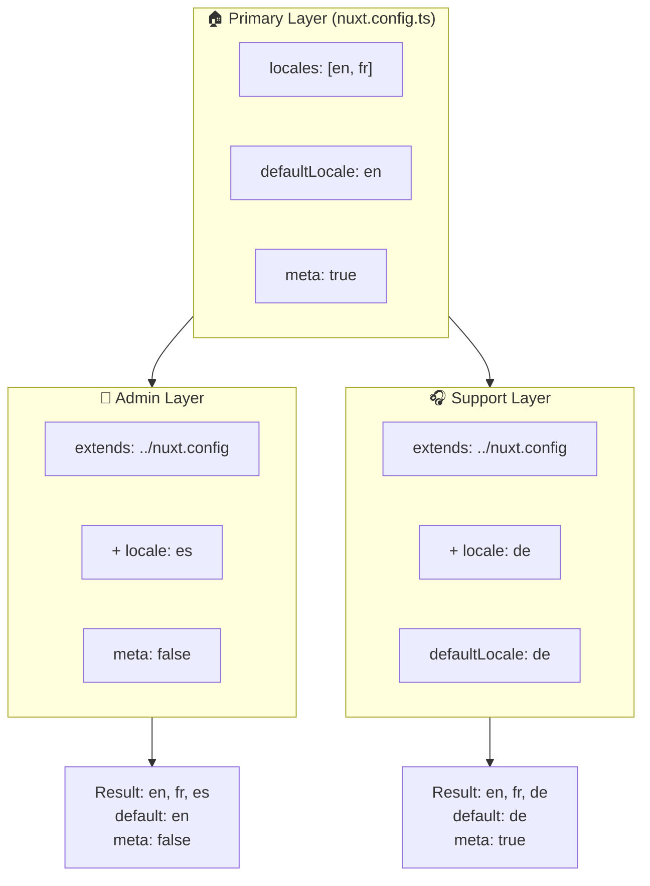

# 🗂️ Capas en `Nuxt I18n Micro`

## 📖 Introducción a las capas

Las capas en `Nuxt I18n Micro` te permiten gestionar y personalizar la configuración de localización de forma flexible en distintas partes de tu aplicación. Al definir diferentes capas, puedes ajustar la configuración para varios contextos, como sobrescribir ajustes para secciones específicas de tu sitio o crear configuraciones base reutilizables que otras partes de tu aplicación puedan extender.

### Flujo de herencia entre capas



## 🛠️ Capa de configuración principal

La **capa de configuración principal** es donde configuras los ajustes de localización predeterminados para toda tu aplicación. Esta capa es esencial ya que define la configuración global, incluyendo los locales admitidos, el idioma predeterminado y otros ajustes críticos de i18n.

### 📄 Ejemplo: definición de la capa de configuración principal

Este es un ejemplo de cómo podrías definir la capa de configuración principal en tu archivo `nuxt.config.ts`:

```typescript
export default defineNuxtConfig({
  i18n: {
    locales: [
      { code: 'en', iso: 'en-EN', dir: 'ltr' },
      { code: 'fr', iso: 'fr-FR', dir: 'ltr' },
      { code: 'ar', iso: 'ar-SA', dir: 'rtl' },
    ],
    defaultLocale: 'en', // The default locale for the entire app
    translationDir: 'locales', // Directory where translations are stored
    meta: true, // Automatically generate SEO-related meta tags like `alternate`
    autoDetectLanguage: true, // Automatically detect and use the user's preferred language
  },
})
```

## 🌱 Capas hijas

Las capas hijas se utilizan para ampliar o sobrescribir la configuración principal en partes específicas de tu aplicación. Por ejemplo, podrías querer añadir locales adicionales o modificar el locale predeterminado para una sección determinada de tu sitio. Las capas hijas son especialmente útiles en aplicaciones modulares donde distintas partes pueden tener requisitos de localización diferentes.

### 📄 Ejemplo: extender la capa principal en una capa hija

Supón que tienes una sección de tu sitio que necesita admitir locales adicionales, o quieres deshabilitar un locale concreto en un cierto contexto. Aquí tienes cómo lograrlo extendiendo la capa de configuración principal:

```typescript
// basic/nuxt.config.ts (Primary Layer)
export default defineNuxtConfig({
  i18n: {
    locales: [
      { code: 'en', iso: 'en-EN', dir: 'ltr' },
      { code: 'fr', iso: 'fr-FR', dir: 'ltr' },
    ],
    defaultLocale: 'en',
    meta: true,
    translationDir: 'locales',
  },
})
```

```typescript
// extended/nuxt.config.ts (Child Layer)
export default defineNuxtConfig({
  extends: '../basic', // Inherit the base configuration from the 'basic' layer
  i18n: {
    locales: [
      { code: 'en', iso: 'en-EN', dir: 'ltr' }, // Inherited from the base layer
      { code: 'fr', iso: 'fr-FR', dir: 'ltr' }, // Inherited from the base layer
      { code: 'de', iso: 'de-DE', dir: 'ltr' }, // Added in the child layer
    ],
    defaultLocale: 'fr', // Override the default locale to French for this section
    autoDetectLanguage: false, // Disable automatic language detection in this section
  },
})
```

### 🌐 Uso de capas en una aplicación modular

En una aplicación Nuxt más grande y modular, podrías tener múltiples secciones, cada una con sus propios ajustes de i18n. Aprovechando las capas, puedes mantener una estructura de configuración limpia y escalable.

### 📄 Ejemplo: configuración por capas en una aplicación modular

Imagina que tienes un sitio de comercio electrónico con secciones distintas como el sitio web principal, el panel de administración y el portal de atención al cliente. Cada sección podría necesitar un conjunto diferente de locales u otros ajustes de i18n.

#### **Capa principal (configuración global):**

```typescript
// nuxt.config.ts
export default defineNuxtConfig({
  i18n: {
    locales: [
      { code: 'en', iso: 'en-EN', dir: 'ltr' },
      { code: 'fr', iso: 'fr-FR', dir: 'ltr' },
    ],
    defaultLocale: 'en',
    meta: true,
    translationDir: 'locales',
    autoDetectLanguage: true,
  },
})
```

#### **Capa hija para el panel de administración:**

```typescript
// admin/nuxt.config.ts
export default defineNuxtConfig({
  extends: '../nuxt.config', // Inherit the global settings
  i18n: {
    locales: [
      { code: 'en', iso: 'en-EN', dir: 'ltr' }, // Inherited
      { code: 'fr', iso: 'fr-FR', dir: 'ltr' }, // Inherited
      { code: 'es', iso: 'es-ES', dir: 'ltr' }, // Specific to the admin panel
    ],
    defaultLocale: 'en',
    meta: false, // Disable automatic meta generation in the admin panel
  },
})
```

#### **Capa hija para el portal de atención al cliente:**

```typescript
// support/nuxt.config.ts
export default defineNuxtConfig({
  extends: '../nuxt.config', // Inherit the global settings
  i18n: {
    locales: [
      { code: 'en', iso: 'en-EN', dir: 'ltr' }, // Inherited
      { code: 'fr', iso: 'fr-FR', dir: 'ltr' }, // Inherited
      { code: 'de', iso: 'de-DE', dir: 'ltr' }, // Specific to the support portal
    ],
    defaultLocale: 'de', // Default to German in the support portal
    autoDetectLanguage: false, // Disable automatic language detection
  },
})
```

En este ejemplo modular:

- Cada sección (administración, soporte) tiene sus propios ajustes de i18n, pero todas heredan la configuración base.
- El panel de administración añade el español (`es`) como locale y deshabilita la generación de meta tags.
- El portal de soporte añade el alemán (`de`) como locale y establece el alemán como predeterminado para la interfaz.

## 📝 Buenas prácticas para el uso de capas

- **🔧 Mantén la capa principal sencilla:** la capa principal debe contener los ajustes más comunes que se aplican de forma global en toda tu aplicación. Mantenla directa para asegurar la coherencia.
- **⚙️ Usa capas hijas para personalizaciones específicas:** solo sobrescribe o extiende los ajustes en capas hijas cuando sea necesario. Este enfoque evita complejidad innecesaria en tu configuración.
- **📚 Documenta tus capas:** documenta claramente el propósito y las particularidades de cada capa en tu proyecto. Esto ayudará a mantener la claridad y facilitará que otras personas (o tú en el futuro) entiendan la configuración.
