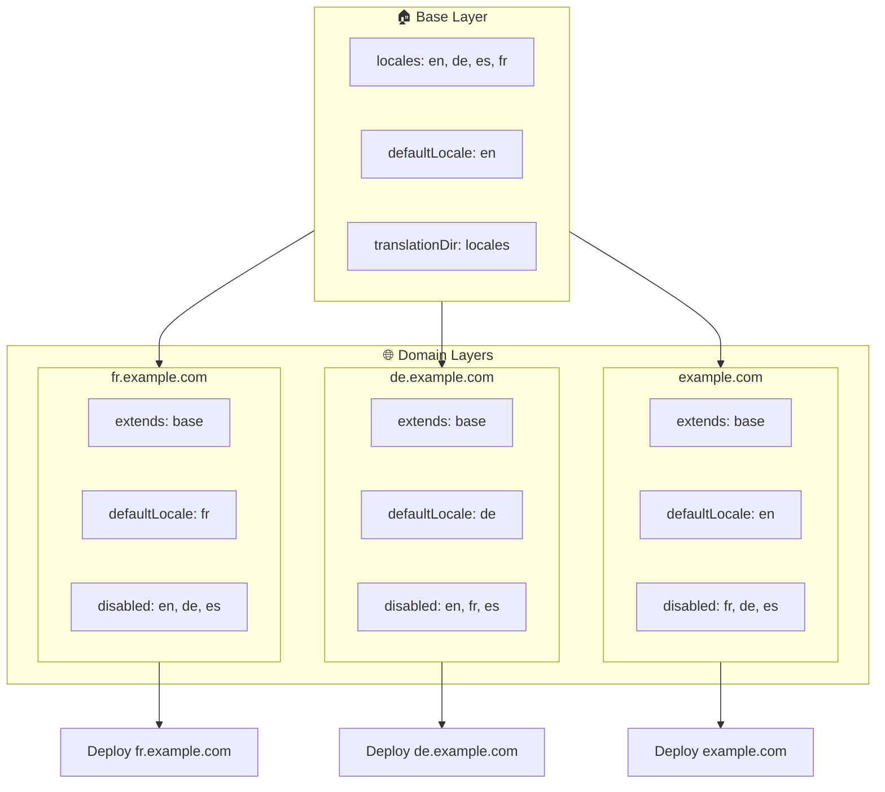

# 🌍 Configurar locales multi-dominio con `Nuxt I18n Micro` usando capas

## 📝 Introducción

Al aprovechar las capas en `Nuxt I18n Micro`, puedes crear una configuración de localización multi-dominio flexible y mantenible. Este enfoque no solo simplifica la gestión de dominios al eliminar la necesidad de funcionalidades complejas, sino que también permite una distribución de carga eficiente y reduce la complejidad del proyecto. Al ejecutar proyectos separados para distintos locales, tu aplicación puede escalar fácilmente y adaptarse a requisitos de locale variables entre múltiples dominios, ofreciendo una solución robusta y escalable para aplicaciones globales.

## 🎯 Objetivo

Crear una configuración donde distintos dominios sirvan locales específicos personalizando las configuraciones en capas hijas. Este método aprovecha el sistema de capas de Nuxt, permitiéndote mantener una configuración base a la vez que la extiendes o modificas para cada dominio.

### Arquitectura multi-dominio



## 🛠 Pasos para implementar locales multi-dominio

### 1. **Crear la capa base**

Comienza creando una capa de configuración base que incluya todos los ajustes comunes de locale para tu aplicación. Esta configuración servirá como base para otras configuraciones específicas por dominio.

#### **Configuración de la capa base**

Crea el archivo de configuración base `base/nuxt.config.ts`:

```typescript
// base/nuxt.config.ts

export default defineNuxtConfig({
  i18n: {
    locales: [
      { code: 'en', iso: 'en-US', dir: 'ltr' },
      { code: 'de', iso: 'de-DE', dir: 'ltr' },
      { code: 'es', iso: 'es-ES', dir: 'ltr' },
    ],
    defaultLocale: 'en',
    translationDir: 'locales',
    meta: true,
    autoDetectLanguage: true,
  },
})
```

### 2. **Crear capas hijas específicas por dominio**

Para cada dominio, crea una capa hija que modifique la configuración base para adaptarse a los requisitos específicos de ese dominio. Puedes deshabilitar los locales que no sean necesarios para un dominio concreto.

#### **Ejemplo: configuración para el dominio francés**

Crea una configuración de capa hija para el dominio francés en `fr/nuxt.config.ts`:

```typescript
// fr/nuxt.config.ts

export default defineNuxtConfig({
  extends: '../base', // Inherit from the base configuration

  i18n: {
    locales: [
      { code: 'en', iso: 'en-US', dir: 'ltr', disabled: true }, // Disable English
      { code: 'fr', iso: 'fr-FR', dir: 'ltr' }, // Add and enable the French locale
      { code: 'de', iso: 'de-DE', dir: 'ltr', disabled: true }, // Disable German
      { code: 'es', iso: 'es-ES', dir: 'ltr', disabled: true }, // Disable Spanish
    ],
    defaultLocale: 'fr', // Set French as the default locale
    autoDetectLanguage: false, // Disable automatic language detection
  },
})
```

#### **Ejemplo: configuración para el dominio alemán**

De forma similar, crea una configuración de capa hija para el dominio alemán en `de/nuxt.config.ts`:

```typescript
// de/nuxt.config.ts

export default defineNuxtConfig({
  extends: '../base', // Inherit from the base configuration

  i18n: {
    locales: [
      { code: 'en', iso: 'en-US', dir: 'ltr', disabled: true }, // Disable English
      { code: 'fr', iso: 'fr-FR', dir: 'ltr', disabled: true }, // Disable French
      { code: 'de', iso: 'de-DE', dir: 'ltr' }, // Use the German locale
      { code: 'es', iso: 'es-ES', dir: 'ltr', disabled: true }, // Disable Spanish
    ],
    defaultLocale: 'de', // Set German as the default locale
    autoDetectLanguage: false, // Disable automatic language detection
  },
})
```

### 3. **Desplegar la aplicación para cada dominio**

Despliega la aplicación con la configuración apropiada para cada dominio. Por ejemplo:

- Despliega la configuración de la capa `fr` en `fr.example.com`.
- Despliega la configuración de la capa `de` en `de.example.com`.

### 4. **Configurar múltiples proyectos para distintos locales**

Para cada locale y dominio, necesitarás ejecutar una instancia separada de la aplicación. Esto garantiza que cada dominio sirva la configuración de locale correcta, optimizando la distribución de la carga y simplificando la estructura del proyecto. Al ejecutar múltiples proyectos adaptados a cada locale, puedes mantener una separación limpia entre configuraciones y reducir la complejidad general del despliegue.

### 5. **Configurar el enrutamiento según el dominio**

Asegúrate de que tu enrutamiento esté configurado para dirigir a los usuarios al proyecto correcto según el dominio al que acceden. Esto garantizará que cada dominio sirva el locale apropiado, mejorando la experiencia del usuario y manteniendo la coherencia entre las distintas regiones.

### 6. **Desplegar y verificar**

Tras configurar las capas y desplegarlas en sus respectivos dominios, asegúrate de que cada dominio sirva el locale correcto. Prueba la aplicación a fondo para confirmar que se carga el locale correcto en función del dominio.

## 📝 Buenas prácticas

- **Mantén la configuración base genérica**: la configuración base debe cubrir los ajustes generales aplicables a todos los dominios.
- **Aísla la lógica específica de dominio**: mantén las configuraciones específicas por dominio en sus respectivas capas para preservar la claridad y la separación de responsabilidades.

## 🎉 Conclusión

Al aprovechar las capas en `Nuxt I18n Micro`, puedes crear una configuración de localización multi-dominio flexible y mantenible. Este enfoque no solo elimina la necesidad de funcionalidades complejas de gestión de dominios, sino que también te permite distribuir la carga de forma eficiente y reducir la complejidad del proyecto. Ejecutar proyectos separados para distintos locales garantiza que tu aplicación pueda escalar fácilmente y adaptarse a diferentes requisitos de locale entre diversos dominios, proporcionando una solución robusta y escalable para aplicaciones globales.
