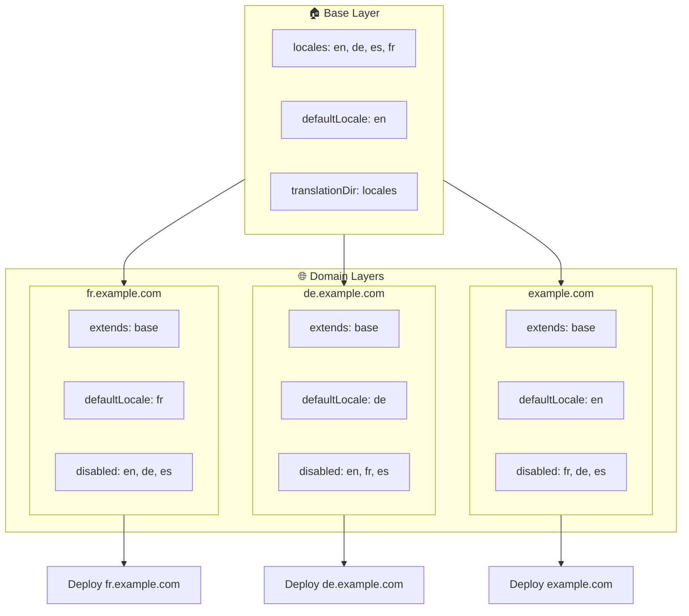

# 🌍 Configurar idiomas multidominio con `Nuxt I18n Micro` usando capas

## 📝 Introducción

Aprovechando las capas en `Nuxt I18n Micro`, puedes crear una configuración de localización multidominio flexible y mantenible. Este enfoque no solo simplifica la gestión de dominios al eliminar la necesidad de funcionalidades complejas, sino que también permite una distribución de carga eficiente y reduce la complejidad del proyecto. Al ejecutar proyectos separados para diferentes idiomas, tu aplicación puede escalar fácilmente y adaptarse a distintos requisitos de idioma en varios dominios, ofreciendo una solución robusta y escalable para aplicaciones globales.

## 🎯 Objetivo

Crear una configuración donde distintos dominios sirvan idiomas específicos personalizando configuraciones en capas hijas. Este método aprovecha el sistema de capas de Nuxt, permitiéndote mantener una configuración base mientras la extiendes o modificas para cada dominio.

### Arquitectura multidominio



## 🛠 Pasos para implementar idiomas multidominio

### 1. **Crear la capa base**

Empieza creando una capa de configuración base que incluya todos los ajustes comunes de idioma para tu aplicación. Esta configuración servirá como base para otras configuraciones específicas de dominio.

#### **Configuración de la capa base**

Crea el archivo de configuración base `base/nuxt.config.ts`:

```typescript
// base/nuxt.config.ts

export default defineNuxtConfig({
  i18n: {
    locales: [
      { code: 'en', iso: 'en-US', dir: 'ltr' },
      { code: 'de', iso: 'de-DE', dir: 'ltr' },
      { code: 'es', iso: 'es-ES', dir: 'ltr' },
    ],
    defaultLocale: 'en',
    translationDir: 'locales',
    meta: true,
    autoDetectLanguage: true,
  },
})
```

### 2. **Crear capas hijas específicas del dominio**

Para cada dominio, crea una capa hija que modifique la configuración base para cumplir los requisitos específicos de ese dominio. Puedes desactivar los idiomas que no se necesitan para un dominio específico.

#### **Ejemplo: configuración para el dominio francés**

Crea una configuración de capa hija para el dominio francés en `fr/nuxt.config.ts`:

```typescript
// fr/nuxt.config.ts

export default defineNuxtConfig({
  extends: '../base', // Inherit from the base configuration

  i18n: {
    locales: [
      { code: 'en', iso: 'en-US', dir: 'ltr', disabled: true }, // Disable English
      { code: 'fr', iso: 'fr-FR', dir: 'ltr' }, // Add and enable the French locale
      { code: 'de', iso: 'de-DE', dir: 'ltr', disabled: true }, // Disable German
      { code: 'es', iso: 'es-ES', dir: 'ltr', disabled: true }, // Disable Spanish
    ],
    defaultLocale: 'fr', // Set French as the default locale
    autoDetectLanguage: false, // Disable automatic language detection
  },
})
```

#### **Ejemplo: configuración para el dominio alemán**

De manera similar, crea una configuración de capa hija para el dominio alemán en `de/nuxt.config.ts`:

```typescript
// de/nuxt.config.ts

export default defineNuxtConfig({
  extends: '../base', // Inherit from the base configuration

  i18n: {
    locales: [
      { code: 'en', iso: 'en-US', dir: 'ltr', disabled: true }, // Disable English
      { code: 'fr', iso: 'fr-FR', dir: 'ltr', disabled: true }, // Disable French
      { code: 'de', iso: 'de-DE', dir: 'ltr' }, // Use the German locale
      { code: 'es', iso: 'es-ES', dir: 'ltr', disabled: true }, // Disable Spanish
    ],
    defaultLocale: 'de', // Set German as the default locale
    autoDetectLanguage: false, // Disable automatic language detection
  },
})
```

### 3. **Desplegar la aplicación para cada dominio**

Despliega la aplicación con la configuración apropiada para cada dominio. Por ejemplo:

- Despliega la configuración de capa `fr` en `fr.example.com`.
- Despliega la configuración de capa `de` en `de.example.com`.

### 4. **Configurar múltiples proyectos para distintos idiomas**

Para cada idioma y dominio, necesitarás ejecutar una instancia separada de la aplicación. Esto asegura que cada dominio sirva la configuración de idioma correcta, optimizando la distribución de carga y simplificando la estructura del proyecto. Al ejecutar múltiples proyectos adaptados a cada idioma, puedes mantener una separación clara entre configuraciones y reducir la complejidad general.

### 5. **Configurar el enrutamiento según el dominio**

Asegúrate de que tu enrutamiento está configurado para dirigir a los usuarios al proyecto correcto según el dominio al que acceden. Esto asegurará que cada dominio sirva el idioma apropiado, mejorando la experiencia del usuario y manteniendo la consistencia entre distintas regiones.

### 6. **Desplegar y verificar**

Después de configurar las capas y desplegarlas en sus respectivos dominios, asegúrate de que cada dominio sirva el idioma correcto. Prueba la aplicación exhaustivamente para confirmar que se carga el idioma correcto según el dominio.

## 📝 Buenas prácticas

- **Mantén la configuración base genérica**: La configuración base debería cubrir los ajustes generales aplicables a todos los dominios.
- **Aísla la lógica específica del dominio**: Mantén las configuraciones específicas del dominio en sus respectivas capas para conservar la claridad y la separación de responsabilidades.

## 🎉 Conclusión

Al aprovechar las capas en `Nuxt I18n Micro`, puedes crear una configuración de localización multidominio flexible y mantenible. Este enfoque no solo elimina la necesidad de funcionalidades complejas de gestión de dominios, sino que también te permite distribuir la carga de forma eficiente y reducir la complejidad del proyecto. Ejecutar proyectos separados para distintos idiomas asegura que tu aplicación pueda escalar fácilmente y adaptarse a diferentes requisitos de idioma en varios dominios, ofreciendo una solución robusta y escalable para aplicaciones globales.
