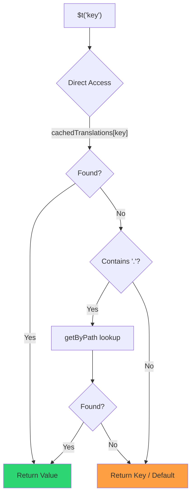

# 🚀 Guía de rendimiento

## 📖 Introducción

`Nuxt I18n Micro` está diseñado con el rendimiento en mente, ofreciendo una mejora significativa sobre los módulos de internacionalización (i18n) tradicionales como `nuxt-i18n`. Esta guía proporciona una visión detallada de los beneficios de rendimiento de usar `Nuxt I18n Micro` y cómo se compara con otras soluciones.

## 🤔 ¿Por qué centrarse en el rendimiento?

En proyectos a gran escala y entornos de alto tráfico, los cuellos de botella de rendimiento pueden llevar a tiempos de compilación lentos, mayor uso de memoria y tiempos de respuesta del servidor pobres. Estos problemas se acentúan con configuraciones i18n complejas que involucran archivos de traducción grandes. `Nuxt I18n Micro` se construyó para abordar estos desafíos de frente optimizando la velocidad, la eficiencia de memoria y el impacto mínimo en el tamaño del bundle de tu aplicación.

## 📊 Comparación de rendimiento

Realizamos una serie de pruebas en fixtures idénticas vía `pnpm test:performance` (`pnpm -C scripts cli performance`) contra **`@nuxtjs/i18n@10.6.0`**. Metodología completa y gráficos: [Resultados de pruebas de rendimiento](/guides/performance-results).

Perfil CLI por defecto: **4 idiomas** × **2 páginas** (`index`, `page`) × ~10k claves hoja de índice. Sube `--locales` / `--keys` para una carga de radar de regresión más pesada. El informe divide **código**, **traducciones** (incluyendo `chunks/raw/*` de `@nuxtjs/i18n`) y **salida** total desplegable.

```bash
pnpm test:performance
pnpm -C scripts cli performance --only micro --skip-stress
pnpm -C scripts cli performance --locales 12 --keys 100000 --runs 3
```

### ⏱️ Tiempo de compilación y consumo de recursos

<Accordion title="**@nuxtjs/i18n v10.6**">
- **Bundle de código**: 2.16 MB
- **Traducciones**: 7.21 MB (chunks de mensajes + payloads de idioma)
- **Total desplegable**: 9.37 MB
- **Uso máximo de memoria**: 1,821 MB
- **Tiempo transcurrido**: 8.34s (media de 3)
</Accordion>

<Tip>
- **Bundle de código**: 1.74 MB — **~19% menos código que `@nuxtjs/i18n` v10.6**
- **Traducciones**: 6.8 MB (JSON con carga perezosa)
- **Total desplegable**: 8.54 MB
- **Uso máximo de memoria**: 1,065 MB — **~41% menos memoria que `@nuxtjs/i18n` v10.6**
- **Tiempo transcurrido**: 5.34s — **~36% más rápido que `@nuxtjs/i18n` v10.6** (≈ línea base de nuxt plano)
</Tip>

> Docs antiguos que mostraban `@nuxtjs/i18n` "code ≈ 15 MB / translations 0 B" contaban los archivos de mensajes `chunks/raw` como código de app. El clasificador actual los separa; la brecha en **código** es menor, y micro sigue liderando en tiempo de compilación, RSS máximo y pruebas de carga.

Consulta el [informe completo de benchmark](/guides/performance-results) para gráficos, resultados de Autocannon y detalles de las fixtures.

### 🌐 Rendimiento del servidor bajo carga

Artillery (6s@6 + 60s@60) y Autocannon (10c / 10s), media de 3 ejecuciones consecutivas por fixture.

<Accordion title="**@nuxtjs/i18n v10.6**">
- **Solicitudes por segundo (Artillery)**: 143 [#/sec]
- **Tiempo de respuesta promedio**: 956 ms
- **RPS de Autocannon / latencia media**: 72 / 139 ms
</Accordion>

<Tip>
- **Solicitudes por segundo (Artillery)**: 275 [#/sec] — **~93% más que `@nuxtjs/i18n` v10.6**
- **Tiempo de respuesta promedio**: 483 ms — **~49% más rápido que `@nuxtjs/i18n` v10.6**
- **RPS de Autocannon / latencia media**: 162 / 62 ms
</Tip>

### 📈 Comparación visual

<Note>
Gráfico interactivo omitido en los docs de Mintlify. Consulta las tablas de benchmark en esta página o la [documentación VitePress](https://s00d.github.io/nuxt-i18n-micro/guide/performance-results) para el gráfico: `chart`.
</Note>

<Note>
Gráfico interactivo omitido en los docs de Mintlify. Consulta las tablas de benchmark en esta página o la [documentación VitePress](https://s00d.github.io/nuxt-i18n-micro/guide/performance-results) para el gráfico: `chart`.
</Note>

| Métrica         | @nuxtjs/i18n v10.6 | i18n-micro | Mejora             |
| --------------- | ------------------ | ---------- | ------------------ |
| Tiempo de build | 8.34s              | 5.34s      | **~36% más rápido**    |
| Memoria (build) | 1,821 MB           | 1,065 MB   | **~41% menos**      |
| Bundle de código | 2.16 MB           | 1.74 MB    | **~19% más pequeño** |
| Tiempo de respuesta | 956 ms         | 483 ms     | **~49% más rápido** |
| RPS (Artillery) | 143                | 275        | **~93% más**       |

### 🔍 Interpretación de los resultados

Contra el `@nuxtjs/i18n` **v10.6** actual (perfil CLI por defecto, media de 3):

- 🗜️ **Grafo de código más pequeño**: ~1.74 MB frente a ~2.16 MB una vez que los chunks de mensajes no se etiquetan mal como "código".
- 🧠 **Menor RSS de build**: pico ~1.1 GB frente a ~1.8 GB.
- 🕒 **Builds más rápidos**: ~5.3s frente a ~8.3s (micro coincide con la línea base de Nuxt plano en este perfil).
- ⚡ **Mucho mejor bajo carga**: ~275 vs ~143 RPS de Artillery, ~162 vs ~72 RPS de Autocannon, menor latencia media.

Los números absolutos difieren de tablas publicadas anteriormente (diccionarios más pequeños, Nuxt más antiguo y una división injusta de "0 B translations" para `@nuxtjs/i18n`). Direccionalmente lo mismo: micro se mantiene por delante en coste de build y rendimiento de solicitudes.

## ⚙️ Optimizaciones clave

### 🛠️ Diseño minimalista

`Nuxt I18n Micro` se construye alrededor de una arquitectura minimalista con un núcleo pequeño y paquetes de estrategia dedicados. Esto reduce la sobrecarga y simplifica la lógica interna, llevando a un rendimiento mejorado.

### 🚦 Enrutamiento eficiente

En v3, la generación de rutas y la lógica de rutas en runtime se dividen en paquetes dedicados para tree-shaking óptimo:

- **`@i18n-micro/route-strategy`** — Generación de rutas en tiempo de compilación: extiende las páginas de Nuxt con rutas localizadas. Solo se incluye la estrategia seleccionada (`no_prefix`, `prefix`, `prefix_except_default`, `prefix_and_default`).
- **`@i18n-micro/path-strategy`** — Resolución de rutas en runtime, redirecciones y generación de enlaces. Usa funciones puras y flags de contexto precalculados para minimizar las asignaciones en rutas críticas. Los exports por subruta (`/prefix`, `/no-prefix`, etc.) aseguran que solo se incluya la implementación elegida.

Este enfoque mantiene la configuración de enrutamiento ligera y asegura una resolución de rutas rápida independientemente del número de idiomas.

### 📂 Carga simplificada de traducciones

El módulo admite solo archivos JSON para traducciones, con una separación clara entre archivos globales y por página. Esto asegura que solo se cargan los datos de traducción necesarios en cualquier momento, mejorando aún más el rendimiento.

### 🔒 Caché singleton con GlobalThis

A partir de v3.0.0, el módulo usa un patrón singleton `globalThis` con `Symbol.for` para garantizar una única instancia de caché en todo el proceso Node.js. Esto evita:

- Duplicación de caché cuando el mismo módulo se empaqueta varias veces.
- Recreación de objetos por solicitud que causa presión de recolección de basura.
- Fugas de memoria de instancias de caché huérfanas.

```mermaid
flowchart LR
    subgraph Process["Node.js Process"]
        G["globalThis[Symbol.for('CACHE')]"]

        subgraph R1["SSR Request 1"]
            P1[Plugin Instance] --> G
        end

        subgraph R2["SSR Request 2"]
            P2[Plugin Instance] --> G
        end

        subgraph R3["SSR Request 3"]
            P3[Plugin Instance] --> G
        end
    end

    G --> Cache["Single Map Instance"]
    Cache --> D1["en:index → translations"]
    Cache --> D2["en:about → translations"
```

```typescript
// Internal implementation pattern
const CACHE_KEY = Symbol.for('__NUXT_I18N_STORAGE_CACHE__')
if (!globalThis[CACHE_KEY]) {
  globalThis[CACHE_KEY] = new Map()
}
```

### ⚡ Función de traducción optimizada (tFast)

La función `$t()` usa una estrategia de búsqueda directa optimizada para velocidad:

1. **Contexto precalculado**: el idioma y el nombre de la ruta se calculan una vez durante la navegación, no en cada llamada a `$t()`.
2. **Búsqueda de fuente única**: todas las traducciones (raíz + específicas de página + fallback) se pre-fusionan en tiempo de compilación en un único archivo por página. Sin necesidad de búsqueda por capas.
3. **Fusión profunda acumulativa en navegación**: al navegar dentro del mismo idioma, las traducciones de la nueva página se fusionan en profundidad (2 niveles) en el diccionario activo, para que las claves de la página anterior permanezcan visibles durante las animaciones de transición. Incluso cuando las páginas comparten prefijos anidados solapados (por ejemplo, ambas tienen claves bajo `common.*`).
4. **Recolección de basura vía `page:transition:finish`**: después de que la animación de transición esté completamente terminada, el diccionario fusionado se reemplaza con las traducciones limpias solo para la nueva página, liberando memoria de claves de páginas antiguas.
5. **Acceso directo a propiedades**: usa `obj[key]` en lugar de búsquedas en Map para rutas críticas.



```typescript
// Simplified lookup logic — single active dictionary
let val = cachedTranslations[key]
if (val === undefined && key.includes('.')) {
  val = getByPath(cachedTranslations, key)
}
```

### 💉 Carga del lado del servidor (sin incrustación HTML)

Las traducciones cargadas durante SSR permanecen en la **memoria del servidor** para `$t` durante el renderizado. **No** se copian a `nuxtApp.payload` / el documento HTML (misma idea que `@nuxtjs/i18n` con `experimental.preload: false`).

En el cliente, `01.plugin.ts` hace `await` a `switchContext`, que carga `/\{apiBaseUrl\}/:page/:locale/data.json` antes de que la app continúe. Una solicitud, no un blob inline de 8 MB.

`NuxtI18n` sigue manteniendo el diccionario fusionado activo (`cachedTranslations`) para `$t()` / `$has()`. Las navegaciones en el mismo idioma fusionan en profundidad los chunks de página hasta que `page:transition:finish` limpia las claves obsoletas.

#### Dónde se encuentra hoy

Los números de abajo se leen del archivo de presupuesto que `pnpm run budget:payload` mide y aplica.

{/* generated:payload-budget — do not edit; run `pnpm run docs:generate` */}

Medido en `playground` en `/`, `/de`:

| Medida | Tamaño |
| --- | --- |
| Fuentes de traducción en disco | 15.2 MB |
| Servidas como archivos de payload separados | 76.3 MB |
| `__NUXT_DATA__` inline más grande | 6.9 MB |
| Assets del cliente | 449.5 KB |

El playground lleva un diccionario deliberadamente sobredimensionado, por lo que estas no son cifras que esperar de una aplicación real. Son un punto fijo contra el que medir. El presupuesto falla cuando crecen inesperadamente, así se detecta un cambio accidental en lo que lleva el payload.

{/* /generated:payload-budget */}

### 💾 Caché y prerenderizado

Las traducciones pasan por varios cachés, y saber cuál respondió a una solicitud es la diferencia entre una sesión de depuración de cinco minutos y una de cinco horas. Hay cuatro, en el orden en que una solicitud las encuentra:

| Capa | Dónde | Duración | Vaciado por |
| --- | --- | --- | --- |
| Navegador / CDN | `Cache-Control` en `/\{apiBaseUrl\}/**` | `httpCacheDuration`, `immutable` | un nuevo `?v=`. Es decir, un despliegue que cambió las traducciones. |
| Caché de ruta de Nitro | `routeRules['/\{apiBaseUrl\}/**'].cache` | 60 s, stale-while-revalidate | reinicio del servidor |
| Loader del servidor | `CacheControl` en proceso, con clave `locale:routeName` | vida del proceso, o `cacheTtl` | reinicio del servidor, HMR en dev |
| Almacén del cliente | `translationStorage` + el chunk activo en `NuxtI18n` | vida de la página | recarga |

Dos reglas evitan que se contradigan entre sí:

- **La caché de ruta de Nitro existe solo cuando `?v=` existe.** Con un cache-buster cada URL es única a su contenido, así que cachearla en el servidor es libre de estar obsoleta. Establece `dateBuild: 0` y esa capa se desactiva, porque la URL es entonces estable y la respuesta dice `must-revalidate`. Una caché del lado servidor respondería desde una entrada obsoleta durante hasta un minuto y silenciosamente la anularía.
- **`immutable` también requiere `?v=`.** Sin un buster, el encabezado es `public, max-age=0, must-revalidate`, sin importar lo que diga `httpCacheDuration`: un `max-age` largo en una URL que nunca cambia fija la primera respuesta que un navegador vio jamás.

<Warning>
Con `translationPayloads.publicAssets` (por defecto en modo premerged) los payloads se copian a `public/<apiBaseUrl>/\{page\}/\{locale\}/data.json`. Una plataforma que sirve ese directorio por sí misma (Cloudflare Pages, Firebase Hosting, `npx serve`) aplica sus propios encabezados. El encabezado de `routeRules` de Nitro solo alcanza a respuestas que pasan por el servidor. Establece la política de caché para esos archivos estáticos en la configuración propia de la plataforma.
</Warning>

🏁 **Prerenderizado**: en modo premerged, `publicAssets` ya escribe el árbol de URLs del cliente en `public/`. Opta por `prerenderRoutes` solo si necesitas que Nitro materialice rutas de handler cuando esa copia esté desactivada.

### 🗜️ Payloads públicos comprimidos

Cuando `nitro.compressPublicAssets` está activo, los payloads de traducción copiados al directorio público también obtienen hermanos `.gz` y `.br`:

```ts
export default defineNuxtConfig({
  nitro: { compressPublicAssets: true },
})
```

Nitro comprime los assets públicos antes del hook que copia los payloads, así que sin esto serían la única parte no comprimida de una build estática. El módulo no activa la compresión por sí mismo. Solo aplica el ajuste que elegiste. Se respeta la selección por codificación (`\{ gzip: true, brotli: false \}`).

Payload de índice del playground: 6 651 984 B en bruto, 1 012 831 B gzip, 821 617 B brotli.

### ☁️ Salida de payload serverless

En **Node**, SSR lee JSON de traducción desde `public/<apiBaseUrl>` (`readFile`, sin `serverAssets` de Nitro / `raw:` de Rollup). En **Edge**, `serverAssets` de Nitro incrusta el mismo árbol (prefiere `mode: 'source'` para catálogos grandes).

```typescript
export default defineNuxtConfig({
  i18n: {
    translationPayloads: {
      serverAssets: true, // default — Node → public copy; Edge → serverAssets embed
      publicAssets: true, // default in premerged mode
    },
  },
})
```

Usa `translationPayloads.mode: 'source'` para incrustaciones Edge compactas (y copias públicas compactas opcionales):

```typescript
export default defineNuxtConfig({
  i18n: {
    translationPayloads: {
      mode: 'source',
    },
  },
})
```

`mode: 'source'` mantiene los archivos fuente fusionados por capa compactos y fusiona raíz/página/fallback en runtime mediante la ruta integrada `/_locales` (o `assets:i18n` en Edge). Por defecto desactiva las copias de assets públicos y las rutas de payload prerenderizadas.

<Warning>
`prerenderRoutes` por defecto es `false`. Con `mode: 'source'`, `publicAssets` también es `false` por defecto. Por tanto, el hosting estático puro sin runtime de Nitro/edge no puede cargar traducciones en el cliente a menos que actives una de estas salidas, mantengas `serverHandler` disponible en runtime o alojes los payloads externamente.

Por defecto premerged + `publicAssets` ya coloca `/\{apiBaseUrl\}/\{page\}/\{locale\}/data.json` bajo `public/`, así que los hosts estáticos pueden servir fetches del cliente sin Nitro.
</Warning>

<Warning>
Establecer `apiBaseServerHost` o `apiBaseClientHost` mueve la entrega de payloads a ese origen, lo que viene con sus propios requisitos. Consulta [Configuración → Hosts CDN externos](/guides/configuration#external-cdn-hosts).
</Warning>

O desactiva salidas HTTP/públicas individuales y aloja los payloads externamente:

```typescript
export default defineNuxtConfig({
  i18n: {
    apiBaseClientHost: 'https://cdn.example.com',
    apiBaseServerHost: 'https://cdn.example.com',
    translationPayloads: {
      serverHandler: false,
      publicAssets: false,
      prerenderRoutes: false,
    },
  },
})
```

Mantén `serverHandler` activo cuando dependes de la ruta local integrada `/\{apiBaseUrl\}/:page/:locale/data.json`. Desactívalo cuando los payloads se alojan externamente y `apiBaseServerHost` apunta a ese origen externo. Activa `prerenderRoutes` solo cuando necesites que Nitro materialice rutas de payload estáticas y `publicAssets` no las haya escrito ya.

Durante el build, el módulo avisa cuando la salida de payload generada supera `translationPayloads.warnFileCount` (por defecto 500) o `translationPayloads.warnSizeBytes` (por defecto 10 MB). También avisa cuando todas las salidas locales están desactivadas sin hosts de payload externos configurados.

## 📝 Consejos para maximizar el rendimiento

Aquí tienes algunos consejos para obtener el mejor rendimiento de `Nuxt I18n Micro`:

- 📉 **Limita los datos de idioma**: incluye solo los idiomas que necesitas en tu proyecto para mantener el tamaño del bundle pequeño.
- 🗂️ **Usa traducciones específicas de página**: organiza tus archivos de traducción por página para evitar cargar datos innecesarios.
- 💾 **Activa la caché**: aprovecha las funciones de caché para reducir la carga del servidor y mejorar los tiempos de respuesta.
- 🏁 **Aprovecha el prerenderizado**: prerenderiza tus traducciones para acelerar las cargas de página y reducir la sobrecarga en runtime.

Para resultados detallados de las pruebas de rendimiento, consulta los [Resultados de pruebas de rendimiento](/guides/performance-results).
