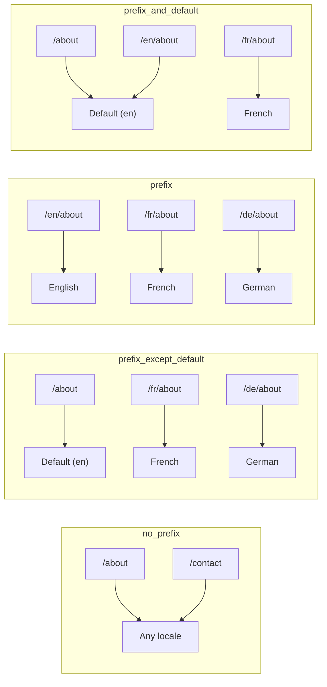
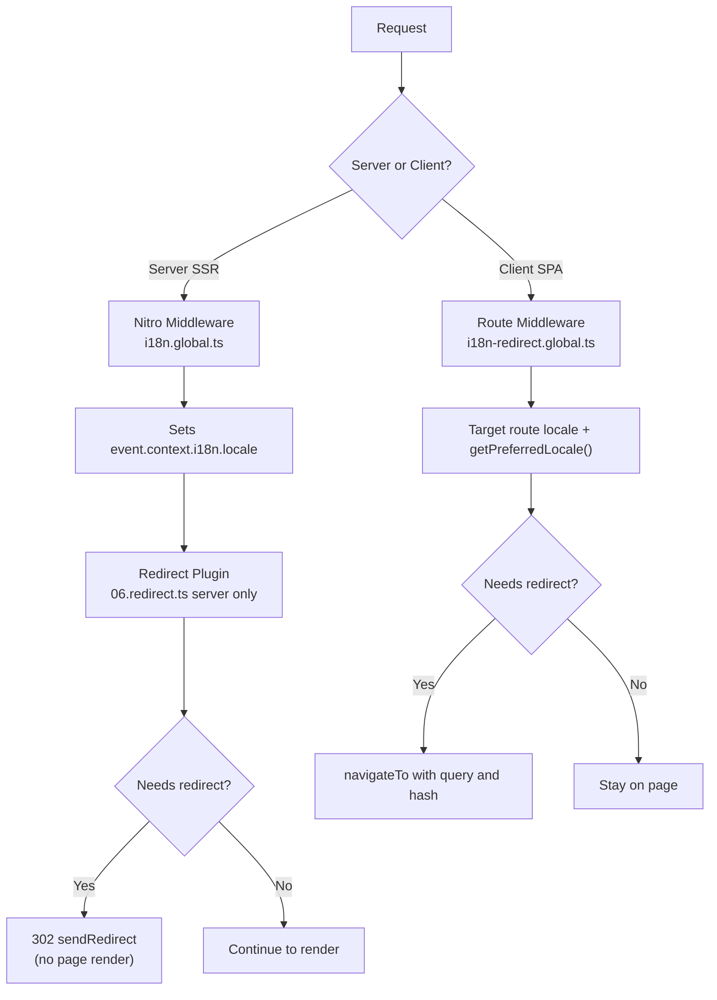

# 🗂️ Estrategias de enrutamiento en Nuxt I18n Micro

## 📖 Descripción general

Nuxt I18n Micro controla cómo aparecen los prefijos de idioma en las URLs mediante la opción `strategy`. Bajo el capó, dos paquetes lo implementan:

- **`@i18n-micro/route-strategy`** — generación de rutas en tiempo de compilación (extiende las páginas de Nuxt con rutas localizadas).
- **`@i18n-micro/path-strategy`** — resolución de rutas en runtime, redirecciones, atributos SEO y generación de enlaces.

El módulo Nuxt selecciona la clase de estrategia correcta en tiempo de compilación y le asigna un alias mediante `#i18n-strategy`, por lo que solo la implementación elegida se incluye en el bundle.

## 🚦 Estrategias disponibles

{/* generated:option:strategy — do not edit; run `pnpm run docs:generate` */}

**Tipo** `Strategies` · **Predeterminado** `'prefix_except_default'`

Estrategia de enrutamiento de URL para prefijos de idioma.

- `'no_prefix'` — sin idioma en la URL; el idioma se almacena en cookie.
- `'prefix_except_default'` — prefijo en todos los idiomas excepto el por defecto.
- `'prefix'` — siempre con prefijo, incluido el idioma por defecto.
- `'prefix_and_default'` — como `prefix`, pero el idioma por defecto también es accesible sin prefijo.

{/* /generated:option:strategy */}

### Comparación de estrategias



### 🛑 `no_prefix`

Las URLs no tienen segmento de idioma. El idioma se determina por cookies, el estado de `useI18nLocale()` o la detección del navegador.

- **Rutas**: `/about`, `/contact` — mismo patrón de URL para todos los idiomas (sin prefijo `/en/`, `/fr/`).
- **Persistencia de idioma**: mediante `localeCookie` (automáticamente establecida a `'user-locale'` si no se especifica).
- **Rutas personalizadas**: se admite mediante [`globalLocaleRoutes`](/guides/configuration#globallocaleroutes) y [`defineI18nRoute`](/guides/custom-locale-routes). Los slugs localizados se generan sin añadir un prefijo de idioma a las URLs (por ejemplo, `/about` frente a `/ueber-uns`). Rutas anidadas, alias y restricciones por idioma son más simples que en `prefix_except_default`.

<Tip>
Al usar `no_prefix`, `localeCookie` se establece automáticamente en `'user-locale'` si no se especifica. Esto es necesario porque la URL no contiene información de idioma.
</Tip>

```typescript
i18n: {
  strategy: 'no_prefix'
  // localeCookie is automatically set to 'user-locale'
}
```

### 🚧 `prefix_except_default`

Todas las rutas tienen un prefijo de idioma **excepto** el idioma por defecto.

- **Idioma por defecto**: `/about`, `/contact`
- **Otros idiomas**: `/fr/about`, `/de/contact`
- **Idioma por defecto con prefijo devuelve 404**: `/en/about` → 404 (cuando `en` es el por defecto).

```typescript
i18n: {
  strategy: 'prefix_except_default' // This is the default
}
```

### 🌍 `prefix`

Cada ruta tiene un prefijo de idioma, incluido el idioma por defecto.

- **Todos los idiomas**: `/en/about`, `/fr/about`, `/de/about`
- **Raíz `/`**: Redirige a `/\{locale\}/` según la preferencia del usuario.

```typescript
i18n: {
  strategy: 'prefix'
}
```

### 🔄 `prefix_and_default`

El idioma por defecto está disponible tanto con prefijo como sin él. Los idiomas no predeterminados siempre tienen prefijo.

- **Idioma por defecto**: tanto `/about` como `/en/about` son válidas.
- **Otros idiomas**: `/fr/about`, `/de/about`
- **Sin redirección desde `/`**: tanto `/` como `/en/` sirven el idioma por defecto.

```typescript
i18n: {
  strategy: 'prefix_and_default'
}
```

## 🔀 Arquitectura de redirección (v3)

En v3, la lógica de redirección se divide en dos capas para rendimiento óptimo:

### Cómo funciona



### Lado servidor (sin flash)

1. El **middleware de Nitro** (`i18n.global.ts`) se ejecuta primero. Detecta el idioma desde la URL, cookie o encabezado `Accept-Language` y establece `event.context.i18n.locale`.
2. El **plugin de redirección** (`06.redirect.ts`, solo servidor) comprueba si la ruta actual necesita una redirección usando `i18nStrategy.getClientRedirect()` y emite un 302 **antes** de que ocurra cualquier renderizado de página.
3. Esto evita el "flash de error" donde los usuarios ven brevemente una página equivocada antes de la redirección.

### Lado cliente (navegación SPA)

1. El middleware global de rutas (`i18n-redirect.global.ts`) se ejecuta en cada navegación del cliente cuando `redirects` está activo.
2. Deriva el idioma preferido primero de la **ruta destino**, luego recurre a `useI18nLocale().getPreferredLocale()`.
3. Usa `i18nStrategy.getClientRedirect()` para decidir si se necesita una redirección.
4. Preserva `query` y `hash` al redirigir.

### Orden de prioridad del idioma

En el servidor, el plugin de redirección determina el idioma preferido en este orden:

1. **`useState('i18n-locale')`** — máxima prioridad (establecido programáticamente mediante `useI18nLocale().setLocale()`).
2. **Cookie** — si `localeCookie` está configurado.
3. **Encabezado `Accept-Language`** — si `autoDetectLanguage: true`.
4. **`defaultLocale`** — fallback final.

En el cliente, el middleware de ruta prefiere el idioma de la ruta destino, luego usa la misma cadena de fallback de estado/cookie.

### Comportamiento de redirección por estrategia

| Estrategia              | Comportamiento de `GET /`                        | ¿Cookie requerida? |
| ----------------------- | ------------------------------------------------ | ------------------ |
| `no_prefix`             | Sin redirección (idioma desde cookie/estado)     | Auto-establecida   |
| `prefix`                | 302 → `/\{locale\}/`                              | Recomendada        |
| `prefix_except_default` | 302 → `/\{locale\}/` si idioma ≠ por defecto      | Recomendada        |
| `prefix_and_default`    | Sin redirección (tanto `/` como `/\{locale\}/` válidas) | Opcional         |

### Desactivar las redirecciones

```typescript
i18n: {
  redirects: false // Disables automatic locale redirects
}
```

Cuando `redirects: false`, las redirecciones automáticas de idioma están desactivadas:

- **Servidor**: el plugin de redirección (`06.redirect.ts`, solo servidor) sigue registrado pero omite la lógica de redirección. Aún realiza **comprobaciones 404** para prefijos de idioma inválidos (por ejemplo, `/xx/about` donde `xx` no es un idioma válido) y **sincronización de cookie** desde el prefijo de URL (por ejemplo, visitar `/fr/about` sincroniza la cookie a `fr`).
- **Cliente**: el middleware global de ruta `i18n-redirect` **no se registra**. Sin auto-redirecciones SPA.

## 🍪 Persistencia de idioma basada en cookies

<Warning>
Al usar `prefix` o `prefix_except_default` con `redirects: true` (por defecto), **debes** establecer `localeCookie` para que las redirecciones funcionen correctamente. Sin una cookie, el plugin de redirección no puede recordar la preferencia de idioma del usuario entre recargas de página.

```typescript
i18n: {
  strategy: 'prefix_except_default',
  localeCookie: 'user-locale' // Required for redirects to work properly
}
```
</Warning>

**Cómo funciona `localeCookie` en v3:**

- Gestionada internamente por `useI18nLocale()`. **No la establezcas manualmente** mediante `useCookie()`.
- Cuando un usuario visita una URL con prefijo (por ejemplo, `/fr/about`), la cookie se sincroniza automáticamente a `fr`.
- En la siguiente visita a `/`, el valor de la cookie se usa para redirigir a `/\{locale\}/`.
- Si la cookie contiene un idioma inválido (no está en la lista `locales`), recurre a `defaultLocale`.

| Estrategia              | `localeCookie` por defecto | Notas                                        |
| ----------------------- | -------------------------- | -------------------------------------------- |
| `no_prefix`             | Auto: `'user-locale'`      | Requerida; se establece automáticamente.     |
| `prefix`                | `null` (desactivada)       | Establécela en `'user-locale'` para redirecciones. |
| `prefix_except_default` | `null` (desactivada)       | Establécela en `'user-locale'` para redirecciones. |
| `prefix_and_default`    | `null` (desactivada)       | Opcional.                                    |

## 🔍 `autoDetectLanguage` y `autoDetectPath`

### `autoDetectLanguage`

{/* generated:option:autoDetectLanguage — do not edit; run `pnpm run docs:generate` */}

**Tipo** `boolean` · **Predeterminado** `true`

Detecta automáticamente el idioma preferido del usuario desde el encabezado HTTP `Accept-Language`. Se usa junto con `autoDetectPath` para decidir cuándo ocurre la detección.

{/* /generated:option:autoDetectLanguage */}

La comprobación se ejecuta en el middleware del servidor y es un fallback: una cookie o un estado existente ganan.

```typescript
i18n: {
  autoDetectLanguage: true
}
```

### `autoDetectPath`

{/* generated:option:autoDetectPath — do not edit; run `pnpm run docs:generate` */}

**Tipo** `string` · **Predeterminado** `'/'`

Dónde pueden ejecutarse las redirecciones por preferencia de cookie / Accept-Language (cuando `redirects` está activo).

- `'/'` — solo `/` (los enlaces profundos en el idioma por defecto siguen siendo accesibles; por defecto).
- `'no_prefix'` — solo rutas sin prefijo de idioma.
- `'*'` — cada ruta, incluyendo reescribir un prefijo de idioma explícito
  (por ejemplo, `/fr/about` → `/de/about` cuando la cookie prefiere `de`).

- cualquier otra cadena — coincidencia exacta de ruta (por ejemplo, `'/welcome'`).

La limpieza de estrategia con prefijo (p. ej. `/en` → `/` en `prefix_except_default`) no está condicionada.

{/* /generated:option:autoDetectPath */}

```typescript
i18n: {
  autoDetectPath: '/' // Default: only root
  // autoDetectPath: '*' // All paths — redirects even /fr/about to /de/about
}
```

<Warning>
Con `autoDetectPath: '*'`, incluso las URLs con un prefijo de idioma explícito (por ejemplo, `/fr/about`) se redirigirán si el idioma preferido del usuario difiere. Puede ser útil para configuraciones basadas en dominios pero puede confundir a usuarios que compartan URLs.
</Warning>

Con `autoDetectPath: '/'` por defecto y una cookie de idioma:

| solicitud | cookie | resultado |
| --- | --- | --- |
| `/` | `de` | 302 → `/de` |
| `/about` | `de` | 200, idioma por defecto (sin reescritura) |

```typescript
i18n: {
  localeCookie: 'user-locale',
  strategy: 'prefix_except_default',
  // Default — remember language on entry, keep deep links stable
  autoDetectPath: '/',
  // Or redirect on every unprefixed path (but not /de/… → /fr/…):
  // autoDetectPath: 'no_prefix',
}
```

## ⚠️ Problemas conocidos y buenas prácticas

### 1. Desajuste de hidratación en la estrategia `no_prefix`

Al usar `no_prefix`, el idioma se determina dinámicamente. Si el servidor y el cliente discrepan sobre el idioma, verás un desajuste de hidratación.

**Solución**: Usa `useI18nLocale().setLocale()` en un plugin del servidor (con `order: -10`) para establecer el idioma antes de la inicialización de i18n:

```ts
// plugins/i18n-loader.server.ts
export default defineNuxtPlugin({
  name: 'i18n-custom-loader',
  enforce: 'pre',
  order: -10,
  setup() {
    const { setLocale } = useI18nLocale()
    setLocale('ja') // Your detection logic here
  },
})
```

Consulta [Detección de idioma personalizada](/guides/custom-language-detection) para ejemplos detallados.

### 2. Usa rutas con nombre con `localeRoute`

El enrutamiento basado en rutas puede causar problemas de resolución:

```typescript
// May cause issues
$localeRoute('/page')

// Preferred approach
$localeRoute({ name: 'page' })
```

### 3. Usar `pages: false` con i18n

Al usar Nuxt con `pages: false`:

```typescript
export default defineNuxtConfig({
  pages: false,
  i18n: {
    strategy: 'no_prefix', // Recommended
    disablePageLocales: true, // Required
    localeCookie: 'user-locale', // Required for persistence
  },
})
```

**Limitaciones con `pages: false`:**

- Sin redirecciones automáticas.
- Sin detección de idioma basada en URL.
- El cambio de idioma del lado cliente requiere recarga de página o carga manual de traducciones.

### 4. Manejo de cookies inválidas

Si una cookie contiene un idioma inválido (no en la lista `locales`), el módulo recurre elegantemente a `defaultLocale`. No se lanzan errores.

## 📝 Resumen de buenas prácticas

| Recomendación               | Detalles                                                                                |
| --------------------------- | --------------------------------------------------------------------------------------- |
| **Establece `localeCookie`** | Siempre configúrala para estrategias con prefijo y `redirects: true`.                  |
| **Usa `useI18nLocale()`**   | La forma centralizada de gestionar el estado del idioma (reemplaza el `useState`/`useCookie` manual). |
| **Usa rutas con nombre**    | `$localeRoute(\{ name: 'page' \})` en lugar de `$localeRoute('/page')`.                   |
| **Idioma programático**     | Usa `useI18nLocale().setLocale()` en un plugin del servidor con `order: -10`.           |
| **Evita cookies manuales**  | No uses `useCookie('user-locale')` directamente. `useI18nLocale()` lo gestiona.         |
