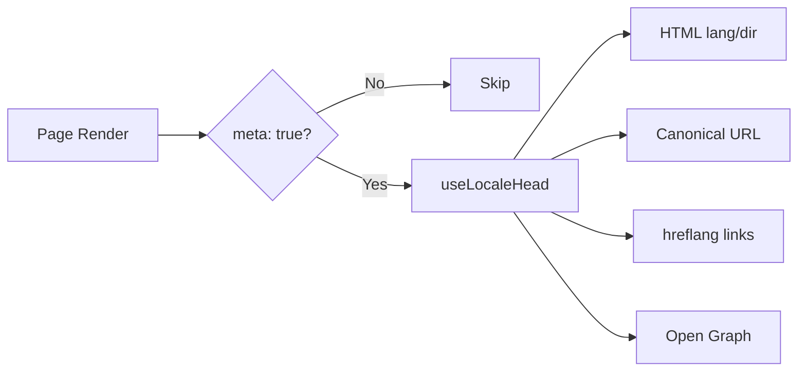

# 🌐 Guía SEO para Nuxt I18n Micro

## 📖 Introducción

Un SEO (Search Engine Optimization) eficaz es esencial para asegurar que tu sitio multilingüe sea accesible y visible para usuarios de todo el mundo a través de motores de búsqueda. `Nuxt I18n Micro` simplifica el proceso de gestionar SEO para sitios multilingües generando automáticamente etiquetas y atributos meta esenciales que informan a los motores de búsqueda sobre la estructura y el contenido de tu sitio.

Esta guía explica cómo `Nuxt I18n Micro` maneja el SEO para mejorar la visibilidad de tu sitio y la experiencia de usuario sin requerir configuración adicional.

## ⚙️ Manejo automático de SEO

### Flujo de generación de meta SEO



**Etiquetas generadas:**

| Etiqueta        | Ejemplo                                                  |
| --------------- | -------------------------------------------------------- |
| Atributos HTML  | `<html lang="en" dir="ltr">`                             |
| Canonical       | `<link rel="canonical" href="...">`                      |
| hreflang        | `<link rel="alternate" hreflang="en" href="...">`        |
| x-default       | `<link rel="alternate" hreflang="x-default" href="...">` |
| Open Graph      | `<meta property="og:locale" content="en_US">`            |

#### `og` por idioma (`og:locale` frente a BCP 47)

`<html lang>` y `hreflang` usan **BCP 47** vía `locale.iso` (por ejemplo, `ar-AE`).  
Open Graph requiere **`language_TERRITORY`** con **guion bajo** (`ar_AE`), según el [protocolo OG](https://ogp.me/).

Por defecto, `og:locale` se deriva de `iso` cuando la asignación no es ambigua (`en-US` → `en_US`).  
Establece una cadena **`og`** explícita cuando necesites un valor personalizado (por ejemplo, `zh-Hans` → `zh_CN`).  
Si no hay ni `og` ni un `iso` convertible, no se generan etiquetas `og:locale`. En desarrollo obtienes un aviso en consola (respeta `missingWarn`).

```typescript
i18n: {
  meta: true,
  locales: [
    { code: 'ar', iso: 'ar-AE', og: 'ar_AE', dir: 'rtl' },
    { code: 'en', iso: 'en-US' }, // og:locale → en_US
    { code: 'zh', iso: 'zh-Hans', og: 'zh_CN' }, // script tags need explicit og
  ],
}
```

### 🔑 Funciones SEO clave

Cuando la opción `meta` está activada en `Nuxt I18n Micro`, el módulo gestiona automáticamente los siguientes aspectos SEO:

1. **🌍 Atributos de idioma y dirección**:
   - El módulo establece los atributos `lang` y `dir` en la etiqueta `<html>` según el idioma actual y la dirección del texto (por ejemplo, `ltr` para inglés o `rtl` para árabe).

2. **🔗 URLs canónicas**:
   - El módulo genera un enlace canonical (`<link rel="canonical">`) para cada página, asegurando que los motores de búsqueda reconozcan la versión principal del contenido.

3. **🌐 Enlaces de idioma alternativo (`hreflang`)**:
   - El módulo genera automáticamente etiquetas `<link rel="alternate" hreflang="">` para todos los idiomas disponibles. Esto ayuda a los motores de búsqueda a entender qué versiones de idioma de tu contenido están disponibles, mejorando la experiencia de usuario para audiencias globales.
   - Cada idioma emite **una** etiqueta: `hreflang = iso || code`. Cuando `iso` está establecido, el `code` de enrutamiento nunca se usa como `hreflang` (así que claves de mercado como `mx` no se convierten en etiquetas de idioma inválidas).
   - Opcional: `hreflangBaseLanguage: true` también emite una etiqueta de idioma desnudo derivada de `iso` (por ejemplo, `es-ES` → `es`), reclamada por el primer idioma regional en `locales`.

4. **🌏 `x-default` Hreflang**:
   - El módulo genera automáticamente una etiqueta `<link rel="alternate" hreflang="x-default">` que apunta a la URL del idioma por defecto. Esto indica a los motores de búsqueda qué URL mostrar a usuarios cuyo idioma no coincida con ninguno de los definidos. No se requiere configuración adicional. Funciona automáticamente cuando `meta: true` está establecido.

5. **🔖 Metadatos Open Graph**:
   - El módulo genera etiquetas meta de Open Graph (`og:locale`, `og:url`, etc.) para cada idioma, particularmente útil para compartir en redes sociales e indexación en motores de búsqueda.

### 🛠️ Configuración

Para activar estas funciones SEO, asegúrate de que la opción `meta` esté en `true` en tu archivo `nuxt.config.ts`:

```typescript
export default defineNuxtConfig({
  modules: ['nuxt-i18n-micro'],
  i18n: {
    locales: [
      { code: 'en', iso: 'en-US', dir: 'ltr' },
      { code: 'fr', iso: 'fr-FR', dir: 'ltr' },
      { code: 'ar', iso: 'ar-SA', dir: 'rtl' },
    ],
    defaultLocale: 'en',
    translationDir: 'locales',
    meta: true, // Enables automatic SEO management
  },
})
```

### 🌍 `metaBaseUrl` dinámica para despliegues multidominio

Cuando `metaBaseUrl` no está establecida, las URLs absolutas SEO se resuelven en este orden (#240):

1. `site.url` de [`nuxt-site-config`](https://nuxtseo.com/docs/site-config) (si ese módulo está presente, por ejemplo, vía `@nuxtjs/seo`).
2. En caso contrario, el hostname desde la solicitud actual (`useRequestURL()` / `window.location.origin`).

El fallback de origen de solicitud respeta los encabezados del proxy inverso (`X-Forwarded-Host`, `X-Forwarded-Proto`), así que funciona correctamente detrás de nginx, Cloudflare, AWS ALB y proxies similares.

Eso significa que las apps que ya establecen `site.url` para sitemap / robots / schema.org **no** necesitan una segunda declaración de `metaBaseUrl`:

```typescript
export default defineNuxtConfig({
  site: {
    url: process.env.NUXT_SITE_URL, // also used by micro for canonical / og:url / hreflang
  },
  i18n: {
    meta: true,
    // metaBaseUrl omitted — picks up site.url, then request origin
  },
})
```

Sin `site.url`, una única instancia de la aplicación puede seguir sirviendo **múltiples dominios** con etiquetas SEO correctas para cada uno vía el origen de la solicitud:

```typescript
export default defineNuxtConfig({
  i18n: {
    meta: true,
    // metaBaseUrl is undefined by default — resolved dynamically from the request
  },
})
```

Por ejemplo, una solicitud a `https://site-a.com/en/about` producirá:

```html
<link rel="canonical" href="https://site-a.com/en/about" /> <meta property="og:url" content="https://site-a.com/en/about" />
```

Mientras que la misma app sirviendo `https://site-b.com/en/about` producirá:

```html
<link rel="canonical" href="https://site-b.com/en/about" /> <meta property="og:url" content="https://site-b.com/en/about" />
```

Si necesitas una URL base fija que siempre gane sobre `site.url`, pasa una cadena estática:

```typescript
metaBaseUrl: 'https://example.com'
```

### 🔍 Lista blanca de query canonical

Por defecto, los parámetros de consulta se eliminan de canonical y `og:url` para evitar contenido duplicado. Puedes incluir en la lista blanca parámetros específicos que deban conservarse:

```typescript
i18n: {
  canonicalQueryWhitelist: ['page', 'sort', 'filter', 'search', 'q', 'query', 'tag']
}
```

Solo los parámetros listados en `canonicalQueryWhitelist` aparecerán en las URLs canónicas. Todos los demás parámetros (por ejemplo, tracking, IDs de sesión) se eliminan.

### 🚫 Desactivar etiquetas meta por página

Puedes desactivar la generación de etiquetas meta SEO para páginas específicas usando `defineI18nRoute()`:

```vue
<script setup>
// Disable all SEO meta tags for this page
defineI18nRoute({
  disableMeta: true,
})
</script>
```

También puedes desactivar meta solo para idiomas específicos:

```vue
<script setup>
// Disable meta tags only for English locale on this page
defineI18nRoute({
  disableMeta: ['en'],
})
</script>
```

Cuando `disableMeta` está activo, no se generan etiquetas `hreflang`, `canonical`, `og:locale`, `og:url` ni `x-default` para la página/idioma afectados.

### 🔇 Idiomas desactivados

Los idiomas con `disabled: true` se excluyen automáticamente de toda la generación de etiquetas SEO. No se crean `hreflang`, `og:locale:alternate` ni enlaces alternate para ellos:

```typescript
i18n: {
  locales: [
    { code: 'en', iso: 'en-US' },
    { code: 'fr', iso: 'fr-FR', disabled: true }, // excluded from SEO tags
  ]
}
```

### 🙈 Idiomas opt-out (`seo: false`)

Para idiomas que deben seguir siendo enrutables y traducidos pero no aparecer en las etiquetas de descubrimiento cross-locale, establece `seo: false`. Esos idiomas se omiten de los alternates `hreflang` y `og:locale:alternate`. Si tu idioma **por defecto** configurado tiene `seo: false`, el enlace `x-default` tampoco se emite.

```typescript
i18n: {
  locales: [
    { code: 'en', iso: 'en-US' },
    { code: 'ru', iso: 'ru-RU', seo: false }, // internal / non-indexed locale
  ]
}
```

### 📌 Comportamiento específico por estrategia

| Estrategia              | Enlaces hreflang | x-default             | canonical           | og:url |
| ----------------------- | ---------------- | --------------------- | ------------------- | ------ |
| `prefix`                | ✅ Todos los idiomas | ✅ URL del idioma por defecto | ✅ URL actual | ✅     |
| `prefix_except_default` | ✅ Todos los idiomas | ✅ URL sin prefijo    | ✅ URL actual       | ✅     |
| `prefix_and_default`    | ✅ Todos los idiomas | ✅ URL del idioma por defecto | ✅ URL actual | ✅     |
| `no_prefix`             | ❌ No generado   | ❌ No generado        | ✅ URL actual       | ✅     |

Para la estrategia `no_prefix`, solo se generan atributos `canonical`, `og:url`, `og:locale` y `html` (`lang`, `dir`). Los enlaces de idioma alternativo (`hreflang`) y `x-default` no se generan porque no hay URLs distintas por idioma.

## Anulaciones a nivel de página (`useI18nHead`)

Para **artículos, guías o cualquier contenido CMS** donde no exista cada idioma o las URLs vengan de una API, usa [`useI18nHead`](/api/composables/use-i18n-head) en la página en lugar de un plugin personalizado de i18n head.

### Artículo con traducciones parciales

```vue
<script setup lang="ts">
const article = await loadArticle()
// article.locales = { en: '...', de: '...' } — only translated locales

useI18nHead({
  meta: [{ property: 'og:title', content: article.title }],
  replace: {
    hreflang: Object.entries(article.locales).map(([locale, href]) => ({
      rel: 'alternate',
      hreflang: locale,
      href,
    })),
    ogAlternates: Object.keys(article.locales),
  },
})
</script>
```

### Slugs por idioma con `$setI18nRouteParams`

Cuando los slugs difieren por idioma, establece primero los params de ruta y luego anula los alternates con URLs reales:

```vue
<script setup lang="ts">
const { $defineI18nRoute, $setI18nRouteParams } = useNuxtApp()
const { data: article } = await useFetch(`/api/articles/${slug}`)

$defineI18nRoute({
  localeRoutes: { en: '/blog/[slug]', de: '/de/blog/[slug]' },
})

$setI18nRouteParams({
  en: { slug: article.value.slugEn },
  de: { slug: article.value.slugDe },
})

useI18nHead({
  replace: {
    hreflang: ['en', 'de'].map((locale) => ({
      rel: 'alternate',
      hreflang: locale,
      href: article.value.urls[locale],
    })),
    ogAlternates: ['en', 'de'],
  },
})
</script>
```

### Origen HTTPS detrás de un proxy

Para URLs absolutas correctas en SSR sin un composable de origen personalizado:

```ts
i18n: {
  meta: true,
  metaBaseUrl: undefined,
  metaTrustForwardedHost: true,
  metaTrustForwardedProto: true,
}
```

Más ejemplos (anulación de canonical, `x-default`, fetch reactivo, helpers compartidos): [composable useI18nHead](/api/composables/use-i18n-head).

### ⚠️ Barra final

El módulo genera URLs canonical y `hreflang` basadas en la ruta real desde `useRoute().fullPath`. Si tu aplicación usa barras finales (por ejemplo, mediante `router.options` de Nuxt), las URLs generadas lo reflejarán. Sin embargo, `$switchLocalePath` puede normalizar las rutas y eliminar las barras finales. Si la consistencia de la barra final es crítica para tu SEO, verifica que las URLs generadas coincidan con la estructura de URLs de tu aplicación.

### 🎯 Beneficios

Al activar la opción `meta`, te beneficias de:

- **📈 Mejor posicionamiento en motores de búsqueda**: los motores de búsqueda pueden indexar mejor tu sitio, entendiendo las relaciones entre las distintas versiones de idioma.
- **👥 Mejor experiencia de usuario**: los usuarios reciben la versión de idioma correcta según sus preferencias, llevando a una experiencia más personalizada.
- **🔧 Menor configuración manual**: el módulo gestiona las tareas SEO automáticamente, liberándote de la necesidad de añadir manualmente etiquetas meta y atributos relacionados con SEO.

## 🔗 Nuxt SEO (`@nuxtjs/seo`)

[`@nuxtjs/seo`](https://nuxtseo.com/) empaqueta sitemap, robots, schema.org, imágenes OG y módulos relacionados. Se integra con **nuxt-i18n-micro** mediante [`nuxt-site-config`](https://nuxtseo.com/docs/site-config/guides/i18n) (v4+).

### Requisitos

- **`@nuxtjs/seo` 3+** (las versiones actuales usan `nuxt-site-config` 4+, que registra el plugin `nuxt-site-config:i18n` para micro).
- **`i18n.meta: true`** (recomendado — micro proporciona etiquetas head con idioma; Nuxt SEO añade sitemap, schema.org, etc.).

### Orden del módulo

Lista **nuxt-i18n-micro antes de `@nuxtjs/seo`** para que site config pueda leer tu configuración de idiomas:

```typescript
export default defineNuxtConfig({
  modules: ['nuxt-i18n-micro', '@nuxtjs/seo'],
  site: {
    url: 'https://example.com',
    name: 'My Site',
  },
  i18n: {
    meta: true,
    defaultLocale: 'en',
    locales: [
      { code: 'en', iso: 'en-US' },
      { code: 'de', iso: 'de-DE' },
    ],
  },
})
```

### Nombre y descripción de sitio traducidos

Nuxt Site Config lee claves de traducción opcionales de tus archivos de idioma:

```json
{
  "nuxtSiteConfig": {
    "name": "My Site",
    "description": "My site description"
  }
}
```

Los valores por idioma en `locales/en.json`, `locales/de.json`, etc. se recogen automáticamente.

### Resolución de problemas

Si ves `Plugin nuxt-seo:defaults depends on nuxt-site-config:i18n but they are not registered`, actualiza **`@nuxtjs/seo` a 3+** (consulta [issue #133](https://github.com/s00d/nuxt-i18n-micro/issues/133)). Las versiones antiguas `nuxt-site-config` 3.x solo conectaban i18n para `@nuxtjs/i18n`, no para micro.

Más: [Guía de sitemap i18n](https://nuxtseo.com/docs/sitemap/guides/i18n), [Guía de Site Config i18n](https://nuxtseo.com/docs/site-config/guides/i18n).
